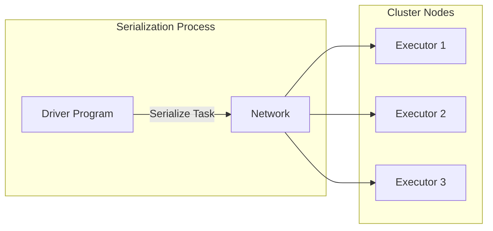
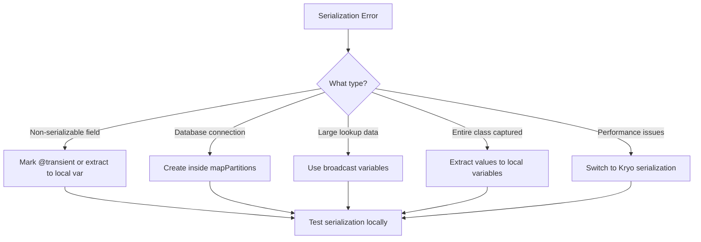

# How to Fix "Job Serialization" Spark Errors

Author: [nawazdhandala](https://www.github.com/nawazdhandala)

Tags: Apache Spark, Big Data, Serialization, Distributed Computing, Java, Scala, Debugging

Description: Learn how to diagnose and fix common Spark job serialization errors that prevent your distributed jobs from running successfully.

---

Apache Spark is a powerful distributed computing framework, but one of the most frustrating errors you will encounter is the dreaded "Task not serializable" exception. This error occurs when Spark tries to send objects from the driver to executors but fails because certain objects cannot be serialized. In this guide, we will explore why these errors happen and how to fix them effectively.

## Understanding Spark Serialization

When you write a Spark job, your code runs on two types of nodes: the driver and the executors. The driver coordinates the job while executors perform the actual data processing. For executors to run your code, Spark must serialize (convert to bytes) the functions and objects you reference and send them over the network.



## Common Serialization Error Messages

You might see errors like:

```
org.apache.spark.SparkException: Task not serializable
Caused by: java.io.NotSerializableException: com.example.MyClass
```

Or in more detail:

```
Serialization stack:
    - object not serializable (class: com.example.DatabaseConnection)
    - field (class: com.example.DataProcessor, name: connection)
    - object (class com.example.DataProcessor, DataProcessor@1234abcd)
```

## Root Causes and Solutions

### 1. Referencing Non-Serializable Objects in Closures

The most common cause is referencing objects that do not implement `Serializable` inside transformations.

**Problem Code:**

```scala
// This will fail - connection is not serializable
class DataProcessor {
  val connection = new DatabaseConnection() // Not serializable!

  def process(rdd: RDD[String]): RDD[String] = {
    rdd.map(record => {
      // This closure captures 'connection' which cannot be serialized
      connection.transform(record)
    })
  }
}
```

**Solution 1: Create the object inside the closure**

```scala
class DataProcessor extends Serializable {
  def process(rdd: RDD[String]): RDD[String] = {
    rdd.map(record => {
      // Create connection inside the closure - runs on each executor
      val connection = new DatabaseConnection()
      val result = connection.transform(record)
      connection.close()
      result
    })
  }
}
```

**Solution 2: Use mapPartitions to reduce overhead**

```scala
class DataProcessor extends Serializable {
  def process(rdd: RDD[String]): RDD[String] = {
    rdd.mapPartitions(partition => {
      // Create one connection per partition instead of per record
      val connection = new DatabaseConnection()
      val results = partition.map(record => connection.transform(record))
      connection.close()
      results
    })
  }
}
```

### 2. Capturing the Enclosing Class

When you reference a method or field from a class, Spark may try to serialize the entire class.

**Problem Code:**

```scala
class SparkJob {
  val config = loadConfig() // config might not be serializable
  val threshold = 100

  def run(rdd: RDD[Int]): RDD[Int] = {
    // References 'threshold' which captures the entire SparkJob instance
    rdd.filter(x => x > threshold)
  }
}
```

**Solution: Extract values to local variables**

```scala
class SparkJob {
  val config = loadConfig()
  val threshold = 100

  def run(rdd: RDD[Int]): RDD[Int] = {
    // Copy to local variable - only this value gets serialized
    val localThreshold = threshold
    rdd.filter(x => x > localThreshold)
  }
}
```

### 3. Using @transient for Non-Serializable Fields

Mark fields that should not be serialized with `@transient`.

```scala
class DataProcessor extends Serializable {
  // This field will be skipped during serialization
  @transient lazy val connection: DatabaseConnection = new DatabaseConnection()

  val batchSize = 1000 // This will be serialized normally

  def process(rdd: RDD[String]): RDD[String] = {
    val size = batchSize // Local copy for closure
    rdd.mapPartitions(partition => {
      // Connection created lazily on each executor
      val conn = new DatabaseConnection()
      partition.grouped(size).flatMap(batch => {
        conn.transformBatch(batch)
      })
    })
  }
}
```

### 4. Broadcast Variables for Large Objects

For large read-only data that multiple tasks need, use broadcast variables.

```scala
class LookupProcessor(spark: SparkSession) extends Serializable {
  def process(rdd: RDD[String]): RDD[String] = {
    // Create a broadcast variable for the lookup table
    val lookupTable: Map[String, String] = loadLookupTable()
    val broadcastLookup = spark.sparkContext.broadcast(lookupTable)

    rdd.map(record => {
      // Access broadcast value on executors
      val lookup = broadcastLookup.value
      lookup.getOrElse(record, "default")
    })
  }
}
```

## Serialization Framework Options

Spark supports multiple serialization frameworks. You can configure them in your SparkConf.

```scala
val conf = new SparkConf()
  .setAppName("MyApp")
  // Use Kryo serialization for better performance
  .set("spark.serializer", "org.apache.spark.serializer.KryoSerializer")
  // Register your classes for Kryo
  .registerKryoClasses(Array(
    classOf[MyCustomClass],
    classOf[AnotherClass]
  ))
```

### Kryo Registration Example

```scala
import com.esotericsoftware.kryo.Kryo
import org.apache.spark.serializer.KryoRegistrator

class MyKryoRegistrator extends KryoRegistrator {
  override def registerClasses(kryo: Kryo): Unit = {
    kryo.register(classOf[MyCustomClass])
    kryo.register(classOf[Array[MyCustomClass]])
    // Register with custom serializer if needed
    kryo.register(classOf[SpecialClass], new SpecialClassSerializer())
  }
}

// In your Spark configuration
val conf = new SparkConf()
  .set("spark.serializer", "org.apache.spark.serializer.KryoSerializer")
  .set("spark.kryo.registrator", "com.example.MyKryoRegistrator")
```

## Debugging Serialization Issues

### Step 1: Identify the Non-Serializable Object

Read the stack trace carefully. Look for the "Serialization stack" section which shows exactly which object caused the failure.

### Step 2: Test Serialization Locally

```scala
import java.io.{ByteArrayOutputStream, ObjectOutputStream}

def isSerializable(obj: Any): Boolean = {
  try {
    val stream = new ObjectOutputStream(new ByteArrayOutputStream())
    stream.writeObject(obj)
    stream.close()
    true
  } catch {
    case _: Exception => false
  }
}

// Test your classes
println(s"MyClass serializable: ${isSerializable(new MyClass())}")
```

### Step 3: Use SerializationDebugger

Spark provides a helpful debugging tool:

```scala
import org.apache.spark.util.SerializationDebugger

try {
  // Your code that triggers serialization error
} catch {
  case e: NotSerializableException =>
    println(SerializationDebugger.find(e))
}
```

## Best Practices Summary



1. **Keep closures small** - Only reference what you absolutely need inside transformations
2. **Use local variables** - Copy class fields to local variables before using them in closures
3. **Prefer Kryo** - It is faster and handles more types than Java serialization
4. **Use mapPartitions** - Create expensive resources once per partition, not per record
5. **Broadcast large data** - Use broadcast variables for lookup tables and reference data
6. **Test early** - Write unit tests that verify your objects can be serialized

## Conclusion

Serialization errors in Spark can be frustrating, but they follow predictable patterns. By understanding how Spark closures capture variables and by applying the techniques shown here, you can write robust distributed applications that avoid these common pitfalls. Remember to always test your transformations with a small dataset locally before running on a full cluster to catch serialization issues early in your development cycle.
