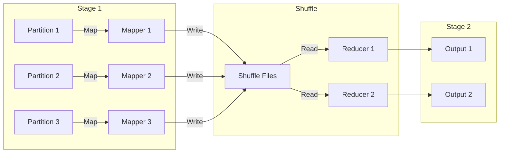
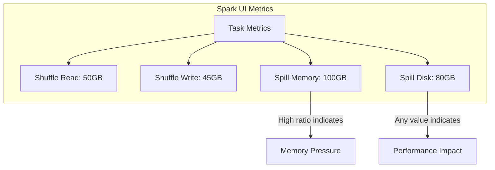
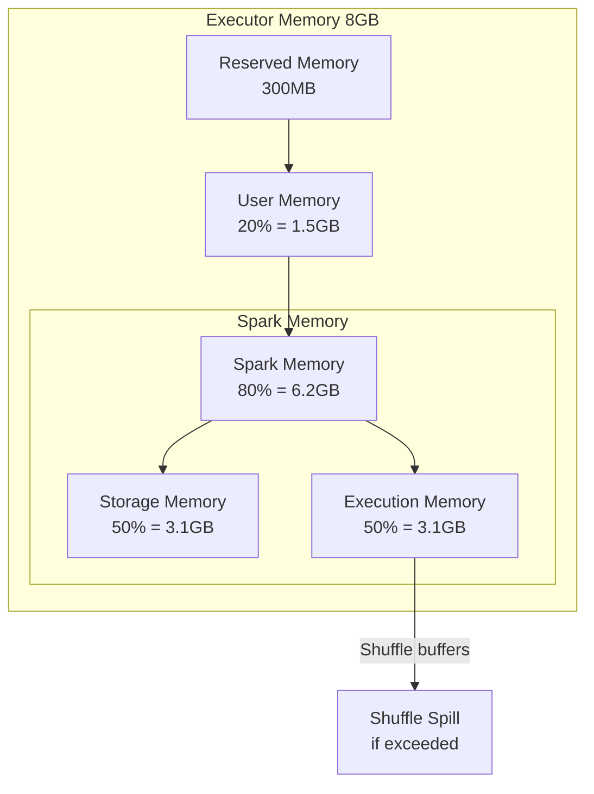
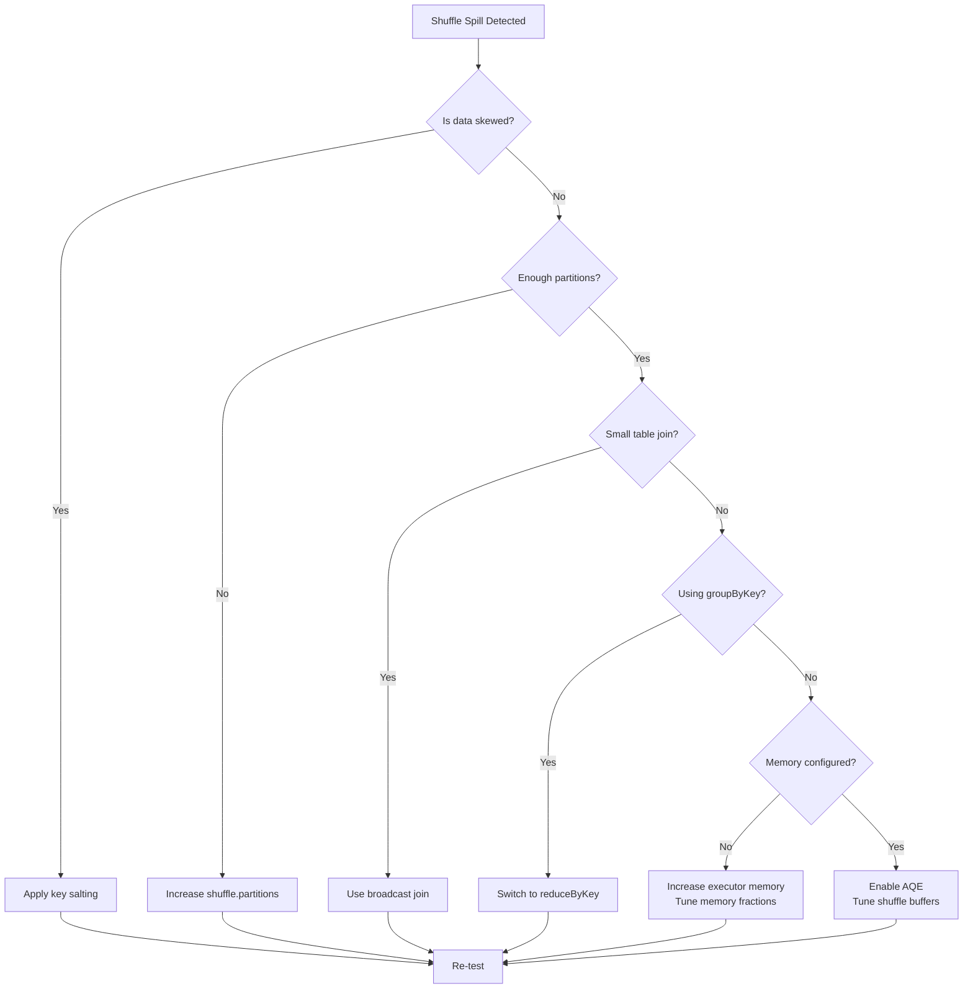

# How to Fix "Shuffle Spill" Spark Performance Issues

Author: [nawazdhandala](https://www.github.com/nawazdhandala)

Tags: Apache Spark, Performance Tuning, Shuffle, Memory Management, Big Data, Optimization

Description: Learn how to identify and fix shuffle spill issues in Apache Spark to dramatically improve job performance and resource utilization.

---

Shuffle operations are often the biggest performance bottleneck in Spark jobs. When shuffle data exceeds available memory, Spark "spills" data to disk, causing severe performance degradation. This guide explains how to identify, diagnose, and fix shuffle spill issues in your Spark applications.

## Understanding Spark Shuffle

A shuffle occurs when Spark needs to redistribute data across partitions. Operations like `groupByKey`, `reduceByKey`, `join`, and `repartition` trigger shuffles.



## Identifying Shuffle Spill

### Reading the Spark UI

Navigate to the Stages tab in Spark UI and look for these metrics:

- **Shuffle Write**: Data written by mappers
- **Shuffle Read**: Data read by reducers
- **Spill (Memory)**: Amount of data spilled from memory before serialization
- **Spill (Disk)**: Amount of data actually written to disk



### Programmatic Detection

```scala
// Enable detailed metrics collection
spark.conf.set("spark.sql.adaptive.enabled", "true")
spark.conf.set("spark.sql.adaptive.coalescePartitions.enabled", "true")

// After job completion, check metrics
val statusTracker = spark.sparkContext.statusTracker
val stageInfo = statusTracker.getActiveStageIds()

// Log shuffle metrics
spark.sparkContext.addSparkListener(new SparkListener {
  override def onStageCompleted(stageCompleted: SparkListenerStageCompleted): Unit = {
    val metrics = stageCompleted.stageInfo.taskMetrics
    if (metrics != null) {
      val shuffleWrite = metrics.shuffleWriteMetrics
      val shuffleRead = metrics.shuffleReadMetrics

      println(s"Stage ${stageCompleted.stageInfo.stageId}:")
      println(s"  Shuffle Write: ${shuffleWrite.bytesWritten / 1024 / 1024} MB")
      println(s"  Shuffle Read: ${shuffleRead.totalBytesRead / 1024 / 1024} MB")
      println(s"  Spill: ${metrics.memoryBytesSpilled / 1024 / 1024} MB")
    }
  }
})
```

## Root Causes and Solutions

### 1. Insufficient Executor Memory

The most common cause of spill is simply not having enough memory for shuffle buffers.

**Configuration Fix:**

```scala
val spark = SparkSession.builder()
  .appName("OptimizedJob")
  .config("spark.executor.memory", "8g")
  // Fraction of heap for execution (shuffle + joins)
  .config("spark.memory.fraction", "0.8")
  // Fraction of execution memory for storage
  .config("spark.memory.storageFraction", "0.3")
  .getOrCreate()
```

**Understanding Memory Layout:**



### 2. Data Skew

When some keys have significantly more data than others, certain tasks become bottlenecks.

**Detecting Skew:**

```scala
// Check key distribution
val keyDistribution = df
  .groupBy("join_key")
  .count()
  .orderBy(desc("count"))
  .show(20)

// Look for significant variation in counts
```

**Solution: Salted Keys**

```scala
import org.apache.spark.sql.functions._

// Add salt to skewed keys
val numSalts = 10

val saltedLeft = leftDf
  .withColumn("salt", (rand() * numSalts).cast("int"))
  .withColumn("salted_key", concat(col("join_key"), lit("_"), col("salt")))

val saltedRight = rightDf
  .withColumn("salts", explode(array((0 until numSalts).map(lit(_)): _*)))
  .withColumn("salted_key", concat(col("join_key"), lit("_"), col("salts")))

// Join on salted keys
val result = saltedLeft
  .join(saltedRight, "salted_key")
  .drop("salt", "salts", "salted_key")
```

### 3. Too Few Partitions

Having too few partitions means each task processes too much data.

**Configuration:**

```scala
// Set default parallelism
spark.conf.set("spark.sql.shuffle.partitions", "400")
spark.conf.set("spark.default.parallelism", "400")

// Dynamic partitioning based on data size
val dataSize = df.rdd.map(_.toString.getBytes.length.toLong).reduce(_ + _)
val targetPartitionSize = 128 * 1024 * 1024 // 128MB per partition
val optimalPartitions = Math.max(200, (dataSize / targetPartitionSize).toInt)

val repartitioned = df.repartition(optimalPartitions)
```

### 4. Use Appropriate Operations

Replace expensive operations with more efficient alternatives.

**Avoid groupByKey:**

```scala
// Bad: groupByKey loads all values into memory
val grouped = rdd.groupByKey().mapValues(_.sum)

// Good: reduceByKey aggregates during shuffle
val reduced = rdd.reduceByKey(_ + _)

// Good: aggregateByKey for complex aggregations
val aggregated = rdd.aggregateByKey(0)(
  (acc, value) => acc + value,    // Merge value into accumulator
  (acc1, acc2) => acc1 + acc2      // Merge two accumulators
)
```

**Use Broadcast Joins for Small Tables:**

```scala
import org.apache.spark.sql.functions.broadcast

// Bad: shuffle join with small table
val result = largeTable.join(smallTable, "key")

// Good: broadcast small table to all executors
val result = largeTable.join(broadcast(smallTable), "key")

// Configure broadcast threshold
spark.conf.set("spark.sql.autoBroadcastJoinThreshold", "100MB")
```

### 5. Enable Adaptive Query Execution

Spark 3.0+ includes AQE which automatically optimizes shuffle partitions.

```scala
val spark = SparkSession.builder()
  .appName("AQEJob")
  // Enable AQE
  .config("spark.sql.adaptive.enabled", "true")
  // Coalesce small partitions
  .config("spark.sql.adaptive.coalescePartitions.enabled", "true")
  .config("spark.sql.adaptive.coalescePartitions.minPartitionSize", "64MB")
  // Optimize skewed joins
  .config("spark.sql.adaptive.skewJoin.enabled", "true")
  .config("spark.sql.adaptive.skewJoin.skewedPartitionFactor", "5")
  .config("spark.sql.adaptive.skewJoin.skewedPartitionThresholdInBytes", "256MB")
  .getOrCreate()
```

### 6. Optimize Shuffle Buffer Sizes

Fine-tune shuffle-related memory settings.

```scala
val spark = SparkSession.builder()
  .appName("ShuffleOptimized")
  // Initial size of shuffle read buffer
  .config("spark.reducer.maxSizeInFlight", "96m")
  // Size of shuffle write buffer
  .config("spark.shuffle.file.buffer", "64k")
  // Use off-heap memory for shuffle
  .config("spark.memory.offHeap.enabled", "true")
  .config("spark.memory.offHeap.size", "2g")
  // Compress shuffle files
  .config("spark.shuffle.compress", "true")
  .config("spark.shuffle.spill.compress", "true")
  .getOrCreate()
```

## Complete Optimization Checklist



## Monitoring and Prevention

Set up alerting for shuffle spill in production:

```scala
// Custom metric reporter
class ShuffleMetricReporter extends SparkListener {
  override def onTaskEnd(taskEnd: SparkListenerTaskEnd): Unit = {
    val metrics = taskEnd.taskMetrics
    if (metrics != null && metrics.memoryBytesSpilled > 0) {
      val spillMB = metrics.memoryBytesSpilled / 1024 / 1024
      val diskSpillMB = metrics.diskBytesSpilled / 1024 / 1024

      // Send to monitoring system
      MetricsClient.gauge("spark.shuffle.spill.memory", spillMB)
      MetricsClient.gauge("spark.shuffle.spill.disk", diskSpillMB)

      if (spillMB > 1000) {
        AlertSystem.warn(s"High shuffle spill detected: ${spillMB}MB")
      }
    }
  }
}

spark.sparkContext.addSparkListener(new ShuffleMetricReporter())
```

## Conclusion

Shuffle spill is a common but solvable problem in Spark applications. Start by identifying the root cause through the Spark UI metrics, then apply targeted solutions based on whether the issue is memory configuration, data skew, partition sizing, or inefficient operations. With Spark 3.x, Adaptive Query Execution handles many of these issues automatically, but understanding the underlying mechanics helps you build more efficient data pipelines from the start. Regular monitoring of shuffle metrics in production will help you catch performance regressions before they impact your users.
