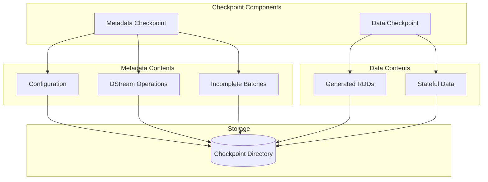

# How to Fix 'Checkpoint' Failures in Spark Streaming

Author: [nawazdhandala](https://www.github.com/nawazdhandala)

Tags: Apache Spark, Spark Streaming, Checkpointing, Fault Tolerance, Big Data, Stream Processing, Debugging

Description: Learn how to diagnose and fix checkpoint failures in Spark Streaming applications, including storage issues, serialization errors, and recovery strategies.

---

> Checkpointing is the backbone of fault tolerance in Spark Streaming. When checkpoints fail, your streaming application loses its ability to recover from failures and maintain exactly-once processing guarantees.

Checkpoint failures can bring down production streaming pipelines, causing data loss or duplicate processing. This guide covers the most common checkpoint issues and their solutions.

---

## Understanding Spark Streaming Checkpoints

Checkpoints in Spark Streaming serve two purposes: metadata checkpointing for driver recovery and data checkpointing for stateful operations. Both must function correctly for reliable stream processing.



---

## Common Checkpoint Failures

### 1. Storage Permission Issues

The most frequent cause of checkpoint failures is insufficient permissions on the checkpoint directory.

**Error Message:**
```
org.apache.hadoop.security.AccessControlException: Permission denied:
user=spark, access=WRITE, path=hdfs://namenode:8020/checkpoints/app
```

**Solution:**

```bash
# For HDFS checkpoints
hdfs dfs -mkdir -p /checkpoints/spark-app
hdfs dfs -chown spark:spark /checkpoints/spark-app
hdfs dfs -chmod 755 /checkpoints/spark-app

# For S3 checkpoints, ensure IAM role has proper permissions
```

```python
# spark_streaming_app.py
# Configure checkpoint directory with proper credentials

from pyspark.sql import SparkSession
from pyspark.streaming import StreamingContext

def create_streaming_context(checkpoint_dir: str):
    """
    Create a streaming context with checkpoint configuration.
    The checkpoint directory must be accessible by all executors.
    """
    spark = SparkSession.builder \
        .appName("CheckpointExample") \
        .config("spark.hadoop.fs.s3a.access.key", "YOUR_ACCESS_KEY") \
        .config("spark.hadoop.fs.s3a.secret.key", "YOUR_SECRET_KEY") \
        .config("spark.hadoop.fs.s3a.impl", "org.apache.hadoop.fs.s3a.S3AFileSystem") \
        .getOrCreate()

    ssc = StreamingContext(spark.sparkContext, batchDuration=10)

    # Set checkpoint directory - must be fault-tolerant storage
    ssc.checkpoint(checkpoint_dir)

    return ssc


# For S3 checkpoint directory
checkpoint_dir = "s3a://my-bucket/checkpoints/spark-app"

# For HDFS checkpoint directory
checkpoint_dir = "hdfs://namenode:8020/checkpoints/spark-app"
```

---

### 2. Serialization Errors

Checkpoint failures often occur when objects in your streaming application cannot be serialized.

**Error Message:**
```
org.apache.spark.SparkException: Task not serializable
Caused by: java.io.NotSerializableException: com.example.DatabaseConnection
```

**Solution:**

```python
# bad_example.py
# This will cause serialization errors

class StreamProcessor:
    def __init__(self):
        # Database connection is not serializable
        self.db_connection = create_database_connection()

    def process_stream(self, dstream):
        # This fails because self.db_connection cannot be serialized
        dstream.foreachRDD(lambda rdd: rdd.foreach(
            lambda record: self.db_connection.insert(record)
        ))


# good_example.py
# Proper approach - create connections inside the worker

class StreamProcessor:
    def __init__(self, db_config: dict):
        # Store configuration, not connection
        self.db_config = db_config

    def process_stream(self, dstream):
        db_config = self.db_config  # Capture in closure

        def process_partition(partition):
            # Create connection inside the worker
            connection = create_database_connection(db_config)
            try:
                for record in partition:
                    connection.insert(record)
                connection.commit()
            finally:
                connection.close()

        dstream.foreachRDD(lambda rdd: rdd.foreachPartition(process_partition))
```

For Scala applications, mark classes as `Serializable` or use `@transient`:

```scala
// StreamProcessor.scala
// Use @transient for non-serializable fields

import org.apache.spark.streaming.dstream.DStream

class StreamProcessor extends Serializable {
  // Mark database connection as transient - won't be serialized
  @transient lazy val dbConnection: Connection = createConnection()

  def processStream(dstream: DStream[Record]): Unit = {
    dstream.foreachRDD { rdd =>
      rdd.foreachPartition { partition =>
        // Use lazy connection that gets created on each executor
        val conn = dbConnection
        partition.foreach { record =>
          conn.insert(record)
        }
      }
    }
  }
}
```

---

### 3. Checkpoint Directory Corruption

When a streaming job crashes during checkpoint writing, the checkpoint directory can become corrupted.

**Error Message:**
```
java.io.IOException: Could not read checkpoint from hdfs://namenode:8020/checkpoints/app
Caused by: java.io.EOFException: Premature EOF from inputStream
```

**Solution:**

```python
# checkpoint_recovery.py
# Implement checkpoint recovery with fallback

from pyspark.streaming import StreamingContext
import os
import shutil

def get_or_create_streaming_context(
    spark_context,
    checkpoint_dir: str,
    create_func,
    force_recreate: bool = False
):
    """
    Recover from checkpoint or create new context.
    Handles corrupted checkpoints gracefully.
    """

    def create_context():
        """Factory function to create new streaming context."""
        ssc = StreamingContext(spark_context, batchDuration=10)
        ssc.checkpoint(checkpoint_dir)
        create_func(ssc)
        return ssc

    if force_recreate:
        # Clear corrupted checkpoint and start fresh
        clear_checkpoint_directory(checkpoint_dir)
        return create_context()

    try:
        # Try to recover from checkpoint
        ssc = StreamingContext.getOrCreate(checkpoint_dir, create_context)
        return ssc
    except Exception as e:
        print(f"Failed to recover from checkpoint: {e}")
        print("Creating new streaming context...")

        # Backup corrupted checkpoint for investigation
        backup_corrupted_checkpoint(checkpoint_dir)

        # Clear and recreate
        clear_checkpoint_directory(checkpoint_dir)
        return create_context()


def clear_checkpoint_directory(checkpoint_dir: str):
    """Remove checkpoint directory contents."""
    if checkpoint_dir.startswith("hdfs://"):
        # Use Hadoop commands for HDFS
        import subprocess
        subprocess.run(["hdfs", "dfs", "-rm", "-r", "-f", checkpoint_dir])
    elif checkpoint_dir.startswith("s3"):
        # Use boto3 for S3
        import boto3
        s3 = boto3.resource('s3')
        bucket_name = checkpoint_dir.split('/')[2]
        prefix = '/'.join(checkpoint_dir.split('/')[3:])
        bucket = s3.Bucket(bucket_name)
        bucket.objects.filter(Prefix=prefix).delete()
    else:
        # Local filesystem
        if os.path.exists(checkpoint_dir):
            shutil.rmtree(checkpoint_dir)


def backup_corrupted_checkpoint(checkpoint_dir: str):
    """Backup corrupted checkpoint for later analysis."""
    import datetime
    timestamp = datetime.datetime.now().strftime("%Y%m%d_%H%M%S")
    backup_dir = f"{checkpoint_dir}_corrupted_{timestamp}"

    if checkpoint_dir.startswith("hdfs://"):
        import subprocess
        subprocess.run(["hdfs", "dfs", "-mv", checkpoint_dir, backup_dir])
    else:
        if os.path.exists(checkpoint_dir):
            shutil.move(checkpoint_dir, backup_dir)
```

---

### 4. Checkpoint Interval Too Short

When the checkpoint interval is shorter than the time required to write checkpoints, you get cascading failures.

**Error Message:**
```
WARN scheduler.JobScheduler: Streaming job could not be submitted
because the previous job has not completed yet
```

**Solution:**

```python
# optimized_checkpointing.py
# Configure appropriate checkpoint intervals

from pyspark.sql import SparkSession
from pyspark.streaming import StreamingContext

def create_optimized_streaming_context(checkpoint_dir: str):
    """
    Create streaming context with optimized checkpoint settings.
    """
    spark = SparkSession.builder \
        .appName("OptimizedCheckpointing") \
        .config("spark.streaming.stopGracefullyOnShutdown", "true") \
        .config("spark.streaming.backpressure.enabled", "true") \
        .config("spark.streaming.kafka.maxRatePerPartition", "1000") \
        .getOrCreate()

    # Batch interval of 30 seconds
    batch_interval = 30
    ssc = StreamingContext(spark.sparkContext, batch_interval)

    # Checkpoint interval should be 5-10x batch interval
    # This reduces checkpoint overhead while maintaining recovery capability
    checkpoint_interval = batch_interval * 5  # 150 seconds

    ssc.checkpoint(checkpoint_dir)

    return ssc, checkpoint_interval


def configure_stateful_stream(dstream, checkpoint_interval: int):
    """
    Configure stateful operations with appropriate checkpoint interval.
    """
    # For updateStateByKey, set checkpoint interval explicitly
    stateful_stream = dstream \
        .map(lambda x: (x.key, x.value)) \
        .updateStateByKey(update_function)

    # Set checkpoint interval for stateful DStream
    stateful_stream.checkpoint(checkpoint_interval)

    return stateful_stream


def update_function(new_values, running_state):
    """State update function for updateStateByKey."""
    current = running_state or 0
    return sum(new_values, current)
```

---

### 5. Memory Issues During Checkpointing

Large state can cause out-of-memory errors during checkpoint serialization.

**Error Message:**
```
java.lang.OutOfMemoryError: Java heap space
at java.io.ObjectOutputStream.writeObject
```

**Solution:**

```python
# memory_optimized_checkpoint.py
# Optimize memory usage for checkpointing

from pyspark.sql import SparkSession
from pyspark import StorageLevel

def create_memory_optimized_context():
    """
    Configure Spark for memory-efficient checkpointing.
    """
    spark = SparkSession.builder \
        .appName("MemoryOptimizedStreaming") \
        .config("spark.executor.memory", "4g") \
        .config("spark.driver.memory", "2g") \
        .config("spark.memory.fraction", "0.6") \
        .config("spark.memory.storageFraction", "0.3") \
        .config("spark.cleaner.referenceTracking.cleanCheckpoints", "true") \
        .config("spark.streaming.unpersist", "true") \
        .getOrCreate()

    return spark


def configure_efficient_state_management(dstream):
    """
    Use mapWithState instead of updateStateByKey for better memory efficiency.
    mapWithState allows state expiration and uses less memory.
    """
    from pyspark.streaming import StateSpec

    def state_mapping_function(key, value, state):
        """
        State mapping function with timeout.
        States that haven't been updated expire automatically.
        """
        if state.isTimingOut():
            # State is expiring - emit final value
            return (key, state.get(), "expired")

        # Update state
        current = state.getOption() or 0
        new_value = current + (value or 0)
        state.update(new_value)

        return (key, new_value, "active")

    # Configure state spec with timeout
    state_spec = StateSpec.function(state_mapping_function) \
        .timeout(minutes=30)  # State expires after 30 minutes of inactivity

    stateful_stream = dstream \
        .map(lambda x: (x.key, x.value)) \
        .mapWithState(state_spec)

    # Use MEMORY_AND_DISK to avoid OOM during checkpointing
    stateful_stream.persist(StorageLevel.MEMORY_AND_DISK_SER)

    return stateful_stream
```

---

## Monitoring Checkpoint Health

Set up monitoring to detect checkpoint issues before they cause failures.

```python
# checkpoint_monitor.py
# Monitor checkpoint health metrics

from pyspark.streaming import StreamingListener
import time

class CheckpointMonitor(StreamingListener):
    """
    Custom listener to monitor checkpoint performance.
    """

    def __init__(self, alert_threshold_ms: int = 5000):
        self.alert_threshold_ms = alert_threshold_ms
        self.checkpoint_times = []

    def onBatchCompleted(self, batchCompleted):
        """Called when a batch completes processing."""
        batch_info = batchCompleted.batchInfo()

        # Check if checkpointing was part of this batch
        processing_delay = batch_info.processingDelay()
        scheduling_delay = batch_info.schedulingDelay()

        if processing_delay and processing_delay > self.alert_threshold_ms:
            print(f"WARNING: Batch {batch_info.batchTime()} "
                  f"processing took {processing_delay}ms")
            self.send_alert(
                f"Checkpoint may be slow - processing delay: {processing_delay}ms"
            )

        if scheduling_delay and scheduling_delay > self.alert_threshold_ms:
            print(f"WARNING: Batch {batch_info.batchTime()} "
                  f"scheduling delay: {scheduling_delay}ms")

    def send_alert(self, message: str):
        """Send alert to monitoring system."""
        # Integration with OneUptime or other monitoring
        import requests
        requests.post(
            "https://oneuptime.com/api/alerts",
            json={
                "message": message,
                "severity": "warning",
                "source": "spark-streaming"
            }
        )


# Register the listener
ssc.addStreamingListener(CheckpointMonitor(alert_threshold_ms=5000))
```

---

## Best Practices

1. **Use reliable storage** - Always use HDFS or cloud storage (S3, GCS) for checkpoints, never local disk
2. **Set appropriate intervals** - Checkpoint interval should be 5-10x your batch interval
3. **Monitor checkpoint size** - Track checkpoint directory size to detect state bloat
4. **Test recovery regularly** - Periodically test that your application can recover from checkpoints
5. **Version your code carefully** - Code changes can break checkpoint compatibility
6. **Clean old checkpoints** - Set up automated cleanup of old checkpoint data
7. **Use Structured Streaming** - Consider migrating to Structured Streaming which has better checkpoint handling

---

*Need comprehensive monitoring for your Spark Streaming applications? [OneUptime](https://oneuptime.com) provides real-time alerting and metrics visualization for big data workloads.*

**Related Reading:**
- [How to Fix "Worker Node" Failures in Spark](https://oneuptime.com/blog/post/2026-01-24-spark-worker-node-failures/view)
- [How to Handle Apache Beam Pipelines](https://oneuptime.com/blog/post/2026-01-24-apache-beam-pipelines/view)
