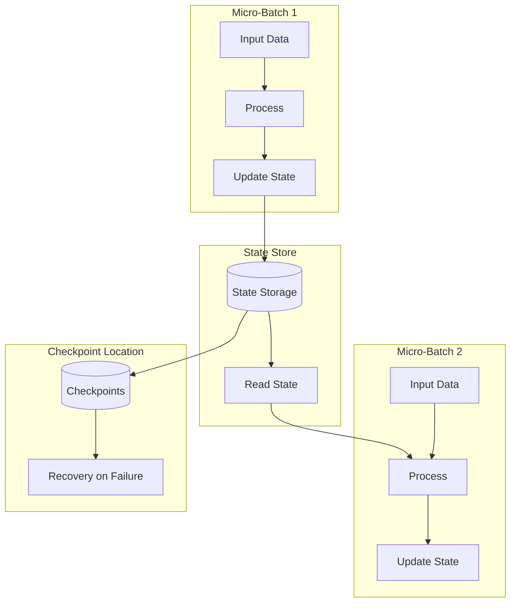
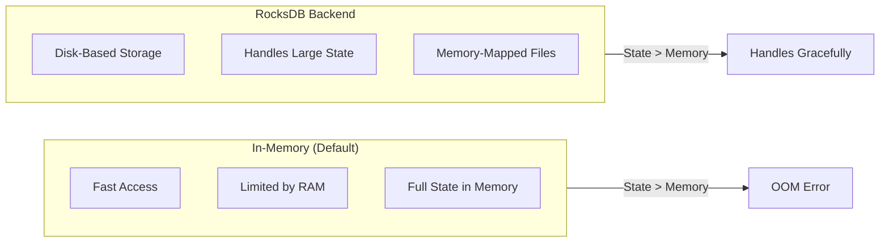

# How to Fix 'State Store' Failures in Spark Streaming

Author: [nawazdhandala](https://www.github.com/nawazdhandala)

Tags: Apache Spark, Spark Streaming, Structured Streaming, State Store, Checkpointing, Data Engineering

Description: A comprehensive guide to diagnosing and fixing state store failures in Spark Structured Streaming applications with practical solutions and code examples.

---

State store failures in Spark Streaming can bring your real-time data pipeline to a grinding halt. These errors typically appear when processing stateful operations like aggregations, joins, or deduplication. Understanding why they happen and how to fix them is critical for maintaining reliable streaming applications.

## Understanding Spark State Stores

Spark Structured Streaming uses state stores to maintain intermediate state between micro-batches. When you run a streaming aggregation or windowed operation, Spark needs to remember previous values.



## Common State Store Errors

### Error 1: State Store Provider Not Found

```
java.lang.IllegalStateException: Error loading state store provider
org.apache.spark.sql.execution.streaming.state.HDFSBackedStateStoreProvider
```

This happens when Spark cannot initialize the state store backend.

**Solution: Ensure checkpoint location is accessible**

```python
# Configure checkpoint location with proper permissions
spark = SparkSession.builder \
    .appName("StreamingApp") \
    .config("spark.sql.streaming.checkpointLocation", "/tmp/spark-checkpoints") \
    .getOrCreate()

# When starting your streaming query
query = df.writeStream \
    .format("console") \
    .outputMode("update") \
    .option("checkpointLocation", "hdfs:///checkpoints/my-app") \
    .start()
```

### Error 2: State Store Corrupted

```
java.io.IOException: Failed to read state store
Caused by: java.io.EOFException: Unexpected end of input stream
```

Corruption usually happens from unclean shutdowns or storage issues.

**Solution: Clear corrupted state and restart**

```python
# In Python, you may need to clear the checkpoint directory
import shutil
import os

checkpoint_path = "/tmp/spark-checkpoints/my-app"

# WARNING: This will lose all state - use only when necessary
if os.path.exists(checkpoint_path):
    shutil.rmtree(checkpoint_path)
    print(f"Cleared checkpoint directory: {checkpoint_path}")

# For HDFS
# hdfs dfs -rm -r /checkpoints/my-app
```

**Better approach: Use state data source to recover**

```python
# Read existing state for debugging
state_df = spark.read \
    .format("statestore") \
    .option("path", "hdfs:///checkpoints/my-app/state/0/0") \
    .load()

state_df.show(truncate=False)
```

### Error 3: State Store Memory Overflow

```
java.lang.OutOfMemoryError: GC overhead limit exceeded
at org.apache.spark.sql.execution.streaming.state.HDFSBackedStateStoreProvider
```

This occurs when state grows too large for available memory.

**Solution: Configure state store memory settings**

```python
spark = SparkSession.builder \
    .appName("StreamingApp") \
    .config("spark.sql.streaming.stateStore.providerClass",
            "org.apache.spark.sql.execution.streaming.state.HDFSBackedStateStoreProvider") \
    .config("spark.sql.streaming.stateStore.minDeltasForSnapshot", "10") \
    .config("spark.sql.streaming.stateStore.maintenanceInterval", "30s") \
    .config("spark.sql.streaming.stateStore.compression.codec", "lz4") \
    .getOrCreate()
```

## Implementing State Cleanup with Watermarks

The most common cause of state store issues is unbounded state growth. Use watermarks to expire old state.

```python
from pyspark.sql.functions import window, col, from_json, current_timestamp
from pyspark.sql.types import StructType, StringType, TimestampType, DoubleType

# Define schema for incoming events
schema = StructType() \
    .add("event_id", StringType()) \
    .add("user_id", StringType()) \
    .add("event_time", TimestampType()) \
    .add("value", DoubleType())

# Read from Kafka
events = spark.readStream \
    .format("kafka") \
    .option("kafka.bootstrap.servers", "localhost:9092") \
    .option("subscribe", "events") \
    .load() \
    .select(from_json(col("value").cast("string"), schema).alias("data")) \
    .select("data.*")

# Add watermark to expire old state
# State older than 1 hour will be dropped
windowed_counts = events \
    .withWatermark("event_time", "1 hour") \
    .groupBy(
        window(col("event_time"), "10 minutes"),
        col("user_id")
    ) \
    .count()

# Write results
query = windowed_counts.writeStream \
    .format("console") \
    .outputMode("update") \
    .option("checkpointLocation", "/tmp/checkpoints/windowed-counts") \
    .start()
```

## Using RocksDB State Store for Large State

The default HDFS-backed state store keeps everything in memory. For large state, use RocksDB.

```python
spark = SparkSession.builder \
    .appName("LargeStateApp") \
    .config("spark.sql.streaming.stateStore.providerClass",
            "org.apache.spark.sql.execution.streaming.state.RocksDBStateStoreProvider") \
    .config("spark.sql.streaming.stateStore.rocksdb.compactOnCommit", "true") \
    .config("spark.sql.streaming.stateStore.rocksdb.changelogCheckpointing.enabled", "true") \
    .getOrCreate()
```



## Handling State Store Version Conflicts

Version conflicts happen when multiple query instances try to write to the same state store.

```
java.lang.IllegalStateException:
State store version conflict: expected version 100, found version 101
```

**Solution: Ensure single writer per state store partition**

```python
# Use unique checkpoint locations per query
import uuid

def create_streaming_query(input_df, query_name):
    # Generate unique checkpoint path
    checkpoint_base = "hdfs:///checkpoints"
    checkpoint_path = f"{checkpoint_base}/{query_name}"

    return input_df.writeStream \
        .queryName(query_name) \
        .format("parquet") \
        .option("path", f"hdfs:///output/{query_name}") \
        .option("checkpointLocation", checkpoint_path) \
        .start()

# Each query gets its own checkpoint
query1 = create_streaming_query(df1, "user-aggregates")
query2 = create_streaming_query(df2, "session-analytics")
```

## Graceful Recovery from State Store Failures

Implement proper error handling for streaming queries:

```python
from pyspark.sql.streaming import StreamingQueryException
import time

def run_streaming_with_recovery(spark, max_retries=3):
    retry_count = 0

    while retry_count < max_retries:
        try:
            # Create your streaming query
            query = spark.readStream \
                .format("kafka") \
                .option("kafka.bootstrap.servers", "localhost:9092") \
                .option("subscribe", "events") \
                .load() \
                .groupBy("key") \
                .count() \
                .writeStream \
                .format("console") \
                .outputMode("update") \
                .option("checkpointLocation", "/tmp/checkpoints/recovery-demo") \
                .start()

            # Wait for termination
            query.awaitTermination()

        except StreamingQueryException as e:
            error_msg = str(e)
            retry_count += 1

            if "state store" in error_msg.lower():
                print(f"State store error detected. Retry {retry_count}/{max_retries}")

                # Exponential backoff
                wait_time = min(60, 2 ** retry_count)
                time.sleep(wait_time)

                # If corruption detected, may need to clear checkpoint
                if "corrupt" in error_msg.lower() and retry_count == max_retries:
                    print("Clearing corrupted checkpoint...")
                    # Clear checkpoint logic here
            else:
                raise e

    raise Exception(f"Streaming query failed after {max_retries} retries")
```

## Monitoring State Store Health

Set up monitoring to catch issues early:

```python
from pyspark.sql.streaming import StreamingQueryListener

class StateStoreMonitor(StreamingQueryListener):
    def onQueryStarted(self, event):
        print(f"Query started: {event.name}")

    def onQueryProgress(self, event):
        progress = event.progress

        # Monitor state store metrics
        if progress.stateOperators:
            for op in progress.stateOperators:
                print(f"State operator: {op.operatorName}")
                print(f"  - Num rows total: {op.numRowsTotal}")
                print(f"  - Num rows updated: {op.numRowsUpdated}")
                print(f"  - Memory used bytes: {op.memoryUsedBytes}")
                print(f"  - Custom metrics: {op.customMetrics}")

                # Alert if state is growing too large
                if op.numRowsTotal > 10000000:
                    print("WARNING: State store has over 10M rows!")

    def onQueryTerminated(self, event):
        if event.exception:
            print(f"Query terminated with error: {event.exception}")

# Register the listener
spark.streams.addListener(StateStoreMonitor())
```

## Tuning State Store Performance

```python
# Comprehensive state store configuration
spark = SparkSession.builder \
    .appName("OptimizedStateStore") \
    .config("spark.sql.streaming.stateStore.providerClass",
            "org.apache.spark.sql.execution.streaming.state.RocksDBStateStoreProvider") \
    .config("spark.sql.shuffle.partitions", "200") \
    .config("spark.sql.streaming.stateStore.minDeltasForSnapshot", "10") \
    .config("spark.sql.streaming.stateStore.maintenanceInterval", "30s") \
    .config("spark.sql.streaming.minBatchesToRetain", "100") \
    .config("spark.sql.streaming.stateStore.rocksdb.compactOnCommit", "false") \
    .config("spark.sql.streaming.stateStore.rocksdb.blockSizeKB", "4") \
    .config("spark.sql.streaming.stateStore.rocksdb.blockCacheSizeMB", "256") \
    .config("spark.sql.streaming.stateStore.rocksdb.lockAcquireTimeoutMs", "60000") \
    .config("spark.sql.streaming.stateStore.rocksdb.resetStatsOnLoad", "true") \
    .getOrCreate()
```

## Best Practices Summary

1. **Always set watermarks** for stateful operations to bound state growth
2. **Use RocksDB** for applications with large state requirements
3. **Monitor state metrics** through StreamingQueryListener
4. **Implement retry logic** with exponential backoff for transient failures
5. **Use unique checkpoint paths** for each streaming query
6. **Test recovery scenarios** by intentionally killing and restarting queries
7. **Keep checkpoint storage reliable** with proper HDFS replication or S3

---

State store failures are often symptoms of deeper issues: unbounded state growth, insufficient resources, or improper configuration. Address the root cause rather than just clearing checkpoints. A well-tuned Spark Streaming application should handle state gracefully even under heavy load.
