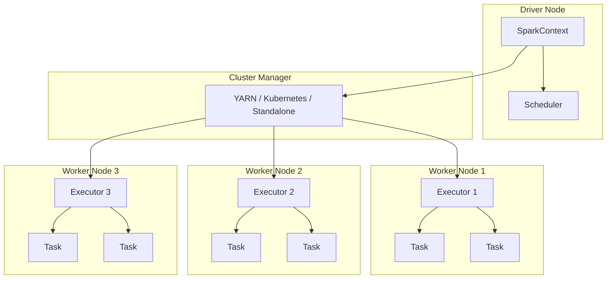

# How to Fix "Worker Node" Failures in Spark

Author: [nawazdhandala](https://www.github.com/nawazdhandala)

Tags: Apache Spark, Worker Nodes, Cluster Management, Debugging, Big Data, Distributed Computing, Fault Tolerance

Description: Learn how to diagnose and fix worker node failures in Apache Spark clusters, including memory issues, network problems, and executor crashes.

---

> Worker node failures in Spark can bring your data processing jobs to a halt. Understanding the root causes and having a systematic approach to diagnosis is essential for maintaining reliable big data pipelines.

Spark's distributed nature means failures can occur at multiple levels: executors, workers, or even the driver. This guide walks through common failure scenarios and their solutions.

---

## Understanding Spark Cluster Architecture

Before diving into failures, it helps to understand how Spark distributes work across a cluster.



---

## Common Worker Node Failures

### 1. Out of Memory (OOM) Errors

The most common worker failure is running out of memory. This happens when executors try to process more data than their allocated memory can handle.

**Error Message:**
```
ExecutorLostFailure (executor 3 exited caused by one of the running tasks)
Reason: Container killed by YARN for exceeding memory limits.
10.5 GB of 10 GB physical memory used.
```

**Solution:**

```python
# spark_memory_config.py
# Configure Spark for better memory management

from pyspark.sql import SparkSession

def create_memory_optimized_session():
    """
    Create a Spark session with optimized memory settings.
    """
    spark = SparkSession.builder \
        .appName("MemoryOptimizedJob") \
        .config("spark.executor.memory", "8g") \
        .config("spark.executor.memoryOverhead", "2g") \
        .config("spark.driver.memory", "4g") \
        .config("spark.driver.memoryOverhead", "1g") \
        .config("spark.memory.fraction", "0.6") \
        .config("spark.memory.storageFraction", "0.3") \
        .config("spark.sql.adaptive.enabled", "true") \
        .config("spark.sql.adaptive.coalescePartitions.enabled", "true") \
        .config("spark.sql.adaptive.skewJoin.enabled", "true") \
        .getOrCreate()

    return spark


def process_large_dataset_safely(spark, input_path: str):
    """
    Process large datasets with memory-efficient techniques.
    """
    # Read with appropriate partitioning
    df = spark.read \
        .option("maxPartitionBytes", "128m") \
        .parquet(input_path)

    # Check partition count and repartition if needed
    current_partitions = df.rdd.getNumPartitions()
    target_partitions = max(200, current_partitions)

    if current_partitions < target_partitions:
        df = df.repartition(target_partitions)

    # Use persist with appropriate storage level
    from pyspark import StorageLevel
    df.persist(StorageLevel.MEMORY_AND_DISK_SER)

    # Process in smaller chunks if needed
    result = df.groupBy("category").agg(
        {"amount": "sum", "count": "count"}
    )

    return result
```

For YARN deployments, also configure container memory:

```bash
# spark-submit with memory configuration
spark-submit \
    --master yarn \
    --deploy-mode cluster \
    --executor-memory 8g \
    --executor-cores 4 \
    --num-executors 10 \
    --conf spark.executor.memoryOverhead=2g \
    --conf spark.yarn.executor.memoryOverhead=2g \
    --conf spark.dynamicAllocation.enabled=true \
    --conf spark.dynamicAllocation.minExecutors=5 \
    --conf spark.dynamicAllocation.maxExecutors=20 \
    my_spark_job.py
```

---

### 2. Executor Heartbeat Timeout

Executors must send regular heartbeats to the driver. When processing takes too long or the network is congested, heartbeats can be missed.

**Error Message:**
```
ERROR TaskSchedulerImpl: Lost executor 5 on worker-3.example.com:
Executor heartbeat timed out after 120000 ms
```

**Solution:**

```python
# heartbeat_config.py
# Configure Spark to handle slow tasks and network issues

from pyspark.sql import SparkSession

def create_resilient_session():
    """
    Create a Spark session with increased timeout settings.
    """
    spark = SparkSession.builder \
        .appName("ResilientJob") \
        .config("spark.executor.heartbeatInterval", "60s") \
        .config("spark.network.timeout", "600s") \
        .config("spark.storage.blockManagerSlaveTimeoutMs", "600000") \
        .config("spark.shuffle.io.connectionTimeout", "300s") \
        .config("spark.rpc.askTimeout", "300s") \
        .config("spark.sql.broadcastTimeout", "600") \
        .config("spark.task.maxFailures", "8") \
        .getOrCreate()

    return spark


def process_with_checkpointing(spark, df, checkpoint_dir: str):
    """
    Use checkpointing to prevent long lineage chains that slow down heartbeats.
    """
    # Set checkpoint directory
    spark.sparkContext.setCheckpointDir(checkpoint_dir)

    # Process with intermediate checkpoints
    stage1 = df.filter(df["status"] == "active") \
        .groupBy("user_id") \
        .count()

    # Checkpoint to break lineage
    stage1.checkpoint()
    stage1.count()  # Force materialization

    stage2 = stage1.join(
        df.select("user_id", "metadata"),
        on="user_id"
    )

    return stage2
```

---

### 3. Disk Space Exhaustion

Workers need local disk space for shuffle data, spilled data, and temporary files.

**Error Message:**
```
java.io.IOException: No space left on device
org.apache.spark.shuffle.FetchFailedException: Failed to connect to worker
```

**Solution:**

```python
# disk_management.py
# Configure Spark for better disk management

from pyspark.sql import SparkSession
import os

def create_disk_optimized_session(local_dirs: list):
    """
    Create a Spark session with optimized disk settings.
    """
    # Join multiple local directories for shuffle
    local_dir_string = ",".join(local_dirs)

    spark = SparkSession.builder \
        .appName("DiskOptimizedJob") \
        .config("spark.local.dir", local_dir_string) \
        .config("spark.shuffle.compress", "true") \
        .config("spark.shuffle.spill.compress", "true") \
        .config("spark.io.compression.codec", "lz4") \
        .config("spark.cleaner.periodicGC.interval", "5min") \
        .config("spark.worker.cleanup.enabled", "true") \
        .config("spark.worker.cleanup.interval", "1800") \
        .config("spark.worker.cleanup.appDataTtl", "3600") \
        .getOrCreate()

    return spark


def monitor_disk_usage(spark):
    """
    Monitor disk usage on executors.
    """
    def check_disk_space(iterator):
        import shutil

        for item in iterator:
            # Check local disk space
            total, used, free = shutil.disk_usage("/")
            usage_percent = (used / total) * 100

            if usage_percent > 85:
                print(f"WARNING: Disk usage at {usage_percent:.1f}%")

            yield item

    return check_disk_space
```

Also set up cleanup scripts on worker nodes:

```bash
#!/bin/bash
# cleanup_spark_local.sh
# Clean up old Spark shuffle and temp files

SPARK_LOCAL_DIRS="/mnt/spark-local1,/mnt/spark-local2"

for dir in ${SPARK_LOCAL_DIRS//,/ }; do
    # Remove files older than 24 hours
    find "$dir" -type f -mtime +1 -delete

    # Remove empty directories
    find "$dir" -type d -empty -delete
done

# Log cleanup
echo "$(date): Cleaned up Spark local directories" >> /var/log/spark-cleanup.log
```

---

### 4. Network Connectivity Issues

Workers communicate constantly during shuffle operations. Network problems can cause cascading failures.

**Error Message:**
```
org.apache.spark.shuffle.FetchFailedException:
Failed to connect to worker-2.example.com/10.0.1.5:7337
```

**Solution:**

```python
# network_resilient_job.py
# Configure Spark for network resilience

from pyspark.sql import SparkSession

def create_network_resilient_session():
    """
    Create a Spark session with network resilience settings.
    """
    spark = SparkSession.builder \
        .appName("NetworkResilientJob") \
        .config("spark.shuffle.io.maxRetries", "10") \
        .config("spark.shuffle.io.retryWait", "30s") \
        .config("spark.shuffle.io.numConnectionsPerPeer", "3") \
        .config("spark.reducer.maxSizeInFlight", "48m") \
        .config("spark.shuffle.file.buffer", "64k") \
        .config("spark.shuffle.io.backLog", "8192") \
        .config("spark.network.timeout", "800s") \
        .config("spark.locality.wait", "10s") \
        .getOrCreate()

    return spark


def reduce_shuffle_impact(df):
    """
    Reduce shuffle by using broadcast joins for small tables.
    """
    from pyspark.sql.functions import broadcast

    # For small dimension tables, use broadcast
    small_table = df.filter(df["type"] == "reference")

    if small_table.count() < 1000000:  # Less than 1M rows
        result = df.join(
            broadcast(small_table),
            on="key"
        )
    else:
        result = df.join(small_table, on="key")

    return result
```

---

### 5. Task Failures Due to Data Skew

When one partition has significantly more data than others, that task takes much longer and may fail.

**Error Message:**
```
org.apache.spark.SparkException: Job aborted due to stage failure:
Task 47 in stage 3.0 failed 4 times
```

**Solution:**

```python
# handle_data_skew.py
# Techniques to handle data skew in Spark

from pyspark.sql import SparkSession
from pyspark.sql import functions as F
from pyspark.sql.window import Window

def handle_skewed_join(spark, large_df, skewed_df, join_key: str):
    """
    Handle skewed joins using salting technique.
    """
    # Identify skewed keys
    key_counts = skewed_df.groupBy(join_key).count()
    skewed_keys = key_counts.filter(F.col("count") > 1000000) \
        .select(join_key).collect()
    skewed_key_list = [row[join_key] for row in skewed_keys]

    if not skewed_key_list:
        # No skew detected, regular join
        return large_df.join(skewed_df, on=join_key)

    # Salt the skewed keys
    num_salts = 10

    # Add salt to large dataframe
    large_salted = large_df.withColumn(
        "salt",
        F.when(
            F.col(join_key).isin(skewed_key_list),
            F.floor(F.rand() * num_salts)
        ).otherwise(F.lit(0))
    ).withColumn(
        "salted_key",
        F.concat(F.col(join_key), F.lit("_"), F.col("salt"))
    )

    # Explode skewed dataframe to match salts
    skewed_exploded = skewed_df.withColumn(
        "salt",
        F.when(
            F.col(join_key).isin(skewed_key_list),
            F.explode(F.array([F.lit(i) for i in range(num_salts)]))
        ).otherwise(F.lit(0))
    ).withColumn(
        "salted_key",
        F.concat(F.col(join_key), F.lit("_"), F.col("salt"))
    )

    # Join on salted key
    result = large_salted.join(
        skewed_exploded,
        on="salted_key"
    ).drop("salt", "salted_key")

    return result


def repartition_by_skew(df, key_column: str, target_partitions: int = 200):
    """
    Repartition data to handle skew using range partitioning.
    """
    # Use range partitioning instead of hash partitioning
    return df.repartitionByRange(target_partitions, F.col(key_column))
```

---

## Monitoring Worker Health

Set up proactive monitoring to detect worker issues before they cause job failures.

```python
# worker_monitor.py
# Monitor Spark worker health

import requests
import json
from datetime import datetime

class SparkClusterMonitor:
    """
    Monitor Spark cluster health via REST API.
    """

    def __init__(self, master_url: str, alert_callback=None):
        self.master_url = master_url
        self.alert_callback = alert_callback

    def get_worker_status(self) -> list:
        """
        Get status of all workers in the cluster.
        """
        response = requests.get(f"{self.master_url}/json")
        data = response.json()

        workers = []
        for worker in data.get("workers", []):
            workers.append({
                "id": worker["id"],
                "host": worker["host"],
                "state": worker["state"],
                "cores": worker["cores"],
                "cores_used": worker["coresused"],
                "memory": worker["memory"],
                "memory_used": worker["memoryused"]
            })

        return workers

    def check_worker_health(self):
        """
        Check worker health and alert on issues.
        """
        workers = self.get_worker_status()

        for worker in workers:
            # Check if worker is alive
            if worker["state"] != "ALIVE":
                self.send_alert(
                    f"Worker {worker['id']} is {worker['state']}",
                    severity="critical"
                )

            # Check memory usage
            memory_usage = worker["memory_used"] / worker["memory"]
            if memory_usage > 0.9:
                self.send_alert(
                    f"Worker {worker['id']} memory usage at {memory_usage*100:.1f}%",
                    severity="warning"
                )

            # Check CPU usage
            cpu_usage = worker["cores_used"] / worker["cores"]
            if cpu_usage > 0.95:
                self.send_alert(
                    f"Worker {worker['id']} CPU usage at {cpu_usage*100:.1f}%",
                    severity="warning"
                )

    def send_alert(self, message: str, severity: str = "warning"):
        """
        Send alert to monitoring system.
        """
        alert = {
            "message": message,
            "severity": severity,
            "timestamp": datetime.utcnow().isoformat(),
            "source": "spark-cluster-monitor"
        }

        if self.alert_callback:
            self.alert_callback(alert)

        # Send to OneUptime
        requests.post(
            "https://oneuptime.com/api/alerts",
            json=alert
        )


def setup_continuous_monitoring(master_url: str, interval_seconds: int = 60):
    """
    Set up continuous monitoring of Spark cluster.
    """
    import time

    monitor = SparkClusterMonitor(master_url)

    while True:
        try:
            monitor.check_worker_health()
        except Exception as e:
            print(f"Monitoring error: {e}")

        time.sleep(interval_seconds)
```

---

## Recovery Strategies

When worker failures occur, these strategies help minimize impact.

```python
# recovery_strategies.py
# Implement recovery strategies for Spark jobs

from pyspark.sql import SparkSession

def configure_fault_tolerant_job():
    """
    Configure Spark for automatic recovery from worker failures.
    """
    spark = SparkSession.builder \
        .appName("FaultTolerantJob") \
        .config("spark.task.maxFailures", "8") \
        .config("spark.stage.maxConsecutiveAttempts", "10") \
        .config("spark.blacklist.enabled", "true") \
        .config("spark.blacklist.task.maxTaskAttemptsPerExecutor", "2") \
        .config("spark.blacklist.task.maxTaskAttemptsPerNode", "4") \
        .config("spark.blacklist.stage.maxFailedTasksPerExecutor", "3") \
        .config("spark.blacklist.stage.maxFailedExecutorsPerNode", "2") \
        .config("spark.blacklist.application.maxFailedTasksPerExecutor", "5") \
        .config("spark.speculation", "true") \
        .config("spark.speculation.multiplier", "1.5") \
        .config("spark.speculation.quantile", "0.9") \
        .getOrCreate()

    return spark
```

---

## Best Practices

1. **Monitor proactively** - Set up alerts for memory, disk, and network metrics before failures occur
2. **Use dynamic allocation** - Let Spark scale executors based on workload
3. **Configure proper timeouts** - Balance between detecting failures quickly and handling slow tasks
4. **Enable blacklisting** - Automatically avoid problematic nodes
5. **Use checkpointing** - For long-running jobs, checkpoint intermediate results
6. **Test failure scenarios** - Regularly test how your jobs handle worker failures
7. **Keep workers homogeneous** - Use similar hardware across workers to prevent stragglers

---

*Need comprehensive monitoring for your Spark cluster? [OneUptime](https://oneuptime.com) provides real-time visibility into worker health, job performance, and resource utilization.*

**Related Reading:**
- [How to Fix "Checkpoint" Failures in Spark Streaming](https://oneuptime.com/blog/post/2026-01-24-spark-streaming-checkpoint-failures/view)
- [How to Handle Apache Beam Pipelines](https://oneuptime.com/blog/post/2026-01-24-apache-beam-pipelines/view)
