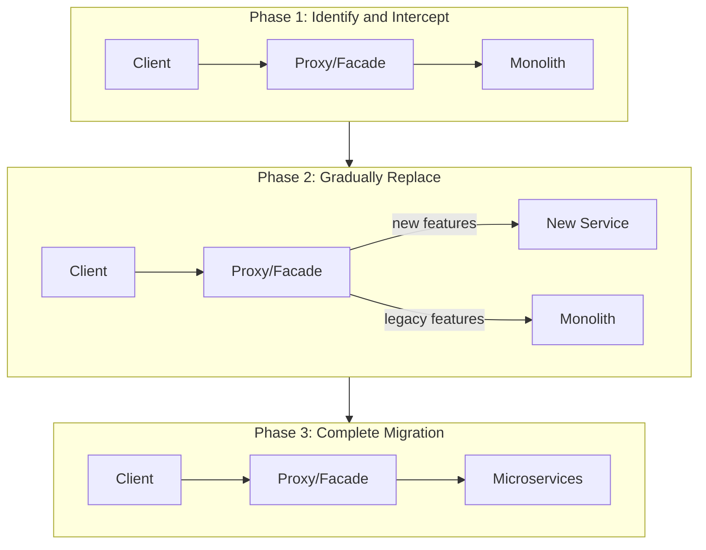
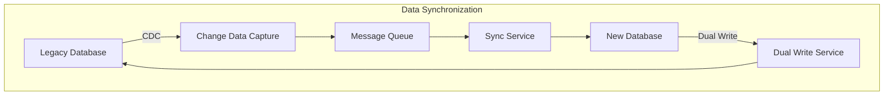

# How to Handle Strangler Fig Migration Pattern

Author: [nawazdhandala](https://www.github.com/nawazdhandala)

Tags: Microservices, Migration, Strangler Fig Pattern, Legacy Systems, Refactoring, Architecture, DevOps, Incremental Migration

Description: A comprehensive guide to migrating monolithic applications to microservices using the Strangler Fig pattern with practical implementation examples and monitoring strategies.

---

> The Strangler Fig pattern allows you to gradually replace a legacy monolith with microservices without a risky big-bang rewrite. This guide provides practical implementation strategies for a successful migration.

Named after the strangler fig tree that grows around its host, this pattern involves building new functionality around an existing system, gradually replacing components until the old system can be safely removed.

---

## Understanding the Strangler Fig Pattern

The pattern works in three phases:



Key benefits:
- **Reduced risk**: Incremental changes are easier to validate
- **Continuous delivery**: Deploy new features without waiting for complete migration
- **Rollback capability**: Route traffic back to monolith if issues arise
- **Team learning**: Gradually build microservices expertise

---

## Setting Up the Strangler Facade

The facade intercepts requests and routes them to either the legacy system or new services:

```python
# strangler_facade.py
from fastapi import FastAPI, Request, HTTPException
from fastapi.responses import Response
import httpx
from opentelemetry import trace
from opentelemetry.propagate import inject
from typing import Dict, Optional
import re

tracer = trace.get_tracer(__name__)

app = FastAPI(title="Strangler Facade")

class RouteConfig:
    """Configuration for route handling"""

    def __init__(
        self,
        pattern: str,
        target: str,
        methods: list = None,
        weight: int = 100,  # Percentage of traffic to new service
        enabled: bool = True
    ):
        self.pattern = re.compile(pattern)
        self.target = target
        self.methods = methods or ["GET", "POST", "PUT", "DELETE", "PATCH"]
        self.weight = weight
        self.enabled = enabled


class StranglerFacade:
    """
    Facade that routes requests between legacy and new services
    Implements the strangler fig pattern for gradual migration
    """

    def __init__(
        self,
        legacy_url: str,
        default_timeout: float = 30.0
    ):
        self.legacy_url = legacy_url
        self.timeout = default_timeout
        self.routes: Dict[str, RouteConfig] = {}
        self.client = httpx.AsyncClient(timeout=default_timeout)

    def register_route(self, name: str, config: RouteConfig):
        """Register a route configuration"""
        self.routes[name] = config

    def find_matching_route(self, path: str, method: str) -> Optional[RouteConfig]:
        """Find a route config that matches the request"""
        for name, config in self.routes.items():
            if config.enabled and config.pattern.match(path):
                if method in config.methods:
                    return config
        return None

    def should_route_to_new_service(self, config: RouteConfig, request_id: str) -> bool:
        """Determine if request should go to new service based on weight"""
        if config.weight >= 100:
            return True
        if config.weight <= 0:
            return False

        # Use request_id for consistent routing (same user gets same experience)
        hash_value = hash(request_id) % 100
        return hash_value < config.weight

    async def proxy_request(
        self,
        request: Request,
        target_url: str,
        service_name: str
    ) -> Response:
        """Proxy a request to the target service"""

        with tracer.start_as_current_span(f"proxy.{service_name}") as span:
            span.set_attribute("http.url", target_url)
            span.set_attribute("http.method", request.method)
            span.set_attribute("proxy.target", service_name)

            # Build headers with trace context
            headers = dict(request.headers)
            headers.pop("host", None)
            inject(headers)

            # Read request body
            body = await request.body()

            try:
                response = await self.client.request(
                    method=request.method,
                    url=target_url,
                    headers=headers,
                    content=body,
                    params=request.query_params
                )

                span.set_attribute("http.status_code", response.status_code)

                return Response(
                    content=response.content,
                    status_code=response.status_code,
                    headers=dict(response.headers)
                )

            except httpx.RequestError as e:
                span.record_exception(e)
                raise HTTPException(status_code=502, detail=f"Proxy error: {str(e)}")


# Initialize facade
facade = StranglerFacade(legacy_url="http://legacy-monolith:8080")

# Register migrated routes
facade.register_route(
    "user_service",
    RouteConfig(
        pattern=r"^/api/users.*",
        target="http://user-service:8001",
        weight=100  # Fully migrated
    )
)

facade.register_route(
    "order_service",
    RouteConfig(
        pattern=r"^/api/orders.*",
        target="http://order-service:8002",
        weight=50  # 50% canary
    )
)

facade.register_route(
    "inventory_service",
    RouteConfig(
        pattern=r"^/api/inventory.*",
        target="http://inventory-service:8003",
        weight=0  # Not yet migrated, still using legacy
    )
)


@app.api_route("/{path:path}", methods=["GET", "POST", "PUT", "DELETE", "PATCH"])
async def proxy_all(request: Request, path: str):
    """Route all requests through the strangler facade"""

    full_path = f"/{path}"
    request_id = request.headers.get("x-request-id", str(hash(request.client.host)))

    with tracer.start_as_current_span("strangler_facade") as span:
        span.set_attribute("http.path", full_path)
        span.set_attribute("http.method", request.method)

        # Find matching route
        route_config = facade.find_matching_route(full_path, request.method)

        if route_config and facade.should_route_to_new_service(route_config, request_id):
            # Route to new microservice
            target_url = f"{route_config.target}{full_path}"
            span.set_attribute("routing.target", "new_service")
            span.set_attribute("routing.service", route_config.target)

            return await facade.proxy_request(request, target_url, "new_service")
        else:
            # Route to legacy monolith
            target_url = f"{facade.legacy_url}{full_path}"
            span.set_attribute("routing.target", "legacy")

            return await facade.proxy_request(request, target_url, "legacy")
```

---

## Implementing Feature Flags for Migration

Control migration at a granular level with feature flags:

```python
# feature_flags.py
import redis
import json
from typing import Optional, Dict, Any
from dataclasses import dataclass, asdict
from opentelemetry import trace

tracer = trace.get_tracer(__name__)

@dataclass
class FeatureFlag:
    """Feature flag configuration"""
    name: str
    enabled: bool
    rollout_percentage: int = 0
    user_whitelist: list = None
    user_blacklist: list = None
    metadata: dict = None

    def __post_init__(self):
        self.user_whitelist = self.user_whitelist or []
        self.user_blacklist = self.user_blacklist or []
        self.metadata = self.metadata or {}


class MigrationFeatureFlags:
    """Feature flag system for migration control"""

    def __init__(self, redis_client: redis.Redis):
        self.redis = redis_client
        self.cache: Dict[str, FeatureFlag] = {}
        self.cache_ttl = 60  # seconds

    def create_flag(self, flag: FeatureFlag):
        """Create or update a feature flag"""
        key = f"migration:flag:{flag.name}"
        self.redis.set(key, json.dumps(asdict(flag)))
        self.cache[flag.name] = flag

    def get_flag(self, name: str) -> Optional[FeatureFlag]:
        """Get a feature flag"""
        # Check cache first
        if name in self.cache:
            return self.cache[name]

        key = f"migration:flag:{name}"
        data = self.redis.get(key)

        if data:
            flag = FeatureFlag(**json.loads(data))
            self.cache[name] = flag
            return flag

        return None

    def is_enabled(self, flag_name: str, user_id: str = None) -> bool:
        """Check if a feature flag is enabled for a user"""

        with tracer.start_as_current_span("check_feature_flag") as span:
            span.set_attribute("flag.name", flag_name)
            span.set_attribute("user.id", user_id or "anonymous")

            flag = self.get_flag(flag_name)

            if not flag:
                span.set_attribute("flag.found", False)
                return False

            span.set_attribute("flag.found", True)
            span.set_attribute("flag.enabled", flag.enabled)

            # Check if globally disabled
            if not flag.enabled:
                return False

            # Check blacklist
            if user_id and user_id in flag.user_blacklist:
                span.set_attribute("flag.result", "blacklisted")
                return False

            # Check whitelist
            if user_id and user_id in flag.user_whitelist:
                span.set_attribute("flag.result", "whitelisted")
                return True

            # Check rollout percentage
            if flag.rollout_percentage >= 100:
                span.set_attribute("flag.result", "full_rollout")
                return True

            if flag.rollout_percentage <= 0:
                span.set_attribute("flag.result", "no_rollout")
                return False

            # Use user_id hash for consistent experience
            if user_id:
                user_hash = hash(user_id) % 100
                enabled = user_hash < flag.rollout_percentage
            else:
                import random
                enabled = random.randint(0, 99) < flag.rollout_percentage

            span.set_attribute("flag.result", "rollout_check")
            span.set_attribute("flag.enabled_for_user", enabled)

            return enabled


# Migration flags configuration
flags = MigrationFeatureFlags(redis.Redis())

# Create migration flags
flags.create_flag(FeatureFlag(
    name="use_new_user_service",
    enabled=True,
    rollout_percentage=100,
    metadata={"migrated_date": "2024-01-15"}
))

flags.create_flag(FeatureFlag(
    name="use_new_order_service",
    enabled=True,
    rollout_percentage=25,
    user_whitelist=["beta_tester_1", "beta_tester_2"],
    metadata={"target_date": "2024-02-01"}
))

flags.create_flag(FeatureFlag(
    name="use_new_inventory_service",
    enabled=False,  # Not yet ready
    rollout_percentage=0,
    metadata={"status": "in_development"}
))
```

---

## Data Synchronization Strategy

Keep data synchronized between legacy and new systems during migration:



### Change Data Capture Implementation

```python
# data_sync.py
import json
from datetime import datetime
from typing import Callable, Dict, Any
from dataclasses import dataclass
import redis
from opentelemetry import trace

tracer = trace.get_tracer(__name__)

@dataclass
class ChangeEvent:
    """Represents a data change event"""
    event_id: str
    table: str
    operation: str  # INSERT, UPDATE, DELETE
    timestamp: str
    before: dict
    after: dict
    source: str  # legacy or new


class DataSyncService:
    """
    Handles data synchronization between legacy and new systems
    Uses CDC pattern for real-time sync
    """

    def __init__(self, redis_client: redis.Redis):
        self.redis = redis_client
        self.handlers: Dict[str, Callable] = {}
        self.sync_enabled = True

    def register_handler(self, table: str, handler: Callable):
        """Register a handler for table changes"""
        self.handlers[table] = handler

    def publish_change(self, event: ChangeEvent):
        """Publish a change event for synchronization"""

        with tracer.start_as_current_span("publish_change") as span:
            span.set_attribute("sync.table", event.table)
            span.set_attribute("sync.operation", event.operation)
            span.set_attribute("sync.source", event.source)

            channel = f"sync:{event.table}"
            self.redis.publish(channel, json.dumps({
                "event_id": event.event_id,
                "table": event.table,
                "operation": event.operation,
                "timestamp": event.timestamp,
                "before": event.before,
                "after": event.after,
                "source": event.source
            }))

            # Also store in stream for reliability
            self.redis.xadd(
                f"sync:stream:{event.table}",
                {"data": json.dumps(event.__dict__)},
                maxlen=10000
            )

    def process_change(self, event_data: dict):
        """Process an incoming change event"""

        event = ChangeEvent(**event_data)

        with tracer.start_as_current_span("process_change") as span:
            span.set_attribute("sync.event_id", event.event_id)
            span.set_attribute("sync.table", event.table)

            handler = self.handlers.get(event.table)

            if handler:
                try:
                    handler(event)
                    span.set_attribute("sync.status", "success")
                except Exception as e:
                    span.record_exception(e)
                    span.set_attribute("sync.status", "failed")
                    # Store failed event for retry
                    self.store_failed_event(event)
                    raise
            else:
                span.set_attribute("sync.status", "no_handler")

    def store_failed_event(self, event: ChangeEvent):
        """Store failed events for later retry"""
        self.redis.lpush(
            f"sync:failed:{event.table}",
            json.dumps(event.__dict__)
        )


class DualWriteService:
    """
    Handles dual writes during migration period
    Writes to both legacy and new databases
    """

    def __init__(self, legacy_db, new_db, sync_service: DataSyncService):
        self.legacy_db = legacy_db
        self.new_db = new_db
        self.sync_service = sync_service
        self.write_to_legacy = True
        self.write_to_new = True

    async def write(self, table: str, operation: str, data: dict) -> dict:
        """Write to both databases with consistency handling"""

        with tracer.start_as_current_span("dual_write") as span:
            span.set_attribute("dual_write.table", table)
            span.set_attribute("dual_write.operation", operation)

            results = {"legacy": None, "new": None, "errors": []}

            # Write to legacy (source of truth during migration)
            if self.write_to_legacy:
                try:
                    with tracer.start_as_current_span("write_legacy"):
                        if operation == "INSERT":
                            results["legacy"] = await self.legacy_db.insert(table, data)
                        elif operation == "UPDATE":
                            results["legacy"] = await self.legacy_db.update(table, data)
                        elif operation == "DELETE":
                            results["legacy"] = await self.legacy_db.delete(table, data)
                except Exception as e:
                    results["errors"].append({"target": "legacy", "error": str(e)})
                    span.record_exception(e)
                    raise  # Legacy is source of truth, fail the operation

            # Write to new database
            if self.write_to_new:
                try:
                    with tracer.start_as_current_span("write_new"):
                        if operation == "INSERT":
                            results["new"] = await self.new_db.insert(table, data)
                        elif operation == "UPDATE":
                            results["new"] = await self.new_db.update(table, data)
                        elif operation == "DELETE":
                            results["new"] = await self.new_db.delete(table, data)
                except Exception as e:
                    # Log but do not fail - sync service will catch up
                    results["errors"].append({"target": "new", "error": str(e)})
                    span.set_attribute("dual_write.new_failed", True)

                    # Publish sync event for retry
                    self.sync_service.publish_change(ChangeEvent(
                        event_id=f"retry-{datetime.utcnow().isoformat()}",
                        table=table,
                        operation=operation,
                        timestamp=datetime.utcnow().isoformat(),
                        before={},
                        after=data,
                        source="dual_write_retry"
                    ))

            return results


# Table-specific sync handlers
def sync_users(event: ChangeEvent):
    """Sync user data from legacy to new service"""

    with tracer.start_as_current_span("sync_users") as span:
        if event.source == "legacy":
            # Transform legacy schema to new schema
            new_data = transform_user_schema(event.after)

            if event.operation == "INSERT":
                new_user_service.create_user(new_data)
            elif event.operation == "UPDATE":
                new_user_service.update_user(new_data["id"], new_data)
            elif event.operation == "DELETE":
                new_user_service.delete_user(event.before["id"])


def sync_orders(event: ChangeEvent):
    """Sync order data from legacy to new service"""

    with tracer.start_as_current_span("sync_orders") as span:
        if event.source == "legacy":
            new_data = transform_order_schema(event.after)

            if event.operation == "INSERT":
                new_order_service.create_order(new_data)
            elif event.operation == "UPDATE":
                new_order_service.update_order(new_data["id"], new_data)


def transform_user_schema(legacy_data: dict) -> dict:
    """Transform legacy user schema to new schema"""
    return {
        "id": legacy_data["user_id"],
        "email": legacy_data["email_address"],
        "name": {
            "first": legacy_data.get("first_name", ""),
            "last": legacy_data.get("last_name", "")
        },
        "created_at": legacy_data.get("created_date"),
        "metadata": {
            "legacy_id": legacy_data["user_id"],
            "migrated_at": datetime.utcnow().isoformat()
        }
    }
```

---

## Implementing the Anti-Corruption Layer

Protect new services from legacy system quirks:

```python
# anti_corruption_layer.py
from abc import ABC, abstractmethod
from typing import Any, Dict, Optional
from dataclasses import dataclass
from opentelemetry import trace

tracer = trace.get_tracer(__name__)

class LegacyAdapter(ABC):
    """Base class for legacy system adapters"""

    @abstractmethod
    def to_legacy(self, data: dict) -> dict:
        """Transform new format to legacy format"""
        pass

    @abstractmethod
    def from_legacy(self, data: dict) -> dict:
        """Transform legacy format to new format"""
        pass


class UserAdapter(LegacyAdapter):
    """Adapter for user data transformation"""

    def to_legacy(self, data: dict) -> dict:
        """Transform new user format to legacy format"""

        with tracer.start_as_current_span("user_adapter.to_legacy"):
            return {
                "user_id": data.get("id"),
                "email_address": data.get("email"),
                "first_name": data.get("name", {}).get("first", ""),
                "last_name": data.get("name", {}).get("last", ""),
                "created_date": data.get("created_at"),
                # Legacy system uses different status codes
                "status_code": self._map_status_to_legacy(data.get("status")),
                # Legacy uses pipe-delimited roles
                "roles": "|".join(data.get("roles", []))
            }

    def from_legacy(self, data: dict) -> dict:
        """Transform legacy user format to new format"""

        with tracer.start_as_current_span("user_adapter.from_legacy"):
            return {
                "id": data.get("user_id"),
                "email": data.get("email_address"),
                "name": {
                    "first": data.get("first_name", ""),
                    "last": data.get("last_name", "")
                },
                "created_at": data.get("created_date"),
                "status": self._map_status_from_legacy(data.get("status_code")),
                "roles": data.get("roles", "").split("|") if data.get("roles") else []
            }

    def _map_status_to_legacy(self, status: str) -> int:
        """Map new status to legacy status code"""
        status_map = {
            "active": 1,
            "inactive": 0,
            "suspended": 2,
            "pending": 3
        }
        return status_map.get(status, 0)

    def _map_status_from_legacy(self, code: int) -> str:
        """Map legacy status code to new status"""
        code_map = {
            1: "active",
            0: "inactive",
            2: "suspended",
            3: "pending"
        }
        return code_map.get(code, "inactive")


class OrderAdapter(LegacyAdapter):
    """Adapter for order data transformation"""

    def to_legacy(self, data: dict) -> dict:
        with tracer.start_as_current_span("order_adapter.to_legacy"):
            # Legacy system expects flat structure
            items = data.get("items", [])

            return {
                "order_no": data.get("id"),
                "cust_id": data.get("customer_id"),
                "order_date": data.get("created_at"),
                "total_amt": data.get("total", 0),
                # Legacy stores items as JSON string
                "items_json": json.dumps(items),
                # Legacy uses numeric status
                "status": self._map_order_status_to_legacy(data.get("status"))
            }

    def from_legacy(self, data: dict) -> dict:
        with tracer.start_as_current_span("order_adapter.from_legacy"):
            items_json = data.get("items_json", "[]")

            return {
                "id": data.get("order_no"),
                "customer_id": data.get("cust_id"),
                "created_at": data.get("order_date"),
                "total": float(data.get("total_amt", 0)),
                "items": json.loads(items_json) if items_json else [],
                "status": self._map_order_status_from_legacy(data.get("status"))
            }

    def _map_order_status_to_legacy(self, status: str) -> int:
        status_map = {
            "pending": 0,
            "confirmed": 1,
            "processing": 2,
            "shipped": 3,
            "delivered": 4,
            "cancelled": 9
        }
        return status_map.get(status, 0)

    def _map_order_status_from_legacy(self, code: int) -> str:
        code_map = {
            0: "pending",
            1: "confirmed",
            2: "processing",
            3: "shipped",
            4: "delivered",
            9: "cancelled"
        }
        return code_map.get(code, "pending")


class AntiCorruptionLayer:
    """
    Anti-corruption layer that isolates new services from legacy quirks
    """

    def __init__(self):
        self.adapters: Dict[str, LegacyAdapter] = {}

    def register_adapter(self, entity_type: str, adapter: LegacyAdapter):
        """Register an adapter for an entity type"""
        self.adapters[entity_type] = adapter

    def translate_to_legacy(self, entity_type: str, data: dict) -> dict:
        """Translate new format to legacy format"""

        with tracer.start_as_current_span("acl.to_legacy") as span:
            span.set_attribute("entity_type", entity_type)

            adapter = self.adapters.get(entity_type)
            if adapter:
                return adapter.to_legacy(data)
            return data

    def translate_from_legacy(self, entity_type: str, data: dict) -> dict:
        """Translate legacy format to new format"""

        with tracer.start_as_current_span("acl.from_legacy") as span:
            span.set_attribute("entity_type", entity_type)

            adapter = self.adapters.get(entity_type)
            if adapter:
                return adapter.from_legacy(data)
            return data


# Initialize ACL
acl = AntiCorruptionLayer()
acl.register_adapter("user", UserAdapter())
acl.register_adapter("order", OrderAdapter())


# Usage in new service
class NewUserService:
    """New user service that uses ACL for legacy integration"""

    def __init__(self, acl: AntiCorruptionLayer, legacy_client):
        self.acl = acl
        self.legacy = legacy_client

    async def get_user(self, user_id: str) -> dict:
        """Get user, falling back to legacy if needed"""

        with tracer.start_as_current_span("get_user") as span:
            # Try new database first
            user = await self.db.get_user(user_id)

            if user:
                span.set_attribute("source", "new")
                return user

            # Fall back to legacy
            span.set_attribute("source", "legacy")
            legacy_user = await self.legacy.get_user(user_id)

            if legacy_user:
                # Transform through ACL
                return self.acl.translate_from_legacy("user", legacy_user)

            return None

    async def update_user(self, user_id: str, data: dict) -> dict:
        """Update user in both systems during migration"""

        with tracer.start_as_current_span("update_user") as span:
            # Update new system
            updated = await self.db.update_user(user_id, data)

            # Also update legacy through ACL
            legacy_data = self.acl.translate_to_legacy("user", data)
            await self.legacy.update_user(user_id, legacy_data)

            return updated
```

---

## Migration Progress Tracking

Monitor and track migration progress:

```python
# migration_tracker.py
from dataclasses import dataclass, field
from datetime import datetime
from typing import Dict, List, Optional
from prometheus_client import Gauge, Counter
import redis
import json
from opentelemetry import trace

tracer = trace.get_tracer(__name__)

# Prometheus metrics
migration_progress = Gauge(
    'migration_progress_percentage',
    'Percentage of traffic migrated',
    ['service', 'endpoint']
)

migration_requests = Counter(
    'migration_requests_total',
    'Total requests during migration',
    ['service', 'target']  # target: legacy or new
)

migration_errors = Counter(
    'migration_errors_total',
    'Errors during migration',
    ['service', 'target', 'error_type']
)


@dataclass
class MigrationStatus:
    """Status of a service migration"""
    service_name: str
    status: str  # planned, in_progress, completed, rolled_back
    started_at: Optional[str] = None
    completed_at: Optional[str] = None
    rollout_percentage: int = 0
    endpoints_migrated: List[str] = field(default_factory=list)
    endpoints_pending: List[str] = field(default_factory=list)
    error_rate: float = 0.0
    notes: str = ""


class MigrationTracker:
    """Tracks migration progress and health"""

    def __init__(self, redis_client: redis.Redis):
        self.redis = redis_client

    def update_status(self, status: MigrationStatus):
        """Update migration status for a service"""

        key = f"migration:status:{status.service_name}"
        self.redis.set(key, json.dumps(status.__dict__))

        # Update Prometheus metrics
        total_endpoints = len(status.endpoints_migrated) + len(status.endpoints_pending)
        if total_endpoints > 0:
            progress = (len(status.endpoints_migrated) / total_endpoints) * 100
            migration_progress.labels(
                service=status.service_name,
                endpoint="all"
            ).set(progress)

    def get_status(self, service_name: str) -> Optional[MigrationStatus]:
        """Get migration status for a service"""

        key = f"migration:status:{service_name}"
        data = self.redis.get(key)

        if data:
            return MigrationStatus(**json.loads(data))
        return None

    def record_request(self, service: str, target: str, success: bool, error_type: str = None):
        """Record a request during migration"""

        migration_requests.labels(service=service, target=target).inc()

        if not success and error_type:
            migration_errors.labels(
                service=service,
                target=target,
                error_type=error_type
            ).inc()

    def get_error_rate(self, service: str, window_minutes: int = 5) -> Dict[str, float]:
        """Calculate error rate for a service over a time window"""

        # In production, query from Prometheus or metrics store
        # This is a simplified in-memory calculation
        return {
            "legacy": 0.01,
            "new": 0.02
        }

    def should_rollback(self, service: str, threshold: float = 0.05) -> bool:
        """Check if migration should be rolled back based on error rate"""

        with tracer.start_as_current_span("check_rollback") as span:
            span.set_attribute("service", service)

            error_rates = self.get_error_rate(service)
            new_error_rate = error_rates.get("new", 0)
            legacy_error_rate = error_rates.get("legacy", 0)

            span.set_attribute("error_rate.new", new_error_rate)
            span.set_attribute("error_rate.legacy", legacy_error_rate)

            # Rollback if new service error rate is significantly higher
            if new_error_rate > threshold and new_error_rate > (legacy_error_rate * 2):
                span.set_attribute("recommendation", "rollback")
                return True

            span.set_attribute("recommendation", "continue")
            return False


class MigrationDashboard:
    """Dashboard for migration visibility"""

    def __init__(self, tracker: MigrationTracker):
        self.tracker = tracker

    def get_overall_status(self) -> dict:
        """Get overall migration status across all services"""

        services = ["user-service", "order-service", "inventory-service", "payment-service"]

        overall = {
            "total_services": len(services),
            "completed": 0,
            "in_progress": 0,
            "pending": 0,
            "services": []
        }

        for service in services:
            status = self.tracker.get_status(service)

            if status:
                if status.status == "completed":
                    overall["completed"] += 1
                elif status.status == "in_progress":
                    overall["in_progress"] += 1
                else:
                    overall["pending"] += 1

                overall["services"].append({
                    "name": service,
                    "status": status.status,
                    "rollout": status.rollout_percentage,
                    "error_rate": status.error_rate
                })

        overall["progress_percentage"] = (overall["completed"] / overall["total_services"]) * 100

        return overall
```

---

## Gradual Rollout Strategy

Implement a safe rollout with automatic rollback:

```python
# rollout_controller.py
from dataclasses import dataclass
from typing import Optional
import asyncio
from opentelemetry import trace

tracer = trace.get_tracer(__name__)

@dataclass
class RolloutConfig:
    """Configuration for gradual rollout"""
    service_name: str
    initial_percentage: int = 1
    increment: int = 5
    max_percentage: int = 100
    increment_interval_minutes: int = 30
    error_threshold: float = 0.05
    min_requests_for_evaluation: int = 100


class RolloutController:
    """Controls gradual rollout of migrated services"""

    def __init__(
        self,
        feature_flags: MigrationFeatureFlags,
        tracker: MigrationTracker
    ):
        self.flags = feature_flags
        self.tracker = tracker
        self.active_rollouts: Dict[str, RolloutConfig] = {}

    async def start_rollout(self, config: RolloutConfig):
        """Start a gradual rollout"""

        with tracer.start_as_current_span("start_rollout") as span:
            span.set_attribute("service", config.service_name)
            span.set_attribute("initial_percentage", config.initial_percentage)

            self.active_rollouts[config.service_name] = config

            # Set initial percentage
            self.flags.create_flag(FeatureFlag(
                name=f"use_new_{config.service_name}",
                enabled=True,
                rollout_percentage=config.initial_percentage
            ))

            # Start monitoring loop
            asyncio.create_task(self._monitor_rollout(config))

    async def _monitor_rollout(self, config: RolloutConfig):
        """Monitor rollout and adjust percentage"""

        current_percentage = config.initial_percentage

        while current_percentage < config.max_percentage:
            # Wait for interval
            await asyncio.sleep(config.increment_interval_minutes * 60)

            with tracer.start_as_current_span("evaluate_rollout") as span:
                span.set_attribute("service", config.service_name)
                span.set_attribute("current_percentage", current_percentage)

                # Check if we should rollback
                if self.tracker.should_rollback(config.service_name, config.error_threshold):
                    await self._execute_rollback(config)
                    span.set_attribute("action", "rollback")
                    return

                # Increment percentage
                current_percentage = min(
                    current_percentage + config.increment,
                    config.max_percentage
                )

                span.set_attribute("new_percentage", current_percentage)
                span.set_attribute("action", "increment")

                self.flags.create_flag(FeatureFlag(
                    name=f"use_new_{config.service_name}",
                    enabled=True,
                    rollout_percentage=current_percentage
                ))

        # Rollout complete
        self.tracker.update_status(MigrationStatus(
            service_name=config.service_name,
            status="completed",
            rollout_percentage=100,
            completed_at=datetime.utcnow().isoformat()
        ))

    async def _execute_rollback(self, config: RolloutConfig):
        """Execute rollback for a service"""

        with tracer.start_as_current_span("execute_rollback") as span:
            span.set_attribute("service", config.service_name)

            # Disable the feature flag
            self.flags.create_flag(FeatureFlag(
                name=f"use_new_{config.service_name}",
                enabled=False,
                rollout_percentage=0
            ))

            # Update status
            self.tracker.update_status(MigrationStatus(
                service_name=config.service_name,
                status="rolled_back",
                rollout_percentage=0,
                notes=f"Automatic rollback due to error threshold exceeded"
            ))

            # Remove from active rollouts
            del self.active_rollouts[config.service_name]

            # Send alert
            await send_alert(
                title=f"Migration Rollback: {config.service_name}",
                message="Automatic rollback triggered due to elevated error rate",
                severity="high"
            )
```

---

## Testing the Migration

Implement shadow testing to validate new services:

```python
# shadow_testing.py
import asyncio
import json
from typing import Tuple
from opentelemetry import trace

tracer = trace.get_tracer(__name__)

class ShadowTester:
    """
    Shadow testing - send requests to both systems and compare results
    without affecting production traffic
    """

    def __init__(self, legacy_client, new_client):
        self.legacy = legacy_client
        self.new = new_client
        self.comparison_results = []

    async def shadow_request(
        self,
        method: str,
        path: str,
        **kwargs
    ) -> Tuple[dict, dict, dict]:
        """
        Send request to both systems and compare
        Returns: (legacy_response, new_response, comparison)
        """

        with tracer.start_as_current_span("shadow_request") as span:
            span.set_attribute("http.method", method)
            span.set_attribute("http.path", path)

            # Send to both systems concurrently
            legacy_task = asyncio.create_task(
                self.legacy.request(method, path, **kwargs)
            )
            new_task = asyncio.create_task(
                self.new.request(method, path, **kwargs)
            )

            legacy_response, new_response = await asyncio.gather(
                legacy_task, new_task,
                return_exceptions=True
            )

            # Compare responses
            comparison = self._compare_responses(
                legacy_response,
                new_response
            )

            span.set_attribute("comparison.match", comparison["match"])
            span.set_attribute("comparison.differences_count", len(comparison.get("differences", [])))

            # Store for analysis
            self.comparison_results.append({
                "path": path,
                "method": method,
                "comparison": comparison,
                "timestamp": datetime.utcnow().isoformat()
            })

            return legacy_response, new_response, comparison

    def _compare_responses(self, legacy, new) -> dict:
        """Compare two responses and identify differences"""

        comparison = {
            "match": True,
            "differences": [],
            "legacy_status": None,
            "new_status": None
        }

        # Handle exceptions
        if isinstance(legacy, Exception):
            comparison["legacy_error"] = str(legacy)
            comparison["match"] = False
            return comparison

        if isinstance(new, Exception):
            comparison["new_error"] = str(new)
            comparison["match"] = False
            return comparison

        # Compare status codes
        comparison["legacy_status"] = legacy.status_code
        comparison["new_status"] = new.status_code

        if legacy.status_code != new.status_code:
            comparison["match"] = False
            comparison["differences"].append({
                "field": "status_code",
                "legacy": legacy.status_code,
                "new": new.status_code
            })

        # Compare response bodies
        try:
            legacy_body = legacy.json()
            new_body = new.json()

            differences = self._find_differences(legacy_body, new_body)

            if differences:
                comparison["match"] = False
                comparison["differences"].extend(differences)

        except json.JSONDecodeError:
            # Compare as text
            if legacy.text != new.text:
                comparison["match"] = False
                comparison["differences"].append({
                    "field": "body",
                    "type": "text_mismatch"
                })

        return comparison

    def _find_differences(self, legacy: dict, new: dict, path: str = "") -> list:
        """Recursively find differences between two dictionaries"""

        differences = []

        # Fields to ignore during comparison (timestamps, etc)
        ignore_fields = {"updated_at", "created_at", "timestamp", "version"}

        all_keys = set(legacy.keys()) | set(new.keys())

        for key in all_keys:
            if key in ignore_fields:
                continue

            field_path = f"{path}.{key}" if path else key

            legacy_val = legacy.get(key)
            new_val = new.get(key)

            if key not in legacy:
                differences.append({
                    "field": field_path,
                    "type": "missing_in_legacy",
                    "new_value": new_val
                })
            elif key not in new:
                differences.append({
                    "field": field_path,
                    "type": "missing_in_new",
                    "legacy_value": legacy_val
                })
            elif isinstance(legacy_val, dict) and isinstance(new_val, dict):
                differences.extend(self._find_differences(legacy_val, new_val, field_path))
            elif legacy_val != new_val:
                differences.append({
                    "field": field_path,
                    "type": "value_mismatch",
                    "legacy_value": legacy_val,
                    "new_value": new_val
                })

        return differences

    def get_match_rate(self) -> float:
        """Get the percentage of matching responses"""

        if not self.comparison_results:
            return 0.0

        matches = sum(1 for r in self.comparison_results if r["comparison"]["match"])
        return (matches / len(self.comparison_results)) * 100
```

---

## Best Practices

1. **Start small**: Begin with low-risk, low-traffic endpoints
2. **Monitor everything**: Track error rates, latency, and business metrics
3. **Maintain data consistency**: Use CDC and dual writes during transition
4. **Build rollback capability**: Always be able to route traffic back to legacy
5. **Test thoroughly**: Shadow testing validates behavior before cutover
6. **Communicate progress**: Keep stakeholders informed of migration status
7. **Document differences**: Track schema changes and API differences

---

## Conclusion

The Strangler Fig pattern enables safe, incremental migration from monoliths to microservices:

- **Facade routing** controls traffic between systems
- **Feature flags** enable granular rollout control
- **Data synchronization** keeps systems in sync during transition
- **Anti-corruption layers** isolate new services from legacy quirks
- **Shadow testing** validates behavior before cutover

Take your time, monitor carefully, and always maintain the ability to roll back.

---

*Need visibility into your migration progress? [OneUptime](https://oneuptime.com) provides dashboards, alerting, and distributed tracing to help you monitor both legacy and new services during your migration journey.*

**Related Reading:**
- [How to Fix Service Dependency Cycle Issues](https://oneuptime.com/blog/post/2026-01-24-fix-service-dependency-cycle-issues/view)
- [How to Implement Distributed Tracing in Python Microservices](https://oneuptime.com/blog/post/2025-01-06-python-distributed-tracing-microservices/view)
