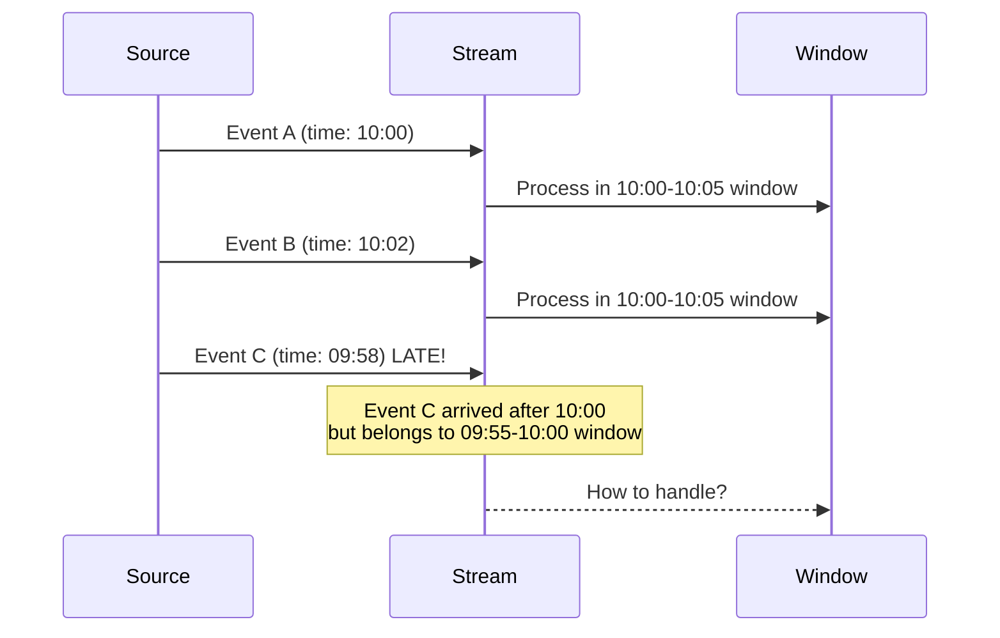
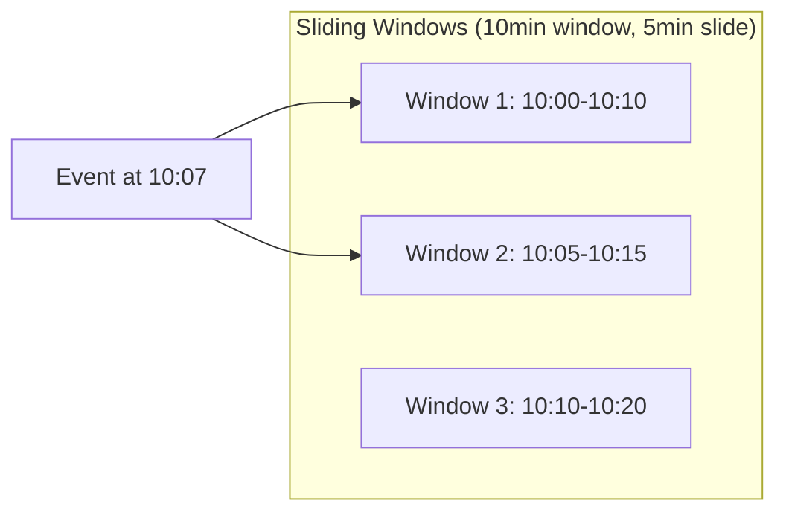
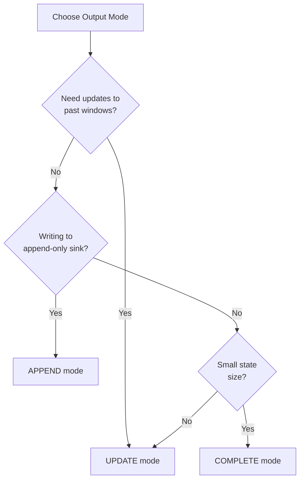

# How to Fix 'Late Data' Handling in Streaming

Author: [nawazdhandala](https://www.github.com/nawazdhandala)

Tags: Apache Spark, Structured Streaming, Stream Processing, Watermarks, Late Data, Real-Time Analytics, Event Time

Description: Learn how to handle late-arriving data in Spark Structured Streaming using watermarks, window operations, and state management strategies.

---

> In real-world streaming systems, data rarely arrives in perfect order. Network delays, device buffering, and system outages cause events to arrive after the time window they belong to has passed. Handling this late data correctly is essential for accurate streaming analytics.

This guide covers watermarking, windowing, and strategies for managing late data in Spark Structured Streaming.

---

## Understanding Late Data

Late data occurs when an event's event time (when it actually happened) is earlier than events already processed. Without proper handling, these events would be dropped or cause incorrect aggregations.



---

## Configuring Watermarks

Watermarks define how long Spark waits for late data before finalizing aggregations.

```python
from pyspark.sql import SparkSession
from pyspark.sql.functions import (
    col, window, sum as spark_sum, count,
    from_json, to_timestamp
)
from pyspark.sql.types import (
    StructType, StructField, StringType,
    DoubleType, TimestampType
)

spark = SparkSession.builder \
    .appName("LateDataHandling") \
    .config("spark.sql.streaming.stateStore.stateSchemaCheck", "false") \
    .getOrCreate()

# Define schema for incoming events
event_schema = StructType([
    StructField("event_id", StringType()),
    StructField("user_id", StringType()),
    StructField("event_type", StringType()),
    StructField("amount", DoubleType()),
    StructField("event_time", StringType())
])

# Read from Kafka
events_df = spark.readStream \
    .format("kafka") \
    .option("kafka.bootstrap.servers", "localhost:9092") \
    .option("subscribe", "events") \
    .load()

# Parse JSON and convert event_time to timestamp
parsed_df = events_df \
    .select(from_json(col("value").cast("string"), event_schema).alias("data")) \
    .select("data.*") \
    .withColumn("event_timestamp", to_timestamp(col("event_time")))

# Apply watermark - wait up to 10 minutes for late data
watermarked_df = parsed_df \
    .withWatermark("event_timestamp", "10 minutes")
```

---

## Window Aggregations with Watermarks

Combine watermarks with window functions for time-based aggregations.

```python
# Tumbling window aggregation (non-overlapping)
tumbling_aggregation = watermarked_df \
    .groupBy(
        window(col("event_timestamp"), "5 minutes"),  # 5-minute windows
        col("event_type")
    ) \
    .agg(
        count("*").alias("event_count"),
        spark_sum("amount").alias("total_amount")
    )

# Write results to Delta Lake
query = tumbling_aggregation.writeStream \
    .format("delta") \
    .outputMode("append")  # Results written once window is finalized \
    .option("checkpointLocation", "/checkpoints/tumbling") \
    .start("/delta/event_aggregates")
```

### Sliding Windows

```python
# Sliding window - 10 minute window, sliding every 5 minutes
sliding_aggregation = watermarked_df \
    .groupBy(
        window(
            col("event_timestamp"),
            "10 minutes",  # Window duration
            "5 minutes"    # Slide interval
        ),
        col("user_id")
    ) \
    .agg(
        count("*").alias("events_in_window"),
        spark_sum("amount").alias("total_amount")
    )

# Each event contributes to 2 overlapping windows
query = sliding_aggregation.writeStream \
    .format("console") \
    .outputMode("update") \
    .start()
```



---

## Watermark Strategies

Choose watermark duration based on your data characteristics and latency requirements.

```python
def configure_watermark(
    df,
    event_time_col: str,
    max_delay_minutes: int,
    safety_buffer_minutes: int = 2
):
    """
    Configure watermark with appropriate delay threshold.

    Args:
        df: Streaming DataFrame
        event_time_col: Column containing event timestamp
        max_delay_minutes: Maximum expected delay for events
        safety_buffer_minutes: Additional buffer for safety
    """
    total_delay = max_delay_minutes + safety_buffer_minutes

    return df.withWatermark(event_time_col, f"{total_delay} minutes")

# Conservative watermark for unreliable sources
watermarked_df = configure_watermark(
    parsed_df,
    "event_timestamp",
    max_delay_minutes=30,  # Events can be up to 30 minutes late
    safety_buffer_minutes=5
)

# Aggressive watermark for real-time requirements
watermarked_df = configure_watermark(
    parsed_df,
    "event_timestamp",
    max_delay_minutes=2,
    safety_buffer_minutes=1
)
```

### Monitoring Late Data

```python
# Track late data metrics
from pyspark.sql.functions import current_timestamp, unix_timestamp

# Add latency calculation
latency_df = watermarked_df \
    .withColumn(
        "processing_time",
        current_timestamp()
    ) \
    .withColumn(
        "latency_seconds",
        unix_timestamp("processing_time") - unix_timestamp("event_timestamp")
    )

# Log latency statistics periodically
def process_batch(batch_df, batch_id):
    if batch_df.count() > 0:
        stats = batch_df.agg({
            "latency_seconds": "max",
            "latency_seconds": "avg",
            "latency_seconds": "percentile_approx(latency_seconds, 0.99)"
        }).collect()[0]

        print(f"Batch {batch_id}: Max latency={stats[0]}s, Avg={stats[1]:.1f}s")

query = latency_df.writeStream \
    .foreachBatch(process_batch) \
    .start()
```

---

## Output Modes and Late Data

Different output modes handle late data differently.

```python
# APPEND mode: Results output once, when watermark passes window end
# Late data after watermark is dropped
append_query = aggregated_df.writeStream \
    .outputMode("append") \
    .format("delta") \
    .start("/delta/final_aggregates")

# UPDATE mode: Results updated as new data arrives
# Late data updates existing aggregations
update_query = aggregated_df.writeStream \
    .outputMode("update") \
    .format("console") \
    .start()

# COMPLETE mode: Entire result table output each trigger
# Not commonly used with watermarks (defeats the purpose)
complete_query = aggregated_df.writeStream \
    .outputMode("complete") \
    .format("memory") \
    .queryName("live_aggregates") \
    .start()
```

### Choosing Output Mode



---

## Handling Extremely Late Data

For data that arrives beyond the watermark, implement a secondary processing path.

```python
from pyspark.sql.functions import lit, when

# Main streaming path with watermark
main_stream = watermarked_df \
    .withColumn("processing_path", lit("realtime"))

# Secondary path for late data recovery
# Run periodically as a batch job
def process_late_data(spark, lookback_hours: int = 24):
    """
    Reprocess late data that arrived after watermark.
    """
    # Read raw events from the last 24 hours
    raw_events = spark.read \
        .format("kafka") \
        .option("kafka.bootstrap.servers", "localhost:9092") \
        .option("subscribe", "events") \
        .option("startingOffsets", "earliest") \
        .option("endingOffsets", "latest") \
        .load()

    # Parse and filter for late events
    parsed = raw_events \
        .select(from_json(col("value").cast("string"), event_schema).alias("data")) \
        .select("data.*") \
        .withColumn("event_timestamp", to_timestamp(col("event_time")))

    # Find events where processing time is much later than event time
    late_events = parsed.filter(
        col("kafka_timestamp") - col("event_timestamp") > expr("INTERVAL 35 MINUTES")
    )

    # Recompute aggregations for affected windows
    late_aggregates = late_events \
        .groupBy(
            window(col("event_timestamp"), "5 minutes"),
            col("event_type")
        ) \
        .agg(
            count("*").alias("late_event_count"),
            spark_sum("amount").alias("late_amount")
        ) \
        .withColumn("processing_path", lit("late_recovery"))

    # Merge with existing aggregates
    existing = spark.read.delta("/delta/event_aggregates")

    merged = existing.alias("e").join(
        late_aggregates.alias("l"),
        ["window", "event_type"],
        "outer"
    ).select(
        col("e.window").alias("window"),
        col("e.event_type").alias("event_type"),
        (col("e.event_count") + col("l.late_event_count")).alias("event_count"),
        (col("e.total_amount") + col("l.late_amount")).alias("total_amount")
    )

    merged.write \
        .format("delta") \
        .mode("overwrite") \
        .save("/delta/event_aggregates_corrected")

# Schedule this to run hourly
process_late_data(spark, lookback_hours=2)
```

---

## State Management for Late Data

Configure state store settings to handle late data efficiently.

```python
# Configure state store
spark.conf.set("spark.sql.streaming.stateStore.providerClass",
    "org.apache.spark.sql.execution.streaming.state.RocksDBStateStoreProvider")

# Limit state retention based on watermark
spark.conf.set("spark.sql.streaming.stateStore.minDeltasForSnapshot", "10")

# Configure state cleanup
spark.conf.set("spark.sql.streaming.statefulOperator.checkCorrectness.enabled", "true")
```

### Monitoring State Size

```python
def monitor_streaming_query(query):
    """
    Monitor streaming query progress including state metrics.
    """
    import time

    while query.isActive:
        progress = query.lastProgress

        if progress:
            # State metrics
            state_ops = progress.get("stateOperators", [])
            for op in state_ops:
                print(f"State rows: {op.get('numRowsTotal', 0):,}")
                print(f"State memory: {op.get('memoryUsedBytes', 0) / (1024**2):.1f} MB")
                print(f"Late inputs: {op.get('numLateInputRows', 0):,}")

            # Processing metrics
            print(f"Input rows/sec: {progress.get('inputRowsPerSecond', 0):.0f}")
            print(f"Processing time: {progress.get('triggerExecution', {}).get('latency', {}).get('triggerExecution', 0)}ms")

        time.sleep(30)

# Run monitor in background
import threading
monitor_thread = threading.Thread(target=monitor_streaming_query, args=(query,))
monitor_thread.daemon = True
monitor_thread.start()
```

---

## Complete Example: E-commerce Events

```python
from pyspark.sql import SparkSession
from pyspark.sql.functions import *
from pyspark.sql.types import *

spark = SparkSession.builder \
    .appName("EcommerceStreaming") \
    .config("spark.sql.shuffle.partitions", "10") \
    .getOrCreate()

# Schema for e-commerce events
order_schema = StructType([
    StructField("order_id", StringType()),
    StructField("customer_id", StringType()),
    StructField("product_id", StringType()),
    StructField("quantity", IntegerType()),
    StructField("price", DoubleType()),
    StructField("order_time", TimestampType()),
    StructField("region", StringType())
])

# Read from Kafka
orders_stream = spark.readStream \
    .format("kafka") \
    .option("kafka.bootstrap.servers", "kafka:9092") \
    .option("subscribe", "orders") \
    .option("startingOffsets", "latest") \
    .load() \
    .select(
        from_json(col("value").cast("string"), order_schema).alias("order")
    ) \
    .select("order.*")

# Apply watermark - allow 15 minutes for late orders
watermarked_orders = orders_stream \
    .withWatermark("order_time", "15 minutes")

# Calculate hourly revenue by region
hourly_revenue = watermarked_orders \
    .withColumn("revenue", col("quantity") * col("price")) \
    .groupBy(
        window(col("order_time"), "1 hour"),
        col("region")
    ) \
    .agg(
        count("order_id").alias("order_count"),
        sum("revenue").alias("total_revenue"),
        avg("revenue").alias("avg_order_value"),
        countDistinct("customer_id").alias("unique_customers")
    )

# Write to Delta Lake with checkpointing
revenue_query = hourly_revenue.writeStream \
    .format("delta") \
    .outputMode("append") \
    .option("checkpointLocation", "/checkpoints/hourly_revenue") \
    .partitionBy("region") \
    .trigger(processingTime="1 minute") \
    .start("/delta/hourly_revenue")

# Calculate 5-minute moving averages for real-time dashboard
realtime_metrics = watermarked_orders \
    .withColumn("revenue", col("quantity") * col("price")) \
    .groupBy(
        window(col("order_time"), "5 minutes", "1 minute"),
        col("region")
    ) \
    .agg(
        sum("revenue").alias("revenue_5min"),
        count("*").alias("orders_5min")
    )

# Write to memory table for dashboard queries
dashboard_query = realtime_metrics.writeStream \
    .format("memory") \
    .outputMode("update") \
    .queryName("realtime_dashboard") \
    .trigger(processingTime="10 seconds") \
    .start()

# Query the live dashboard data
spark.sql("""
    SELECT
        window.start as window_start,
        region,
        revenue_5min,
        orders_5min
    FROM realtime_dashboard
    WHERE window.start >= current_timestamp() - INTERVAL 30 MINUTES
    ORDER BY window.start DESC, region
""").show()
```

---

## Best Practices

1. **Set watermarks based on data patterns** - Analyze historical latency distribution
2. **Use appropriate output mode** - Append for final results, Update for dashboards
3. **Monitor late input metrics** - Track dropped events in Spark UI
4. **Implement late data recovery** - Batch reprocessing for critical accuracy
5. **Size state stores properly** - Use RocksDB for large state
6. **Test with simulated delays** - Verify late data handling before production
7. **Document latency SLAs** - Make watermark choices explicit

---

*Building real-time streaming applications? [OneUptime](https://oneuptime.com) provides comprehensive monitoring for streaming pipelines with lag detection, throughput tracking, and automated incident response.*

**Related Reading:**
- [How to Handle Databricks Workflows](https://oneuptime.com/blog/post/2026-01-24-databricks-workflows/view)
- [How to Fix "Executor Memory" Spark Errors](https://oneuptime.com/blog/post/2026-01-24-spark-executor-memory/view)
