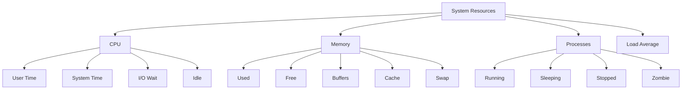
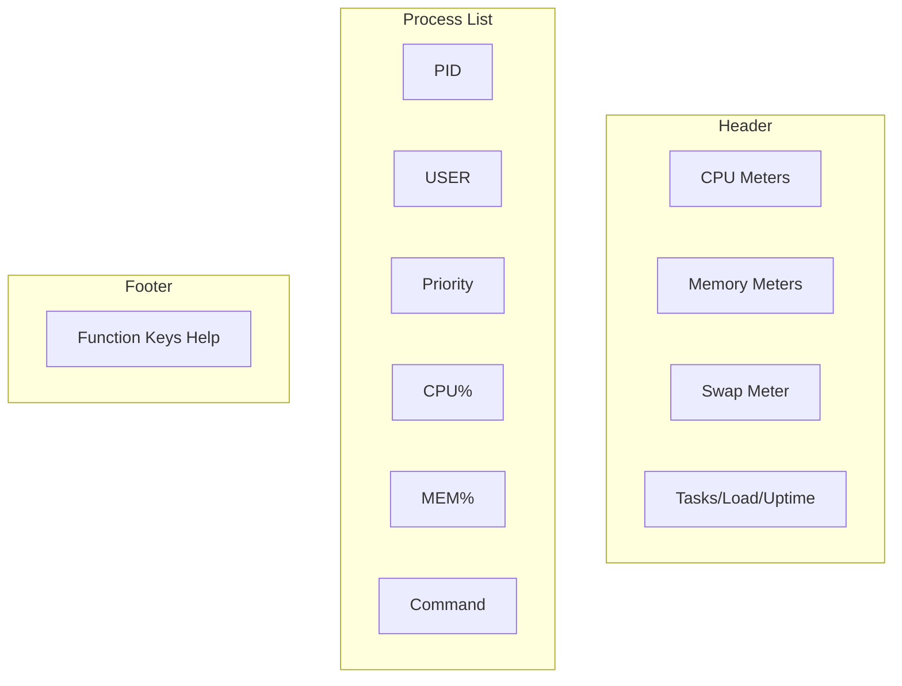
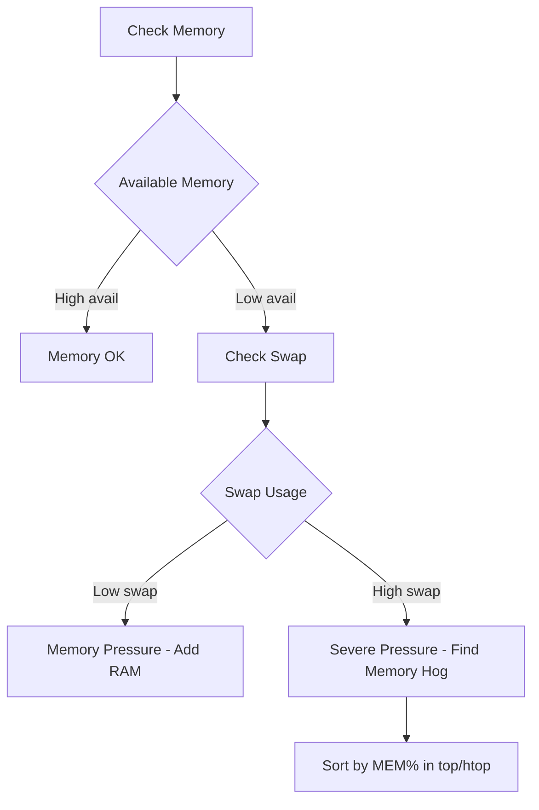

# How to Handle System Monitoring with top and htop

Author: [nawazdhandala](https://www.github.com/nawazdhandala)

Tags: Linux, Monitoring, Performance, System Administration, top, htop, Processes, Resource Management

Description: Learn how to effectively monitor system resources using top and htop, including understanding metrics, customizing views, and identifying performance issues.

---

Monitoring system performance is essential for maintaining healthy Linux servers. The `top` and `htop` utilities provide real-time views of system resources and running processes. This guide shows you how to use both tools effectively.

## Understanding System Metrics



## Using top

### Starting top

```bash
# Basic usage
top

# Start with specific update interval (seconds)
top -d 2

# Monitor specific user's processes
top -u username

# Start in batch mode (for scripts)
top -b -n 1

# Monitor specific PID
top -p 1234

# Monitor multiple PIDs
top -p 1234,5678,9012
```

### Understanding the top Display

```
top - 14:30:00 up 45 days,  3:22,  2 users,  load average: 0.52, 0.58, 0.59
Tasks: 287 total,   1 running, 286 sleeping,   0 stopped,   0 zombie
%Cpu(s):  5.3 us,  2.1 sy,  0.0 ni, 92.0 id,  0.5 wa,  0.0 hi,  0.1 si,  0.0 st
MiB Mem :  15921.4 total,   1234.5 free,   8765.4 used,   5921.5 buff/cache
MiB Swap:   4096.0 total,   4000.0 free,     96.0 used.   6543.2 avail Mem

  PID USER      PR  NI    VIRT    RES    SHR S  %CPU  %MEM     TIME+ COMMAND
 1234 root      20   0  456789 123456  12345 S   5.3   0.8   1:23.45 myapp
```

#### Header Line Breakdown

| Field | Description |
|-------|-------------|
| `up 45 days` | System uptime |
| `2 users` | Logged-in users |
| `load average: 0.52, 0.58, 0.59` | 1, 5, 15 minute load averages |

#### Task Line

| Field | Description |
|-------|-------------|
| `287 total` | Total number of processes |
| `1 running` | Processes actively using CPU |
| `286 sleeping` | Processes waiting for events |
| `0 stopped` | Paused processes (SIGSTOP) |
| `0 zombie` | Terminated but not reaped |

#### CPU Line

| Field | Description |
|-------|-------------|
| `us` | User space CPU time |
| `sy` | Kernel/system CPU time |
| `ni` | Nice (low priority) processes |
| `id` | Idle CPU time |
| `wa` | I/O wait time |
| `hi` | Hardware interrupt time |
| `si` | Software interrupt time |
| `st` | Steal time (virtualization) |

#### Memory Lines

| Field | Description |
|-------|-------------|
| `total` | Total physical memory |
| `free` | Unused memory |
| `used` | Memory in use |
| `buff/cache` | Buffer and cache memory |
| `avail Mem` | Available for new processes |

#### Process Columns

| Column | Description |
|--------|-------------|
| `PID` | Process ID |
| `USER` | Process owner |
| `PR` | Priority |
| `NI` | Nice value (-20 to 19) |
| `VIRT` | Virtual memory size |
| `RES` | Resident (physical) memory |
| `SHR` | Shared memory |
| `S` | Process state |
| `%CPU` | CPU usage percentage |
| `%MEM` | Memory usage percentage |
| `TIME+` | Total CPU time used |
| `COMMAND` | Command name |

### Interactive top Commands

While top is running, use these keys:

```
Navigation:
  Up/Down      Scroll through processes
  PgUp/PgDn    Scroll one page
  Home/End     Jump to top/bottom

Display:
  1            Toggle individual CPU cores
  t            Toggle task/CPU line display modes
  m            Toggle memory line display modes
  l            Toggle load average line
  H            Show threads (toggle)
  V            Forest (tree) view

Sorting:
  M            Sort by memory usage
  P            Sort by CPU usage
  T            Sort by running time
  N            Sort by PID
  R            Reverse sort order
  <            Move sort column left
  >            Move sort column right

Filtering:
  u            Filter by user
  o            Add filter (e.g., COMMAND=apache)
  O            Add case-insensitive filter
  =            Clear filters

Actions:
  k            Kill a process
  r            Renice (change priority)
  s            Change refresh interval
  d            Same as s (delay)

View options:
  c            Toggle full command line
  i            Toggle idle processes (hide/show)
  x            Toggle highlight sort column
  y            Toggle highlight running tasks
  z            Toggle color mode
  b            Toggle bold for running tasks

Configuration:
  W            Write configuration to ~/.toprc
  q            Quit
  ?/h          Help
```

### Customizing top

```bash
# Set default update interval
top -d 5

# Save configuration while running top:
# 1. Configure display as desired
# 2. Press W to save to ~/.toprc
```

#### Example: Create Custom View

```bash
# In top, press:
# 1 - Show all CPUs
# t - Cycle through CPU display modes
# m - Cycle through memory display modes
# c - Show full command paths
# x - Highlight sort column
# W - Save configuration
```

### Batch Mode for Scripts

```bash
# Get one snapshot
top -b -n 1 > system_snapshot.txt

# Get 5 snapshots, 2 seconds apart
top -b -n 5 -d 2 > monitoring.txt

# Get top 10 CPU consumers
top -b -n 1 | head -17

# Get memory usage in script
top -b -n 1 | grep "MiB Mem"

# Monitor specific processes
top -b -n 1 -p $(pgrep -d',' nginx)
```

## Using htop

htop is a more user-friendly and feature-rich alternative to top.

### Installing htop

```bash
# Debian/Ubuntu
sudo apt-get install htop

# RHEL/CentOS/Fedora
sudo dnf install htop

# Arch Linux
sudo pacman -S htop
```

### Starting htop

```bash
# Basic usage
htop

# Monitor specific user
htop -u username

# Start with tree view
htop -t

# Monitor specific PID
htop -p 1234

# Start without color
htop -C
```

### Understanding the htop Display



htop displays:
- **CPU bars**: Each core shown individually with color coding
- **Memory bars**: Visual representation of memory usage
- **Process tree**: Option to view parent-child relationships
- **Function keys**: Help bar at the bottom

### htop Color Coding

CPU bar colors:
- **Blue**: Low priority processes
- **Green**: Normal user processes
- **Red**: Kernel processes
- **Orange/Yellow**: IRQ time
- **Magenta**: Soft IRQ time
- **Gray**: I/O wait

Memory bar colors:
- **Green**: Used memory
- **Blue**: Buffers
- **Orange/Yellow**: Cache

### Interactive htop Commands

```
Navigation:
  Up/Down/j/k  Scroll through processes
  PgUp/PgDn    Scroll one page
  Home/End     Jump to top/bottom
  Space        Tag process (for batch operations)
  U            Untag all processes

Display:
  t            Tree view toggle
  H            Show/hide user threads
  K            Show/hide kernel threads
  p            Toggle program path

Sorting:
  F6/</        Select sort column
  I            Invert sort order
  P            Sort by CPU%
  M            Sort by MEM%
  T            Sort by TIME

Filtering/Searching:
  F3//         Search for process
  F4/\         Filter by string
  F5           Tree view

Actions:
  F9/k         Kill process (select signal)
  F7/]         Increase priority (lower nice)
  F8/[         Decrease priority (higher nice)
  l            List open files (lsof)
  s            Strace process
  e            Show environment variables
  a            Set CPU affinity

Configuration:
  F2/S         Setup (configure meters/display)
  C            Tag and kill (confirmation)
  F10/q        Quit
```

### Customizing htop

Press F2 (Setup) to access the configuration menu:

```
┌─────────────────────────────────────────┐
│ Setup                                   │
├─────────────────────────────────────────┤
│ Meters     Columns    Display   Colors  │
├─────────────────────────────────────────┤
│ Configure CPU meters layout             │
│ Add/remove displayed columns            │
│ Change display options                  │
│ Select color scheme                     │
└─────────────────────────────────────────┘
```

#### Configuring Meters

1. Press F2 (Setup)
2. Select "Meters" column
3. Use arrow keys to navigate
4. Press Enter to add meters
5. F10 to save and exit

Available meters:
- CPU/Memory/Swap (various styles)
- Load average
- Tasks
- Uptime
- Battery
- Hostname
- Clock
- Network I/O
- Disk I/O

#### Configuring Columns

1. Press F2 (Setup)
2. Select "Columns"
3. Add/remove columns with Enter
4. Reorder with arrow keys

Useful columns to add:
- IO_READ_RATE
- IO_WRITE_RATE
- PERCENT_NORM_CPU
- NLWP (number of threads)

### htop Configuration File

htop saves configuration to `~/.config/htop/htoprc`:

```bash
# View current configuration
cat ~/.config/htop/htoprc

# Reset to defaults
rm ~/.config/htop/htoprc
```

## Comparing top vs htop

| Feature | top | htop |
|---------|-----|------|
| Visual CPU meters | No | Yes |
| Mouse support | No | Yes |
| Horizontal scroll | No | Yes |
| Tree view | Limited | Full |
| Process search | Filter only | Search + Filter |
| Kill signals | Basic | Full list |
| Color customization | Basic | Extensive |
| Strace integration | No | Yes |
| lsof integration | No | Yes |
| Configuration GUI | No | Yes |

## Practical Monitoring Scenarios

### Finding High CPU Processes

```bash
# In top: Press P to sort by CPU
# In htop: Press F6, select PERCENT_CPU

# Command line:
top -b -n 1 | head -12
ps aux --sort=-%cpu | head -10
```

### Finding High Memory Processes

```bash
# In top: Press M to sort by memory
# In htop: Press F6, select PERCENT_MEM

# Command line:
top -b -n 1 -o %MEM | head -12
ps aux --sort=-%mem | head -10
```

### Monitoring Specific Application

```bash
# Monitor all Apache processes
top -p $(pgrep -d',' httpd)
htop -p $(pgrep -d',' httpd)

# Monitor by user
top -u www-data
htop -u www-data
```

### Identifying I/O Wait Issues

```bash
# High wa% in CPU line indicates I/O bottleneck
# In top/htop, look at the CPU metrics
# wa > 10% typically indicates I/O problems

# Use iotop for detailed I/O monitoring
sudo iotop
```

### Detecting Memory Pressure



```bash
# Signs of memory pressure:
# - Low "avail Mem" value
# - High swap usage
# - kswapd process active

# In top/htop, check:
# - buff/cache being reclaimed
# - Swap increasing
```

### Monitoring Load Average

```bash
# Load average interpretation:
# - 1.0 on single CPU = 100% utilized
# - 1.0 on 4 CPUs = 25% utilized
# - Values above CPU count indicate overload

# Get CPU count
nproc

# Monitor load
watch -n 1 'cat /proc/loadavg'

# In top/htop, load shown in header
```

## Advanced Usage

### Creating Monitoring Script

```bash
#!/bin/bash
# monitor-resources.sh - Log system resources

LOG_FILE="/var/log/system_monitor.log"
INTERVAL=60

while true; do
    echo "=== $(date) ===" >> $LOG_FILE

    # CPU and memory summary
    top -b -n 1 | head -5 >> $LOG_FILE

    # Top 5 CPU consumers
    echo "Top CPU:" >> $LOG_FILE
    ps aux --sort=-%cpu | head -6 >> $LOG_FILE

    # Top 5 memory consumers
    echo "Top Memory:" >> $LOG_FILE
    ps aux --sort=-%mem | head -6 >> $LOG_FILE

    echo "" >> $LOG_FILE
    sleep $INTERVAL
done
```

### Alerting on High Resource Usage

```bash
#!/bin/bash
# alert-high-usage.sh - Alert on resource thresholds

CPU_THRESHOLD=80
MEM_THRESHOLD=90

# Get CPU usage (100 - idle)
CPU_USAGE=$(top -b -n 1 | grep "Cpu(s)" | awk '{print 100 - $8}')

# Get memory usage percentage
MEM_USAGE=$(free | awk '/Mem/ {printf "%.0f", $3/$2 * 100}')

if (( $(echo "$CPU_USAGE > $CPU_THRESHOLD" | bc -l) )); then
    echo "ALERT: CPU usage at ${CPU_USAGE}%"
    # Send notification
fi

if [ "$MEM_USAGE" -gt "$MEM_THRESHOLD" ]; then
    echo "ALERT: Memory usage at ${MEM_USAGE}%"
    # Send notification
fi
```

### Using top/htop Output in Scripts

```bash
# Extract specific metrics from top
top -b -n 1 | awk '/Cpu\(s\)/ {print "CPU idle: " $8 "%"}'
top -b -n 1 | awk '/MiB Mem/ {print "Memory used: " $8 " MiB"}'

# Get process count by state
top -b -n 1 | awk '/Tasks:/ {print "Running: " $4 ", Sleeping: " $6}'

# Parse htop-style output using ps
ps -eo pid,user,%cpu,%mem,comm --sort=-%cpu | head -10
```

## Quick Reference

### top Keyboard Shortcuts

| Key | Action |
|-----|--------|
| `1` | Toggle CPU cores |
| `M` | Sort by memory |
| `P` | Sort by CPU |
| `k` | Kill process |
| `r` | Renice process |
| `c` | Show full command |
| `H` | Show threads |
| `V` | Tree view |
| `W` | Save config |
| `q` | Quit |

### htop Keyboard Shortcuts

| Key | Action |
|-----|--------|
| `F1` | Help |
| `F2` | Setup |
| `F3` | Search |
| `F4` | Filter |
| `F5` | Tree view |
| `F6` | Sort by |
| `F7` | Nice - |
| `F8` | Nice + |
| `F9` | Kill |
| `F10` | Quit |

### Useful One-Liners

```bash
# Top 10 CPU processes
ps aux --sort=-%cpu | head -11

# Top 10 memory processes
ps aux --sort=-%mem | head -11

# Process count by user
ps -eo user | sort | uniq -c | sort -rn

# Watch for specific process
watch -n 1 'ps aux | grep nginx'

# Real-time process monitoring with timestamps
while true; do date; ps aux --sort=-%cpu | head -5; sleep 5; done
```

---

Both top and htop are essential tools for Linux system monitoring. Use top for its universal availability and scripting capabilities, and htop for interactive troubleshooting with its superior interface. Master the keyboard shortcuts and customization options to quickly identify and resolve performance issues.
