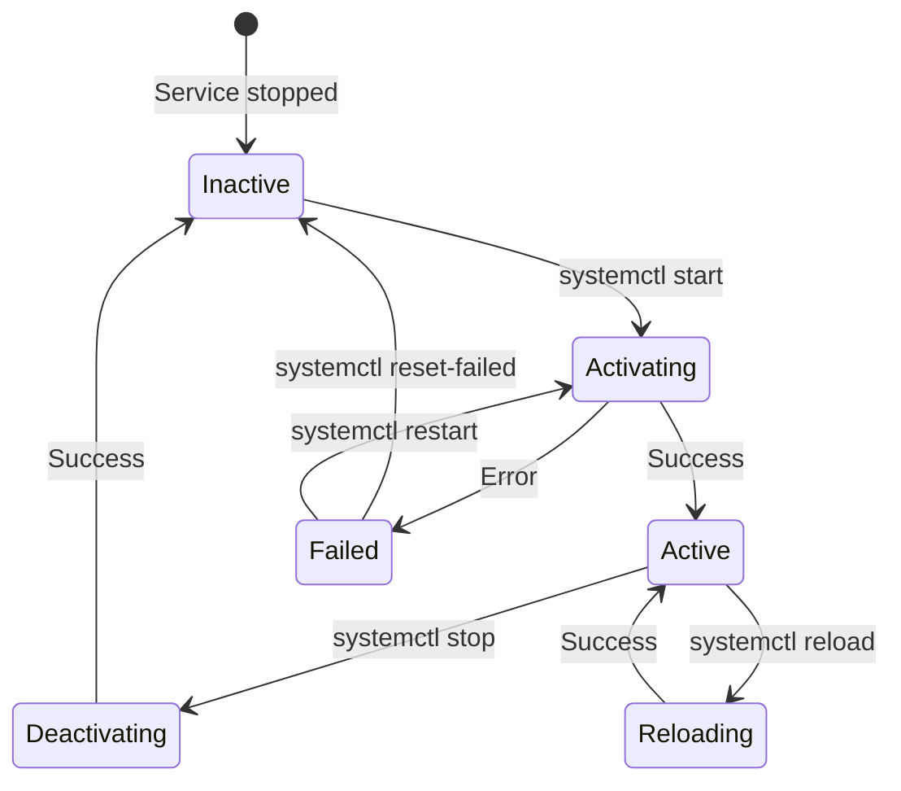
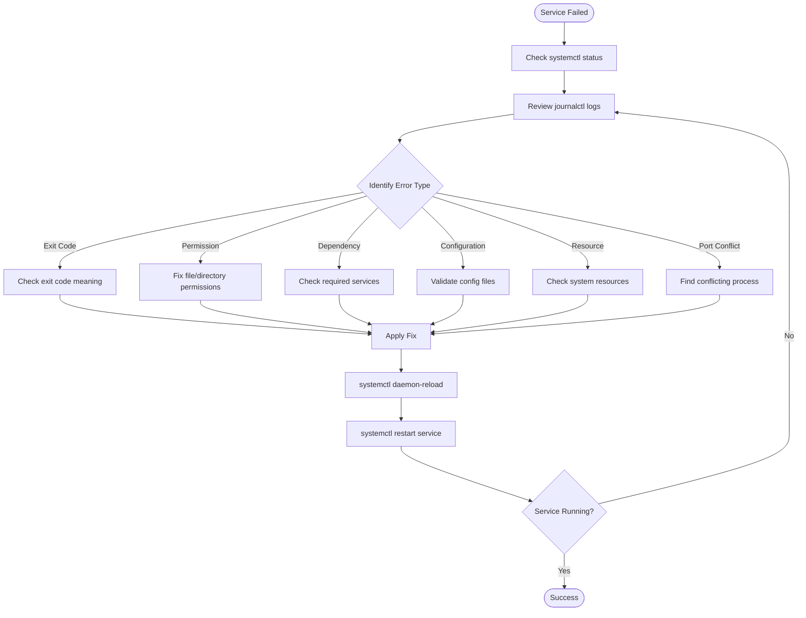
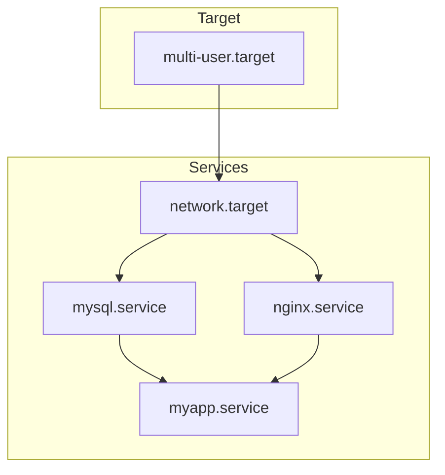
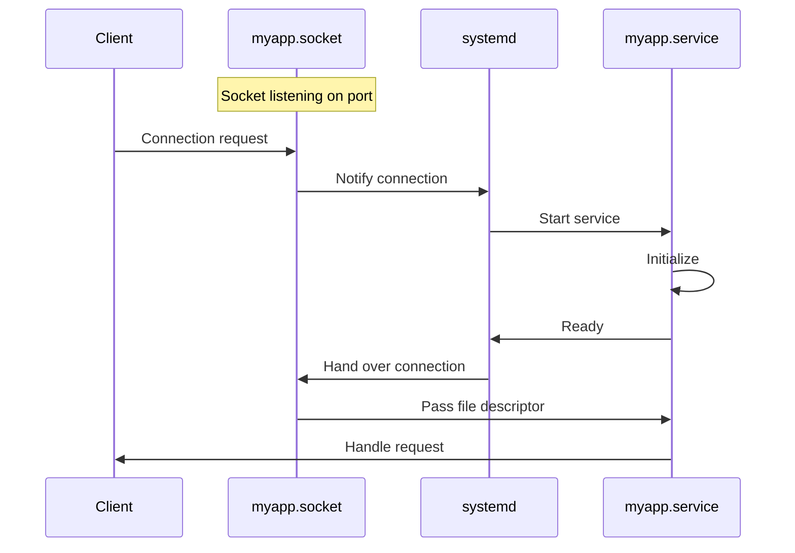

# How to Fix 'Failed to Start Service' systemd Errors

Author: [nawazdhandala](https://www.github.com/nawazdhandala)

Tags: systemd, Linux, Service Management, Troubleshooting, System Administration, Debugging, Logs

Description: Learn how to diagnose and fix common systemd 'Failed to start service' errors with practical troubleshooting techniques and real-world solutions.

---

> The dreaded "Failed to start service" message can bring your infrastructure to a halt. Whether it is a web server, database, or custom application, understanding how to diagnose and fix systemd failures is an essential skill for any Linux administrator.

Your monitoring system is screaming, users are complaining, and all you see is "failed to start." Let's fix that.

---

## Understanding systemd Service States

Before diving into fixes, understand how systemd manages services:



---

## Initial Diagnosis Commands

Start with these commands to gather information:

```bash
# Check service status - most important first step
sudo systemctl status nginx.service

# View full service status with all details
sudo systemctl status nginx.service -l --no-pager

# Check if service is enabled at boot
sudo systemctl is-enabled nginx.service

# List all failed services on the system
sudo systemctl --failed
```

Example output of a failed service:

```
● nginx.service - A high performance web server
     Loaded: loaded (/lib/systemd/system/nginx.service; enabled)
     Active: failed (Result: exit-code) since Fri 2026-01-24 10:30:00 UTC
    Process: 1234 ExecStart=/usr/sbin/nginx -g daemon on; (code=exited, status=1/FAILURE)
   Main PID: 1234 (code=exited, status=1/FAILURE)

Jan 24 10:30:00 server systemd[1]: Starting A high performance web server...
Jan 24 10:30:00 server nginx[1234]: nginx: [emerg] bind() to 0.0.0.0:80 failed (98: Address already in use)
Jan 24 10:30:00 server systemd[1]: nginx.service: Main process exited, code=exited, status=1/FAILURE
Jan 24 10:30:00 server systemd[1]: Failed to start A high performance web server.
```

---

## Viewing Service Logs

systemd journal contains detailed logs:

```bash
# View logs for specific service
sudo journalctl -u nginx.service

# View logs since last boot
sudo journalctl -u nginx.service -b

# View logs from the last hour
sudo journalctl -u nginx.service --since "1 hour ago"

# Follow logs in real-time (like tail -f)
sudo journalctl -u nginx.service -f

# View logs with full output (no truncation)
sudo journalctl -u nginx.service --no-pager -l

# View last 100 lines
sudo journalctl -u nginx.service -n 100

# View logs between specific times
sudo journalctl -u nginx.service --since "2026-01-24 10:00:00" --until "2026-01-24 11:00:00"
```

---

## Troubleshooting Flowchart

Follow this systematic approach:



---

## Error Type 1: Exit Code Failures

Common exit codes and their meanings:

| Exit Code | Meaning | Common Cause |
|-----------|---------|--------------|
| 1 | General error | Configuration error, missing file |
| 2 | Misuse of command | Invalid arguments |
| 126 | Permission denied | Cannot execute binary |
| 127 | Command not found | Binary missing or wrong path |
| 137 | SIGKILL (128+9) | OOM killer, forced termination |
| 143 | SIGTERM (128+15) | Graceful termination signal |
| 203 | EXEC format error | Wrong architecture, script issue |
| 217 | User not found | Service user does not exist |

### Fix Exit Code 1 - Configuration Error

```bash
# Check service configuration file
sudo systemctl cat nginx.service

# Validate application configuration
# For nginx:
sudo nginx -t

# For Apache:
sudo apachectl configtest

# For MySQL:
sudo mysqld --validate-config

# For custom apps, check their config
sudo /usr/local/bin/myapp --config-test
```

### Fix Exit Code 217 - User Not Found

```bash
# Check if the service user exists
id nginx

# Create the user if missing
sudo useradd --system --no-create-home --shell /sbin/nologin nginx

# Or check the service file for the correct user
grep "User=" /lib/systemd/system/nginx.service
```

---

## Error Type 2: Permission Denied

Permission issues are common after updates or migrations:

```bash
# Check service file for user/group settings
sudo systemctl cat myapp.service | grep -E "User=|Group="

# Check file ownership
ls -la /var/log/myapp/
ls -la /var/lib/myapp/
ls -la /etc/myapp/

# Fix ownership
sudo chown -R myapp:myapp /var/log/myapp/
sudo chown -R myapp:myapp /var/lib/myapp/

# Fix permissions
sudo chmod 755 /var/log/myapp/
sudo chmod 640 /etc/myapp/config.yml

# Check if binary is executable
ls -la /usr/local/bin/myapp
sudo chmod +x /usr/local/bin/myapp

# Check SELinux/AppArmor contexts if applicable
ls -laZ /var/lib/myapp/
```

---

## Error Type 3: Port Already in Use

When another process is using the required port:

```bash
# Find what is using the port
sudo ss -tlnp | grep :80
sudo lsof -i :80
sudo netstat -tlnp | grep :80

# Example output:
# tcp  LISTEN  0  128  0.0.0.0:80  0.0.0.0:*  users:(("apache2",pid=1234,fd=4))

# Kill the conflicting process
sudo kill 1234

# Or stop the conflicting service
sudo systemctl stop apache2

# Then start your service
sudo systemctl start nginx
```

For a permanent fix, ensure only one service uses the port:

```bash
# Disable the conflicting service
sudo systemctl disable apache2
sudo systemctl mask apache2  # Prevents accidental start
```

---

## Error Type 4: Dependency Failures

Services may depend on other services or targets:

```bash
# View service dependencies
sudo systemctl list-dependencies nginx.service

# View reverse dependencies (what depends on this service)
sudo systemctl list-dependencies nginx.service --reverse

# Check if dependencies are running
sudo systemctl status network.target
sudo systemctl status mysql.service
```

Dependency chain visualization:



Fix dependency issues:

```bash
# Start a required dependency
sudo systemctl start mysql.service

# Add missing dependency to service file
# Edit the service:
sudo systemctl edit myapp.service

# Add in the override file:
[Unit]
After=mysql.service
Requires=mysql.service
```

---

## Error Type 5: Resource Limits

Services may fail due to system resource limits:

```bash
# Check current resource limits for a service
sudo systemctl show myapp.service | grep -E "Limit|Memory|CPU"

# View process limits
cat /proc/$(pgrep myapp)/limits

# Check system-wide limits
ulimit -a
cat /etc/security/limits.conf

# Check available memory
free -h

# Check disk space
df -h

# Check for OOM killer activity
dmesg | grep -i "out of memory"
sudo journalctl -k | grep -i "killed process"
```

Fix resource limits in service file:

```bash
# Edit the service
sudo systemctl edit myapp.service

# Add resource limits in override file:
[Service]
# Increase file descriptor limit
LimitNOFILE=65536

# Increase process limit
LimitNPROC=4096

# Set memory limit (or remove if too restrictive)
MemoryMax=2G

# Set CPU quota
CPUQuota=200%
```

---

## Error Type 6: Missing Files or Directories

```bash
# Check for missing runtime directories
ls -la /run/myapp/
ls -la /var/run/myapp/

# Create missing directories
sudo mkdir -p /run/myapp
sudo chown myapp:myapp /run/myapp

# For directories needed at boot, add to service file:
sudo systemctl edit myapp.service

# Add to override:
[Service]
RuntimeDirectory=myapp
RuntimeDirectoryMode=0755
```

Creating required directories automatically:

```bash
# Use tmpfiles.d for persistent runtime directories
# Create /etc/tmpfiles.d/myapp.conf
sudo tee /etc/tmpfiles.d/myapp.conf << 'EOF'
# Type  Path            Mode  User   Group   Age  Argument
d       /run/myapp      0755  myapp  myapp   -    -
d       /var/log/myapp  0755  myapp  myapp   -    -
EOF

# Apply the configuration
sudo systemd-tmpfiles --create
```

---

## Analyzing Service Unit Files

Understanding the unit file helps identify issues:

```bash
# View the full service file
sudo systemctl cat myapp.service

# Show all properties of a service
sudo systemctl show myapp.service

# Show specific properties
sudo systemctl show myapp.service --property=ExecStart
sudo systemctl show myapp.service --property=Environment
```

Common service file structure:

```ini
# /etc/systemd/system/myapp.service
[Unit]
# Description shown in status
Description=My Application Server
# Documentation links
Documentation=https://example.com/docs

# Start after these units
After=network.target mysql.service
# Hard dependency - fail if these fail
Requires=mysql.service
# Soft dependency - try to start these but continue if they fail
Wants=redis.service

[Service]
# Service type (simple, forking, oneshot, notify)
Type=simple

# User and group to run as
User=myapp
Group=myapp

# Working directory
WorkingDirectory=/opt/myapp

# Environment variables
Environment=NODE_ENV=production
EnvironmentFile=/etc/myapp/env

# Command to start the service
ExecStart=/usr/bin/node /opt/myapp/server.js

# Commands for reload and stop
ExecReload=/bin/kill -HUP $MAINPID
ExecStop=/bin/kill -TERM $MAINPID

# Restart policy
Restart=always
RestartSec=5

# Resource limits
LimitNOFILE=65536

[Install]
# Target to enable this service under
WantedBy=multi-user.target
```

---

## Service Types Explained

Different service types require different configurations:

```mermaid
flowchart TD
    subgraph "Type=simple"
        S1[ExecStart runs main process]
        S2[systemd tracks this PID]
        S1 --> S2
    end

    subgraph "Type=forking"
        F1[ExecStart forks and exits]
        F2[Parent exits, child continues]
        F3[Use PIDFile= to track]
        F1 --> F2 --> F3
    end

    subgraph "Type=oneshot"
        O1[ExecStart runs and exits]
        O2[Service considered active after exit]
        O3[Good for setup scripts]
        O1 --> O2 --> O3
    end

    subgraph "Type=notify"
        N1[ExecStart runs main process]
        N2[Process sends ready notification]
        N3[systemd waits for notification]
        N1 --> N2 --> N3
    end
```



### Fix Type Mismatch Issues

```bash
# If service forks but type is simple, it will fail
# Check if the process forks
ps aux | grep myapp

# For traditional daemons that fork, use:
[Service]
Type=forking
PIDFile=/var/run/myapp.pid

# For modern apps that stay in foreground:
[Service]
Type=simple

# For apps that use systemd notification:
[Service]
Type=notify
```

---

## Creating Service Overrides

Never edit the original service file. Use overrides instead:

```bash
# Create override directory and file
sudo systemctl edit myapp.service

# This opens an editor for /etc/systemd/system/myapp.service.d/override.conf
# Add your customizations:

[Service]
# Clear existing ExecStart (required to replace)
ExecStart=
# Set new ExecStart
ExecStart=/usr/bin/myapp --new-flag

# Add environment variable
Environment=DEBUG=true

# Change user
User=newuser
```

View effective configuration after overrides:

```bash
# Shows merged configuration
sudo systemctl cat myapp.service

# Shows where each setting comes from
sudo systemd-analyze cat-config /etc/systemd/system/myapp.service
```

---

## Debugging Startup with Verbose Mode

Get more information during service startup:

```bash
# Run the service command manually
sudo -u myapp /usr/bin/myapp --verbose

# Check the exact command systemd runs
sudo systemctl show myapp.service --property=ExecStart

# Run with systemd-run for testing
sudo systemd-run --unit=test-myapp --wait /usr/bin/myapp

# Check the test service
sudo journalctl -u test-myapp
```

---

## Timeout Issues

Services may fail due to startup timeouts:

```bash
# Check timeout settings
sudo systemctl show myapp.service | grep Timeout

# Increase startup timeout
sudo systemctl edit myapp.service

# Add to override:
[Service]
TimeoutStartSec=300
TimeoutStopSec=300

# For services that take a long time to become ready
[Service]
Type=notify
TimeoutStartSec=600
WatchdogSec=60
```

---

## Fixing Socket Activation Issues

Some services use socket activation:

```bash
# List socket units
sudo systemctl list-sockets

# Check socket status
sudo systemctl status myapp.socket

# Ensure socket is enabled and started
sudo systemctl enable myapp.socket
sudo systemctl start myapp.socket

# The service will start when connection arrives at socket
```

Socket and service relationship:



---

## Recovery Commands

When standard restarts fail:

```bash
# Reset failed state
sudo systemctl reset-failed myapp.service

# Force stop if stuck
sudo systemctl kill myapp.service

# Kill with specific signal
sudo systemctl kill -s SIGKILL myapp.service

# Reload systemd manager (after editing unit files)
sudo systemctl daemon-reload

# Reexec systemd (rarely needed)
sudo systemctl daemon-reexec
```

---

## Checking System State

Sometimes the issue is system-wide:

```bash
# Check overall system state
sudo systemctl is-system-running

# Possible states:
# - running: all units active
# - degraded: some units failed
# - maintenance: rescue mode
# - initializing: boot in progress

# List all failed units
sudo systemctl --failed

# Check system targets
sudo systemctl list-units --type=target

# Verify no dependency cycles
sudo systemd-analyze verify /etc/systemd/system/myapp.service
```

---

## Practical Examples

### Example 1: Fix Node.js Application

```bash
# Error: myapp.service: Main process exited, code=exited, status=1/FAILURE
# journalctl shows: Error: Cannot find module '/opt/myapp/server.js'

# Check if file exists
ls -la /opt/myapp/

# Fix: Update service file with correct path
sudo systemctl edit myapp.service

# Override:
[Service]
ExecStart=
ExecStart=/usr/bin/node /correct/path/to/server.js
WorkingDirectory=/correct/path/to

# Reload and restart
sudo systemctl daemon-reload
sudo systemctl restart myapp.service
```

### Example 2: Fix Database Connection

```bash
# Error: myapp.service: Failed with result 'exit-code'
# journalctl shows: Error: Connection refused to localhost:3306

# Check if MySQL is running
sudo systemctl status mysql.service

# Start MySQL first
sudo systemctl start mysql.service

# Add dependency to ensure order
sudo systemctl edit myapp.service

# Override:
[Unit]
After=mysql.service
Requires=mysql.service

# Reload and restart
sudo systemctl daemon-reload
sudo systemctl restart myapp.service
```

### Example 3: Fix Memory Issue

```bash
# Error: myapp.service: Main process exited, code=killed, status=9/KILL
# dmesg shows: Out of memory: Killed process myapp

# Check memory usage
free -h

# Option 1: Add swap space
sudo fallocate -l 2G /swapfile
sudo chmod 600 /swapfile
sudo mkswap /swapfile
sudo swapon /swapfile

# Option 2: Limit other services or increase RAM
# Option 3: Optimize the application memory usage

# Also consider setting memory limits
sudo systemctl edit myapp.service

# Override:
[Service]
MemoryMax=1G
MemoryHigh=800M
```

---

## Automated Health Checks

Configure automatic recovery:

```bash
# Edit service for automatic restart
sudo systemctl edit myapp.service

# Override:
[Service]
# Restart on failure
Restart=on-failure
RestartSec=10

# Limit restart attempts
StartLimitBurst=5
StartLimitIntervalSec=300

# Run health check
ExecStartPost=/usr/local/bin/check-myapp-health.sh
```

Health check script example:

```bash
#!/bin/bash
# /usr/local/bin/check-myapp-health.sh
# Verify the service is actually working

# Wait for service to be ready
sleep 5

# Check if the service is responding
if ! curl -sf http://localhost:8080/health > /dev/null; then
    echo "Health check failed"
    exit 1
fi

echo "Health check passed"
exit 0
```

---

## Summary

When facing "Failed to start service" errors:

1. **Check status**: `systemctl status service.name`
2. **Read logs**: `journalctl -u service.name`
3. **Identify error type**: Exit code, permission, dependency, resource, or port conflict
4. **Apply targeted fix**: Based on the specific error
5. **Reload and restart**: `systemctl daemon-reload && systemctl restart`
6. **Verify**: Confirm service is running and healthy

Remember:
- Always use `systemctl edit` for overrides, never edit original unit files
- Test changes in a staging environment when possible
- Set up proper monitoring to catch failures early
- Document any customizations for future reference

The key to efficient troubleshooting is systematic diagnosis. Follow the logs, and they will lead you to the solution.
