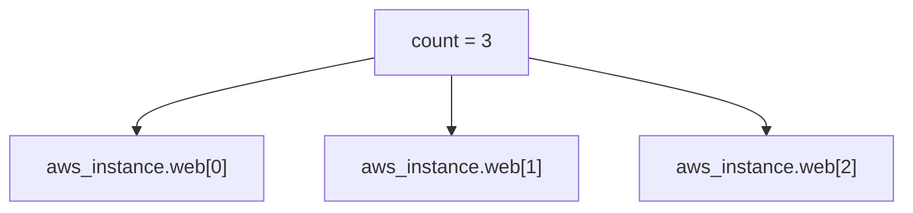
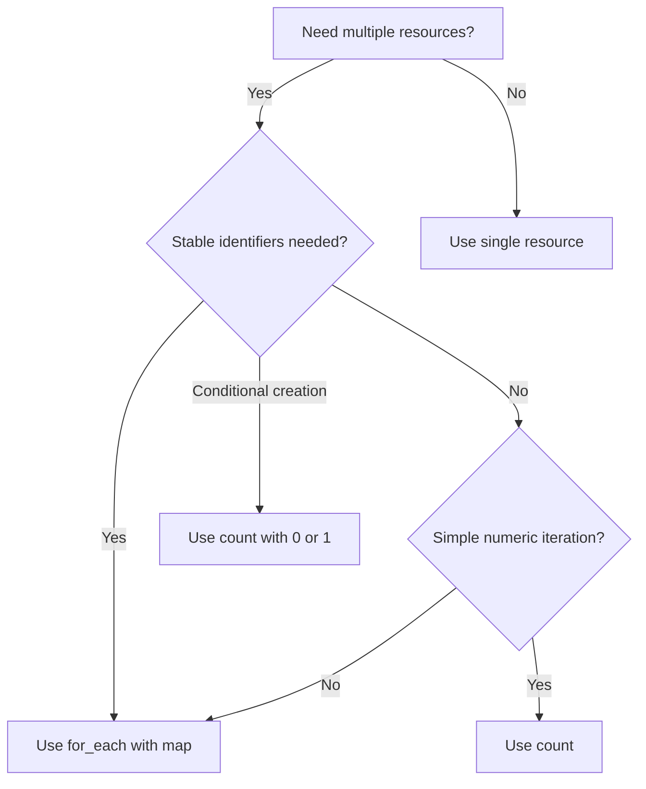

# How to Use Count and For Each in Terraform

Author: [nawazdhandala](https://www.github.com/nawazdhandala)

Tags: Terraform, Infrastructure as Code, Count, For Each, DevOps, Automation

Description: Master Terraform's count and for_each meta-arguments to create multiple resources from a single block, understand when to use each approach, and avoid common pitfalls with resource addressing.

---

Creating multiple similar resources in Terraform does not require copying configuration blocks. The `count` and `for_each` meta-arguments let you define resources once and create multiple instances. Each has strengths and tradeoffs that affect how Terraform tracks and updates your infrastructure.

## Count Basics

The `count` argument creates multiple instances of a resource. Each instance gets an index starting at 0.

```hcl
variable "instance_count" {
  description = "Number of instances to create"
  type        = number
  default     = 3
}

resource "aws_instance" "web" {
  count         = var.instance_count
  ami           = var.ami_id
  instance_type = "t3.micro"

  tags = {
    Name = "web-server-${count.index}"
  }
}

# Access instances by index
output "instance_ids" {
  value = aws_instance.web[*].id
}

output "first_instance_ip" {
  value = aws_instance.web[0].private_ip
}
```



### Conditional Creation with Count

Count works well for conditionally creating resources.

```hcl
variable "create_bastion" {
  type    = bool
  default = false
}

resource "aws_instance" "bastion" {
  count = var.create_bastion ? 1 : 0

  ami           = var.ami_id
  instance_type = "t3.micro"
  subnet_id     = var.public_subnet_id

  tags = {
    Name = "bastion-host"
  }
}

# Safe reference to optional resource
output "bastion_ip" {
  value = var.create_bastion ? aws_instance.bastion[0].public_ip : null
}
```

## The Problem with Count

Count uses numeric indexes, which causes issues when removing items from the middle of a list.

```hcl
# Initial configuration with 3 subnets
variable "subnet_cidrs" {
  default = ["10.0.1.0/24", "10.0.2.0/24", "10.0.3.0/24"]
}

resource "aws_subnet" "main" {
  count      = length(var.subnet_cidrs)
  vpc_id     = aws_vpc.main.id
  cidr_block = var.subnet_cidrs[count.index]

  tags = {
    Name = "subnet-${count.index}"
  }
}
```

If you remove the middle subnet (`10.0.2.0/24`), Terraform sees:
- `subnet[0]` stays the same
- `subnet[1]` changes from `10.0.2.0/24` to `10.0.3.0/24` (DESTROY and CREATE)
- `subnet[2]` no longer exists (DESTROY)

This destroys the wrong subnet. Enter `for_each`.

## For Each Basics

The `for_each` argument creates instances keyed by strings rather than integers.

```hcl
variable "subnets" {
  type = map(object({
    cidr_block        = string
    availability_zone = string
  }))
  default = {
    public-1 = {
      cidr_block        = "10.0.1.0/24"
      availability_zone = "us-east-1a"
    }
    public-2 = {
      cidr_block        = "10.0.2.0/24"
      availability_zone = "us-east-1b"
    }
    private-1 = {
      cidr_block        = "10.0.10.0/24"
      availability_zone = "us-east-1a"
    }
  }
}

resource "aws_subnet" "main" {
  for_each = var.subnets

  vpc_id            = aws_vpc.main.id
  cidr_block        = each.value.cidr_block
  availability_zone = each.value.availability_zone

  tags = {
    Name = each.key
  }
}

# Access by key
output "subnet_ids" {
  value = { for k, v in aws_subnet.main : k => v.id }
}

output "public_1_subnet_id" {
  value = aws_subnet.main["public-1"].id
}
```

Now removing `public-2` only destroys that specific subnet. The keys `public-1` and `private-1` remain stable.

## Converting Lists to Sets for for_each

For_each requires a map or set. Use `toset()` to convert lists.

```hcl
variable "security_group_names" {
  type    = list(string)
  default = ["web", "api", "database"]
}

resource "aws_security_group" "main" {
  for_each = toset(var.security_group_names)

  name        = each.value
  description = "Security group for ${each.value}"
  vpc_id      = aws_vpc.main.id

  tags = {
    Name = each.value
  }
}
```

## Transforming Data for for_each

Use locals to transform data into the right shape.

```hcl
variable "instances" {
  type = list(object({
    name          = string
    instance_type = string
    subnet        = string
  }))
  default = [
    { name = "web-1", instance_type = "t3.small", subnet = "public-1" },
    { name = "web-2", instance_type = "t3.small", subnet = "public-2" },
    { name = "api-1", instance_type = "t3.medium", subnet = "private-1" }
  ]
}

locals {
  # Transform list to map keyed by name
  instances_map = { for inst in var.instances : inst.name => inst }
}

resource "aws_instance" "main" {
  for_each = local.instances_map

  ami           = var.ami_id
  instance_type = each.value.instance_type
  subnet_id     = aws_subnet.main[each.value.subnet].id

  tags = {
    Name = each.key
  }
}
```

## Nested Iteration with for_each

Handle complex structures by flattening them first.

```hcl
variable "environments" {
  type = map(object({
    instance_type = string
    replicas      = number
  }))
  default = {
    staging    = { instance_type = "t3.small", replicas = 1 }
    production = { instance_type = "t3.large", replicas = 3 }
  }
}

locals {
  # Flatten environments into individual instances
  instances = flatten([
    for env, config in var.environments : [
      for i in range(config.replicas) : {
        key           = "${env}-${i}"
        environment   = env
        instance_type = config.instance_type
        index         = i
      }
    ]
  ])

  # Convert to map for for_each
  instances_map = { for inst in local.instances : inst.key => inst }
}

resource "aws_instance" "main" {
  for_each = local.instances_map

  ami           = var.ami_id
  instance_type = each.value.instance_type

  tags = {
    Name        = each.key
    Environment = each.value.environment
  }
}

# Results in: staging-0, production-0, production-1, production-2
```

## Count vs For Each Decision Guide



**Use count when:**
- Creating a fixed number of identical resources
- Conditionally creating a single resource (count = 0 or 1)
- Order matters and items will not be removed from the middle

**Use for_each when:**
- Resources have unique identifiers
- You might add or remove items from the middle
- Each resource has different configuration
- You want meaningful resource addresses

## Module Count and For Each

Modules also support count and for_each.

```hcl
module "vpc" {
  source = "./modules/vpc"

  for_each = var.environments

  environment = each.key
  cidr_block  = each.value.cidr_block
  azs         = each.value.availability_zones
}

# Access module outputs
output "vpc_ids" {
  value = { for env, vpc in module.vpc : env => vpc.vpc_id }
}
```

### Conditional Module

```hcl
variable "enable_monitoring" {
  type    = bool
  default = true
}

module "monitoring" {
  source = "./modules/monitoring"
  count  = var.enable_monitoring ? 1 : 0

  environment = var.environment
}

output "dashboard_url" {
  value = var.enable_monitoring ? module.monitoring[0].dashboard_url : null
}
```

## Referencing Resources Created with Count and For Each

```hcl
# Count resources - use splat or index
resource "aws_instance" "web" {
  count         = 3
  ami           = var.ami_id
  instance_type = "t3.micro"
}

# All IDs
output "all_instance_ids" {
  value = aws_instance.web[*].id
}

# Specific instance
output "first_instance" {
  value = aws_instance.web[0].id
}

# For_each resources - use keys
resource "aws_instance" "app" {
  for_each      = toset(["api", "worker", "scheduler"])
  ami           = var.ami_id
  instance_type = "t3.micro"

  tags = {
    Name = each.value
  }
}

# All as map
output "app_instances" {
  value = { for k, v in aws_instance.app : k => v.id }
}

# Specific instance
output "api_instance" {
  value = aws_instance.app["api"].id
}

# Values only
output "app_instance_ids" {
  value = values(aws_instance.app)[*].id
}
```

## Common Patterns

### Creating Resources Across Availability Zones

```hcl
data "aws_availability_zones" "available" {
  state = "available"
}

resource "aws_subnet" "private" {
  for_each = toset(data.aws_availability_zones.available.names)

  vpc_id            = aws_vpc.main.id
  cidr_block        = cidrsubnet(aws_vpc.main.cidr_block, 8, index(data.aws_availability_zones.available.names, each.value))
  availability_zone = each.value

  tags = {
    Name = "private-${each.value}"
  }
}
```

### IAM Users and Group Memberships

```hcl
variable "developers" {
  type = map(object({
    groups = list(string)
  }))
  default = {
    alice = { groups = ["developers", "admins"] }
    bob   = { groups = ["developers"] }
    carol = { groups = ["developers", "readonly"] }
  }
}

resource "aws_iam_user" "developers" {
  for_each = var.developers
  name     = each.key
}

locals {
  # Flatten user-group pairs
  user_group_pairs = flatten([
    for user, config in var.developers : [
      for group in config.groups : {
        user  = user
        group = group
      }
    ]
  ])
}

resource "aws_iam_user_group_membership" "developers" {
  for_each = { for pair in local.user_group_pairs : "${pair.user}-${pair.group}" => pair }

  user   = each.value.user
  groups = [each.value.group]

  depends_on = [aws_iam_user.developers]
}
```

---

Choosing between count and for_each comes down to stability. If your resources need to survive additions and removals without unnecessary recreation, use for_each with meaningful keys. Reserve count for simple numeric iteration and conditional resource creation.
