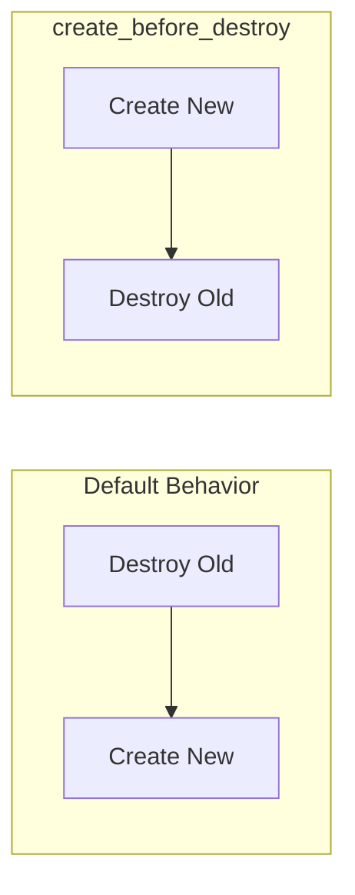

# How to Configure Lifecycle Rules in Terraform

Author: [nawazdhandala](https://www.github.com/nawazdhandala)

Tags: Terraform, Infrastructure as Code, Lifecycle, DevOps, Resource Management

Description: Learn how to use Terraform lifecycle rules to control resource creation, updates, and deletion behavior, including create_before_destroy, prevent_destroy, ignore_changes, and replace_triggered_by.

---

Terraform's lifecycle rules give you fine-grained control over how resources are created, updated, and destroyed. These rules help prevent accidental deletions, handle replacement ordering, and ignore drift in specific attributes. Understanding lifecycle management is essential for production infrastructure.

## Lifecycle Block Basics

Every resource supports a `lifecycle` block with several arguments.

```hcl
resource "aws_instance" "example" {
  ami           = var.ami_id
  instance_type = var.instance_type

  lifecycle {
    create_before_destroy = true
    prevent_destroy       = false
    ignore_changes        = [tags]
  }
}
```

## create_before_destroy

When Terraform needs to replace a resource, it normally destroys the old one first, then creates the new one. With `create_before_destroy = true`, Terraform reverses this order, creating the replacement before destroying the original.

```hcl
# Without create_before_destroy:
# 1. Destroy old instance
# 2. Create new instance (downtime during this gap)

# With create_before_destroy:
# 1. Create new instance
# 2. Destroy old instance (minimal or no downtime)

resource "aws_instance" "web" {
  ami           = var.ami_id
  instance_type = "t3.medium"

  lifecycle {
    create_before_destroy = true
  }

  tags = {
    Name = "web-server"
  }
}
```

This pattern works well for stateless resources like web servers behind a load balancer.



### Use Cases for create_before_destroy

```hcl
# Launch templates must exist before ASG references them
resource "aws_launch_template" "web" {
  name_prefix   = "web-"
  image_id      = var.ami_id
  instance_type = "t3.medium"

  lifecycle {
    create_before_destroy = true
  }
}

resource "aws_autoscaling_group" "web" {
  name                = "web-asg"
  vpc_zone_identifier = var.subnet_ids
  min_size            = 2
  max_size            = 10

  launch_template {
    id      = aws_launch_template.web.id
    version = "$Latest"
  }
}

# Security groups referenced by instances
resource "aws_security_group" "web" {
  name_prefix = "web-"
  vpc_id      = var.vpc_id

  ingress {
    from_port   = 80
    to_port     = 80
    protocol    = "tcp"
    cidr_blocks = ["0.0.0.0/0"]
  }

  lifecycle {
    create_before_destroy = true
  }
}
```

## prevent_destroy

The `prevent_destroy` argument adds a safety net against accidental deletion. Terraform will error if you try to destroy a resource with this flag set.

```hcl
resource "aws_db_instance" "production" {
  identifier           = "production-db"
  engine               = "postgres"
  engine_version       = "15"
  instance_class       = "db.r5.large"
  allocated_storage    = 100
  username             = "admin"
  password             = var.db_password
  skip_final_snapshot  = false
  final_snapshot_identifier = "production-db-final"

  lifecycle {
    prevent_destroy = true
  }
}

resource "aws_s3_bucket" "important_data" {
  bucket = "company-critical-data"

  lifecycle {
    prevent_destroy = true
  }
}
```

When you actually need to destroy the resource, remove the lifecycle block first, run `terraform apply`, then destroy.

```hcl
# To destroy a prevent_destroy resource:
# 1. Comment out or remove prevent_destroy
resource "aws_db_instance" "production" {
  # ... configuration ...

  lifecycle {
    # prevent_destroy = true  # Removed to allow destruction
  }
}

# 2. Run terraform apply to update state
# 3. Run terraform destroy (or remove resource block and apply)
```

### Conditional prevent_destroy

You cannot use variables directly in lifecycle blocks, but you can work around this with module composition.

```hcl
# modules/database/main.tf
variable "protect" {
  type    = bool
  default = true
}

resource "aws_db_instance" "main" {
  count = var.protect ? 0 : 1
  # ... configuration without prevent_destroy ...
}

resource "aws_db_instance" "protected" {
  count = var.protect ? 1 : 0
  # ... same configuration ...

  lifecycle {
    prevent_destroy = true
  }
}

output "db_endpoint" {
  value = var.protect ? aws_db_instance.protected[0].endpoint : aws_db_instance.main[0].endpoint
}
```

## ignore_changes

The `ignore_changes` argument tells Terraform to ignore differences in specified attributes. This is useful when external processes modify resources or when you want to manage certain attributes outside Terraform.

```hcl
# Ignore changes made by auto-scaling or external processes
resource "aws_autoscaling_group" "web" {
  name                = "web-asg"
  min_size            = 2
  max_size            = 10
  desired_capacity    = 2
  vpc_zone_identifier = var.subnet_ids

  launch_template {
    id      = aws_launch_template.web.id
    version = "$Latest"
  }

  lifecycle {
    # Auto-scaling adjusts desired_capacity; don't reset it
    ignore_changes = [desired_capacity]
  }
}
```

### Common ignore_changes Patterns

```hcl
# Ignore tags managed by AWS services
resource "aws_instance" "web" {
  ami           = var.ami_id
  instance_type = "t3.medium"

  tags = {
    Name = "web-server"
  }

  lifecycle {
    # AWS adds tags for cost allocation, backup policies, etc.
    ignore_changes = [tags]
  }
}

# Ignore changes to container image (updated by CI/CD)
resource "aws_ecs_service" "api" {
  name            = "api-service"
  cluster         = aws_ecs_cluster.main.id
  task_definition = aws_ecs_task_definition.api.arn
  desired_count   = 2

  lifecycle {
    # CI/CD pipeline updates task_definition
    ignore_changes = [task_definition]
  }
}

# Ignore all changes - effectively read-only after creation
resource "aws_instance" "legacy" {
  ami           = var.ami_id
  instance_type = "t3.medium"

  lifecycle {
    ignore_changes = all
  }
}

# Ignore nested attributes
resource "aws_launch_template" "web" {
  name_prefix   = "web-"
  image_id      = var.ami_id
  instance_type = "t3.medium"

  block_device_mappings {
    device_name = "/dev/sda1"
    ebs {
      volume_size = 20
    }
  }

  lifecycle {
    # Ignore changes to specific nested attributes
    ignore_changes = [
      block_device_mappings[0].ebs[0].volume_size,
    ]
  }
}
```

## replace_triggered_by

The `replace_triggered_by` argument forces resource replacement when referenced resources or attributes change. This creates explicit dependencies that trigger recreation.

```hcl
resource "aws_ami_copy" "app" {
  name              = "app-ami-${formatdate("YYYY-MM-DD", timestamp())}"
  source_ami_id     = var.source_ami_id
  source_ami_region = "us-east-1"
}

resource "aws_instance" "web" {
  ami           = aws_ami_copy.app.id
  instance_type = "t3.medium"

  lifecycle {
    # Replace instance when AMI changes
    replace_triggered_by = [
      aws_ami_copy.app.id
    ]
  }
}

# Trigger replacement when configuration changes
resource "null_resource" "config_version" {
  triggers = {
    config_hash = filesha256("${path.module}/config/app.conf")
  }
}

resource "aws_instance" "app" {
  ami           = var.ami_id
  instance_type = "t3.medium"

  lifecycle {
    replace_triggered_by = [
      null_resource.config_version
    ]
  }
}
```

### replace_triggered_by with Modules

```hcl
# When a module output changes, replace dependent resources
module "network" {
  source = "./modules/network"
  cidr   = var.vpc_cidr
}

resource "aws_instance" "web" {
  ami           = var.ami_id
  instance_type = "t3.medium"
  subnet_id     = module.network.subnet_id

  lifecycle {
    replace_triggered_by = [
      # Replace when VPC configuration changes
      module.network.vpc_id
    ]
  }
}
```

## Combining Lifecycle Rules

Multiple lifecycle arguments can be combined for complex behavior.

```hcl
resource "aws_db_instance" "main" {
  identifier           = "main-db"
  engine               = "postgres"
  engine_version       = "15"
  instance_class       = "db.r5.large"
  allocated_storage    = 100
  username             = "admin"
  password             = var.db_password
  multi_az             = true
  skip_final_snapshot  = false
  final_snapshot_identifier = "main-db-final"

  # Performance Insights and Enhanced Monitoring
  performance_insights_enabled = true
  monitoring_interval          = 60
  monitoring_role_arn          = aws_iam_role.rds_monitoring.arn

  lifecycle {
    # Never accidentally delete production database
    prevent_destroy = true

    # Allow storage autoscaling to manage this
    ignore_changes = [allocated_storage]

    # Create new instance before destroying old during upgrades
    create_before_destroy = true
  }
}
```

## Lifecycle with Provisioners

Lifecycle rules also affect provisioner behavior.

```hcl
resource "aws_instance" "web" {
  ami           = var.ami_id
  instance_type = "t3.medium"

  provisioner "local-exec" {
    command = "echo ${self.private_ip} >> inventory.txt"
  }

  provisioner "local-exec" {
    when    = destroy
    command = "sed -i '/${self.private_ip}/d' inventory.txt"
  }

  lifecycle {
    create_before_destroy = true
  }
}
```

## Best Practices

1. **Use prevent_destroy for critical resources** - Databases, S3 buckets with important data, and encryption keys should be protected.

2. **Document why you use ignore_changes** - Add comments explaining what external process modifies the attribute.

3. **Prefer create_before_destroy for stateless resources** - Web servers, workers, and anything behind load balancers benefit from zero-downtime replacements.

4. **Be careful with ignore_changes = all** - This makes the resource almost unmanageable by Terraform.

5. **Test lifecycle behavior in non-production first** - Replacement ordering can have unexpected effects.

```hcl
resource "aws_instance" "web" {
  ami           = var.ami_id
  instance_type = "t3.medium"

  lifecycle {
    create_before_destroy = true

    # IMPORTANT: AWS cost allocation adds these tags automatically.
    # Do not remove this or Terraform will fight with AWS.
    ignore_changes = [
      tags["aws:createdBy"],
      tags["CostCenter"],
    ]
  }
}
```

---

Lifecycle rules bridge the gap between Terraform's declarative model and the messy reality of production infrastructure. Use them to protect critical resources, handle external modifications gracefully, and minimize downtime during replacements. But use them sparingly - each lifecycle rule adds complexity to your configuration.
