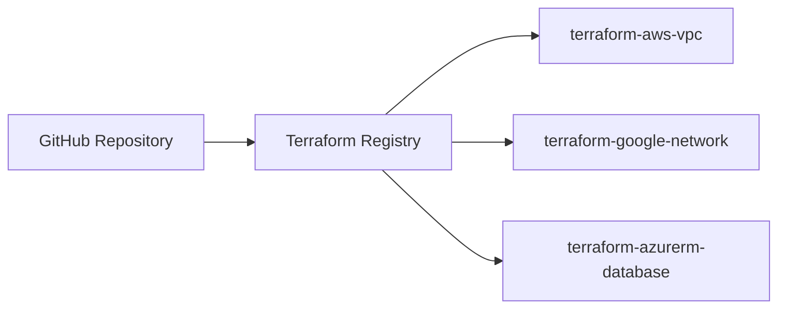
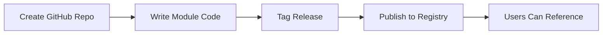

# How to Publish to Terraform Module Registry

Author: [nawazdhandala](https://www.github.com/nawazdhandala)

Tags: Terraform, Infrastructure as Code, Module Registry, DevOps, Modules

Description: A complete guide to publishing reusable Terraform modules to the public registry or private registries, covering module structure, versioning, documentation, and best practices for maintainability.

---

Publishing Terraform modules to a registry makes them reusable across teams and projects. The public Terraform Registry hosts thousands of modules, and private registries in Terraform Cloud or Enterprise provide internal sharing. This guide covers everything from structuring your module to publishing and maintaining it.

## Module Structure Requirements

The Terraform Registry expects modules to follow a standard structure.

```
terraform-aws-vpc/
|-- README.md           # Required: module documentation
|-- main.tf             # Required: primary resources
|-- variables.tf        # Required: input variables
|-- outputs.tf          # Required: output values
|-- versions.tf         # Provider version constraints
|-- examples/           # Required: usage examples
|   |-- simple/
|   |   |-- main.tf
|   |   |-- outputs.tf
|   |-- complete/
|       |-- main.tf
|       |-- outputs.tf
|       |-- variables.tf
|-- modules/            # Optional: submodules
|   |-- subnet/
|       |-- main.tf
|       |-- variables.tf
|       |-- outputs.tf
|-- LICENSE             # Required: open source license
```

## Repository Naming Convention

Public registry modules must be hosted on GitHub with a specific naming pattern:

```
terraform-<PROVIDER>-<NAME>
```

Examples:
- `terraform-aws-vpc`
- `terraform-google-kubernetes-engine`
- `terraform-azurerm-storage-account`



## Writing the Module

### main.tf - Primary Resources

```hcl
# main.tf
resource "aws_vpc" "this" {
  cidr_block           = var.cidr_block
  enable_dns_hostnames = var.enable_dns_hostnames
  enable_dns_support   = var.enable_dns_support

  tags = merge(
    var.tags,
    {
      Name = var.name
    }
  )
}

resource "aws_internet_gateway" "this" {
  count = var.create_igw ? 1 : 0

  vpc_id = aws_vpc.this.id

  tags = merge(
    var.tags,
    {
      Name = "${var.name}-igw"
    }
  )
}

resource "aws_subnet" "public" {
  for_each = { for idx, az in var.availability_zones : az => idx }

  vpc_id                  = aws_vpc.this.id
  cidr_block              = cidrsubnet(var.cidr_block, var.subnet_newbits, each.value)
  availability_zone       = each.key
  map_public_ip_on_launch = true

  tags = merge(
    var.tags,
    {
      Name = "${var.name}-public-${each.key}"
      Tier = "public"
    }
  )
}

resource "aws_subnet" "private" {
  for_each = { for idx, az in var.availability_zones : az => idx + length(var.availability_zones) }

  vpc_id            = aws_vpc.this.id
  cidr_block        = cidrsubnet(var.cidr_block, var.subnet_newbits, each.value)
  availability_zone = each.key

  tags = merge(
    var.tags,
    {
      Name = "${var.name}-private-${each.key}"
      Tier = "private"
    }
  )
}
```

### variables.tf - Input Variables

```hcl
# variables.tf
variable "name" {
  description = "Name to be used on all resources as identifier"
  type        = string
}

variable "cidr_block" {
  description = "The CIDR block for the VPC"
  type        = string

  validation {
    condition     = can(cidrhost(var.cidr_block, 0))
    error_message = "Must be a valid CIDR block."
  }
}

variable "availability_zones" {
  description = "List of availability zones to use"
  type        = list(string)

  validation {
    condition     = length(var.availability_zones) > 0
    error_message = "At least one availability zone must be specified."
  }
}

variable "enable_dns_hostnames" {
  description = "Enable DNS hostnames in the VPC"
  type        = bool
  default     = true
}

variable "enable_dns_support" {
  description = "Enable DNS support in the VPC"
  type        = bool
  default     = true
}

variable "create_igw" {
  description = "Create an Internet Gateway for public subnets"
  type        = bool
  default     = true
}

variable "subnet_newbits" {
  description = "Number of additional bits to add to the VPC CIDR for subnet calculation"
  type        = number
  default     = 8
}

variable "tags" {
  description = "Tags to apply to all resources"
  type        = map(string)
  default     = {}
}
```

### outputs.tf - Output Values

```hcl
# outputs.tf
output "vpc_id" {
  description = "The ID of the VPC"
  value       = aws_vpc.this.id
}

output "vpc_cidr_block" {
  description = "The CIDR block of the VPC"
  value       = aws_vpc.this.cidr_block
}

output "public_subnet_ids" {
  description = "List of public subnet IDs"
  value       = [for subnet in aws_subnet.public : subnet.id]
}

output "private_subnet_ids" {
  description = "List of private subnet IDs"
  value       = [for subnet in aws_subnet.private : subnet.id]
}

output "internet_gateway_id" {
  description = "The ID of the Internet Gateway"
  value       = var.create_igw ? aws_internet_gateway.this[0].id : null
}

output "public_subnet_cidr_blocks" {
  description = "List of public subnet CIDR blocks"
  value       = [for subnet in aws_subnet.public : subnet.cidr_block]
}

output "private_subnet_cidr_blocks" {
  description = "List of private subnet CIDR blocks"
  value       = [for subnet in aws_subnet.private : subnet.cidr_block]
}
```

### versions.tf - Provider Constraints

```hcl
# versions.tf
terraform {
  required_version = ">= 1.0"

  required_providers {
    aws = {
      source  = "hashicorp/aws"
      version = ">= 4.0, < 6.0"
    }
  }
}
```

## Writing Documentation

### README.md

```markdown
# AWS VPC Terraform Module

Terraform module which creates VPC resources on AWS.

## Usage

```hcl
module "vpc" {
  source  = "your-org/vpc/aws"
  version = "1.0.0"

  name               = "my-vpc"
  cidr_block         = "10.0.0.0/16"
  availability_zones = ["us-east-1a", "us-east-1b"]

  tags = {
    Environment = "production"
  }
}
```

## Examples

- [Simple VPC](examples/simple)
- [Complete VPC with NAT Gateways](examples/complete)

## Requirements

| Name | Version |
|------|---------|
| terraform | >= 1.0 |
| aws | >= 4.0, < 6.0 |

## Inputs

| Name | Description | Type | Default | Required |
|------|-------------|------|---------|:--------:|
| name | Name to be used on all resources | `string` | n/a | yes |
| cidr_block | The CIDR block for the VPC | `string` | n/a | yes |
| availability_zones | List of availability zones | `list(string)` | n/a | yes |
| enable_dns_hostnames | Enable DNS hostnames | `bool` | `true` | no |
| create_igw | Create Internet Gateway | `bool` | `true` | no |
| tags | Tags to apply to resources | `map(string)` | `{}` | no |

## Outputs

| Name | Description |
|------|-------------|
| vpc_id | The ID of the VPC |
| public_subnet_ids | List of public subnet IDs |
| private_subnet_ids | List of private subnet IDs |

## License

Apache 2.0 Licensed. See LICENSE for full details.
```

## Creating Examples

### examples/simple/main.tf

```hcl
module "vpc" {
  source = "../../"

  name               = "simple-vpc"
  cidr_block         = "10.0.0.0/16"
  availability_zones = ["us-east-1a", "us-east-1b"]

  tags = {
    Example = "simple"
  }
}
```

### examples/complete/main.tf

```hcl
module "vpc" {
  source = "../../"

  name               = "complete-vpc"
  cidr_block         = "10.0.0.0/16"
  availability_zones = ["us-east-1a", "us-east-1b", "us-east-1c"]

  enable_dns_hostnames = true
  enable_dns_support   = true
  create_igw           = true
  subnet_newbits       = 4

  tags = {
    Environment = "production"
    Project     = "example"
    Terraform   = "true"
  }
}

# Additional resources using the module outputs
resource "aws_security_group" "example" {
  name        = "example"
  description = "Example security group"
  vpc_id      = module.vpc.vpc_id

  ingress {
    from_port   = 443
    to_port     = 443
    protocol    = "tcp"
    cidr_blocks = ["0.0.0.0/0"]
  }
}
```

## Versioning with Git Tags

The registry uses Git tags for versions. Follow semantic versioning.

```bash
# Tag your release
git tag -a v1.0.0 -m "Initial release"
git push origin v1.0.0

# For patch releases
git tag -a v1.0.1 -m "Bug fix for subnet calculation"
git push origin v1.0.1

# For minor releases
git tag -a v1.1.0 -m "Added NAT gateway support"
git push origin v1.1.0

# For major releases (breaking changes)
git tag -a v2.0.0 -m "Changed variable names"
git push origin v2.0.0
```

## Publishing to Public Registry

1. Sign in to the [Terraform Registry](https://registry.terraform.io/) with GitHub
2. Click "Publish" and select "Module"
3. Authorize the Terraform Registry GitHub App
4. Select your repository
5. The registry automatically imports tags as versions



## Private Registry with Terraform Cloud

For internal modules, use Terraform Cloud's private registry.

```hcl
# Using a private module
module "vpc" {
  source  = "app.terraform.io/your-org/vpc/aws"
  version = "1.0.0"

  name       = "production-vpc"
  cidr_block = "10.0.0.0/16"
}
```

Publishing process:
1. Connect your VCS provider to Terraform Cloud
2. Go to Registry > Modules > Add Module
3. Select your repository
4. Terraform Cloud imports versions from tags

## Testing Your Module

Use Terratest or similar tools for automated testing.

```go
// test/vpc_test.go
package test

import (
    "testing"
    "github.com/gruntwork-io/terratest/modules/terraform"
    "github.com/stretchr/testify/assert"
)

func TestVPCModule(t *testing.T) {
    terraformOptions := &terraform.Options{
        TerraformDir: "../examples/simple",
    }

    defer terraform.Destroy(t, terraformOptions)
    terraform.InitAndApply(t, terraformOptions)

    vpcID := terraform.Output(t, terraformOptions, "vpc_id")
    assert.NotEmpty(t, vpcID)
}
```

## Module Maintenance Best Practices

1. **Use semantic versioning** - Breaking changes require major version bumps.

2. **Keep examples updated** - Examples are the first thing users check.

3. **Document all variables** - Include descriptions and validation rules.

4. **Test before releasing** - Run examples against real infrastructure.

5. **Use variable validation** - Catch errors early with validation blocks.

6. **Provide sensible defaults** - Make the simple case easy.

7. **Support multiple use cases** - Use boolean flags to enable optional features.

8. **Keep provider constraints loose** - Use `>= 4.0, < 6.0` not `= 4.5.0`.

```hcl
# Good: range constraint
required_providers {
  aws = {
    source  = "hashicorp/aws"
    version = ">= 4.0, < 6.0"
  }
}

# Bad: pinned version
required_providers {
  aws = {
    source  = "hashicorp/aws"
    version = "= 4.5.0"
  }
}
```

---

Publishing modules to the Terraform Registry helps your team and the community reuse battle-tested infrastructure code. Start with a well-structured module, document it thoroughly, and version releases with semantic versioning. The effort pays off when your module saves hours of configuration work across multiple projects.
