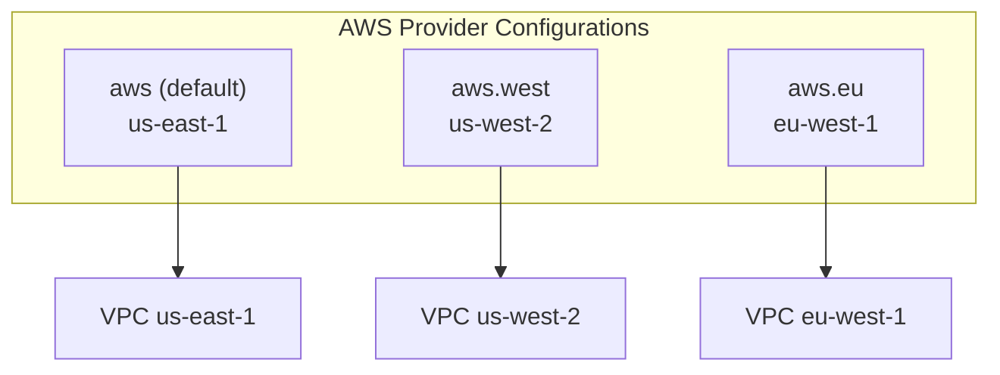

# How to Use Provider Aliases in Terraform

Author: [nawazdhandala](https://www.github.com/nawazdhandala)

Tags: Terraform, Infrastructure as Code, Provider Aliases, Multi-Region, DevOps

Description: Learn how to configure multiple instances of the same Terraform provider using aliases, enabling multi-region deployments, cross-account access, and resources with different credentials.

---

Provider aliases let you configure multiple instances of the same provider with different settings. This unlocks multi-region deployments, cross-account access patterns, and resources that need different authentication. Without aliases, you are limited to a single configuration per provider.

## Why Provider Aliases

Consider these scenarios:
- Deploying resources to multiple AWS regions
- Creating resources in different AWS accounts
- Using different credentials for specific resources
- Managing resources across environments with different provider configurations

Provider aliases solve all of these by letting you define multiple provider configurations.



## Basic Alias Syntax

Define the default provider without an alias, then add aliased versions.

```hcl
# Default provider - no alias needed
provider "aws" {
  region = "us-east-1"
}

# Aliased provider for us-west-2
provider "aws" {
  alias  = "west"
  region = "us-west-2"
}

# Aliased provider for eu-west-1
provider "aws" {
  alias  = "europe"
  region = "eu-west-1"
}
```

## Using Aliased Providers in Resources

Reference aliased providers with the `provider` argument.

```hcl
# Uses default provider (us-east-1)
resource "aws_vpc" "east" {
  cidr_block = "10.0.0.0/16"

  tags = {
    Name   = "vpc-east"
    Region = "us-east-1"
  }
}

# Uses aliased provider (us-west-2)
resource "aws_vpc" "west" {
  provider   = aws.west
  cidr_block = "10.1.0.0/16"

  tags = {
    Name   = "vpc-west"
    Region = "us-west-2"
  }
}

# Uses aliased provider (eu-west-1)
resource "aws_vpc" "europe" {
  provider   = aws.europe
  cidr_block = "10.2.0.0/16"

  tags = {
    Name   = "vpc-europe"
    Region = "eu-west-1"
  }
}
```

## Multi-Region Infrastructure

Deploy a complete infrastructure stack across multiple regions.

```hcl
variable "regions" {
  type = map(object({
    cidr_block = string
    azs        = list(string)
  }))
  default = {
    us-east-1 = {
      cidr_block = "10.0.0.0/16"
      azs        = ["us-east-1a", "us-east-1b"]
    }
    us-west-2 = {
      cidr_block = "10.1.0.0/16"
      azs        = ["us-west-2a", "us-west-2b"]
    }
  }
}

provider "aws" {
  region = "us-east-1"
}

provider "aws" {
  alias  = "west"
  region = "us-west-2"
}

# VPC in us-east-1
resource "aws_vpc" "east" {
  cidr_block           = var.regions["us-east-1"].cidr_block
  enable_dns_hostnames = true

  tags = {
    Name = "vpc-us-east-1"
  }
}

# VPC in us-west-2
resource "aws_vpc" "west" {
  provider             = aws.west
  cidr_block           = var.regions["us-west-2"].cidr_block
  enable_dns_hostnames = true

  tags = {
    Name = "vpc-us-west-2"
  }
}

# Subnets in us-east-1
resource "aws_subnet" "east" {
  for_each = toset(var.regions["us-east-1"].azs)

  vpc_id            = aws_vpc.east.id
  cidr_block        = cidrsubnet(aws_vpc.east.cidr_block, 8, index(var.regions["us-east-1"].azs, each.value))
  availability_zone = each.value

  tags = {
    Name = "subnet-${each.value}"
  }
}

# Subnets in us-west-2
resource "aws_subnet" "west" {
  for_each = toset(var.regions["us-west-2"].azs)
  provider = aws.west

  vpc_id            = aws_vpc.west.id
  cidr_block        = cidrsubnet(aws_vpc.west.cidr_block, 8, index(var.regions["us-west-2"].azs, each.value))
  availability_zone = each.value

  tags = {
    Name = "subnet-${each.value}"
  }
}
```

## Cross-Account Access

Use different AWS credentials for different accounts.

```hcl
# Production account (default credentials)
provider "aws" {
  region = "us-east-1"
}

# Development account (assumed role)
provider "aws" {
  alias  = "dev"
  region = "us-east-1"

  assume_role {
    role_arn     = "arn:aws:iam::123456789012:role/TerraformAdmin"
    session_name = "terraform-dev"
  }
}

# Shared services account
provider "aws" {
  alias  = "shared"
  region = "us-east-1"

  assume_role {
    role_arn     = "arn:aws:iam::987654321098:role/TerraformAdmin"
    session_name = "terraform-shared"
  }
}

# Create VPC in production
resource "aws_vpc" "production" {
  cidr_block = "10.0.0.0/16"

  tags = {
    Name    = "production-vpc"
    Account = "production"
  }
}

# Create VPC in development
resource "aws_vpc" "development" {
  provider   = aws.dev
  cidr_block = "10.1.0.0/16"

  tags = {
    Name    = "development-vpc"
    Account = "development"
  }
}

# Create shared resources
resource "aws_ecr_repository" "shared" {
  provider = aws.shared
  name     = "shared-images"

  image_scanning_configuration {
    scan_on_push = true
  }
}
```

## Module Provider Configuration

Modules can accept provider configurations through the `providers` argument.

```hcl
# Root module
provider "aws" {
  region = "us-east-1"
}

provider "aws" {
  alias  = "west"
  region = "us-west-2"
}

# Pass providers to module
module "vpc_east" {
  source = "./modules/vpc"

  cidr_block  = "10.0.0.0/16"
  environment = "production"
}

module "vpc_west" {
  source = "./modules/vpc"

  providers = {
    aws = aws.west
  }

  cidr_block  = "10.1.0.0/16"
  environment = "production"
}
```

### Module Provider Requirements

Modules can declare required providers and their configurations.

```hcl
# modules/vpc/main.tf
terraform {
  required_providers {
    aws = {
      source  = "hashicorp/aws"
      version = "~> 5.0"
    }
  }
}

# This module uses the default aws provider passed to it
resource "aws_vpc" "main" {
  cidr_block = var.cidr_block

  tags = {
    Environment = var.environment
  }
}
```

### Multiple Providers in a Module

Modules can require multiple provider configurations.

```hcl
# modules/cross-region-replication/main.tf
terraform {
  required_providers {
    aws = {
      source                = "hashicorp/aws"
      version               = "~> 5.0"
      configuration_aliases = [aws.source, aws.destination]
    }
  }
}

resource "aws_s3_bucket" "source" {
  provider = aws.source
  bucket   = "${var.bucket_prefix}-source"
}

resource "aws_s3_bucket" "destination" {
  provider = aws.destination
  bucket   = "${var.bucket_prefix}-destination"
}

resource "aws_s3_bucket_replication_configuration" "replication" {
  provider   = aws.source
  depends_on = [aws_s3_bucket_versioning.source]

  role   = aws_iam_role.replication.arn
  bucket = aws_s3_bucket.source.id

  rule {
    id     = "replicate-all"
    status = "Enabled"

    destination {
      bucket        = aws_s3_bucket.destination.arn
      storage_class = "STANDARD"
    }
  }
}

# Root module usage
module "replication" {
  source = "./modules/cross-region-replication"

  providers = {
    aws.source      = aws
    aws.destination = aws.west
  }

  bucket_prefix = "my-app"
}
```

## Multiple Cloud Providers

Aliases work across different cloud providers too.

```hcl
# AWS
provider "aws" {
  region = "us-east-1"
}

provider "aws" {
  alias  = "west"
  region = "us-west-2"
}

# GCP
provider "google" {
  project = "my-project"
  region  = "us-central1"
}

provider "google" {
  alias   = "europe"
  project = "my-project"
  region  = "europe-west1"
}

# Azure
provider "azurerm" {
  features {}
}

provider "azurerm" {
  alias = "secondary"
  features {}
  subscription_id = var.secondary_subscription_id
}
```

## Data Sources with Aliases

Data sources can also use provider aliases.

```hcl
provider "aws" {
  region = "us-east-1"
}

provider "aws" {
  alias  = "west"
  region = "us-west-2"
}

# Get AMI in us-east-1
data "aws_ami" "ubuntu_east" {
  most_recent = true
  owners      = ["099720109477"]

  filter {
    name   = "name"
    values = ["ubuntu/images/hvm-ssd/ubuntu-jammy-22.04-amd64-server-*"]
  }
}

# Get AMI in us-west-2
data "aws_ami" "ubuntu_west" {
  provider    = aws.west
  most_recent = true
  owners      = ["099720109477"]

  filter {
    name   = "name"
    values = ["ubuntu/images/hvm-ssd/ubuntu-jammy-22.04-amd64-server-*"]
  }
}

# AMI IDs differ by region
output "ami_ids" {
  value = {
    us-east-1 = data.aws_ami.ubuntu_east.id
    us-west-2 = data.aws_ami.ubuntu_west.id
  }
}
```

## Dynamic Provider Selection

While you cannot dynamically select providers at runtime, you can use for_each with modules to deploy to multiple regions.

```hcl
locals {
  regions = {
    primary   = "us-east-1"
    secondary = "us-west-2"
    dr        = "eu-west-1"
  }
}

provider "aws" {
  alias  = "us_east_1"
  region = "us-east-1"
}

provider "aws" {
  alias  = "us_west_2"
  region = "us-west-2"
}

provider "aws" {
  alias  = "eu_west_1"
  region = "eu-west-1"
}

module "vpc_us_east_1" {
  source = "./modules/vpc"

  providers = {
    aws = aws.us_east_1
  }

  cidr_block = "10.0.0.0/16"
}

module "vpc_us_west_2" {
  source = "./modules/vpc"

  providers = {
    aws = aws.us_west_2
  }

  cidr_block = "10.1.0.0/16"
}

module "vpc_eu_west_1" {
  source = "./modules/vpc"

  providers = {
    aws = aws.eu_west_1
  }

  cidr_block = "10.2.0.0/16"
}
```

## Best Practices

1. **Use meaningful alias names** - `aws.west` is clearer than `aws.secondary`.

2. **Always define a default provider** - Even if using aliases, have one without an alias for resources that do not specify a provider.

3. **Document cross-account patterns** - When using assume_role, document the required IAM setup.

4. **Keep provider configurations in root module** - Child modules should receive providers, not define them.

5. **Test multi-region deployments carefully** - Resources in different regions cannot reference each other directly.

---

Provider aliases unlock sophisticated infrastructure patterns like multi-region deployments, cross-account access, and DR configurations. Start simple with a single aliased provider for a secondary region, then build up to more complex patterns as your infrastructure requirements grow.
