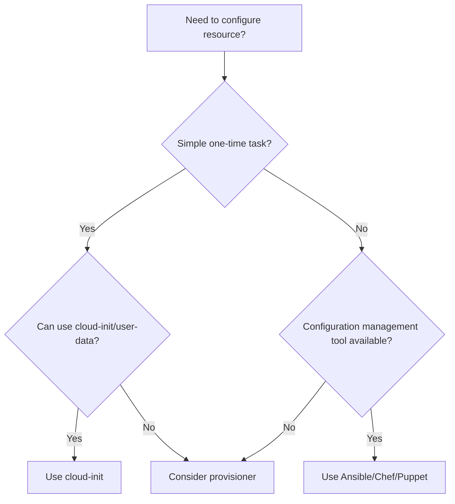

# How to Use Provisioners in Terraform

Author: [nawazdhandala](https://www.github.com/nawazdhandala)

Tags: Terraform, Infrastructure as Code, Provisioners, Configuration Management, DevOps

Description: Learn how to use Terraform provisioners to run scripts and commands on resources after creation, understand when provisioners are appropriate, and explore alternatives for configuration management.

---

Provisioners in Terraform let you execute scripts or commands on resources after they are created or before they are destroyed. While Terraform discourages heavy use of provisioners in favor of purpose-built configuration management tools, they remain useful for bootstrapping, simple configuration tasks, and legacy integrations.

## When to Use Provisioners

Terraform's documentation calls provisioners a "last resort." Use them for:

- Bootstrapping instances before configuration management takes over
- Running one-time setup scripts
- Passing data to instances at creation time
- Integrating with legacy systems that require imperative commands

Avoid provisioners for:
- Complex configuration management (use Ansible, Chef, or Puppet)
- Installing software packages (use machine images instead)
- Ongoing configuration drift management



## Remote-Exec Provisioner

The `remote-exec` provisioner runs commands on a remote resource over SSH or WinRM.

```hcl
resource "aws_instance" "web" {
  ami           = var.ami_id
  instance_type = "t3.micro"
  key_name      = aws_key_pair.deployer.key_name
  subnet_id     = var.subnet_id

  vpc_security_group_ids = [aws_security_group.ssh.id]

  connection {
    type        = "ssh"
    user        = "ubuntu"
    private_key = file("~/.ssh/id_rsa")
    host        = self.public_ip
  }

  provisioner "remote-exec" {
    inline = [
      "sudo apt-get update",
      "sudo apt-get install -y nginx",
      "sudo systemctl enable nginx",
      "sudo systemctl start nginx"
    ]
  }

  tags = {
    Name = "web-server"
  }
}

resource "aws_key_pair" "deployer" {
  key_name   = "deployer-key"
  public_key = file("~/.ssh/id_rsa.pub")
}

resource "aws_security_group" "ssh" {
  name        = "allow-ssh"
  description = "Allow SSH inbound"
  vpc_id      = var.vpc_id

  ingress {
    from_port   = 22
    to_port     = 22
    protocol    = "tcp"
    cidr_blocks = [var.my_ip]
  }

  egress {
    from_port   = 0
    to_port     = 0
    protocol    = "-1"
    cidr_blocks = ["0.0.0.0/0"]
  }
}
```

### Running Scripts with remote-exec

```hcl
resource "aws_instance" "app" {
  ami           = var.ami_id
  instance_type = "t3.small"
  key_name      = aws_key_pair.deployer.key_name

  connection {
    type        = "ssh"
    user        = "ubuntu"
    private_key = file("~/.ssh/id_rsa")
    host        = self.public_ip
  }

  # Copy script to remote server
  provisioner "file" {
    source      = "scripts/setup.sh"
    destination = "/tmp/setup.sh"
  }

  # Execute the script
  provisioner "remote-exec" {
    inline = [
      "chmod +x /tmp/setup.sh",
      "/tmp/setup.sh ${var.environment}"
    ]
  }
}
```

## Local-Exec Provisioner

The `local-exec` provisioner runs commands on the machine running Terraform, not on the remote resource.

```hcl
resource "aws_instance" "web" {
  ami           = var.ami_id
  instance_type = "t3.micro"

  tags = {
    Name = "web-server"
  }

  provisioner "local-exec" {
    command = "echo ${self.private_ip} >> inventory.txt"
  }
}

# Common patterns with local-exec

# Trigger Ansible playbook
resource "aws_instance" "app" {
  ami           = var.ami_id
  instance_type = "t3.micro"

  provisioner "local-exec" {
    command = <<-EOT
      ANSIBLE_HOST_KEY_CHECKING=False ansible-playbook \
        -i '${self.public_ip},' \
        -u ubuntu \
        --private-key ~/.ssh/id_rsa \
        playbooks/configure.yml
    EOT
  }
}

# Run a Python script
resource "null_resource" "setup" {
  provisioner "local-exec" {
    command     = "python3 scripts/setup.py"
    interpreter = ["bash", "-c"]

    environment = {
      INSTANCE_ID = aws_instance.web.id
      REGION      = var.region
    }
  }
}
```

## File Provisioner

The `file` provisioner copies files or directories to a remote resource.

```hcl
resource "aws_instance" "web" {
  ami           = var.ami_id
  instance_type = "t3.micro"
  key_name      = aws_key_pair.deployer.key_name

  connection {
    type        = "ssh"
    user        = "ubuntu"
    private_key = file("~/.ssh/id_rsa")
    host        = self.public_ip
  }

  # Copy a single file
  provisioner "file" {
    source      = "configs/nginx.conf"
    destination = "/tmp/nginx.conf"
  }

  # Copy a directory
  provisioner "file" {
    source      = "app/"
    destination = "/home/ubuntu/app"
  }

  # Copy content directly
  provisioner "file" {
    content     = templatefile("templates/config.tpl", {
      db_host = aws_db_instance.main.endpoint
      db_name = var.db_name
    })
    destination = "/home/ubuntu/app/config.json"
  }

  # Move files to final locations and set permissions
  provisioner "remote-exec" {
    inline = [
      "sudo mv /tmp/nginx.conf /etc/nginx/nginx.conf",
      "sudo chown root:root /etc/nginx/nginx.conf",
      "sudo nginx -t && sudo systemctl reload nginx"
    ]
  }
}
```

## Connection Block Configuration

### SSH Connection

```hcl
resource "aws_instance" "example" {
  ami           = var.ami_id
  instance_type = "t3.micro"

  connection {
    type        = "ssh"
    user        = "ubuntu"
    private_key = file("~/.ssh/id_rsa")
    host        = self.public_ip
    port        = 22
    timeout     = "5m"

    # Optional: Use bastion host
    bastion_host        = var.bastion_ip
    bastion_user        = "ubuntu"
    bastion_private_key = file("~/.ssh/bastion_key")
  }

  provisioner "remote-exec" {
    inline = ["echo 'Connected!'"]
  }
}
```

### WinRM Connection for Windows

```hcl
resource "aws_instance" "windows" {
  ami           = var.windows_ami_id
  instance_type = "t3.medium"

  connection {
    type     = "winrm"
    user     = "Administrator"
    password = var.admin_password
    host     = self.public_ip
    port     = 5986
    https    = true
    insecure = true
    timeout  = "10m"
  }

  provisioner "remote-exec" {
    inline = [
      "powershell -Command \"Write-Host 'Connected to Windows'\""
    ]
  }
}
```

## Provisioner Timing

### Creation-Time Provisioners (Default)

```hcl
resource "aws_instance" "web" {
  ami           = var.ami_id
  instance_type = "t3.micro"

  # Runs after instance is created (default behavior)
  provisioner "local-exec" {
    command = "echo 'Instance created: ${self.id}'"
  }
}
```

### Destroy-Time Provisioners

```hcl
resource "aws_instance" "web" {
  ami           = var.ami_id
  instance_type = "t3.micro"

  # Runs before instance is destroyed
  provisioner "local-exec" {
    when    = destroy
    command = "echo 'Cleaning up instance ${self.id}' >> cleanup.log"
  }

  # Deregister from load balancer before destroy
  provisioner "local-exec" {
    when    = destroy
    command = "aws elbv2 deregister-targets --target-group-arn ${var.target_group_arn} --targets Id=${self.id}"
  }
}
```

## Failure Handling

### on_failure Behavior

```hcl
resource "aws_instance" "web" {
  ami           = var.ami_id
  instance_type = "t3.micro"

  connection {
    type        = "ssh"
    user        = "ubuntu"
    private_key = file("~/.ssh/id_rsa")
    host        = self.public_ip
  }

  # Continue even if provisioner fails
  provisioner "remote-exec" {
    on_failure = continue

    inline = [
      "optional-setup-script.sh || true"
    ]
  }

  # Fail and taint resource if this provisioner fails (default)
  provisioner "remote-exec" {
    on_failure = fail

    inline = [
      "critical-setup-script.sh"
    ]
  }
}
```

## Null Resource for Standalone Provisioners

Use `null_resource` when provisioners are not tied to a specific resource.

```hcl
resource "null_resource" "configure_cluster" {
  # Trigger re-provisioning when these change
  triggers = {
    cluster_id     = aws_eks_cluster.main.id
    config_version = var.config_version
  }

  provisioner "local-exec" {
    command = <<-EOT
      aws eks update-kubeconfig --name ${aws_eks_cluster.main.name}
      kubectl apply -f manifests/
    EOT
  }

  depends_on = [aws_eks_cluster.main, aws_eks_node_group.main]
}

# Run database migrations
resource "null_resource" "db_migrations" {
  triggers = {
    migration_version = var.migration_version
    db_endpoint       = aws_db_instance.main.endpoint
  }

  provisioner "local-exec" {
    command = "python manage.py migrate"

    environment = {
      DATABASE_URL = "postgresql://${var.db_user}:${var.db_password}@${aws_db_instance.main.endpoint}/${var.db_name}"
    }
  }

  depends_on = [aws_db_instance.main]
}
```

## Alternatives to Provisioners

### Cloud-Init (Recommended for Linux)

```hcl
resource "aws_instance" "web" {
  ami           = var.ami_id
  instance_type = "t3.micro"

  user_data = <<-EOF
    #!/bin/bash
    apt-get update
    apt-get install -y nginx
    systemctl enable nginx
    systemctl start nginx
  EOF

  user_data_replace_on_change = true

  tags = {
    Name = "web-server"
  }
}
```

### Packer for Custom Images

Build configuration into AMIs instead of running at boot time.

```hcl
# Use pre-configured AMI from Packer
data "aws_ami" "app" {
  most_recent = true
  owners      = ["self"]

  filter {
    name   = "name"
    values = ["app-server-*"]
  }
}

resource "aws_instance" "app" {
  ami           = data.aws_ami.app.id
  instance_type = "t3.micro"

  # No provisioners needed - everything is in the AMI
}
```

### Ansible Integration

```hcl
resource "null_resource" "ansible" {
  triggers = {
    instance_ids = join(",", aws_instance.web[*].id)
  }

  provisioner "local-exec" {
    command = <<-EOT
      ANSIBLE_HOST_KEY_CHECKING=False ansible-playbook \
        -i '${join(",", aws_instance.web[*].public_ip)},' \
        -u ubuntu \
        --private-key ~/.ssh/id_rsa \
        site.yml
    EOT
  }

  depends_on = [aws_instance.web]
}
```

---

Provisioners fill a gap between Terraform's infrastructure provisioning and configuration management tools. Use them sparingly for bootstrapping and one-time setup tasks. For anything more complex, combine Terraform with Packer for image building and Ansible, Chef, or Puppet for configuration management.
