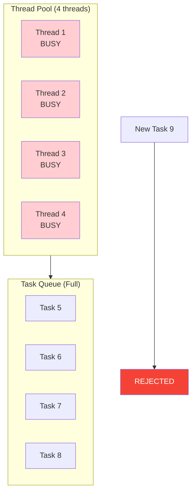
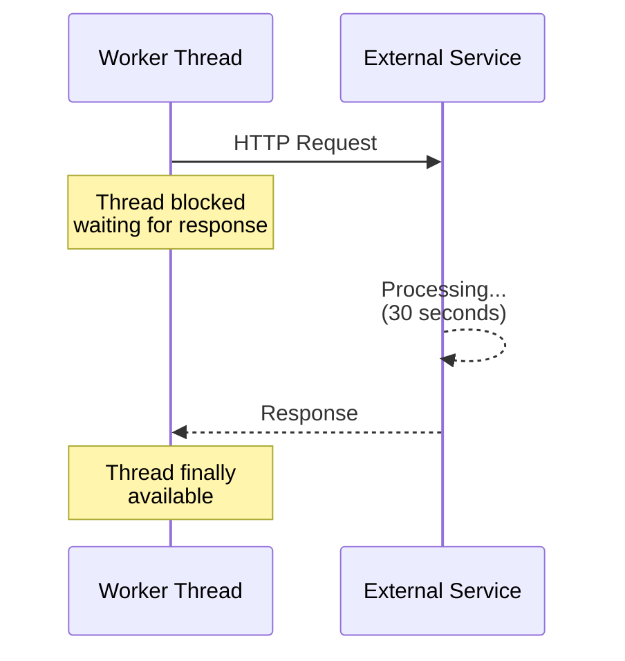
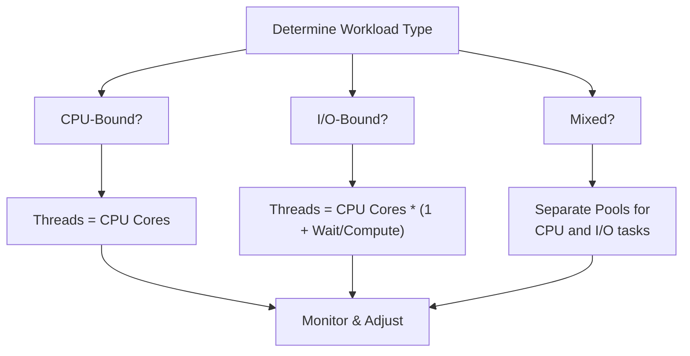

# How to Fix "Thread Pool Exhausted" Errors

Author: [nawazdhandala](https://www.github.com/nawazdhandala)

Tags: Threading, Performance, Java, Python, Thread Pool, Concurrency, Troubleshooting, DevOps

Description: Learn how to diagnose and fix thread pool exhaustion errors that cause application hangs and timeouts, with practical solutions for Java and Python applications.

---

> Thread pool exhaustion is one of the most common causes of application hangs and timeouts in production. This guide shows you how to identify, diagnose, and fix thread pool issues before they bring down your services.

When all threads in a pool are busy and the queue is full, new tasks get rejected or blocked indefinitely. Understanding why this happens and how to prevent it is crucial for maintaining healthy applications.

---

## Understanding Thread Pool Exhaustion

Thread pool exhaustion occurs when:

1. All worker threads are busy
2. The task queue is full
3. New tasks cannot be accepted



---

## Diagnosing Thread Pool Issues

### Java: Thread Dump Analysis

```java
// ThreadPoolDiagnostics.java
import java.lang.management.ManagementFactory;
import java.lang.management.ThreadInfo;
import java.lang.management.ThreadMXBean;
import java.util.concurrent.*;

public class ThreadPoolDiagnostics {

    /**
     * Get comprehensive thread pool statistics
     */
    public static ThreadPoolStats getPoolStats(ThreadPoolExecutor executor) {
        return new ThreadPoolStats(
            executor.getPoolSize(),
            executor.getCorePoolSize(),
            executor.getMaximumPoolSize(),
            executor.getActiveCount(),
            executor.getQueue().size(),
            executor.getQueue().remainingCapacity(),
            executor.getCompletedTaskCount(),
            executor.getTaskCount(),
            executor.getLargestPoolSize()
        );
    }

    /**
     * Detect potential thread pool exhaustion
     */
    public static boolean isPoolExhausted(ThreadPoolExecutor executor) {
        int activeCount = executor.getActiveCount();
        int maxPoolSize = executor.getMaximumPoolSize();
        int queueRemaining = executor.getQueue().remainingCapacity();

        // Pool is exhausted if all threads busy and queue nearly full
        return activeCount >= maxPoolSize && queueRemaining < 10;
    }

    /**
     * Generate thread dump for analysis
     */
    public static String generateThreadDump() {
        StringBuilder dump = new StringBuilder();
        ThreadMXBean threadMXBean = ManagementFactory.getThreadMXBean();

        for (ThreadInfo threadInfo : threadMXBean.dumpAllThreads(true, true)) {
            dump.append(threadInfo.toString());
        }

        return dump.toString();
    }

    /**
     * Find threads blocked on specific operations
     */
    public static void analyzeBlockedThreads() {
        ThreadMXBean threadMXBean = ManagementFactory.getThreadMXBean();
        long[] deadlockedThreads = threadMXBean.findDeadlockedThreads();

        if (deadlockedThreads != null) {
            System.err.println("DEADLOCK DETECTED!");
            for (long threadId : deadlockedThreads) {
                ThreadInfo info = threadMXBean.getThreadInfo(threadId);
                System.err.println("Deadlocked thread: " + info.getThreadName());
                System.err.println("Blocked on: " + info.getLockInfo());
            }
        }

        // Find threads waiting on I/O or locks
        for (ThreadInfo info : threadMXBean.dumpAllThreads(false, false)) {
            if (info.getThreadState() == Thread.State.BLOCKED) {
                System.out.println("Blocked thread: " + info.getThreadName());
                System.out.println("Waiting for: " + info.getLockInfo());
                System.out.println("Held by: " + info.getLockOwnerName());
            }
        }
    }
}

record ThreadPoolStats(
    int poolSize,
    int corePoolSize,
    int maxPoolSize,
    int activeCount,
    int queueSize,
    int queueRemainingCapacity,
    long completedTasks,
    long totalTasks,
    int largestPoolSize
) {
    public double utilizationPercent() {
        return (double) activeCount / maxPoolSize * 100;
    }

    public boolean isHealthy() {
        return utilizationPercent() < 80 && queueRemainingCapacity > 10;
    }
}
```

### Python: Thread Pool Monitoring

```python
# thread_pool_diagnostics.py
import threading
import sys
import traceback
from concurrent.futures import ThreadPoolExecutor
from typing import Dict, List
from dataclasses import dataclass
import time


@dataclass
class ThreadPoolStats:
    """Statistics for a thread pool"""
    active_threads: int
    total_threads: int
    pending_tasks: int
    completed_tasks: int

    @property
    def utilization_percent(self) -> float:
        if self.total_threads == 0:
            return 0
        return (self.active_threads / self.total_threads) * 100


def get_all_threads() -> List[Dict]:
    """Get information about all active threads"""
    threads_info = []

    for thread in threading.enumerate():
        info = {
            "name": thread.name,
            "daemon": thread.daemon,
            "alive": thread.is_alive(),
            "ident": thread.ident,
        }

        # Get stack trace for the thread
        frame = sys._current_frames().get(thread.ident)
        if frame:
            info["stack"] = traceback.format_stack(frame)

        threads_info.append(info)

    return threads_info


def analyze_thread_states() -> Dict[str, int]:
    """Analyze thread states"""
    frames = sys._current_frames()
    states = {
        "running": 0,
        "waiting_io": 0,
        "waiting_lock": 0,
        "idle": 0
    }

    for thread_id, frame in frames.items():
        stack = traceback.extract_stack(frame)

        if stack:
            last_call = stack[-1]

            # Classify based on what the thread is doing
            if "socket" in last_call.filename or "recv" in last_call.name:
                states["waiting_io"] += 1
            elif "lock" in last_call.name.lower() or "acquire" in last_call.name:
                states["waiting_lock"] += 1
            elif "wait" in last_call.name or "sleep" in last_call.name:
                states["idle"] += 1
            else:
                states["running"] += 1

    return states


class MonitoredThreadPoolExecutor(ThreadPoolExecutor):
    """Thread pool with built-in monitoring"""

    def __init__(self, max_workers: int = None, thread_name_prefix: str = ""):
        super().__init__(max_workers=max_workers, thread_name_prefix=thread_name_prefix)
        self._completed_tasks = 0
        self._active_tasks = 0
        self._lock = threading.Lock()
        self._task_start_times: Dict[int, float] = {}

    def submit(self, fn, *args, **kwargs):
        """Submit with monitoring wrapper"""

        def monitored_fn(*a, **kw):
            task_id = id(threading.current_thread())

            with self._lock:
                self._active_tasks += 1
                self._task_start_times[task_id] = time.time()

            try:
                return fn(*a, **kw)
            finally:
                with self._lock:
                    self._active_tasks -= 1
                    self._completed_tasks += 1
                    self._task_start_times.pop(task_id, None)

        return super().submit(monitored_fn, *args, **kwargs)

    def get_stats(self) -> ThreadPoolStats:
        """Get current pool statistics"""
        with self._lock:
            return ThreadPoolStats(
                active_threads=self._active_tasks,
                total_threads=self._max_workers,
                pending_tasks=self._work_queue.qsize(),
                completed_tasks=self._completed_tasks
            )

    def get_long_running_tasks(self, threshold_seconds: float = 30) -> List[Dict]:
        """Find tasks running longer than threshold"""
        now = time.time()
        long_running = []

        with self._lock:
            for task_id, start_time in self._task_start_times.items():
                duration = now - start_time
                if duration > threshold_seconds:
                    long_running.append({
                        "task_id": task_id,
                        "duration_seconds": duration
                    })

        return long_running


# Usage
executor = MonitoredThreadPoolExecutor(max_workers=10, thread_name_prefix="worker")

# Check pool health periodically
def health_check():
    stats = executor.get_stats()
    print(f"Pool utilization: {stats.utilization_percent:.1f}%")
    print(f"Pending tasks: {stats.pending_tasks}")

    if stats.utilization_percent > 90:
        print("WARNING: Thread pool near exhaustion!")

    long_running = executor.get_long_running_tasks(threshold_seconds=30)
    if long_running:
        print(f"WARNING: {len(long_running)} long-running tasks detected")
```

---

## Common Causes and Solutions

### 1. Blocking I/O Operations

**Problem**: Threads blocked waiting for slow external services.



**Solution**: Add timeouts and use async I/O.

```python
# fix_blocking_io.py
import httpx
import asyncio
from concurrent.futures import ThreadPoolExecutor
import requests
from requests.adapters import HTTPAdapter
from urllib3.util.retry import Retry

# BAD: No timeout, thread blocks indefinitely
def bad_fetch(url):
    return requests.get(url)  # Can block forever!


# GOOD: Timeout prevents indefinite blocking
def good_fetch(url, timeout=10):
    return requests.get(url, timeout=timeout)


# BETTER: Use connection pooling with timeouts
def create_session_with_timeout():
    session = requests.Session()

    # Configure retry strategy
    retry_strategy = Retry(
        total=3,
        backoff_factor=0.5,
        status_forcelist=[429, 500, 502, 503, 504]
    )

    adapter = HTTPAdapter(
        max_retries=retry_strategy,
        pool_connections=10,
        pool_maxsize=10
    )

    session.mount("http://", adapter)
    session.mount("https://", adapter)

    return session


# BEST: Use async for I/O-bound operations
async def async_fetch_all(urls: list, timeout: float = 10):
    """Fetch multiple URLs concurrently without blocking threads"""

    async with httpx.AsyncClient(timeout=timeout) as client:
        tasks = [client.get(url) for url in urls]
        responses = await asyncio.gather(*tasks, return_exceptions=True)

        return [
            r.json() if isinstance(r, httpx.Response) else {"error": str(r)}
            for r in responses
        ]


# Run async code in thread pool context
def fetch_all_with_async(urls: list):
    """Bridge between sync thread pool and async I/O"""
    return asyncio.run(async_fetch_all(urls))
```

### 2. Database Connection Pool Exhaustion

**Problem**: Threads waiting for database connections.

```java
// FixDatabasePooling.java
import com.zaxxer.hikari.HikariConfig;
import com.zaxxer.hikari.HikariDataSource;
import java.sql.Connection;
import java.sql.SQLException;

public class FixDatabasePooling {

    /**
     * Properly configured connection pool
     */
    public static HikariDataSource createOptimizedPool() {
        HikariConfig config = new HikariConfig();

        config.setJdbcUrl("jdbc:postgresql://localhost:5432/mydb");
        config.setUsername("user");
        config.setPassword("password");

        // Pool sizing: typically 2x CPU cores + disk spindles
        // For SSD, use CPU cores * 2
        config.setMaximumPoolSize(20);
        config.setMinimumIdle(5);

        // CRITICAL: Connection timeout prevents indefinite waiting
        config.setConnectionTimeout(10000);  // 10 seconds

        // Idle timeout - close unused connections
        config.setIdleTimeout(300000);  // 5 minutes

        // Max lifetime - prevent stale connections
        config.setMaxLifetime(1800000);  // 30 minutes

        // Leak detection - find connection leaks
        config.setLeakDetectionThreshold(30000);  // 30 seconds

        return new HikariDataSource(config);
    }

    /**
     * Always use try-with-resources to return connections
     */
    public void properConnectionUsage(HikariDataSource dataSource) {
        // Connection is automatically returned to pool
        try (Connection conn = dataSource.getConnection()) {
            // Use connection
            var stmt = conn.prepareStatement("SELECT * FROM users WHERE id = ?");
            // ...
        } catch (SQLException e) {
            // Handle error
        }
        // Connection returned here, even if exception occurs
    }

    /**
     * BAD: Connection leak - never do this
     */
    public Connection badConnectionUsage(HikariDataSource dataSource)
            throws SQLException {
        // Connection is never returned to pool!
        return dataSource.getConnection();
    }
}
```

### 3. Unbounded Task Queues

**Problem**: Queue grows indefinitely, causing memory issues.

```python
# fix_unbounded_queue.py
from concurrent.futures import ThreadPoolExecutor
from queue import Queue, Full
import threading
import time


# BAD: Default unbounded queue
bad_executor = ThreadPoolExecutor(max_workers=5)
# Tasks queue up indefinitely, consuming memory


# GOOD: Bounded queue with rejection policy
class BoundedThreadPoolExecutor:
    """Thread pool with bounded queue and configurable rejection"""

    def __init__(
        self,
        max_workers: int,
        max_queue_size: int,
        rejection_policy: str = "abort"
    ):
        self.max_workers = max_workers
        self.max_queue_size = max_queue_size
        self.rejection_policy = rejection_policy

        self._queue = Queue(maxsize=max_queue_size)
        self._workers = []
        self._shutdown = False

        # Start worker threads
        for i in range(max_workers):
            worker = threading.Thread(
                target=self._worker_loop,
                name=f"worker-{i}",
                daemon=True
            )
            worker.start()
            self._workers.append(worker)

    def _worker_loop(self):
        while not self._shutdown:
            try:
                task, args, kwargs = self._queue.get(timeout=1)
                try:
                    task(*args, **kwargs)
                except Exception as e:
                    print(f"Task failed: {e}")
                finally:
                    self._queue.task_done()
            except:
                continue

    def submit(self, fn, *args, **kwargs):
        """Submit task with rejection handling"""

        if self._shutdown:
            raise RuntimeError("Executor is shut down")

        try:
            self._queue.put_nowait((fn, args, kwargs))
            return True

        except Full:
            return self._handle_rejection(fn, args, kwargs)

    def _handle_rejection(self, fn, args, kwargs):
        """Handle task rejection based on policy"""

        if self.rejection_policy == "abort":
            raise RuntimeError("Thread pool queue is full")

        elif self.rejection_policy == "discard":
            # Silently discard the task
            return False

        elif self.rejection_policy == "caller_runs":
            # Execute in calling thread
            fn(*args, **kwargs)
            return True

        elif self.rejection_policy == "discard_oldest":
            # Remove oldest task and retry
            try:
                self._queue.get_nowait()
                self._queue.put_nowait((fn, args, kwargs))
                return True
            except:
                return False

    def shutdown(self, wait: bool = True):
        self._shutdown = True
        if wait:
            for worker in self._workers:
                worker.join()


# Usage
executor = BoundedThreadPoolExecutor(
    max_workers=10,
    max_queue_size=100,
    rejection_policy="caller_runs"  # Backpressure to caller
)
```

### 4. Thread Leaks

**Problem**: Threads never terminate and accumulate.

```java
// FixThreadLeaks.java
import java.util.concurrent.*;

public class FixThreadLeaks {

    /**
     * BAD: Creating thread pool without shutdown
     */
    public void badThreadPoolUsage() {
        // Thread pool created but never shutdown
        ExecutorService executor = Executors.newFixedThreadPool(10);
        executor.submit(() -> doWork());
        // Threads leak when method exits!
    }

    /**
     * GOOD: Proper thread pool lifecycle management
     */
    public void goodThreadPoolUsage() {
        ExecutorService executor = Executors.newFixedThreadPool(10);

        try {
            executor.submit(() -> doWork());
            // More work...
        } finally {
            // Always shutdown!
            executor.shutdown();

            try {
                if (!executor.awaitTermination(60, TimeUnit.SECONDS)) {
                    executor.shutdownNow();
                }
            } catch (InterruptedException e) {
                executor.shutdownNow();
                Thread.currentThread().interrupt();
            }
        }
    }

    /**
     * BETTER: Use try-with-resources (Java 19+)
     */
    public void betterThreadPoolUsage() {
        try (var executor = Executors.newVirtualThreadPerTaskExecutor()) {
            executor.submit(() -> doWork());
        }
        // Automatically shutdown and awaits termination
    }

    /**
     * Register shutdown hook for application-wide pools
     */
    public static class ApplicationThreadPools {
        private static final ExecutorService mainPool =
            Executors.newFixedThreadPool(20);

        static {
            Runtime.getRuntime().addShutdownHook(new Thread(() -> {
                mainPool.shutdown();
                try {
                    mainPool.awaitTermination(30, TimeUnit.SECONDS);
                } catch (InterruptedException e) {
                    mainPool.shutdownNow();
                }
            }));
        }

        public static ExecutorService getMainPool() {
            return mainPool;
        }
    }

    private void doWork() {
        // Task implementation
    }
}
```

---

## Proper Thread Pool Configuration

### Sizing Guidelines



```python
# thread_pool_sizing.py
import os
import multiprocessing


def calculate_optimal_pool_size(
    wait_time_ms: float,
    compute_time_ms: float,
    target_utilization: float = 0.8
) -> int:
    """
    Calculate optimal thread pool size using the formula:
    Threads = CPU Cores * Target Utilization * (1 + Wait/Compute)

    Args:
        wait_time_ms: Average time spent waiting (I/O, network, etc.)
        compute_time_ms: Average time spent computing
        target_utilization: Target CPU utilization (0.0 to 1.0)

    Returns:
        Optimal number of threads
    """
    cpu_cores = multiprocessing.cpu_count()

    if compute_time_ms == 0:
        # Pure I/O bound - use higher thread count
        return int(cpu_cores * 10)

    wait_compute_ratio = wait_time_ms / compute_time_ms
    optimal = cpu_cores * target_utilization * (1 + wait_compute_ratio)

    return max(1, int(optimal))


# Examples
print("CPU-bound tasks (no waiting):")
print(f"  Optimal threads: {calculate_optimal_pool_size(0, 100)}")

print("\nI/O-bound tasks (90% waiting):")
print(f"  Optimal threads: {calculate_optimal_pool_size(900, 100)}")

print("\nMixed workload (50% waiting):")
print(f"  Optimal threads: {calculate_optimal_pool_size(50, 50)}")
```

### Java: Optimal Configuration

```java
// OptimalThreadPoolConfig.java
import java.util.concurrent.*;

public class OptimalThreadPoolConfig {

    /**
     * Create thread pool for CPU-bound tasks
     */
    public static ExecutorService createCpuBoundPool() {
        int cores = Runtime.getRuntime().availableProcessors();

        return new ThreadPoolExecutor(
            cores,                              // Core pool size
            cores,                              // Max pool size (same for CPU-bound)
            60L, TimeUnit.SECONDS,              // Keep-alive time
            new LinkedBlockingQueue<>(100),    // Bounded queue
            new ThreadPoolExecutor.CallerRunsPolicy()  // Backpressure
        );
    }

    /**
     * Create thread pool for I/O-bound tasks
     */
    public static ExecutorService createIoBoundPool() {
        int cores = Runtime.getRuntime().availableProcessors();
        int ioThreads = cores * 10;  // Higher count for I/O

        return new ThreadPoolExecutor(
            cores,                              // Core pool size
            ioThreads,                          // Max pool size
            60L, TimeUnit.SECONDS,
            new SynchronousQueue<>(),           // Direct handoff
            new ThreadPoolExecutor.AbortPolicy()
        );
    }

    /**
     * Create separate pools for different workloads
     */
    public static class WorkloadPools {
        // CPU-intensive operations
        public static final ExecutorService CPU_POOL = createCpuBoundPool();

        // Database operations
        public static final ExecutorService DB_POOL = new ThreadPoolExecutor(
            10, 20, 60L, TimeUnit.SECONDS,
            new LinkedBlockingQueue<>(50)
        );

        // External API calls
        public static final ExecutorService API_POOL = new ThreadPoolExecutor(
            5, 50, 60L, TimeUnit.SECONDS,
            new LinkedBlockingQueue<>(100)
        );

        // Background tasks
        public static final ScheduledExecutorService SCHEDULED_POOL =
            Executors.newScheduledThreadPool(5);
    }
}
```

---

## Monitoring and Alerting

```python
# thread_pool_monitoring.py
from prometheus_client import Gauge, Counter, Histogram
import threading
import time


class ThreadPoolMetrics:
    """Prometheus metrics for thread pool monitoring"""

    def __init__(self, pool_name: str):
        self.pool_name = pool_name

        self.active_threads = Gauge(
            'threadpool_active_threads',
            'Number of active threads',
            ['pool']
        )

        self.queue_size = Gauge(
            'threadpool_queue_size',
            'Number of tasks in queue',
            ['pool']
        )

        self.rejected_tasks = Counter(
            'threadpool_rejected_total',
            'Total rejected tasks',
            ['pool']
        )

        self.task_duration = Histogram(
            'threadpool_task_duration_seconds',
            'Task execution duration',
            ['pool'],
            buckets=[.01, .05, .1, .5, 1, 5, 10, 30, 60]
        )

    def update(self, executor: 'MonitoredThreadPoolExecutor'):
        stats = executor.get_stats()
        self.active_threads.labels(pool=self.pool_name).set(stats.active_threads)
        self.queue_size.labels(pool=self.pool_name).set(stats.pending_tasks)


# Alert thresholds
ALERT_THRESHOLDS = {
    "utilization_critical": 95,
    "utilization_warning": 80,
    "queue_critical": 90,  # % of max queue size
    "queue_warning": 70,
}


def check_pool_health(executor: MonitoredThreadPoolExecutor, pool_name: str):
    """Check thread pool health and generate alerts"""
    stats = executor.get_stats()
    alerts = []

    # Check utilization
    utilization = stats.utilization_percent
    if utilization >= ALERT_THRESHOLDS["utilization_critical"]:
        alerts.append({
            "severity": "critical",
            "pool": pool_name,
            "message": f"Thread pool utilization at {utilization:.1f}%",
            "metric": "utilization"
        })
    elif utilization >= ALERT_THRESHOLDS["utilization_warning"]:
        alerts.append({
            "severity": "warning",
            "pool": pool_name,
            "message": f"Thread pool utilization at {utilization:.1f}%",
            "metric": "utilization"
        })

    # Check long-running tasks
    long_running = executor.get_long_running_tasks(threshold_seconds=60)
    if long_running:
        alerts.append({
            "severity": "warning",
            "pool": pool_name,
            "message": f"{len(long_running)} tasks running > 60s",
            "metric": "long_running_tasks"
        })

    return alerts
```

---

## Prevention Strategies

### 1. Circuit Breaker for External Calls

```python
# circuit_breaker_protection.py
from enum import Enum
import time
import threading


class CircuitState(Enum):
    CLOSED = "closed"
    OPEN = "open"
    HALF_OPEN = "half_open"


class CircuitBreaker:
    """Prevent thread pool exhaustion from slow external services"""

    def __init__(
        self,
        failure_threshold: int = 5,
        timeout: float = 10.0,
        recovery_time: float = 30.0
    ):
        self.failure_threshold = failure_threshold
        self.timeout = timeout
        self.recovery_time = recovery_time

        self._state = CircuitState.CLOSED
        self._failures = 0
        self._last_failure = 0
        self._lock = threading.Lock()

    def call(self, func, *args, **kwargs):
        """Execute function with circuit breaker protection"""

        with self._lock:
            if self._state == CircuitState.OPEN:
                if time.time() - self._last_failure > self.recovery_time:
                    self._state = CircuitState.HALF_OPEN
                else:
                    raise CircuitOpenError("Circuit breaker is open")

        try:
            # Add timeout to prevent indefinite blocking
            import concurrent.futures
            with concurrent.futures.ThreadPoolExecutor(max_workers=1) as executor:
                future = executor.submit(func, *args, **kwargs)
                result = future.result(timeout=self.timeout)

            self._record_success()
            return result

        except concurrent.futures.TimeoutError:
            self._record_failure()
            raise TimeoutError(f"Call timed out after {self.timeout}s")
        except Exception as e:
            self._record_failure()
            raise

    def _record_success(self):
        with self._lock:
            self._failures = 0
            self._state = CircuitState.CLOSED

    def _record_failure(self):
        with self._lock:
            self._failures += 1
            self._last_failure = time.time()
            if self._failures >= self.failure_threshold:
                self._state = CircuitState.OPEN


class CircuitOpenError(Exception):
    pass


# Usage
payment_breaker = CircuitBreaker(
    failure_threshold=5,
    timeout=10.0,
    recovery_time=30.0
)

def process_payment(order_id: str):
    """Payment processing protected by circuit breaker"""
    return payment_breaker.call(
        external_payment_gateway,
        order_id
    )
```

### 2. Async for I/O Operations

```python
# async_io_operations.py
import asyncio
import aiohttp
from typing import List, Dict


async def fetch_all_data(urls: List[str]) -> List[Dict]:
    """
    Fetch multiple URLs concurrently without consuming threads.
    Uses async I/O instead of thread pool.
    """

    async with aiohttp.ClientSession() as session:
        tasks = []
        for url in urls:
            task = asyncio.create_task(fetch_one(session, url))
            tasks.append(task)

        results = await asyncio.gather(*tasks, return_exceptions=True)

        return [
            r if not isinstance(r, Exception) else {"error": str(r)}
            for r in results
        ]


async def fetch_one(session: aiohttp.ClientSession, url: str) -> Dict:
    """Fetch single URL with timeout"""

    async with session.get(url, timeout=aiohttp.ClientTimeout(total=10)) as response:
        return await response.json()


# Bridge for sync code
def fetch_all_sync(urls: List[str]) -> List[Dict]:
    """Sync wrapper for async fetch"""
    return asyncio.run(fetch_all_data(urls))
```

---

## Conclusion

Thread pool exhaustion can cripple your application. Key prevention strategies:

- **Always set timeouts**: Never let threads block indefinitely
- **Use bounded queues**: Prevent unbounded memory growth
- **Separate pools by workload**: Isolate CPU-bound and I/O-bound tasks
- **Monitor actively**: Track utilization and queue depth
- **Use circuit breakers**: Protect against slow external services
- **Consider async I/O**: For I/O-bound operations, async is more efficient

With proper configuration and monitoring, you can prevent thread pool issues before they impact users.

---

*Need real-time alerts when thread pools approach exhaustion? [OneUptime](https://oneuptime.com) provides comprehensive application monitoring with custom metric alerts.*
