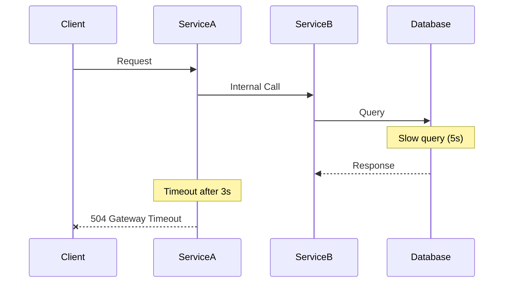
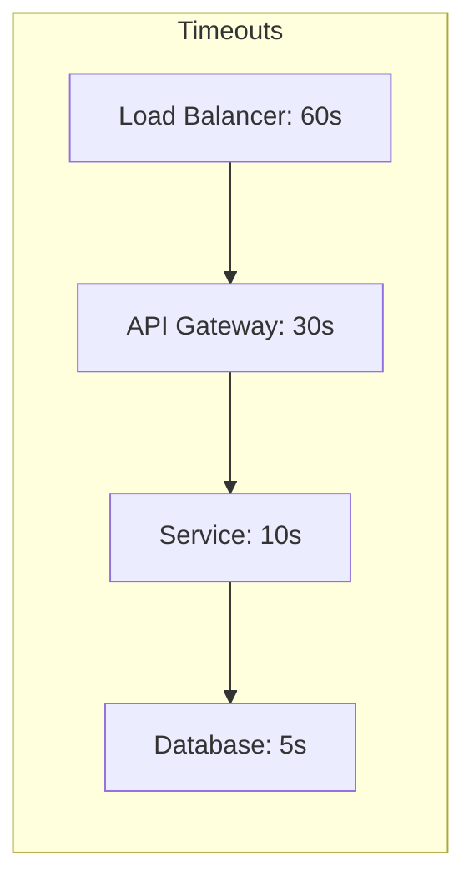
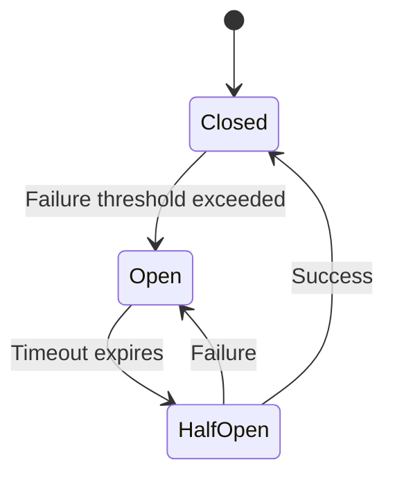

# How to Fix 'Timeout' Errors in Service-to-Service Calls

Author: [nawazdhandala](https://www.github.com/nawazdhandala)

Tags: Microservices, Timeout, Distributed Systems, Networking, Troubleshooting, Resilience, DevOps

Description: Learn how to diagnose and fix timeout errors in service-to-service communication, including configuration tuning, circuit breakers, and observability strategies.

---

Timeout errors in service-to-service calls are one of the most common issues in microservices architectures. They indicate that a downstream service did not respond within the expected time frame. Let us explore the root causes and practical solutions.

## Understanding Timeout Errors

Timeouts occur when a service waits too long for a response. This can happen at multiple layers of your stack.



The diagram shows how a slow database query causes a cascading timeout failure.

## Common Causes of Timeout Errors

### Cause 1: Misconfigured Timeout Values

The most frequent cause is timeout values that do not account for realistic response times.

```yaml
# Kubernetes service configuration with readiness probe
apiVersion: v1
kind: Service
metadata:
  name: user-service
spec:
  selector:
    app: user-service
  ports:
    - port: 8080
      targetPort: 8080
---
# Deployment with proper timeout configurations
apiVersion: apps/v1
kind: Deployment
metadata:
  name: user-service
spec:
  template:
    spec:
      containers:
        - name: user-service
          image: user-service:latest
          # Ensure readiness probe timeout is less than service timeout
          readinessProbe:
            httpGet:
              path: /health
              port: 8080
            initialDelaySeconds: 5
            periodSeconds: 10
            timeoutSeconds: 3
            failureThreshold: 3
```

### Cause 2: Network Latency Issues

Network problems between services can cause intermittent timeouts.

```bash
# Check network latency between services
kubectl exec -it <source-pod> -- ping <target-service>

# Test TCP connection time
kubectl exec -it <source-pod> -- curl -w "Connect: %{time_connect}s\nTotal: %{time_total}s\n" \
  -o /dev/null -s http://target-service:8080/health

# Check for DNS resolution delays
kubectl exec -it <source-pod> -- nslookup target-service
```

### Cause 3: Resource Exhaustion

CPU or memory pressure can slow down response times.

```bash
# Check pod resource usage
kubectl top pods -n <namespace>

# View pod resource limits and requests
kubectl describe pod <pod-name> -n <namespace> | grep -A 5 "Limits\|Requests"
```

## Implementing Proper Timeout Strategies

### Strategy 1: Layered Timeouts

Configure timeouts at each layer, with outer timeouts longer than inner ones.



Here is a practical implementation in Go:

```go
package main

import (
    "context"
    "fmt"
    "net/http"
    "time"
)

// HTTPClient with proper timeout configuration
type HTTPClient struct {
    client *http.Client
}

// NewHTTPClient creates a client with layered timeouts
func NewHTTPClient() *HTTPClient {
    return &HTTPClient{
        client: &http.Client{
            // Overall timeout for the entire request
            Timeout: 10 * time.Second,
            Transport: &http.Transport{
                // Connection timeout
                DialContext: (&net.Dialer{
                    Timeout:   5 * time.Second,
                    KeepAlive: 30 * time.Second,
                }).DialContext,
                // TLS handshake timeout
                TLSHandshakeTimeout: 5 * time.Second,
                // Response header timeout
                ResponseHeaderTimeout: 5 * time.Second,
                // Idle connection timeout
                IdleConnTimeout: 90 * time.Second,
                // Maximum idle connections
                MaxIdleConns: 100,
                MaxIdleConnsPerHost: 10,
            },
        },
    }
}

// CallService makes a request with context timeout
func (c *HTTPClient) CallService(ctx context.Context, url string) (*http.Response, error) {
    // Create request with context for cancellation
    req, err := http.NewRequestWithContext(ctx, "GET", url, nil)
    if err != nil {
        return nil, fmt.Errorf("creating request: %w", err)
    }

    resp, err := c.client.Do(req)
    if err != nil {
        return nil, fmt.Errorf("making request: %w", err)
    }

    return resp, nil
}

// Usage example
func main() {
    client := NewHTTPClient()

    // Set per-request timeout via context
    ctx, cancel := context.WithTimeout(context.Background(), 5*time.Second)
    defer cancel()

    resp, err := client.CallService(ctx, "http://user-service:8080/users/123")
    if err != nil {
        // Handle timeout or other errors
        fmt.Printf("Service call failed: %v\n", err)
        return
    }
    defer resp.Body.Close()

    fmt.Printf("Response status: %d\n", resp.StatusCode)
}
```

### Strategy 2: Implementing Retries with Backoff

Add retries with exponential backoff to handle transient timeout issues.

```go
package main

import (
    "context"
    "fmt"
    "math/rand"
    "net/http"
    "time"
)

// RetryConfig holds retry configuration
type RetryConfig struct {
    MaxRetries  int
    BaseDelay   time.Duration
    MaxDelay    time.Duration
    Multiplier  float64
}

// DefaultRetryConfig provides sensible defaults
func DefaultRetryConfig() RetryConfig {
    return RetryConfig{
        MaxRetries: 3,
        BaseDelay:  100 * time.Millisecond,
        MaxDelay:   5 * time.Second,
        Multiplier: 2.0,
    }
}

// RetryableClient wraps HTTP client with retry logic
type RetryableClient struct {
    client *http.Client
    config RetryConfig
}

// DoWithRetry executes request with retry logic
func (rc *RetryableClient) DoWithRetry(ctx context.Context, req *http.Request) (*http.Response, error) {
    var lastErr error
    delay := rc.config.BaseDelay

    for attempt := 0; attempt <= rc.config.MaxRetries; attempt++ {
        if attempt > 0 {
            // Add jitter to prevent thundering herd
            jitter := time.Duration(rand.Int63n(int64(delay / 2)))
            sleepTime := delay + jitter

            select {
            case <-ctx.Done():
                return nil, ctx.Err()
            case <-time.After(sleepTime):
            }

            // Exponential backoff
            delay = time.Duration(float64(delay) * rc.config.Multiplier)
            if delay > rc.config.MaxDelay {
                delay = rc.config.MaxDelay
            }
        }

        // Clone request for retry
        reqCopy := req.Clone(ctx)
        resp, err := rc.client.Do(reqCopy)

        if err == nil && resp.StatusCode < 500 {
            return resp, nil
        }

        if err != nil {
            lastErr = err
        } else {
            lastErr = fmt.Errorf("server error: %d", resp.StatusCode)
            resp.Body.Close()
        }

        fmt.Printf("Attempt %d failed: %v, retrying...\n", attempt+1, lastErr)
    }

    return nil, fmt.Errorf("all retries exhausted: %w", lastErr)
}
```

### Strategy 3: Circuit Breaker Pattern

Prevent cascading failures by implementing circuit breakers.



Implementation using a circuit breaker:

```go
package main

import (
    "errors"
    "sync"
    "time"
)

// CircuitState represents the circuit breaker state
type CircuitState int

const (
    StateClosed CircuitState = iota
    StateOpen
    StateHalfOpen
)

// CircuitBreaker implements the circuit breaker pattern
type CircuitBreaker struct {
    mu              sync.RWMutex
    state           CircuitState
    failureCount    int
    successCount    int
    failureThreshold int
    successThreshold int
    timeout         time.Duration
    lastFailure     time.Time
}

// NewCircuitBreaker creates a new circuit breaker
func NewCircuitBreaker(failureThreshold, successThreshold int, timeout time.Duration) *CircuitBreaker {
    return &CircuitBreaker{
        state:            StateClosed,
        failureThreshold: failureThreshold,
        successThreshold: successThreshold,
        timeout:          timeout,
    }
}

// ErrCircuitOpen is returned when circuit is open
var ErrCircuitOpen = errors.New("circuit breaker is open")

// Execute runs the function with circuit breaker protection
func (cb *CircuitBreaker) Execute(fn func() error) error {
    if !cb.allowRequest() {
        return ErrCircuitOpen
    }

    err := fn()

    cb.recordResult(err)
    return err
}

func (cb *CircuitBreaker) allowRequest() bool {
    cb.mu.RLock()
    state := cb.state
    lastFailure := cb.lastFailure
    cb.mu.RUnlock()

    switch state {
    case StateClosed:
        return true
    case StateOpen:
        // Check if timeout has passed
        if time.Since(lastFailure) > cb.timeout {
            cb.mu.Lock()
            if cb.state == StateOpen {
                cb.state = StateHalfOpen
                cb.successCount = 0
            }
            cb.mu.Unlock()
            return true
        }
        return false
    case StateHalfOpen:
        return true
    }
    return false
}

func (cb *CircuitBreaker) recordResult(err error) {
    cb.mu.Lock()
    defer cb.mu.Unlock()

    if err != nil {
        cb.failureCount++
        cb.lastFailure = time.Now()

        if cb.state == StateHalfOpen || cb.failureCount >= cb.failureThreshold {
            cb.state = StateOpen
            cb.failureCount = 0
        }
    } else {
        if cb.state == StateHalfOpen {
            cb.successCount++
            if cb.successCount >= cb.successThreshold {
                cb.state = StateClosed
                cb.failureCount = 0
            }
        } else {
            cb.failureCount = 0
        }
    }
}
```

## Kubernetes and Istio Configuration

### Istio Timeout Configuration

```yaml
# VirtualService with timeout configuration
apiVersion: networking.istio.io/v1beta1
kind: VirtualService
metadata:
  name: user-service
  namespace: production
spec:
  hosts:
    - user-service
  http:
    - route:
        - destination:
            host: user-service
            port:
              number: 8080
      timeout: 10s
      retries:
        attempts: 3
        perTryTimeout: 3s
        retryOn: gateway-error,connect-failure,retriable-4xx
```

### DestinationRule for Connection Pooling

```yaml
apiVersion: networking.istio.io/v1beta1
kind: DestinationRule
metadata:
  name: user-service
  namespace: production
spec:
  host: user-service
  trafficPolicy:
    connectionPool:
      tcp:
        maxConnections: 100
        connectTimeout: 5s
      http:
        http1MaxPendingRequests: 100
        http2MaxRequests: 1000
        maxRequestsPerConnection: 10
        maxRetries: 3
    outlierDetection:
      consecutive5xxErrors: 5
      interval: 10s
      baseEjectionTime: 30s
      maxEjectionPercent: 50
```

## Monitoring and Debugging

### Prometheus Metrics for Timeout Tracking

```yaml
# ServiceMonitor for collecting timeout metrics
apiVersion: monitoring.coreos.com/v1
kind: ServiceMonitor
metadata:
  name: user-service-monitor
  namespace: monitoring
spec:
  selector:
    matchLabels:
      app: user-service
  endpoints:
    - port: metrics
      interval: 15s
      path: /metrics
```

### Useful Metrics to Track

```promql
# P99 latency by service
histogram_quantile(0.99,
  sum(rate(http_request_duration_seconds_bucket{job="user-service"}[5m])) by (le)
)

# Timeout error rate
sum(rate(http_requests_total{status="504"}[5m])) /
sum(rate(http_requests_total[5m])) * 100

# Circuit breaker state changes
sum(increase(circuit_breaker_state_changes_total[1h])) by (service, state)
```

### Debugging Commands

```bash
# Check Istio proxy logs for timeout issues
kubectl logs <pod-name> -c istio-proxy -n <namespace> | grep -i timeout

# View Envoy cluster configuration
istioctl proxy-config cluster <pod-name> -n <namespace> -o json | jq '.[] | select(.name | contains("user-service"))'

# Check service endpoints
kubectl get endpoints user-service -n <namespace> -o yaml

# Test connectivity with timeout
kubectl exec -it <source-pod> -n <namespace> -- \
  curl -v --max-time 5 http://user-service:8080/health
```

## Best Practices Summary

1. Set layered timeouts where outer layers have longer timeouts than inner layers
2. Always implement retries with exponential backoff and jitter
3. Use circuit breakers to prevent cascading failures
4. Monitor timeout metrics and set up alerts
5. Configure connection pools to prevent resource exhaustion
6. Test timeout behavior under load before deploying to production
7. Document expected latencies for each service in your architecture

Timeout errors are symptoms of deeper issues. Use them as signals to improve your system resilience and observability.
