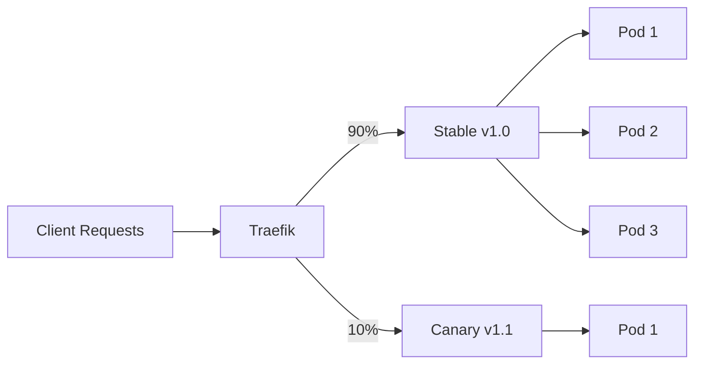

# How to Implement Canary Deployments with Traefik

Author: [nawazdhandala](https://www.github.com/nawazdhandala)

Tags: Traefik, Canary Deployments, Traffic Splitting, DevOps, Continuous Deployment

Description: Configure weighted traffic routing in Traefik to implement canary deployments, gradually rolling out new versions while monitoring for issues.

---

Canary deployments let you test new versions with a small percentage of production traffic before rolling out fully. If the new version has problems, only a fraction of users are affected, and you can quickly roll back. Traefik makes this straightforward with its weighted round-robin load balancing feature.

This guide covers implementing canary deployments in Traefik, from basic traffic splitting to sophisticated header-based routing for internal testing.

## How Canary Deployments Work

In a canary deployment, you run two versions simultaneously:

- **Stable version**: The current production release serving most traffic
- **Canary version**: The new release receiving a small percentage of traffic



You monitor the canary version for errors and performance issues. If everything looks good, gradually increase its traffic share until it handles 100%.

## Basic Traffic Splitting

Traefik uses `TraefikService` to define weighted routing between services:

```yaml
# canary-services.yaml
# Stable deployment - current production version
apiVersion: apps/v1
kind: Deployment
metadata:
  name: myapp-stable
  namespace: default
spec:
  replicas: 3
  selector:
    matchLabels:
      app: myapp
      version: stable
  template:
    metadata:
      labels:
        app: myapp
        version: stable
    spec:
      containers:
        - name: myapp
          image: myapp:1.0.0
          ports:
            - containerPort: 8080
---
# Canary deployment - new version being tested
apiVersion: apps/v1
kind: Deployment
metadata:
  name: myapp-canary
  namespace: default
spec:
  replicas: 1  # Start with fewer replicas
  selector:
    matchLabels:
      app: myapp
      version: canary
  template:
    metadata:
      labels:
        app: myapp
        version: canary
    spec:
      containers:
        - name: myapp
          image: myapp:1.1.0
          ports:
            - containerPort: 8080
---
# Service for stable version
apiVersion: v1
kind: Service
metadata:
  name: myapp-stable
  namespace: default
spec:
  selector:
    app: myapp
    version: stable
  ports:
    - port: 80
      targetPort: 8080
---
# Service for canary version
apiVersion: v1
kind: Service
metadata:
  name: myapp-canary
  namespace: default
spec:
  selector:
    app: myapp
    version: canary
  ports:
    - port: 80
      targetPort: 8080
```

Now create the TraefikService for weighted routing:

```yaml
# weighted-service.yaml
apiVersion: traefik.io/v1alpha1
kind: TraefikService
metadata:
  name: myapp-weighted
  namespace: default
spec:
  weighted:
    services:
      - name: myapp-stable
        port: 80
        weight: 90  # 90% of traffic
      - name: myapp-canary
        port: 80
        weight: 10  # 10% of traffic
```

Route traffic through the weighted service:

```yaml
# canary-ingress.yaml
apiVersion: traefik.io/v1alpha1
kind: IngressRoute
metadata:
  name: myapp
  namespace: default
spec:
  entryPoints:
    - websecure
  routes:
    - match: Host(`myapp.example.com`)
      kind: Rule
      services:
        - name: myapp-weighted
          kind: TraefikService
  tls: {}
```

## Gradual Traffic Increase

As you gain confidence in the canary version, update the weights:

```yaml
# progressive-weights.yaml
# Week 1: 10% canary
apiVersion: traefik.io/v1alpha1
kind: TraefikService
metadata:
  name: myapp-weighted
  namespace: default
spec:
  weighted:
    services:
      - name: myapp-stable
        port: 80
        weight: 90
      - name: myapp-canary
        port: 80
        weight: 10
---
# Week 2: 25% canary (after successful monitoring)
# Update the TraefikService
spec:
  weighted:
    services:
      - name: myapp-stable
        port: 80
        weight: 75
      - name: myapp-canary
        port: 80
        weight: 25
---
# Week 3: 50% canary
spec:
  weighted:
    services:
      - name: myapp-stable
        port: 80
        weight: 50
      - name: myapp-canary
        port: 80
        weight: 50
---
# Final: 100% canary (now becomes stable)
spec:
  weighted:
    services:
      - name: myapp-canary
        port: 80
        weight: 100
```

## Header-Based Canary Testing

Before exposing the canary to real users, test it internally using header-based routing:

```yaml
# header-canary.yaml
apiVersion: traefik.io/v1alpha1
kind: IngressRoute
metadata:
  name: myapp
  namespace: default
spec:
  entryPoints:
    - websecure
  routes:
    # Route with canary header goes to canary version
    - match: Host(`myapp.example.com`) && Headers(`X-Canary`, `true`)
      kind: Rule
      priority: 100  # Higher priority matches first
      services:
        - name: myapp-canary
          port: 80

    # All other traffic goes to stable version
    - match: Host(`myapp.example.com`)
      kind: Rule
      priority: 1
      services:
        - name: myapp-stable
          port: 80
  tls: {}
```

Test the canary internally:

```bash
# Request goes to stable version
curl https://myapp.example.com/

# Request goes to canary version
curl -H "X-Canary: true" https://myapp.example.com/
```

## Cookie-Based Sticky Sessions

For applications where users should consistently see the same version during a session:

```yaml
# sticky-canary.yaml
apiVersion: traefik.io/v1alpha1
kind: TraefikService
metadata:
  name: myapp-weighted
  namespace: default
spec:
  weighted:
    services:
      - name: myapp-stable
        port: 80
        weight: 90
      - name: myapp-canary
        port: 80
        weight: 10
    # Sticky cookie ensures user stays on same version
    sticky:
      cookie:
        name: canary_version
        httpOnly: true
        secure: true
        sameSite: strict
```

Once assigned to a version, the user continues using that version for the session duration.

## Monitoring Canary Health

Create separate monitoring for stable and canary versions:

```yaml
# canary-monitoring.yaml
# Add version labels to enable separate metrics
apiVersion: traefik.io/v1alpha1
kind: IngressRoute
metadata:
  name: myapp-with-metrics
  namespace: default
spec:
  entryPoints:
    - websecure
  routes:
    - match: Host(`myapp.example.com`)
      kind: Rule
      services:
        - name: myapp-weighted
          kind: TraefikService
  tls: {}
```

Query Prometheus for version-specific metrics:

```promql
# Error rate for stable version
sum(rate(traefik_service_requests_total{service="myapp-stable@kubernetes", code=~"5.."}[5m]))
/
sum(rate(traefik_service_requests_total{service="myapp-stable@kubernetes"}[5m]))

# Error rate for canary version
sum(rate(traefik_service_requests_total{service="myapp-canary@kubernetes", code=~"5.."}[5m]))
/
sum(rate(traefik_service_requests_total{service="myapp-canary@kubernetes"}[5m]))

# Latency comparison
histogram_quantile(0.95,
  sum by (le, service) (
    rate(traefik_service_request_duration_seconds_bucket{service=~"myapp-.*"}[5m])
  )
)
```

Set up alerts for canary issues:

```yaml
# canary-alerts.yaml
apiVersion: monitoring.coreos.com/v1
kind: PrometheusRule
metadata:
  name: canary-alerts
  namespace: monitoring
spec:
  groups:
    - name: canary
      rules:
        - alert: CanaryHighErrorRate
          expr: |
            sum(rate(traefik_service_requests_total{service="myapp-canary@kubernetes", code=~"5.."}[5m]))
            /
            sum(rate(traefik_service_requests_total{service="myapp-canary@kubernetes"}[5m]))
            > 0.05
          for: 5m
          labels:
            severity: warning
          annotations:
            summary: Canary version has elevated error rate

        - alert: CanaryHighLatency
          expr: |
            histogram_quantile(0.95,
              sum(rate(traefik_service_request_duration_seconds_bucket{service="myapp-canary@kubernetes"}[5m])) by (le)
            ) > 2
          for: 5m
          labels:
            severity: warning
          annotations:
            summary: Canary version has high latency
```

## Automated Rollback

Create a rollback script that reverts traffic on errors:

```bash
#!/bin/bash
# rollback-canary.sh

# Check canary error rate
ERROR_RATE=$(curl -s "http://prometheus:9090/api/v1/query?query=..." | jq '.data.result[0].value[1]')

if (( $(echo "$ERROR_RATE > 0.05" | bc -l) )); then
  echo "Canary error rate too high: $ERROR_RATE"

  # Apply rollback configuration
  kubectl apply -f - <<EOF
apiVersion: traefik.io/v1alpha1
kind: TraefikService
metadata:
  name: myapp-weighted
  namespace: default
spec:
  weighted:
    services:
      - name: myapp-stable
        port: 80
        weight: 100
      - name: myapp-canary
        port: 80
        weight: 0
EOF

  echo "Rolled back canary deployment"
fi
```

## Blue-Green with Instant Switch

For blue-green deployments (instant cutover instead of gradual):

```yaml
# blue-green.yaml
apiVersion: traefik.io/v1alpha1
kind: TraefikService
metadata:
  name: myapp-bluegreen
  namespace: default
spec:
  weighted:
    services:
      # Blue (current) - 100%
      - name: myapp-blue
        port: 80
        weight: 100
      # Green (new) - 0%
      - name: myapp-green
        port: 80
        weight: 0
```

Switch instantly by updating weights to 0/100.

## Complete Canary Pipeline

Here is a full example combining the concepts:

```yaml
# complete-canary.yaml
# Stable deployment
apiVersion: apps/v1
kind: Deployment
metadata:
  name: api-stable
  namespace: production
spec:
  replicas: 5
  selector:
    matchLabels:
      app: api
      track: stable
  template:
    metadata:
      labels:
        app: api
        track: stable
    spec:
      containers:
        - name: api
          image: api:2.0.0
          ports:
            - containerPort: 8080
          resources:
            requests:
              cpu: 100m
              memory: 128Mi
---
# Canary deployment
apiVersion: apps/v1
kind: Deployment
metadata:
  name: api-canary
  namespace: production
spec:
  replicas: 1
  selector:
    matchLabels:
      app: api
      track: canary
  template:
    metadata:
      labels:
        app: api
        track: canary
    spec:
      containers:
        - name: api
          image: api:2.1.0
          ports:
            - containerPort: 8080
          resources:
            requests:
              cpu: 100m
              memory: 128Mi
---
# Services
apiVersion: v1
kind: Service
metadata:
  name: api-stable
  namespace: production
spec:
  selector:
    app: api
    track: stable
  ports:
    - port: 80
      targetPort: 8080
---
apiVersion: v1
kind: Service
metadata:
  name: api-canary
  namespace: production
spec:
  selector:
    app: api
    track: canary
  ports:
    - port: 80
      targetPort: 8080
---
# Weighted routing
apiVersion: traefik.io/v1alpha1
kind: TraefikService
metadata:
  name: api-weighted
  namespace: production
spec:
  weighted:
    services:
      - name: api-stable
        port: 80
        weight: 95
      - name: api-canary
        port: 80
        weight: 5
    sticky:
      cookie:
        name: api_version
---
# Ingress
apiVersion: traefik.io/v1alpha1
kind: IngressRoute
metadata:
  name: api
  namespace: production
spec:
  entryPoints:
    - websecure
  routes:
    - match: Host(`api.example.com`)
      kind: Rule
      services:
        - name: api-weighted
          kind: TraefikService
  tls:
    certResolver: letsencrypt
```

---

Canary deployments significantly reduce deployment risk by testing changes with real traffic before full rollout. Traefik's weighted routing makes implementation straightforward. Start with header-based testing, move to a small traffic percentage, and gradually increase as confidence grows. Always have monitoring in place to catch issues early.
