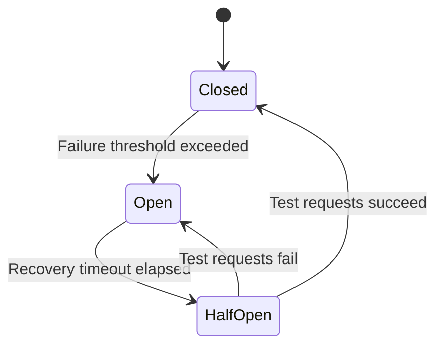
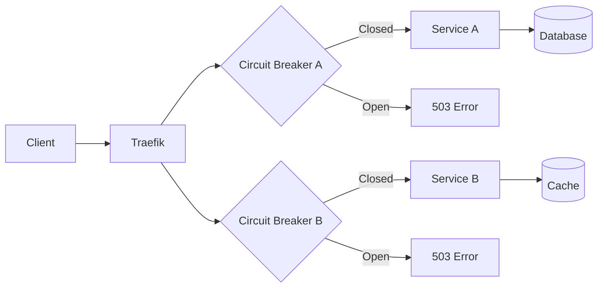

# How to Implement Circuit Breaker in Traefik

Author: [nawazdhandala](https://www.github.com/nawazdhandala)

Tags: Traefik, Circuit Breaker, Resilience, Microservices, Fault Tolerance

Description: Configure circuit breaker middleware in Traefik to protect your services from cascading failures, with practical examples and monitoring strategies.

---

When a downstream service fails, continuing to send requests to it wastes resources and can cascade failures throughout your system. The circuit breaker pattern addresses this by detecting failures and temporarily stopping requests to unhealthy services, giving them time to recover.

Traefik implements circuit breakers as middleware, letting you add resilience at the proxy layer without modifying application code.

## How Circuit Breakers Work

A circuit breaker has three states:

- **Closed**: Normal operation. Requests pass through, failures are counted.
- **Open**: Too many failures detected. Requests are rejected immediately without hitting the backend.
- **Half-Open**: After a timeout, some requests are allowed through to test if the service has recovered.



## Basic Circuit Breaker Configuration

Create a circuit breaker middleware that opens when error rates exceed 50%:

```yaml
# circuit-breaker-middleware.yaml
apiVersion: traefik.io/v1alpha1
kind: Middleware
metadata:
  name: circuit-breaker
  namespace: default
spec:
  circuitBreaker:
    # Expression that determines when the circuit opens
    # Opens when more than 50% of recent requests failed
    expression: NetworkErrorRatio() > 0.50
```

Apply it to a route:

```yaml
# protected-route.yaml
apiVersion: traefik.io/v1alpha1
kind: IngressRoute
metadata:
  name: api-with-breaker
  namespace: default
spec:
  entryPoints:
    - websecure
  routes:
    - match: Host(`api.example.com`)
      kind: Rule
      middlewares:
        - name: circuit-breaker
      services:
        - name: api-service
          port: 8080
  tls: {}
```

## Understanding the Expression Language

Traefik's circuit breaker uses expressions to define trip conditions. Available metrics include:

- `NetworkErrorRatio()`: Ratio of network errors (connection failures, timeouts)
- `ResponseCodeRatio(from, to, start, end)`: Ratio of responses with codes in [from, to) within [start, end) total responses
- `LatencyAtQuantileMS(quantile)`: Latency at the given quantile in milliseconds

### Examples of Common Expressions

```yaml
# Trip on high network error rate
apiVersion: traefik.io/v1alpha1
kind: Middleware
metadata:
  name: network-error-breaker
  namespace: default
spec:
  circuitBreaker:
    # Open circuit when 30% of requests fail with network errors
    expression: NetworkErrorRatio() > 0.30

---
# Trip on high HTTP 5xx rate
apiVersion: traefik.io/v1alpha1
kind: Middleware
metadata:
  name: server-error-breaker
  namespace: default
spec:
  circuitBreaker:
    # Open when more than 25% of responses are 5xx errors
    expression: ResponseCodeRatio(500, 600, 0, 600) > 0.25

---
# Trip on high latency
apiVersion: traefik.io/v1alpha1
kind: Middleware
metadata:
  name: latency-breaker
  namespace: default
spec:
  circuitBreaker:
    # Open when P95 latency exceeds 2 seconds
    expression: LatencyAtQuantileMS(95.0) > 2000

---
# Combined conditions
apiVersion: traefik.io/v1alpha1
kind: Middleware
metadata:
  name: combined-breaker
  namespace: default
spec:
  circuitBreaker:
    # Open on high errors OR high latency
    expression: NetworkErrorRatio() > 0.30 || LatencyAtQuantileMS(99.0) > 5000
```

## Configuring Recovery Parameters

Traefik 3.0 added configuration for recovery behavior:

```yaml
# recovery-config.yaml
apiVersion: traefik.io/v1alpha1
kind: Middleware
metadata:
  name: tuned-circuit-breaker
  namespace: default
spec:
  circuitBreaker:
    expression: NetworkErrorRatio() > 0.50
    # Duration to wait before transitioning to half-open
    checkPeriod: 10s
    # Duration circuit stays open before allowing test requests
    fallbackDuration: 30s
    # Duration to sample metrics for recovery check
    recoveryDuration: 60s
```

## Per-Service Circuit Breakers

Different services may need different sensitivity levels:

```yaml
# multi-service-breakers.yaml
# Critical payment service - very sensitive
apiVersion: traefik.io/v1alpha1
kind: Middleware
metadata:
  name: payment-breaker
  namespace: default
spec:
  circuitBreaker:
    expression: NetworkErrorRatio() > 0.10 || ResponseCodeRatio(500, 600, 0, 600) > 0.05
    fallbackDuration: 60s

---
# Non-critical recommendation service - more tolerant
apiVersion: traefik.io/v1alpha1
kind: Middleware
metadata:
  name: recommendations-breaker
  namespace: default
spec:
  circuitBreaker:
    expression: NetworkErrorRatio() > 0.50
    fallbackDuration: 15s

---
apiVersion: traefik.io/v1alpha1
kind: IngressRoute
metadata:
  name: services
  namespace: default
spec:
  entryPoints:
    - websecure
  routes:
    - match: Host(`api.example.com`) && PathPrefix(`/payments`)
      kind: Rule
      middlewares:
        - name: payment-breaker
      services:
        - name: payment-service
          port: 8080
    - match: Host(`api.example.com`) && PathPrefix(`/recommendations`)
      kind: Rule
      middlewares:
        - name: recommendations-breaker
      services:
        - name: recommendation-service
          port: 8080
  tls: {}
```

## Combining Circuit Breaker with Retry

Circuit breakers work well with retry middleware. Retries handle transient failures, while the circuit breaker prevents hammering a truly failing service:

```yaml
# breaker-with-retry.yaml
# Retry middleware for transient failures
apiVersion: traefik.io/v1alpha1
kind: Middleware
metadata:
  name: retry
  namespace: default
spec:
  retry:
    attempts: 3
    initialInterval: 100ms

---
# Circuit breaker for sustained failures
apiVersion: traefik.io/v1alpha1
kind: Middleware
metadata:
  name: circuit-breaker
  namespace: default
spec:
  circuitBreaker:
    expression: NetworkErrorRatio() > 0.50

---
apiVersion: traefik.io/v1alpha1
kind: IngressRoute
metadata:
  name: resilient-api
  namespace: default
spec:
  entryPoints:
    - websecure
  routes:
    - match: Host(`api.example.com`)
      kind: Rule
      middlewares:
        # Order matters: retry first, then circuit breaker
        - name: retry
        - name: circuit-breaker
      services:
        - name: api-service
          port: 8080
  tls: {}
```

## Handling Circuit Breaker Responses

When the circuit is open, Traefik returns HTTP 503 Service Unavailable. Your application should handle this gracefully:

```javascript
// Example client-side handling
async function fetchWithFallback(url) {
  try {
    const response = await fetch(url);

    if (response.status === 503) {
      // Circuit is open, use fallback
      console.log('Service temporarily unavailable, using cached data');
      return getCachedResponse(url);
    }

    return response.json();
  } catch (error) {
    // Network error, use fallback
    return getCachedResponse(url);
  }
}
```

## Monitoring Circuit Breaker State

Track circuit breaker activity through Traefik metrics:

```yaml
# Enable metrics in Traefik configuration
apiVersion: v1
kind: ConfigMap
metadata:
  name: traefik-config
  namespace: traefik
data:
  traefik.yaml: |
    metrics:
      prometheus:
        entryPoint: metrics
        addEntryPointsLabels: true
        addServicesLabels: true

    entryPoints:
      metrics:
        address: ":8082"
```

Query Prometheus for circuit breaker metrics:

```promql
# Track circuit breaker trips
increase(traefik_service_open_connections_count{service="api-service@kubernetes"}[5m])

# Monitor error ratios that trigger the breaker
sum(rate(traefik_service_requests_total{code=~"5.."}[5m]))
/
sum(rate(traefik_service_requests_total[5m]))
```

## Testing Circuit Breakers

Verify your circuit breaker configuration works:

```bash
# Deploy a test service that fails intermittently
kubectl run failing-app --image=kennethreitz/httpbin --port=80

# Configure it to return errors
# httpbin has endpoints like /status/500 that return specific codes

# Generate load with errors
for i in {1..100}; do
  # 30% of requests go to error endpoint
  if [ $((RANDOM % 10)) -lt 3 ]; then
    curl -s -o /dev/null -w "%{http_code}\n" https://api.example.com/status/500
  else
    curl -s -o /dev/null -w "%{http_code}\n" https://api.example.com/get
  fi
done

# Watch for 503 responses indicating open circuit
```

## Circuit Breaker vs Health Checks

Circuit breakers and health checks serve different purposes:

| Feature | Circuit Breaker | Health Check |
|---------|----------------|--------------|
| Trigger | Request failures | Dedicated probe |
| Scope | Per-client behavior | Server-wide status |
| Response | Fail fast (503) | Remove from pool |
| Recovery | Automatic after timeout | Automatic when healthy |

Use both together for comprehensive resilience:

```yaml
# combined-resilience.yaml
apiVersion: traefik.io/v1alpha1
kind: Middleware
metadata:
  name: circuit-breaker
  namespace: default
spec:
  circuitBreaker:
    expression: NetworkErrorRatio() > 0.50

---
apiVersion: traefik.io/v1alpha1
kind: IngressRoute
metadata:
  name: resilient-service
  namespace: default
spec:
  entryPoints:
    - websecure
  routes:
    - match: Host(`api.example.com`)
      kind: Rule
      middlewares:
        - name: circuit-breaker
      services:
        - name: api-service
          port: 8080
          # Health check removes unhealthy pods from rotation
          healthCheck:
            path: /health
            interval: 10s
            timeout: 3s
  tls: {}
```

## Architecture with Circuit Breakers



## Best Practices

1. **Set appropriate thresholds**: Too sensitive causes false positives; too lenient defeats the purpose
2. **Use combined expressions**: Check both error rates and latency for comprehensive detection
3. **Start with conservative settings**: Begin with higher thresholds and tune based on observations
4. **Monitor circuit state**: Alert when circuits open frequently
5. **Provide graceful degradation**: Have fallback responses ready for 503 errors
6. **Test in staging**: Verify circuit breakers work before production

---

Circuit breakers add a critical layer of resilience to your microservices architecture. By failing fast when downstream services are unhealthy, you prevent resource exhaustion and give failing services time to recover. Combined with retries and health checks, circuit breakers make your system significantly more robust.
