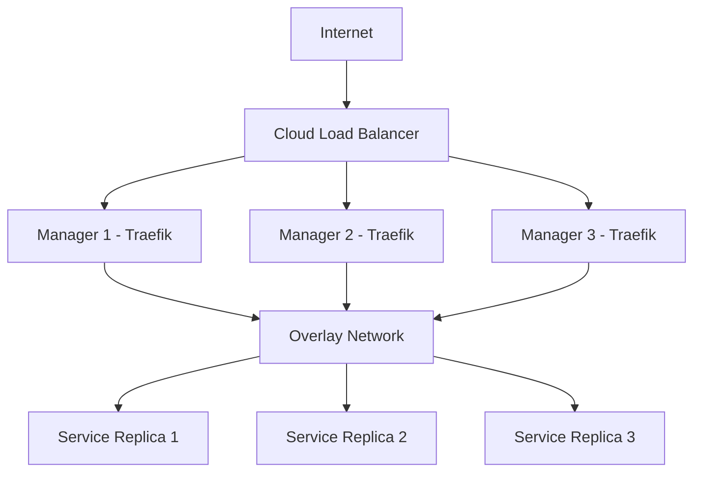

# How to Configure Traefik for Docker Swarm

Author: [nawazdhandala](https://www.github.com/nawazdhandala)

Tags: Traefik, Docker Swarm, Container Orchestration, Load Balancing, DevOps

Description: Deploy Traefik as an ingress controller for Docker Swarm, with automatic service discovery, rolling updates, and high availability configuration.

---

Docker Swarm provides built-in orchestration for containers, but it lacks a sophisticated ingress controller out of the box. Traefik fills this gap by automatically discovering Swarm services and routing traffic to them. Labels on your services tell Traefik how to route requests, eliminating manual configuration.

This guide walks through deploying Traefik on Docker Swarm with automatic HTTPS, service discovery, and production-ready settings.

## Prerequisites

You need a Docker Swarm cluster with at least one manager node. If you do not have one yet:

```bash
# Initialize a swarm on the manager node
docker swarm init --advertise-addr <manager-ip>

# Join worker nodes (run on each worker)
docker swarm join --token <token> <manager-ip>:2377
```

## Create a Network for Traefik

Services need to share a network with Traefik for routing to work:

```bash
# Create an overlay network for Traefik and services
docker network create --driver=overlay --attachable traefik-public
```

The `--attachable` flag allows standalone containers to connect, useful for debugging.

## Deploy Traefik as a Swarm Service

Create a Docker Compose file for the Traefik stack:

```yaml
# traefik-stack.yaml
version: "3.8"

services:
  traefik:
    image: traefik:v3.0
    command:
      # Enable Docker Swarm provider
      - --providers.docker=true
      - --providers.docker.swarmMode=true
      - --providers.docker.exposedbydefault=false
      - --providers.docker.network=traefik-public

      # Define entrypoints
      - --entrypoints.web.address=:80
      - --entrypoints.websecure.address=:443

      # Redirect HTTP to HTTPS
      - --entrypoints.web.http.redirections.entryPoint.to=websecure
      - --entrypoints.web.http.redirections.entryPoint.scheme=https

      # Let's Encrypt configuration
      - --certificatesresolvers.letsencrypt.acme.email=admin@example.com
      - --certificatesresolvers.letsencrypt.acme.storage=/letsencrypt/acme.json
      - --certificatesresolvers.letsencrypt.acme.httpchallenge.entrypoint=web

      # Enable dashboard (protect in production)
      - --api.dashboard=true

      # Logging
      - --log.level=INFO
      - --accesslog=true

    ports:
      # Publish ports in host mode for direct access
      - target: 80
        published: 80
        mode: host
      - target: 443
        published: 443
        mode: host

    volumes:
      # Docker socket for service discovery
      - /var/run/docker.sock:/var/run/docker.sock:ro
      # Persistent storage for certificates
      - traefik-certificates:/letsencrypt

    networks:
      - traefik-public

    deploy:
      mode: global  # Run on all manager nodes
      placement:
        constraints:
          # Only run on manager nodes (they have docker.sock)
          - node.role == manager
      labels:
        # Enable Traefik for this service
        - traefik.enable=true

        # Dashboard routing (protect with authentication)
        - traefik.http.routers.dashboard.rule=Host(`traefik.example.com`)
        - traefik.http.routers.dashboard.service=api@internal
        - traefik.http.routers.dashboard.entrypoints=websecure
        - traefik.http.routers.dashboard.tls.certresolver=letsencrypt

        # Basic auth for dashboard
        - traefik.http.middlewares.dashboard-auth.basicauth.users=admin:$$2y$$05$$hash
        - traefik.http.routers.dashboard.middlewares=dashboard-auth

        # Required for Swarm - define the service port
        - traefik.http.services.dashboard.loadbalancer.server.port=8080

networks:
  traefik-public:
    external: true

volumes:
  traefik-certificates:
```

Deploy the stack:

```bash
# Deploy Traefik to the swarm
docker stack deploy -c traefik-stack.yaml traefik
```

## Deploy a Sample Service

Now deploy an application that Traefik will automatically discover:

```yaml
# app-stack.yaml
version: "3.8"

services:
  webapp:
    image: nginx:alpine
    networks:
      - traefik-public
    deploy:
      replicas: 3
      labels:
        # Enable Traefik routing for this service
        - traefik.enable=true

        # Define the router
        - traefik.http.routers.webapp.rule=Host(`app.example.com`)
        - traefik.http.routers.webapp.entrypoints=websecure
        - traefik.http.routers.webapp.tls.certresolver=letsencrypt

        # Define the service (required for Swarm)
        - traefik.http.services.webapp.loadbalancer.server.port=80

        # Health check for load balancing
        - traefik.http.services.webapp.loadbalancer.healthcheck.path=/
        - traefik.http.services.webapp.loadbalancer.healthcheck.interval=10s

networks:
  traefik-public:
    external: true
```

Deploy the application:

```bash
# Deploy the web application
docker stack deploy -c app-stack.yaml myapp
```

## Understanding Swarm Labels

Labels on Swarm services configure Traefik routing. Here are the essential patterns:

```yaml
# Router configuration - determines how requests are matched
labels:
  # Basic host matching
  - traefik.http.routers.myrouter.rule=Host(`example.com`)

  # Path-based routing
  - traefik.http.routers.api.rule=Host(`example.com`) && PathPrefix(`/api`)

  # Multiple hosts
  - traefik.http.routers.multi.rule=Host(`example.com`) || Host(`www.example.com`)

  # Entry point selection
  - traefik.http.routers.myrouter.entrypoints=websecure

  # TLS configuration
  - traefik.http.routers.myrouter.tls=true
  - traefik.http.routers.myrouter.tls.certresolver=letsencrypt
```

```yaml
# Service configuration - defines the backend
labels:
  # Container port (required in Swarm mode)
  - traefik.http.services.myservice.loadbalancer.server.port=8080

  # Load balancer settings
  - traefik.http.services.myservice.loadbalancer.sticky.cookie=true
  - traefik.http.services.myservice.loadbalancer.sticky.cookie.name=server_id
```

## Middleware Configuration via Labels

Add middleware to Swarm services using labels:

```yaml
# middleware-examples.yaml
version: "3.8"

services:
  api:
    image: myapi:latest
    networks:
      - traefik-public
    deploy:
      labels:
        - traefik.enable=true
        - traefik.http.routers.api.rule=Host(`api.example.com`)
        - traefik.http.routers.api.entrypoints=websecure
        - traefik.http.routers.api.tls.certresolver=letsencrypt

        # Define rate limiting middleware
        - traefik.http.middlewares.api-ratelimit.ratelimit.average=100
        - traefik.http.middlewares.api-ratelimit.ratelimit.burst=50

        # Define headers middleware
        - traefik.http.middlewares.api-headers.headers.customrequestheaders.X-Forwarded-Proto=https

        # Chain middlewares on the router
        - traefik.http.routers.api.middlewares=api-ratelimit,api-headers

        - traefik.http.services.api.loadbalancer.server.port=8080

networks:
  traefik-public:
    external: true
```

## High Availability Configuration

For production, run Traefik on multiple manager nodes:

```yaml
# ha-traefik-stack.yaml
version: "3.8"

services:
  traefik:
    image: traefik:v3.0
    command:
      - --providers.docker=true
      - --providers.docker.swarmMode=true
      - --providers.docker.exposedbydefault=false
      - --providers.docker.network=traefik-public
      - --entrypoints.web.address=:80
      - --entrypoints.websecure.address=:443

      # Use distributed certificate storage for HA
      # Option 1: Consul
      # - --certificatesresolvers.letsencrypt.acme.storage=consul://consul:8500/traefik/acme

      # Option 2: File storage with shared volume (NFS)
      - --certificatesresolvers.letsencrypt.acme.storage=/letsencrypt/acme.json

      - --certificatesresolvers.letsencrypt.acme.httpchallenge.entrypoint=web

    ports:
      - target: 80
        published: 80
        mode: host
      - target: 443
        published: 443
        mode: host

    volumes:
      - /var/run/docker.sock:/var/run/docker.sock:ro
      # For HA: mount NFS volume or use distributed KV store
      - traefik-certificates:/letsencrypt

    networks:
      - traefik-public

    deploy:
      mode: global
      placement:
        constraints:
          - node.role == manager
      update_config:
        parallelism: 1
        delay: 10s
        failure_action: rollback
      restart_policy:
        condition: any
        delay: 5s
        max_attempts: 3

networks:
  traefik-public:
    external: true

volumes:
  traefik-certificates:
    driver: local
    # For HA: use NFS or cloud storage driver
    # driver_opts:
    #   type: nfs
    #   o: addr=nfs-server.example.com,rw
    #   device: ":/exports/traefik"
```

## Rolling Updates Without Downtime

Traefik handles rolling updates gracefully. Configure your services:

```yaml
# zero-downtime-deploy.yaml
version: "3.8"

services:
  webapp:
    image: myapp:v2
    networks:
      - traefik-public
    deploy:
      replicas: 3
      update_config:
        # Update one container at a time
        parallelism: 1
        # Wait between updates
        delay: 30s
        # Rollback if health checks fail
        failure_action: rollback
        # Time to wait for health check
        monitor: 60s
      labels:
        - traefik.enable=true
        - traefik.http.routers.webapp.rule=Host(`app.example.com`)
        - traefik.http.services.webapp.loadbalancer.server.port=80

        # Health check ensures traffic only goes to healthy containers
        - traefik.http.services.webapp.loadbalancer.healthcheck.path=/health
        - traefik.http.services.webapp.loadbalancer.healthcheck.interval=5s
        - traefik.http.services.webapp.loadbalancer.healthcheck.timeout=3s

networks:
  traefik-public:
    external: true
```

## Debugging Swarm Routing

When things do not work, check these common issues:

```bash
# Verify Traefik can see the service
docker service logs traefik_traefik

# Check service labels are correct
docker service inspect myapp_webapp --format '{{json .Spec.Labels}}' | jq

# Verify network connectivity
docker network inspect traefik-public

# Check service is running and healthy
docker service ps myapp_webapp

# Test from inside the network
docker run --rm --network traefik-public curlimages/curl \
  curl -H "Host: app.example.com" http://traefik_traefik
```

## Architecture Overview



## Production Checklist

1. **Network isolation**: Create separate networks for frontend and backend services
2. **Certificate storage**: Use distributed storage (Consul, etcd) for HA certificate management
3. **Access logs**: Enable and ship to your logging system
4. **Metrics**: Export Prometheus metrics for monitoring
5. **Security**: Protect the Docker socket and dashboard endpoint
6. **Health checks**: Configure health checks for all services
7. **Resource limits**: Set CPU and memory limits on all services

---

Traefik and Docker Swarm make a powerful combination for container orchestration. The label-based configuration keeps routing rules close to your service definitions, and automatic discovery means zero manual configuration when services scale or move between nodes.
