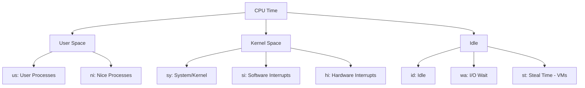
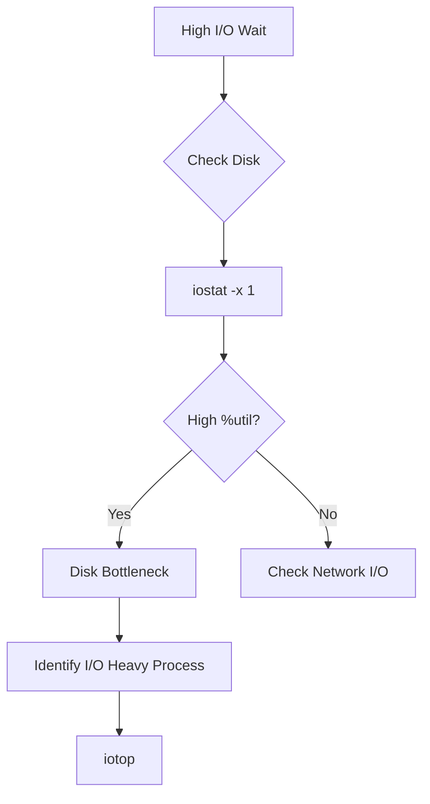

# How to Troubleshoot High CPU Usage in Linux

Author: [nawazdhandala](https://www.github.com/nawazdhandala)

Tags: Linux, System Administration, Performance, Troubleshooting, CPU, Monitoring, top, htop

Description: A systematic guide to identifying and resolving high CPU usage issues in Linux, including process analysis, profiling techniques, and optimization strategies.

---

High CPU usage can cripple system performance and user experience. This guide provides a systematic approach to identify the root cause and implement effective solutions.

## Understanding CPU Metrics



### Key CPU Metrics Explained

| Metric | Description | High Value Indicates |
|--------|-------------|---------------------|
| %us | User space processes | Application workload |
| %sy | Kernel operations | System calls, drivers |
| %ni | Nice (low priority) processes | Background tasks |
| %wa | Waiting for I/O | Disk/network bottleneck |
| %hi | Hardware interrupts | Hardware issues |
| %si | Software interrupts | Network processing |
| %st | Steal time (VMs) | Host overcommitment |
| %id | Idle | Available capacity |

## Quick Diagnosis Commands

```bash
# Real-time CPU overview
top -o %CPU

# Better interactive view
htop

# One-shot CPU stats
mpstat 1 5

# Per-CPU breakdown
mpstat -P ALL 1

# System load average
uptime
# Output: load average: 2.50, 3.10, 2.85
# These are 1, 5, and 15 minute averages

# Number of CPU cores (for context)
nproc
```

## Step-by-Step Troubleshooting

### Step 1: Identify the Scope

```bash
# Check overall system load
uptime

# Compare load average to CPU count
nproc
```

**Interpretation**: If load average exceeds the number of CPU cores, the system is overloaded.


### Step 2: Find the Top CPU Consumers

```bash
# Sort processes by CPU usage
ps aux --sort=-%cpu | head -20

# Real-time view with process tree
htop

# Top processes with refresh
top -b -n 1 | head -20

# Watch specific process
pidstat -u 1 5
```

**Output analysis**:

```
USER       PID %CPU %MEM    VSZ   RSS TTY      STAT START   TIME COMMAND
mysql    12345 95.0  5.0 2345678 512000 ?      Sl   10:00  45:30 /usr/sbin/mysqld
www-data 12346 45.0  2.0  500000 200000 ?      S    10:00  20:15 /usr/sbin/apache2
```

### Step 3: Analyze Process Behavior

```bash
# Get detailed info about a specific PID
ps -p 12345 -o pid,ppid,user,%cpu,%mem,stat,start,time,command

# Check what files the process has open
lsof -p 12345

# See system calls being made
strace -p 12345 -c
# Press Ctrl+C after a few seconds to see summary

# Check threads of a process
ps -T -p 12345

# Per-thread CPU usage
pidstat -t -p 12345 1
```

### Step 4: Determine CPU Usage Pattern

```bash
# Check if CPU is in user or kernel mode
vmstat 1 10
```

**Sample output**:

```
procs -----------memory---------- ---swap-- -----io---- -system-- ------cpu-----
 r  b   swpd   free   buff  cache   si   so    bi    bo   in   cs us sy id wa st
 5  0      0 500000  50000 2000000    0    0     5    10  500 1000 85  5 10  0  0
```

**Interpretation**:

| Pattern | Meaning | Action |
|---------|---------|--------|
| High us% | Application CPU bound | Profile application |
| High sy% | Kernel/system calls | Check syscalls, drivers |
| High wa% | I/O bottleneck | Check disk/network |
| High si% | Network heavy | Check network stack |
| High st% | VM resource contention | Contact cloud provider |

### Step 5: Profile the Offending Process

#### For Application Issues (High %us)

```bash
# Install perf (if not available)
sudo apt install linux-tools-common linux-tools-generic   # Debian/Ubuntu
sudo yum install perf                                      # RHEL/CentOS

# Profile the process for 30 seconds
sudo perf record -p 12345 -g -- sleep 30

# View the report
sudo perf report

# Quick summary of hotspots
sudo perf top -p 12345
```

#### For System Call Issues (High %sy)

```bash
# Trace system calls with summary
strace -p 12345 -c -f 2>&1 | head -30

# Sample output:
# % time     seconds  usecs/call     calls    errors syscall
# ------ ----------- ----------- --------- --------- ----------------
#  45.00    2.500000          50     50000           write
#  30.00    1.700000          17    100000           read
#  15.00    0.850000          85     10000           open
```

## Common Causes and Solutions

### Cause 1: Runaway Process

**Symptoms**: Single process using 100% CPU

```bash
# Identify the process
ps aux --sort=-%cpu | head -5

# Check if it's stuck in a loop
strace -p 12345 2>&1 | head -20
```

**Solutions**:

```bash
# Lower priority (nice value: -20 to 19, higher = lower priority)
sudo renice 19 -p 12345

# Limit CPU usage with cpulimit
sudo apt install cpulimit
sudo cpulimit -p 12345 -l 50    # Limit to 50% CPU

# Use cgroups for persistent limits
sudo cgcreate -g cpu:/limited
echo 50000 | sudo tee /sys/fs/cgroup/cpu/limited/cpu.cfs_quota_us
sudo cgclassify -g cpu:/limited 12345

# Kill the process if necessary
kill 12345        # Graceful
kill -9 12345     # Force
```

### Cause 2: Too Many Processes

**Symptoms**: Many processes each using moderate CPU

```bash
# Count processes by user
ps aux | awk '{print $1}' | sort | uniq -c | sort -rn

# Count by command
ps aux | awk '{print $11}' | sort | uniq -c | sort -rn | head -20
```

**Solutions**:

```bash
# Limit maximum processes per user
# Edit /etc/security/limits.conf
# Add: username hard nproc 100

# For services, use systemd limits
# In service file:
# [Service]
# LimitNPROC=100
```

### Cause 3: Fork Bomb or Infinite Spawning

**Symptoms**: Rapid process creation, system becomes unresponsive

```bash
# Check for rapid process creation
watch -n 0.5 'ps aux | wc -l'

# Find processes spawning children
ps auxf | less
```

**Solutions**:

```bash
# Kill all processes of a user
pkill -u problematic_user

# Set process limits (prevent future incidents)
# /etc/security/limits.conf
# *    hard    nproc    500
# root hard    nproc    unlimited
```

### Cause 4: High I/O Wait

**Symptoms**: High %wa in top/vmstat, CPU seems busy but processes are waiting



```bash
# Check I/O statistics
iostat -x 1 5

# Find processes doing most I/O
sudo iotop -o

# Check for processes in uninterruptible sleep (D state)
ps aux | awk '$8 ~ /D/'
```

**Solutions**:

```bash
# Reduce I/O priority of non-critical processes
ionice -c 3 -p 12345    # Idle class

# Check for disk issues
sudo smartctl -a /dev/sda

# Consider adding faster storage or more RAM for caching
```

### Cause 5: Kernel or Driver Issues

**Symptoms**: High %sy, kworker processes consuming CPU

```bash
# Check kernel worker processes
ps aux | grep kworker

# Identify which subsystem is busy
sudo perf top

# Check for hardware interrupt issues
watch -n 1 'cat /proc/interrupts'
```

**Solutions**:

```bash
# Update kernel and drivers
sudo apt update && sudo apt upgrade

# Check dmesg for errors
dmesg | grep -i error

# Disable problematic hardware if identified
# (varies by hardware type)
```

### Cause 6: Cryptocurrency Miner (Security Incident)

**Symptoms**: Unknown process using 100% CPU, often with suspicious names

```bash
# Find suspicious processes
ps aux --sort=-%cpu | head -10

# Check network connections
netstat -tulpn | grep 12345
ss -tulpn | grep 12345

# Check binary location
ls -la /proc/12345/exe

# Check for common miner indicators
ps aux | grep -iE 'xmrig|minerd|cpuminer|cryptonight'
```

**Solutions**:

```bash
# Kill the miner
kill -9 12345

# Find and remove the binary
rm -f /path/to/miner

# Check for persistence (cron, systemd, rc.local)
crontab -l
ls /etc/cron.d/
systemctl list-unit-files | grep enabled
cat /etc/rc.local

# Check for web shells (if web server)
find /var/www -name "*.php" -exec grep -l "eval\|base64_decode\|exec\|system" {} \;

# Update and patch system
sudo apt update && sudo apt upgrade
```

## Setting Up CPU Monitoring

### Using sar for Historical Data

```bash
# Install sysstat
sudo apt install sysstat

# Enable collection
sudo systemctl enable sysstat
sudo systemctl start sysstat

# View historical CPU data
sar -u    # Today
sar -u -f /var/log/sysstat/sa20    # Specific day (sa20 = 20th)

# CPU usage by hour
sar -u -s 09:00:00 -e 17:00:00
```

### Creating CPU Alerts

```bash
#!/bin/bash
# cpu_alert.sh - Alert when CPU exceeds threshold

THRESHOLD=90
EMAIL="admin@example.com"

# Get current CPU usage
CPU_USAGE=$(top -bn1 | grep "Cpu(s)" | awk '{print 100 - $8}' | cut -d. -f1)

if [ "$CPU_USAGE" -gt "$THRESHOLD" ]; then
    # Get top processes
    TOP_PROCS=$(ps aux --sort=-%cpu | head -10)

    # Send alert
    echo -e "CPU Usage: ${CPU_USAGE}%\n\nTop Processes:\n${TOP_PROCS}" | \
        mail -s "High CPU Alert: ${HOSTNAME}" "$EMAIL"
fi
```

Add to cron for regular checks:

```bash
# Run every 5 minutes
*/5 * * * * /usr/local/bin/cpu_alert.sh
```

## CPU Limiting and Control

### Using cgroups v2

```bash
# Create a cgroup for CPU-limited applications
sudo mkdir -p /sys/fs/cgroup/limited

# Set CPU limit to 50% of one core
echo "50000 100000" | sudo tee /sys/fs/cgroup/limited/cpu.max

# Move a process to this cgroup
echo 12345 | sudo tee /sys/fs/cgroup/limited/cgroup.procs

# Create systemd slice for persistent limits
# /etc/systemd/system/limited.slice
# [Slice]
# CPUQuota=50%
```

### Using nice and renice

```bash
# Start process with low priority
nice -n 19 ./my_background_task

# Change priority of running process
renice 10 -p 12345

# Nice values: -20 (highest priority) to 19 (lowest priority)
```

## Performance Tuning

### CPU Governor Settings

```bash
# Check current governor
cat /sys/devices/system/cpu/cpu0/cpufreq/scaling_governor

# List available governors
cat /sys/devices/system/cpu/cpu0/cpufreq/scaling_available_governors

# Set performance governor (maximum clock speed)
echo performance | sudo tee /sys/devices/system/cpu/cpu*/cpufreq/scaling_governor

# Set powersave (for laptops/energy savings)
echo powersave | sudo tee /sys/devices/system/cpu/cpu*/cpufreq/scaling_governor
```

### Process Affinity

```bash
# Check current affinity
taskset -p 12345

# Set process to run only on CPU 0 and 1
taskset -pc 0,1 12345

# Start process with specific CPU affinity
taskset -c 0-3 ./my_application
```

## Debugging Checklist

- [ ] Check system load with `uptime`
- [ ] Identify top CPU consumers with `ps aux --sort=-%cpu`
- [ ] Check CPU breakdown with `vmstat 1` (us/sy/wa/id)
- [ ] Profile heavy process with `perf top -p PID`
- [ ] Check for I/O issues with `iostat -x 1`
- [ ] Look for suspicious processes
- [ ] Review recent changes or deployments
- [ ] Check system logs with `dmesg` and `journalctl`

---

High CPU usage typically comes from application issues (high %us), system call overhead (high %sy), or I/O bottlenecks (high %wa). Start with `top` or `htop` to identify the culprit process, then use `perf` or `strace` to understand what it is doing. Most issues can be resolved by fixing application bugs, adding resources, or implementing proper resource limits.
