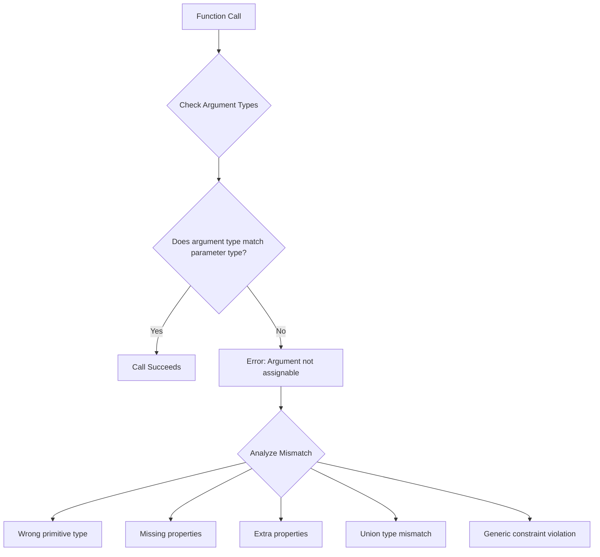
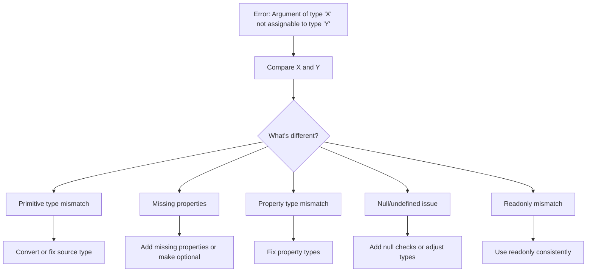
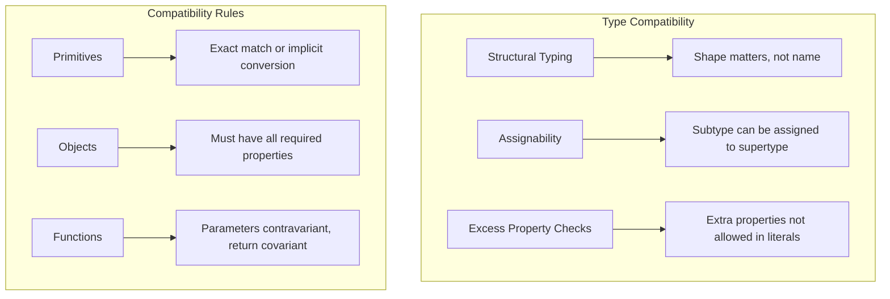
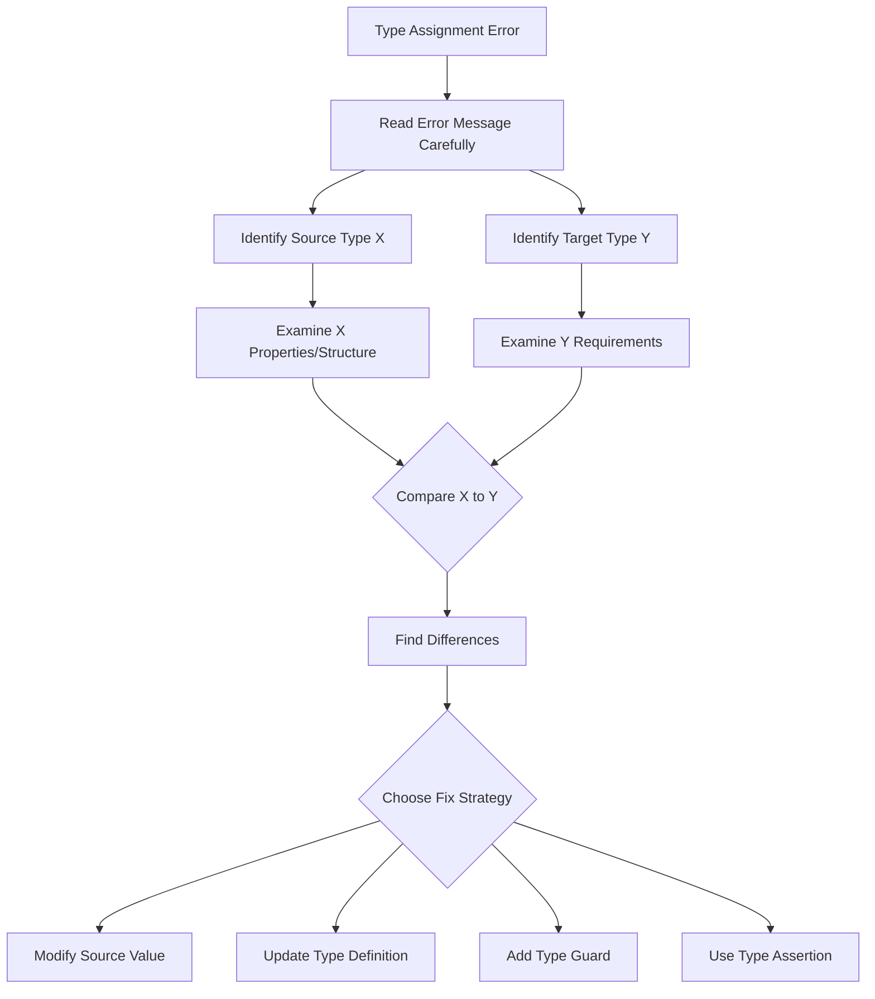

# How to Fix 'Argument of Type Not Assignable' Errors

Author: [nawazdhandala](https://www.github.com/nawazdhandala)

Tags: TypeScript, Error Handling, Type Errors, Debugging, Programming, Troubleshooting

Description: Learn how to diagnose and fix TypeScript 'Argument of type X is not assignable to parameter of type Y' errors with practical examples and solutions.

---

The "Argument of type X is not assignable to parameter of type Y" error is a common TypeScript error that occurs when you pass an argument that does not match the expected parameter type. This guide explains why these errors occur and how to fix them.

## Understanding the Error



This error occurs when TypeScript's type system detects that the type of an argument you are passing to a function does not match what the function expects.

## Common Scenarios and Solutions

### Scenario 1: Basic Type Mismatch

```typescript
// Function expecting a string
function greet(name: string): string {
    return `Hello, ${name}!`;
}

// Error: Argument of type 'number' is not assignable to parameter of type 'string'
// greet(42);

// Solution 1: Pass the correct type
greet("Alice");  // Works

// Solution 2: Convert the value
const userId = 42;
greet(String(userId));  // Works
greet(userId.toString());  // Works
```

### Scenario 2: Object Type Mismatch

```typescript
// Expected type
interface User {
    id: number;
    name: string;
    email: string;
}

function createUser(user: User): void {
    console.log(`Creating user: ${user.name}`);
}

// Error: Argument of type '{ id: number; name: string; }' is not
// assignable to parameter of type 'User'.
// Property 'email' is missing in type '{ id: number; name: string; }'
// createUser({ id: 1, name: "Alice" });

// Solution 1: Provide all required properties
createUser({
    id: 1,
    name: "Alice",
    email: "alice@example.com"
});

// Solution 2: Make properties optional if they should be
interface UserOptional {
    id: number;
    name: string;
    email?: string;  // Now optional
}

function createUserOptional(user: UserOptional): void {
    console.log(`Creating user: ${user.name}`);
}

createUserOptional({ id: 1, name: "Alice" });  // Works
```

### Scenario 3: Null and Undefined Mismatches

```typescript
// Function that doesn't accept null
function processValue(value: string): string {
    return value.toUpperCase();
}

let maybeString: string | null = "hello";

// Error: Argument of type 'string | null' is not assignable
// to parameter of type 'string'.
// Type 'null' is not assignable to type 'string'.
// processValue(maybeString);

// Solution 1: Null check before calling
if (maybeString !== null) {
    processValue(maybeString);  // Works - TypeScript knows it's string
}

// Solution 2: Non-null assertion (use carefully)
processValue(maybeString!);  // Works but risky if value is actually null

// Solution 3: Provide a default value
processValue(maybeString ?? "default");  // Works - always a string

// Solution 4: Update function to accept null
function processValueNullable(value: string | null): string {
    if (value === null) {
        return "";
    }
    return value.toUpperCase();
}

processValueNullable(maybeString);  // Works
```

## Error Analysis Flow



### Scenario 4: Array Type Mismatches

```typescript
// Function expecting specific array type
function processNumbers(numbers: number[]): number {
    return numbers.reduce((sum, n) => sum + n, 0);
}

// Mixed array
const mixed = [1, 2, "three", 4];  // Type: (string | number)[]

// Error: Argument of type '(string | number)[]' is not assignable
// to parameter of type 'number[]'.
// processNumbers(mixed);

// Solution 1: Filter to correct type
const numbersOnly = mixed.filter((item): item is number => typeof item === "number");
processNumbers(numbersOnly);  // Works

// Solution 2: Ensure array has correct type from start
const numbers: number[] = [1, 2, 3, 4];
processNumbers(numbers);  // Works

// Solution 3: Use type assertion (if you're certain)
processNumbers(mixed as number[]);  // Works but unsafe
```

### Scenario 5: Union Type Arguments

```typescript
// Function with union parameter
function formatValue(value: string | number): string {
    if (typeof value === "string") {
        return value.toUpperCase();
    }
    return value.toFixed(2);
}

// This works - both string and number are allowed
formatValue("hello");  // Works
formatValue(42);       // Works

// But a wider union type fails
type ExtendedValue = string | number | boolean;
const extended: ExtendedValue = true;

// Error: Argument of type 'ExtendedValue' is not assignable
// to parameter of type 'string | number'.
// Type 'boolean' is not assignable to type 'string | number'.
// formatValue(extended);

// Solution 1: Narrow the type before calling
if (typeof extended === "string" || typeof extended === "number") {
    formatValue(extended);  // Works
}

// Solution 2: Update function to accept broader type
function formatValueExtended(value: string | number | boolean): string {
    if (typeof value === "string") {
        return value.toUpperCase();
    }
    if (typeof value === "number") {
        return value.toFixed(2);
    }
    return value ? "true" : "false";
}

formatValueExtended(extended);  // Works
```

### Scenario 6: Generic Type Constraints

```typescript
// Generic function with constraint
interface HasLength {
    length: number;
}

function getLength<T extends HasLength>(item: T): number {
    return item.length;
}

// Works with types that have length property
getLength("hello");       // Works - string has length
getLength([1, 2, 3]);     // Works - array has length
getLength({ length: 5 }); // Works - object has length

// Error: Argument of type 'number' is not assignable to
// parameter of type 'HasLength'.
// getLength(42);

// Solution: Ensure argument satisfies constraint
const value = 42;
getLength(String(value));        // Works - convert to string
getLength(Array(value).fill(0)); // Works - convert to array
```

### Scenario 7: Callback Function Types

```typescript
// Function expecting a specific callback type
type Callback = (value: string) => void;

function processWithCallback(data: string, callback: Callback): void {
    callback(data);
}

// Error: Argument of type '(value: number) => void' is not assignable
// to parameter of type 'Callback'.
// Types of parameters 'value' and 'value' are incompatible.
// processWithCallback("test", (value: number) => console.log(value));

// Solution: Match the expected callback signature
processWithCallback("test", (value: string) => {
    console.log(value.toUpperCase());
});

// Or let TypeScript infer the parameter type
processWithCallback("test", (value) => {
    // value is inferred as string
    console.log(value);
});
```

## Type Compatibility Deep Dive



### Scenario 8: Excess Property Checks

```typescript
interface Point {
    x: number;
    y: number;
}

function drawPoint(point: Point): void {
    console.log(`Drawing at (${point.x}, ${point.y})`);
}

// Error with object literal - excess property check
// Error: Argument of type '{ x: number; y: number; z: number; }'
// is not assignable to parameter of type 'Point'.
// Object literal may only specify known properties
// drawPoint({ x: 1, y: 2, z: 3 });

// Solution 1: Remove the extra property
drawPoint({ x: 1, y: 2 });  // Works

// Solution 2: Use a variable (bypass excess property check)
const point3D = { x: 1, y: 2, z: 3 };
drawPoint(point3D);  // Works - no excess property check on variables

// Solution 3: Extend the interface
interface Point3D extends Point {
    z: number;
}

function drawPoint3D(point: Point3D): void {
    console.log(`Drawing at (${point.x}, ${point.y}, ${point.z})`);
}

// Solution 4: Add index signature
interface PointFlexible {
    x: number;
    y: number;
    [key: string]: number;  // Allow extra number properties
}
```

### Scenario 9: Readonly Mismatches

```typescript
// Function expecting mutable array
function addItem(items: string[]): void {
    items.push("new item");
}

// Readonly array
const readonlyItems: readonly string[] = ["a", "b", "c"];

// Error: Argument of type 'readonly string[]' is not assignable
// to parameter of type 'string[]'.
// The type 'readonly string[]' is 'readonly' and cannot be
// assigned to the mutable type 'string[]'.
// addItem(readonlyItems);

// Solution 1: Create mutable copy
addItem([...readonlyItems]);  // Works - spread creates mutable copy

// Solution 2: Update function to accept readonly
function addItemImmutable(items: readonly string[]): string[] {
    return [...items, "new item"];  // Return new array instead of mutating
}

addItemImmutable(readonlyItems);  // Works

// Solution 3: Use type assertion (if mutation won't happen)
function displayItems(items: string[]): void {
    // Only reads, doesn't mutate
    items.forEach(item => console.log(item));
}

displayItems(readonlyItems as string[]);  // Works but not ideal
```

### Scenario 10: Literal Types vs General Types

```typescript
// Function expecting literal type
type Status = "pending" | "approved" | "rejected";

function updateStatus(status: Status): void {
    console.log(`Status updated to: ${status}`);
}

// Regular string variable
let status = "pending";  // Type: string (not "pending")

// Error: Argument of type 'string' is not assignable
// to parameter of type 'Status'.
// updateStatus(status);

// Solution 1: Use const assertion
const statusConst = "pending" as const;  // Type: "pending"
updateStatus(statusConst);  // Works

// Solution 2: Type the variable explicitly
let statusTyped: Status = "pending";
updateStatus(statusTyped);  // Works

// Solution 3: Assert at call site
updateStatus(status as Status);  // Works but risky

// Solution 4: Validate at runtime
function isStatus(value: string): value is Status {
    return ["pending", "approved", "rejected"].includes(value);
}

if (isStatus(status)) {
    updateStatus(status);  // Works - type narrowed
}
```

## Debugging Strategy



## Quick Reference: Common Fixes

| Error Pattern | Likely Cause | Quick Fix |
|---------------|--------------|-----------|
| `'string' not assignable to 'number'` | Wrong primitive type | Convert with `Number()` or `String()` |
| `'X \| null' not assignable to 'X'` | Null not handled | Add null check or use `!` assertion |
| `'{ a }' not assignable to '{ a, b }'` | Missing property | Add missing property or make optional |
| `Object literal has extra properties` | Excess property check | Remove property or use variable |
| `'readonly T[]' not assignable to 'T[]'` | Readonly mismatch | Spread to copy or update function |
| `'string' not assignable to literal` | Literal type needed | Use `as const` or explicit type |
| `Callback parameter types differ` | Function signature mismatch | Match expected signature |

## Best Practices

1. **Read the full error message** - TypeScript provides detailed information
2. **Hover over variables in IDE** - See the actual inferred types
3. **Use explicit types** - When types are complex, be explicit
4. **Prefer narrowing over assertions** - Type guards are safer
5. **Update function signatures** - If arguments should be more flexible

```typescript
// Good practice: Validate external data
function processApiData(data: unknown): void {
    // Validate before using
    if (isValidData(data)) {
        // Now TypeScript knows the type
        handleData(data);
    }
}

// Good practice: Use generics for flexibility
function processItem<T>(item: T, processor: (value: T) => void): void {
    processor(item);
}

// Good practice: Explicit return types catch errors early
function createConfig(): Config {  // Return type specified
    return {
        // TypeScript will error if this doesn't match Config
        host: "localhost",
        port: 3000
    };
}
```

## Summary

The "Argument of type not assignable" error occurs when TypeScript detects a type mismatch between what you are passing and what is expected. To fix these errors:

1. **Understand the types** - Compare the source and target types
2. **Find the mismatch** - Is it a missing property, wrong type, or null issue?
3. **Choose the right fix** - Type narrowing, conversion, or updating definitions
4. **Avoid unsafe assertions** - Prefer type guards and proper type handling
5. **Use IDE tools** - Hover for type info, quick fixes for common issues

These errors are TypeScript protecting you from runtime bugs. Take time to understand and fix them properly rather than suppressing them with `any` or unsafe assertions.
