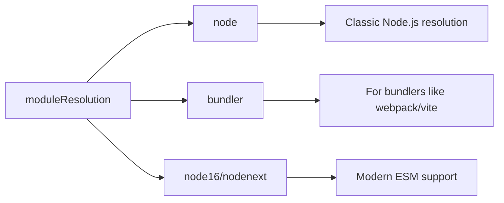

# How to Fix 'Cannot Find Module' Declaration Errors

Author: [nawazdhandala](https://www.github.com/nawazdhandala)

Tags: TypeScript, Module Resolution, Type Declarations, JavaScript, Node.js

Description: A practical guide to resolving TypeScript's 'Cannot find module' and module declaration errors with step-by-step solutions.

---

> The "Cannot find module" error in TypeScript can be frustrating, especially when your code runs fine in JavaScript. This error typically means TypeScript cannot locate type definitions for a module. This guide covers all the common causes and their solutions.

Understanding TypeScript's module resolution is key to fixing these errors. TypeScript needs either built-in types, a declaration file, or explicit type definitions to understand imported modules.

---

## Understanding the Error

```mermaid
flowchart TD
    A[Import Statement] --> B{TypeScript Searches}
    B --> C[Node modules with types]
    B --> D[@types packages]
    B --> E[Local .d.ts files]
    B --> F[Package's types field]

    C --> G{Found?}
    D --> G
    E --> G
    F --> G

    G -->|Yes| H[Import Succeeds]
    G -->|No| I[Cannot Find Module Error]
```

---

## Common Error Messages

```typescript
// Error: Cannot find module 'some-package' or its corresponding type declarations.
import something from 'some-package';

// Error: Could not find a declaration file for module 'some-package'.
// 'node_modules/some-package/index.js' implicitly has an 'any' type.
import something from 'some-package';

// Error: Cannot find module './myfile'.
import myModule from './myfile';

// Error: Cannot find module '@/components/Button'.
import Button from '@/components/Button';
```

---

## Solution 1: Install @types Package

Many popular packages have community-maintained type definitions in the DefinitelyTyped repository.

```bash
# Check if types exist
npm search @types/package-name

# Install types for common packages
npm install --save-dev @types/node
npm install --save-dev @types/express
npm install --save-dev @types/lodash
npm install --save-dev @types/react
npm install --save-dev @types/jest

# For yarn users
yarn add -D @types/node @types/express
```

```typescript
// After installing @types/lodash
import _ from 'lodash';  // Works - types are now available

const result = _.chunk([1, 2, 3, 4], 2);  // Type: number[][]
```

---

## Solution 2: Create Custom Declaration File

When no @types package exists, create your own type declarations.

### Basic Declaration File

```typescript
// src/types/some-package.d.ts
declare module 'some-package' {
    // Export what the module provides
    export function doSomething(input: string): string;
    export const version: string;

    interface Config {
        option1: boolean;
        option2: string;
    }

    export function configure(config: Config): void;

    // Default export
    export default function main(): void;
}
```

### Wildcard Module Declaration

For packages where you just want to suppress the error without full types.

```typescript
// src/types/declarations.d.ts

// Declare a specific module with 'any' type
declare module 'untyped-package';

// Declare all modules matching a pattern
declare module '*.svg' {
    const content: string;
    export default content;
}

declare module '*.png' {
    const content: string;
    export default content;
}

declare module '*.css' {
    const classes: { [key: string]: string };
    export default classes;
}

declare module '*.module.css' {
    const classes: { [key: string]: string };
    export default classes;
}

// JSON modules
declare module '*.json' {
    const value: unknown;
    export default value;
}
```

### Include Declaration Files in tsconfig.json

```json
{
    "compilerOptions": {
        "typeRoots": [
            "./src/types",
            "./node_modules/@types"
        ]
    },
    "include": [
        "src/**/*",
        "src/types/**/*.d.ts"
    ]
}
```

---

## Solution 3: Fix Module Resolution Settings

### Configure baseUrl and paths

```json
// tsconfig.json
{
    "compilerOptions": {
        "baseUrl": ".",
        "paths": {
            "@/*": ["src/*"],
            "@components/*": ["src/components/*"],
            "@utils/*": ["src/utils/*"],
            "@types/*": ["src/types/*"]
        },
        "moduleResolution": "node"
    }
}
```

```typescript
// Now these imports work
import Button from '@/components/Button';
import { formatDate } from '@utils/date';
```

### Module Resolution Modes



```json
// For Node.js projects
{
    "compilerOptions": {
        "moduleResolution": "node",
        "module": "commonjs"
    }
}

// For ESM Node.js projects (Node 16+)
{
    "compilerOptions": {
        "moduleResolution": "node16",
        "module": "node16"
    }
}

// For bundler-based projects (webpack, vite, etc.)
{
    "compilerOptions": {
        "moduleResolution": "bundler",
        "module": "esnext"
    }
}
```

---

## Solution 4: Fix File Extension Issues

TypeScript can be particular about file extensions, especially with ESM.

```typescript
// ERROR in ESM mode: Cannot find module './utils'
import { helper } from './utils';

// SOLUTION 1: Add .js extension (even for .ts files in ESM)
import { helper } from './utils.js';

// SOLUTION 2: Configure tsconfig to allow extensionless imports
// tsconfig.json
{
    "compilerOptions": {
        "moduleResolution": "bundler",
        "allowImportingTsExtensions": true
    }
}

// SOLUTION 3: Use the .ts extension directly (with allowImportingTsExtensions)
import { helper } from './utils.ts';
```

---

## Solution 5: Augment Existing Module Types

When a package has types but is missing some declarations.

```typescript
// src/types/express-augment.d.ts
import 'express';

declare module 'express' {
    interface Request {
        user?: {
            id: string;
            email: string;
            role: string;
        };
        sessionId?: string;
    }

    interface Response {
        success(data: unknown): void;
        error(message: string, code?: number): void;
    }
}
```

```typescript
// Now you can use the augmented types
import express from 'express';

const app = express();

app.use((req, res, next) => {
    req.user = { id: '123', email: 'user@test.com', role: 'admin' };
    next();
});

app.get('/profile', (req, res) => {
    // TypeScript knows req.user exists with correct shape
    res.json(req.user);
});
```

---

## Solution 6: Fix Package.json Configuration

For local packages or monorepo setups.

```json
// package.json of local package
{
    "name": "my-local-package",
    "main": "./dist/index.js",
    "types": "./dist/index.d.ts",
    "exports": {
        ".": {
            "types": "./dist/index.d.ts",
            "import": "./dist/index.mjs",
            "require": "./dist/index.js"
        },
        "./utils": {
            "types": "./dist/utils.d.ts",
            "import": "./dist/utils.mjs",
            "require": "./dist/utils.js"
        }
    }
}
```

---

## Troubleshooting Steps

```mermaid
flowchart TD
    A[Cannot Find Module Error] --> B{Is it installed?}
    B -->|No| C[npm install package-name]
    B -->|Yes| D{Has built-in types?}

    D -->|Yes| E[Check moduleResolution]
    D -->|No| F{@types available?}

    F -->|Yes| G[npm install @types/package]
    F -->|No| H[Create declaration file]

    E --> I{Still failing?}
    I -->|Yes| J[Check paths and baseUrl]
    J --> K[Check include/exclude in tsconfig]
```

### Step-by-Step Debugging

```bash
# 1. Verify package is installed
ls node_modules/package-name

# 2. Check if package has types
cat node_modules/package-name/package.json | grep types

# 3. Check if @types package exists
npm view @types/package-name

# 4. Verify TypeScript can find the file
npx tsc --traceResolution 2>&1 | grep "package-name"
```

### Common Configuration Issues

```json
// tsconfig.json - Correct configuration
{
    "compilerOptions": {
        "target": "ES2020",
        "module": "commonjs",
        "moduleResolution": "node",
        "esModuleInterop": true,
        "strict": true,
        "skipLibCheck": true,
        "forceConsistentCasingInFileNames": true,
        "resolveJsonModule": true,
        "declaration": true,
        "declarationMap": true,
        "baseUrl": ".",
        "paths": {
            "@/*": ["src/*"]
        },
        "typeRoots": [
            "./node_modules/@types",
            "./src/types"
        ]
    },
    "include": ["src/**/*"],
    "exclude": ["node_modules", "dist"]
}
```

---

## Specific Scenarios

### Importing JSON Files

```json
// tsconfig.json
{
    "compilerOptions": {
        "resolveJsonModule": true,
        "esModuleInterop": true
    }
}
```

```typescript
// Now JSON imports work with types
import config from './config.json';
console.log(config.apiUrl);  // TypeScript knows the shape
```

### Importing CSS Modules

```typescript
// src/types/css.d.ts
declare module '*.module.css' {
    const classes: { readonly [key: string]: string };
    export default classes;
}

declare module '*.module.scss' {
    const classes: { readonly [key: string]: string };
    export default classes;
}
```

```typescript
// Usage
import styles from './Button.module.css';
const className = styles.button;  // Type: string
```

### Importing Image Files

```typescript
// src/types/assets.d.ts
declare module '*.svg' {
    import React from 'react';
    const SVG: React.FC<React.SVGProps<SVGSVGElement>>;
    export default SVG;
}

declare module '*.png' {
    const src: string;
    export default src;
}

declare module '*.jpg' {
    const src: string;
    export default src;
}

declare module '*.webp' {
    const src: string;
    export default src;
}
```

### Node.js Built-in Modules

```typescript
// ERROR: Cannot find module 'fs' or 'path'

// SOLUTION: Install Node.js types
// npm install --save-dev @types/node

import fs from 'fs';
import path from 'path';
import { fileURLToPath } from 'url';

// For ESM, also configure tsconfig
// tsconfig.json
{
    "compilerOptions": {
        "module": "node16",
        "moduleResolution": "node16"
    }
}
```

---

## Creating Complete Type Definitions

For packages without types, create comprehensive declarations.

```typescript
// src/types/untyped-library.d.ts
declare module 'untyped-library' {
    // Named exports
    export interface Options {
        timeout?: number;
        retries?: number;
        debug?: boolean;
    }

    export interface Result<T> {
        success: boolean;
        data: T;
        error?: Error;
    }

    export function initialize(options?: Options): void;

    export function fetch<T>(url: string): Promise<Result<T>>;

    export function configure(key: string, value: unknown): void;

    // Class export
    export class Client {
        constructor(apiKey: string);
        get<T>(endpoint: string): Promise<T>;
        post<T>(endpoint: string, data: unknown): Promise<T>;
        close(): void;
    }

    // Default export
    interface Library {
        version: string;
        Client: typeof Client;
        initialize: typeof initialize;
        fetch: typeof fetch;
    }

    const lib: Library;
    export default lib;
}
```

---

## Best Practices

1. **Always install @types first** - Check DefinitelyTyped before writing custom declarations

2. **Use declaration files for untyped packages** - Better than using `// @ts-ignore`

3. **Keep custom types organized** - Use a dedicated `types` or `@types` directory

4. **Update typeRoots when adding custom types** - Ensure TypeScript can find your declarations

5. **Use strict mode** - Helps catch module resolution issues early

6. **Match moduleResolution to your runtime** - Use `node16` for Node.js, `bundler` for webpack/vite

---

## Conclusion

The "Cannot find module" error usually has a straightforward fix: install @types packages, create declaration files, or configure module resolution correctly. Understanding TypeScript's module resolution process helps you quickly identify and fix these issues.

When in doubt, use the `--traceResolution` flag to see exactly where TypeScript is looking for modules. This diagnostic output often reveals configuration issues that are not obvious from the error message alone.

---

*Need to monitor your TypeScript applications? [OneUptime](https://oneuptime.com) provides comprehensive monitoring and error tracking to catch issues in production.*

**Related Reading:**
- [How to Configure tsconfig.json Properly](https://oneuptime.com/blog)
- [How to Fix "Type 'X' Is Not Assignable to Type 'Y'" Errors](https://oneuptime.com/blog)
