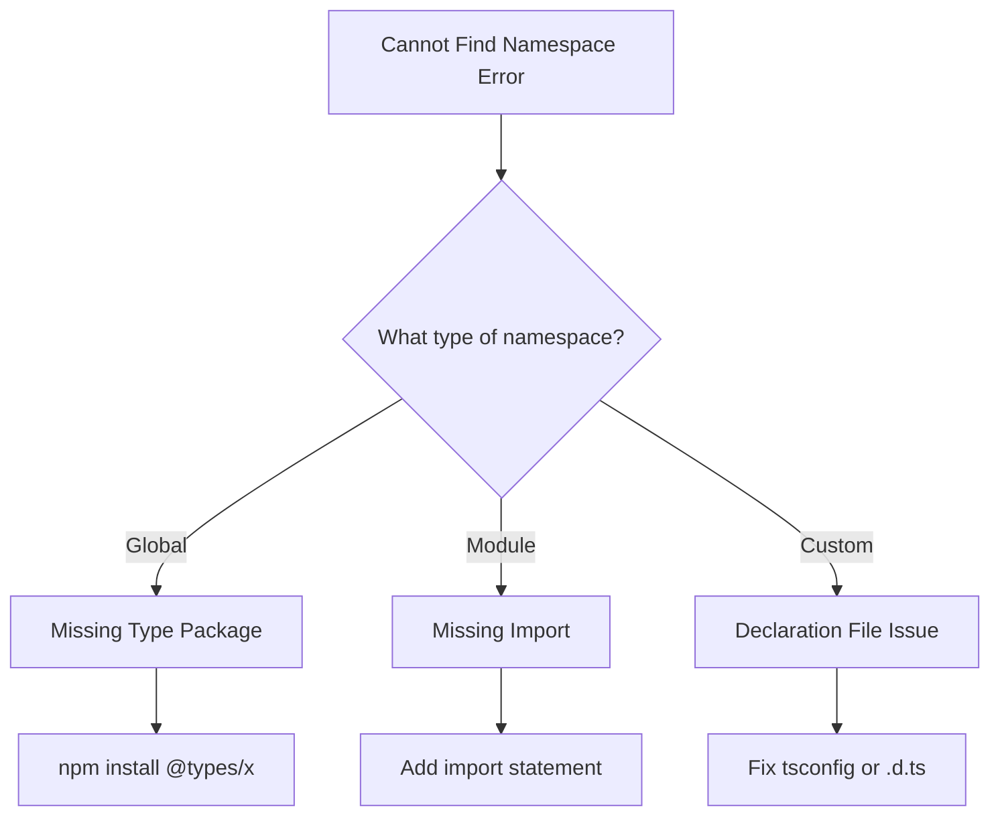
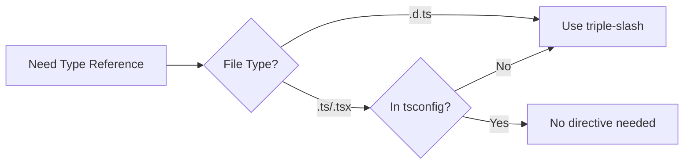
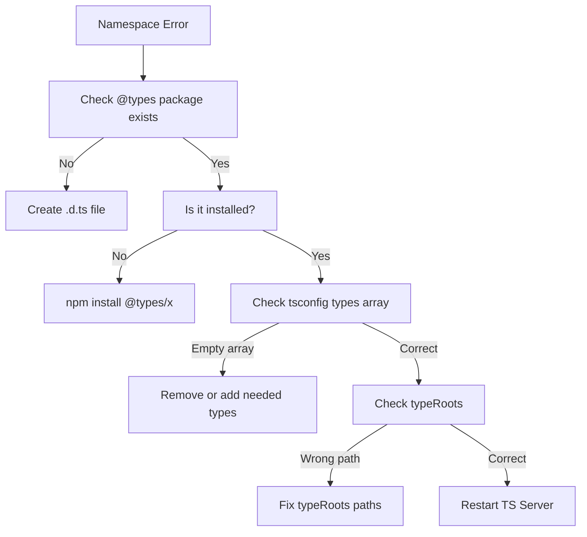

# How to Fix 'Cannot Find Namespace' Errors

Author: [nawazdhandala](https://www.github.com/nawazdhandala)

Tags: TypeScript, Namespaces, Modules, Error Handling, Configuration, Type Definitions

Description: A practical guide to diagnosing and fixing 'Cannot find namespace' errors in TypeScript projects, covering common causes and solutions.

---

The "Cannot find namespace 'X'" error is a common TypeScript frustration that usually indicates a configuration issue or missing type definitions. This guide walks through the most common causes and provides concrete solutions for each scenario.

## Understanding the Error

TypeScript namespaces are a way to organize code and avoid naming collisions. When you see "Cannot find namespace," it means TypeScript cannot locate the type definitions you are trying to reference.



### Common Error Messages

```typescript
// Error: Cannot find namespace 'React'
const element: React.ReactElement = <div />;

// Error: Cannot find namespace 'Express'
function handler(req: Express.Request) {}

// Error: Cannot find namespace 'NodeJS'
const timeout: NodeJS.Timeout = setTimeout(() => {}, 1000);
```

## Solution 1: Install Missing Type Packages

The most common cause is missing `@types` packages.

```bash
# Install types for common libraries
npm install --save-dev @types/node    # For NodeJS namespace
npm install --save-dev @types/react   # For React namespace
npm install --save-dev @types/express # For Express namespace

# Check if types exist for a package
npm search @types/your-package
```

### Verify Installation

```json
// package.json should include
{
    "devDependencies": {
        "@types/node": "^20.0.0",
        "@types/react": "^18.0.0",
        "@types/express": "^4.17.0"
    }
}
```

## Solution 2: Configure tsconfig.json Correctly

Your TypeScript configuration might not be finding the type definitions.

### Check typeRoots and types

```json
// tsconfig.json
{
    "compilerOptions": {
        // Specify where TypeScript looks for type definitions
        // Default is node_modules/@types
        "typeRoots": [
            "./node_modules/@types",
            "./src/types"
        ],

        // Specify which type packages to include
        // If omitted, all packages in typeRoots are included
        // If specified, ONLY these packages are included
        "types": ["node", "react", "jest"]
    }
}
```

### Common Configuration Mistake

```json
// WRONG: This limits types to only "jest"
{
    "compilerOptions": {
        "types": ["jest"]
    }
}
// Result: Cannot find namespace 'NodeJS' or 'React'

// CORRECT: Include all needed types or remove the option
{
    "compilerOptions": {
        "types": ["node", "react", "jest"]
    }
}
// Or simply remove "types" to include all available type packages
```

## Solution 3: Add Triple-Slash Directives

For some type definitions, you need explicit references.

```typescript
// At the top of your file
/// <reference types="node" />
/// <reference types="react" />

// Now these work
const buffer: NodeJS.ArrayBufferView = new Uint8Array();
const element: React.ReactNode = null;
```

### When to Use Triple-Slash Directives



## Solution 4: Fix Import Statements

Sometimes the issue is using namespace syntax when you should use imports.

```typescript
// WRONG: Using namespace syntax for ES modules
const axios: Axios.AxiosInstance = axios.create();

// CORRECT: Import the types
import axios, { AxiosInstance } from 'axios';
const instance: AxiosInstance = axios.create();

// WRONG: Namespace for React types
const props: React.ComponentProps<'button'> = {};

// CORRECT: Import React first
import React from 'react';
const props: React.ComponentProps<'button'> = {};

// Or import specific types
import { ComponentProps } from 'react';
const props: ComponentProps<'button'> = {};
```

## Solution 5: Create Missing Declaration Files

If no type package exists, create your own declarations.

```typescript
// src/types/untyped-library.d.ts

// Declare the namespace
declare namespace UntypedLibrary {
    interface Config {
        apiKey: string;
        debug?: boolean;
    }

    interface Client {
        connect(): Promise<void>;
        disconnect(): void;
        query<T>(sql: string): Promise<T[]>;
    }

    function createClient(config: Config): Client;
}

// Export the namespace for module usage
declare module 'untyped-library' {
    export = UntypedLibrary;
}
```

### Global Namespace Declaration

```typescript
// src/types/global.d.ts

// Extend global namespace
declare global {
    namespace MyApp {
        interface User {
            id: string;
            name: string;
            email: string;
        }

        interface AppConfig {
            apiUrl: string;
            features: string[];
        }

        type Environment = 'development' | 'staging' | 'production';
    }
}

// Required to make this a module
export {};
```

```typescript
// Usage anywhere in your project
const user: MyApp.User = {
    id: '123',
    name: 'John',
    email: 'john@example.com'
};

const env: MyApp.Environment = 'production';
```

## Solution 6: Handle JSX Namespace Issues

React projects often encounter JSX namespace errors.

```typescript
// Error: Cannot find namespace 'JSX'
const element: JSX.Element = <div />;
```

### Fix for React 17+

```json
// tsconfig.json
{
    "compilerOptions": {
        "jsx": "react-jsx",
        // or for development with fast refresh
        "jsx": "react-jsxdev"
    }
}
```

### Fix for Older React Versions

```json
// tsconfig.json
{
    "compilerOptions": {
        "jsx": "react"
    }
}
```

```typescript
// Must import React in every file using JSX
import React from 'react';

const element: JSX.Element = <div />;
```

## Solution 7: Module Resolution Issues

Namespace errors can stem from incorrect module resolution.

```json
// tsconfig.json
{
    "compilerOptions": {
        // For Node.js projects
        "moduleResolution": "node",

        // For modern bundlers (Vite, esbuild)
        "moduleResolution": "bundler",

        // Base URL for non-relative imports
        "baseUrl": ".",

        // Path mappings
        "paths": {
            "@types/*": ["src/types/*"],
            "@/*": ["src/*"]
        }
    }
}
```

## Real-World Scenarios

### Scenario 1: Express with Custom Request Properties

```typescript
// Error: Cannot find namespace 'Express'

// Step 1: Install types
// npm install --save-dev @types/express

// Step 2: Create augmentation file
// src/types/express.d.ts
import 'express';

declare global {
    namespace Express {
        interface Request {
            user?: {
                id: string;
                role: string;
            };
        }
    }
}

export {};

// Step 3: Use in your code
import { Request, Response } from 'express';

function authMiddleware(req: Request, res: Response, next: Function) {
    req.user = { id: '123', role: 'admin' };
    next();
}
```

### Scenario 2: Node.js Global Types

```typescript
// Error: Cannot find namespace 'NodeJS'

// Solution 1: Install @types/node
// npm install --save-dev @types/node

// Solution 2: Add to tsconfig
{
    "compilerOptions": {
        "types": ["node"]
    }
}

// Now these work
const timeout: NodeJS.Timeout = setTimeout(() => {}, 1000);
const processEnv: NodeJS.ProcessEnv = process.env;

// If you need specific Node.js globals
declare global {
    namespace NodeJS {
        interface ProcessEnv {
            NODE_ENV: 'development' | 'production' | 'test';
            API_KEY: string;
            DATABASE_URL: string;
        }
    }
}
```

### Scenario 3: Third-Party Library Without Types

```typescript
// Error: Cannot find namespace 'ChartJS'

// Create types/chartjs-plugin.d.ts
declare namespace ChartJS {
    interface ChartOptions {
        responsive: boolean;
        maintainAspectRatio: boolean;
        plugins?: PluginOptions;
    }

    interface PluginOptions {
        legend?: {
            display: boolean;
            position: 'top' | 'bottom' | 'left' | 'right';
        };
        tooltip?: {
            enabled: boolean;
        };
    }

    interface ChartData {
        labels: string[];
        datasets: Dataset[];
    }

    interface Dataset {
        label: string;
        data: number[];
        backgroundColor?: string | string[];
    }
}

declare module 'chartjs-plugin' {
    export = ChartJS;
}
```

## Debugging Checklist

When you encounter a namespace error, work through this checklist:



### Quick Fixes to Try

```bash
# 1. Delete node_modules and reinstall
rm -rf node_modules
npm install

# 2. Clear TypeScript cache
rm -rf .tsbuildinfo

# 3. Restart your IDE's TypeScript server
# VS Code: Cmd/Ctrl + Shift + P -> "TypeScript: Restart TS Server"
```

## Best Practices

### 1. Organize Custom Types

```
src/
├── types/
│   ├── index.d.ts      # Re-exports all types
│   ├── express.d.ts    # Express augmentations
│   ├── global.d.ts     # Global namespace extensions
│   └── vendors/        # Third-party library types
│       ├── legacy-lib.d.ts
│       └── untyped-api.d.ts
```

### 2. Use Module Augmentation Over Global

```typescript
// Prefer this (module augmentation)
declare module 'express' {
    interface Request {
        customProp: string;
    }
}

// Over this (global namespace)
declare global {
    namespace Express {
        interface Request {
            customProp: string;
        }
    }
}
```

### 3. Keep Types Close to Usage

```typescript
// For component-specific types, keep them in the same file
interface ButtonProps {
    variant: 'primary' | 'secondary';
    onClick: () => void;
}

function Button({ variant, onClick }: ButtonProps) {
    return <button className={variant} onClick={onClick} />;
}
```

### 4. Document Namespace Sources

```typescript
// types/vendor.d.ts

/**
 * Type definitions for legacy-vendor-lib v2.3.1
 * These types were manually created as no @types package exists
 * Last updated: 2026-01-24
 *
 * @see https://github.com/vendor/legacy-lib
 */
declare namespace LegacyVendor {
    // ... types
}
```

---

The "Cannot find namespace" error almost always comes down to missing type definitions or incorrect configuration. Start by checking if @types packages exist, verify your tsconfig.json settings, and create custom declarations when needed. With proper type organization and configuration, these errors become easy to diagnose and fix.
