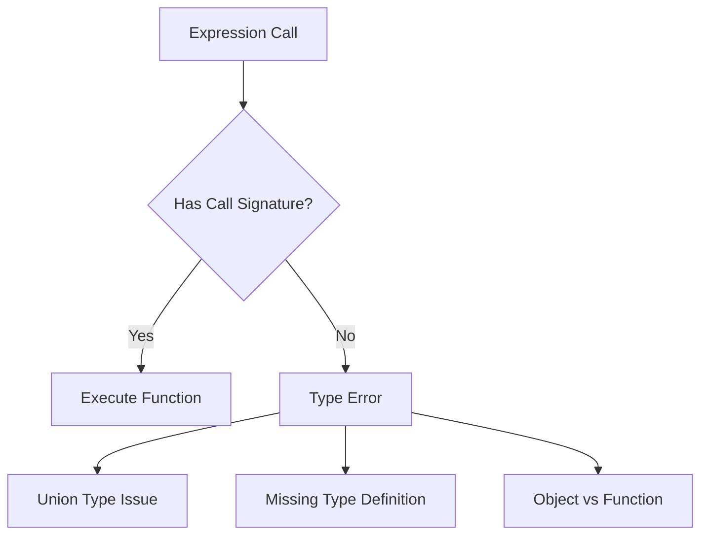
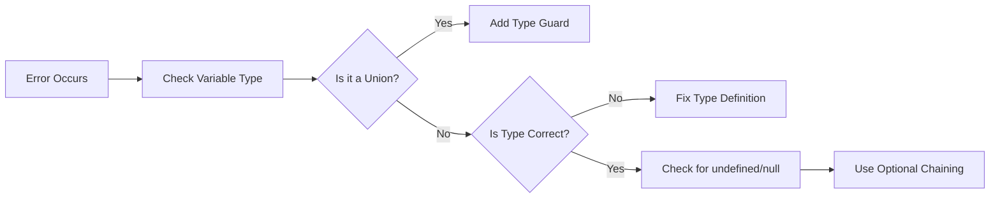

# How to Fix 'Cannot Invoke Expression' Errors

Author: [nawazdhandala](https://www.github.com/nawazdhandala)

Tags: TypeScript, JavaScript, Error Handling, Type Safety, Functions, Debugging

Description: A practical guide to understanding and fixing 'Cannot invoke an expression whose type lacks a call signature' errors in TypeScript.

---

If you have worked with TypeScript for any amount of time, you have probably encountered the frustrating error: "Cannot invoke an expression whose type lacks a call signature." This error occurs when TypeScript cannot determine that something is callable. Let's dive into why this happens and how to fix it.

## Understanding the Error

The error appears when you try to call something that TypeScript does not recognize as a function. This usually happens due to union types, incorrect type definitions, or missing type guards.



### The Basic Problem

Here is a simple example that triggers the error:

```typescript
// This will cause an error
const handler: Function | string = getHandler();
handler(); // Error: Cannot invoke an expression whose type lacks a call signature
```

TypeScript cannot call `handler` because it might be a `string`, and strings are not callable.

## Common Causes and Solutions

### Cause 1: Union Types with Non-Callable Members

The most common cause is union types that include non-callable types.

```typescript
// Problem: callback might be undefined
interface Config {
    onSuccess?: () => void;
    onError?: (err: Error) => void;
}

function processData(config: Config) {
    // Error: Cannot invoke an expression whose type lacks a call signature
    // config.onSuccess();  // This would fail

    // Solution: Check if the function exists first
    if (config.onSuccess) {
        config.onSuccess(); // Now TypeScript knows it's defined
    }

    // Or use optional chaining
    config.onError?.(new Error("Something went wrong"));
}
```

### Cause 2: Generic Function Types

When working with generics, TypeScript sometimes cannot infer that a type is callable.

```typescript
// Problem: T could be anything
function execute<T>(action: T) {
    // action(); // Error: Type 'T' has no call signatures
}

// Solution 1: Constrain the generic to be callable
function executeCallable<T extends (...args: any[]) => any>(action: T) {
    return action(); // Works because T must be a function
}

// Solution 2: Use a specific function type
type AnyFunction = (...args: unknown[]) => unknown;

function executeFunction<T extends AnyFunction>(action: T): ReturnType<T> {
    return action() as ReturnType<T>;
}

// Usage
const result = executeFunction(() => 42); // result is number
```

### Cause 3: Object Types vs Function Types

Sometimes you have an object that might have a callable method, but TypeScript cannot verify it.

```typescript
// Problem: Mixed object and function type
type Handler = {
    name: string;
} | {
    (event: Event): void;
};

function triggerHandler(handler: Handler, event: Event) {
    // handler(event); // Error: not all members are callable
}

// Solution: Use type guards to narrow the type
function isCallable(fn: unknown): fn is (event: Event) => void {
    return typeof fn === 'function';
}

function triggerHandlerFixed(handler: Handler, event: Event) {
    if (isCallable(handler)) {
        handler(event); // Works
    } else {
        console.log(`Handler ${handler.name} is not callable`);
    }
}
```

### Cause 4: Class Constructors and Instances

Confusing class types with instance types leads to this error.

```typescript
// Problem: Mixing class type and instance type
class Logger {
    log(message: string) {
        console.log(message);
    }
}

// Wrong: logger is an instance, not the class itself
function createLogger(logger: Logger) {
    // new logger(); // Error: 'Logger' is not a constructor
}

// Solution: Use the class constructor type
function createLoggerFixed(LoggerClass: new () => Logger) {
    return new LoggerClass(); // Works
}

// Or use typeof for the class itself
function createLoggerAlternative(LoggerClass: typeof Logger) {
    return new LoggerClass(); // Also works
}
```

## Advanced Patterns

### Pattern 1: Callable Objects

Sometimes you need objects that can be called like functions.

```typescript
// Define a callable interface
interface CallableValidator {
    (value: string): boolean;
    pattern: RegExp;
    errorMessage: string;
}

// Create a callable validator
function createValidator(pattern: RegExp, message: string): CallableValidator {
    const validator = ((value: string) => pattern.test(value)) as CallableValidator;
    validator.pattern = pattern;
    validator.errorMessage = message;
    return validator;
}

// Usage
const emailValidator = createValidator(
    /^[^\s@]+@[^\s@]+\.[^\s@]+$/,
    "Invalid email format"
);

// Both work
console.log(emailValidator("test@example.com")); // true (called as function)
console.log(emailValidator.errorMessage); // "Invalid email format" (accessed as object)
```

### Pattern 2: Overloaded Function Types

When dealing with overloaded functions, ensure all signatures are properly defined.

```typescript
// Define overloaded function type
interface DataProcessor {
    (data: string): string;
    (data: number): number;
    (data: string[]): string[];
}

// Implement with proper overloads
const processData: DataProcessor = ((data: string | number | string[]) => {
    if (typeof data === 'string') {
        return data.toUpperCase();
    }
    if (typeof data === 'number') {
        return data * 2;
    }
    return data.map(s => s.toUpperCase());
}) as DataProcessor;

// All these work
const str = processData("hello"); // "HELLO"
const num = processData(21); // 42
const arr = processData(["a", "b"]); // ["A", "B"]
```

### Pattern 3: Discriminated Unions with Functions

Use discriminated unions to safely handle different action types.

```typescript
// Define action types with discriminator
type Action =
    | { type: 'sync'; execute: () => void }
    | { type: 'async'; execute: () => Promise<void> }
    | { type: 'data'; payload: unknown };

async function handleAction(action: Action) {
    switch (action.type) {
        case 'sync':
            action.execute(); // TypeScript knows this is () => void
            break;
        case 'async':
            await action.execute(); // TypeScript knows this returns Promise
            break;
        case 'data':
            // No execute method here, handle data instead
            console.log(action.payload);
            break;
    }
}
```

## Working with Third-Party Libraries

### Handling Untyped Libraries

When using libraries without proper type definitions, you might encounter this error.

```typescript
// Problem: Library returns unknown type
import { getPlugin } from 'untyped-library';

const plugin = getPlugin('formatter');
// plugin(); // Error if plugin type is unknown

// Solution 1: Create a local type declaration
declare module 'untyped-library' {
    export function getPlugin(name: string): () => void;
}

// Solution 2: Assert the type at usage
const formatterPlugin = getPlugin('formatter') as () => string;
const result = formatterPlugin(); // Works

// Solution 3: Runtime validation
function isFunction(value: unknown): value is (...args: unknown[]) => unknown {
    return typeof value === 'function';
}

const dynamicPlugin = getPlugin('dynamic');
if (isFunction(dynamicPlugin)) {
    dynamicPlugin(); // Safe to call
}
```

### Fixing React Event Handler Issues

This error commonly appears in React when event handlers are not properly typed.

```typescript
import React from 'react';

// Problem: onClick might not be defined
interface ButtonProps {
    onClick?: React.MouseEventHandler<HTMLButtonElement>;
    label: string;
}

function Button({ onClick, label }: ButtonProps) {
    const handleClick: React.MouseEventHandler<HTMLButtonElement> = (event) => {
        // onClick(event); // Error: onClick might be undefined

        // Solution: Check before calling
        onClick?.(event);
    };

    return <button onClick={handleClick}>{label}</button>;
}
```

## Debugging Tips

When you encounter this error, follow these steps:



### Step 1: Hover to Check the Type

In your IDE, hover over the expression to see its inferred type. If it shows a union type like `string | (() => void)`, you need to narrow the type.

### Step 2: Add Type Guards

Use `typeof`, `instanceof`, or custom type guards to narrow types before calling.

```typescript
function safeCall(fn: unknown) {
    // Always validate before calling
    if (typeof fn === 'function') {
        return fn();
    }
    throw new Error('Expected a function');
}
```

### Step 3: Use Assertion Functions

For complex scenarios, assertion functions help narrow types.

```typescript
function assertIsFunction(value: unknown): asserts value is Function {
    if (typeof value !== 'function') {
        throw new TypeError(`Expected function, got ${typeof value}`);
    }
}

function callUnknown(maybeFunction: unknown) {
    assertIsFunction(maybeFunction);
    maybeFunction(); // TypeScript knows it's a function now
}
```

## Best Practices

1. **Avoid `Function` type** - Use specific function signatures like `() => void` or `(x: number) => string`

2. **Prefer optional chaining** - Use `callback?.()` instead of `callback && callback()`

3. **Create type guards** - Write reusable type guards for common patterns

4. **Use strict null checks** - Enable `strictNullChecks` in tsconfig to catch these issues early

5. **Define callback types explicitly** - Do not rely on inference for complex callback scenarios

---

The "Cannot invoke an expression" error is TypeScript protecting you from runtime errors. By understanding why it occurs and applying proper type narrowing techniques, you can write safer code that handles all possible cases. Remember that every time TypeScript shows this error, it is pointing out a potential bug in your code.
