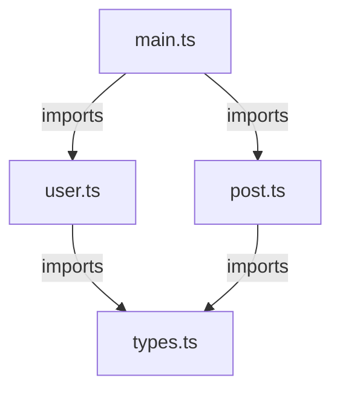

# How to Fix "Circular Reference" Type Errors

Author: [nawazdhandala](https://github.com/nawazdhandala)

Tags: TypeScript, Circular References, Type Errors, Module Design, Code Architecture, Debugging

Description: Learn how to identify, understand, and resolve circular reference type errors in TypeScript projects with practical refactoring strategies.

---

## Introduction

Circular reference errors in TypeScript occur when two or more types, modules, or files depend on each other in a way that creates an infinite loop. These errors can be cryptic and frustrating to debug. This guide explains the different types of circular references you might encounter and provides practical solutions for each scenario.

## Understanding Circular References

### What Are Circular References?

A circular reference occurs when A depends on B, and B depends on A (directly or indirectly). In TypeScript, this can happen at multiple levels:

1. **Type-level**: Types that reference each other
2. **Module-level**: Files that import from each other
3. **Runtime-level**: Objects that reference each other


### Common Error Messages

You might see errors like:

- `Type alias 'X' circularly references itself`
- `'X' is referenced directly or indirectly in its own type annotation`
- `Cannot access 'X' before initialization`
- `Type instantiation is excessively deep and possibly infinite`

## Type-Level Circular References

### Self-Referencing Types (Valid)

Some self-references are valid and useful, like recursive data structures:

```typescript
// Valid: Tree node that references itself
interface TreeNode {
  value: string;
  children: TreeNode[];
}

// Valid: Linked list node
interface ListNode<T> {
  value: T;
  next: ListNode<T> | null;
}

// Valid: JSON-like recursive type
type JsonValue =
  | string
  | number
  | boolean
  | null
  | JsonValue[]
  | { [key: string]: JsonValue };
```

### Invalid Circular Type Aliases

Type aliases cannot immediately reference themselves in their definition:

```typescript
// Error: Type alias 'BadType' circularly references itself
type BadType = {
  value: BadType;  // Direct circular reference without indirection
};

// Also invalid: Immediate self-reference in union
type Invalid = Invalid | string;
```

### Fixing Type Alias Circles

Use interfaces instead of type aliases for recursive structures:

```typescript
// Error with type alias
type Node = {
  children: Node[];
};

// Solution: Use interface
interface Node {
  children: Node[];
}

// Or use lazy evaluation with a function type
type LazyNode = {
  getChildren: () => LazyNode[];
};
```

## Mutually Recursive Types

### The Problem

When two types reference each other:

```typescript
// These might cause issues depending on usage
type User = {
  posts: Post[];  // References Post
};

type Post = {
  author: User;   // References User
};
```

### Solution: Interfaces

Interfaces handle mutual recursion better than type aliases:

```typescript
// Solution: Use interfaces for mutual recursion
interface User {
  id: string;
  name: string;
  posts: Post[];
}

interface Post {
  id: string;
  title: string;
  author: User;
}

// Now both can be used without errors
const user: User = {
  id: "1",
  name: "Alice",
  posts: []
};

const post: Post = {
  id: "p1",
  title: "Hello",
  author: user
};

user.posts.push(post);
```

### Complex Recursive Structures

For more complex scenarios, use generics to break the cycle:

```typescript
// Generic approach for flexible relationships
interface Entity<TRelations = unknown> {
  id: string;
  createdAt: Date;
  relations: TRelations;
}

interface UserRelations {
  posts: Entity<PostRelations>[];
  followers: Entity<UserRelations>[];
}

interface PostRelations {
  author: Entity<UserRelations>;
  comments: Entity<CommentRelations>[];
}

interface CommentRelations {
  author: Entity<UserRelations>;
  post: Entity<PostRelations>;
}

type User = Entity<UserRelations>;
type Post = Entity<PostRelations>;
type Comment = Entity<CommentRelations>;
```

## Module-Level Circular Imports

### Identifying the Problem

Module cycles often manifest as runtime errors:

```typescript
// user.ts
import { Post } from "./post";  // Imports Post

export interface User {
  id: string;
  posts: Post[];
}

export function createUser(name: string): User {
  return { id: crypto.randomUUID(), posts: [] };
}
```

```typescript
// post.ts
import { User, createUser } from "./user";  // Imports User and createUser

export interface Post {
  id: string;
  author: User;
}

// This might fail at runtime due to circular import
export function createPost(title: string): Post {
  const author = createUser("Anonymous");  // Error: createUser might be undefined
  return { id: crypto.randomUUID(), author };
}
```

### Solution 1: Extract Shared Types

Move shared types to a separate file:

```typescript
// types.ts - No imports from other local modules
export interface User {
  id: string;
  name: string;
  posts: Post[];
}

export interface Post {
  id: string;
  title: string;
  author: User;
}
```

```typescript
// user.ts
import { User, Post } from "./types";

export function createUser(name: string): User {
  return { id: crypto.randomUUID(), name, posts: [] };
}
```

```typescript
// post.ts
import { User, Post } from "./types";

export function createPost(title: string, author: User): Post {
  return { id: crypto.randomUUID(), title, author };
}
```



### Solution 2: Dependency Injection

Instead of importing directly, inject dependencies:

```typescript
// user-service.ts
import { User } from "./types";

export class UserService {
  createUser(name: string): User {
    return { id: crypto.randomUUID(), name, posts: [] };
  }
}
```

```typescript
// post-service.ts
import { Post, User } from "./types";

export class PostService {
  // Inject the dependency instead of importing it
  constructor(private createUser: (name: string) => User) {}

  createPost(title: string): Post {
    const author = this.createUser("Anonymous");
    return { id: crypto.randomUUID(), title, author };
  }
}
```

```typescript
// main.ts - Wire up dependencies here
import { UserService } from "./user-service";
import { PostService } from "./post-service";

const userService = new UserService();
const postService = new PostService((name) => userService.createUser(name));
```

### Solution 3: Import Type Only

When you only need types (not runtime values), use type-only imports:

```typescript
// post.ts
import type { User } from "./user";  // Type-only import

export interface Post {
  id: string;
  author: User;
}

// This works because User is only used as a type
```

Type-only imports are erased at compile time and do not create runtime dependencies.

## Deep Instantiation Errors

### The Problem

Complex generic types can cause "excessively deep" errors:

```typescript
// Error: Type instantiation is excessively deep and possibly infinite
type DeepNested<T> = {
  value: T;
  nested: DeepNested<DeepNested<T>>;
};
```

### Solution: Add Base Cases

Limit recursion depth with conditional types:

```typescript
// Add a depth limit using a counter tuple
type DeepNested<T, Depth extends unknown[] = []> =
  Depth["length"] extends 5
    ? T  // Base case: stop at depth 5
    : {
        value: T;
        nested: DeepNested<T, [...Depth, unknown]>;
      };

// Or use a simpler bounded recursion
type MaxDepth = [never, 0, 1, 2, 3, 4, 5];

type BoundedRecursive<T, D extends number = 5> = D extends 0
  ? T
  : {
      value: T;
      child: BoundedRecursive<T, MaxDepth[D]>;
    };
```

## Practical Refactoring Strategies

### Strategy 1: Barrel File Reorganization

Barrel files (index.ts) can hide circular dependencies. Restructure them:

```typescript
// Before: Single barrel with everything
// index.ts
export * from "./user";
export * from "./post";
export * from "./comment";

// After: Separate concerns
// types/index.ts - Only types, no runtime code
export * from "./user.types";
export * from "./post.types";
export * from "./comment.types";

// services/index.ts - Runtime code imports from types
export * from "./user.service";
export * from "./post.service";
export * from "./comment.service";
```

### Strategy 2: Interface Segregation

Split large interfaces to reduce coupling:

```typescript
// Before: Tightly coupled
interface User {
  id: string;
  profile: UserProfile;
  posts: Post[];
  comments: Comment[];
  followers: User[];
}

// After: Segregated interfaces
interface UserIdentity {
  id: string;
  profile: UserProfile;
}

interface UserContent {
  posts: Post[];
  comments: Comment[];
}

interface UserSocial {
  followers: UserIdentity[];
}

// Compose when needed
type FullUser = UserIdentity & UserContent & UserSocial;
```

### Strategy 3: Lazy Loading with Dynamic Imports

For runtime circular dependencies, use dynamic imports:

```typescript
// user.ts
export class User {
  async getPosts(): Promise<Post[]> {
    // Lazy load to break the cycle
    const { Post } = await import("./post");
    return Post.findByUserId(this.id);
  }
}
```

## Detecting Circular Dependencies

### Using madge

Install and run madge to visualize dependencies:

```bash
npm install -D madge

# Check for circular dependencies
npx madge --circular --extensions ts src/

# Generate a visual graph
npx madge --image graph.svg --extensions ts src/
```

### Using ESLint

Configure the import plugin to catch cycles:

```json
{
  "plugins": ["import"],
  "rules": {
    "import/no-cycle": ["error", { "maxDepth": 10 }]
  }
}
```

### TypeScript Compiler Checks

Enable strict checks that help catch issues early:

```json
{
  "compilerOptions": {
    "strict": true,
    "noImplicitAny": true,
    "strictNullChecks": true
  }
}
```

## Real-World Example: Fixing a Circular Dependency

### Before: Circular Structure

```typescript
// models/user.ts
import { Order } from "./order";

export class User {
  orders: Order[] = [];

  addOrder(order: Order) {
    this.orders.push(order);
    order.setUser(this);  // Circular runtime dependency
  }
}
```

```typescript
// models/order.ts
import { User } from "./user";

export class Order {
  user?: User;

  setUser(user: User) {
    this.user = user;
  }

  getOrderSummary() {
    return `Order for ${this.user?.name}`;  // Needs User
  }
}
```

### After: Refactored Structure

```typescript
// models/types.ts
export interface IUser {
  id: string;
  name: string;
}

export interface IOrder {
  id: string;
  userId: string;
  items: string[];
}
```

```typescript
// models/user.ts
import { IUser, IOrder } from "./types";

export class User implements IUser {
  constructor(
    public id: string,
    public name: string
  ) {}
}
```

```typescript
// models/order.ts
import { IOrder } from "./types";

export class Order implements IOrder {
  constructor(
    public id: string,
    public userId: string,
    public items: string[]
  ) {}
}
```

```typescript
// services/order-service.ts
import { User } from "../models/user";
import { Order } from "../models/order";

export class OrderService {
  private orders = new Map<string, Order[]>();

  addOrder(user: User, order: Order) {
    const userOrders = this.orders.get(user.id) || [];
    userOrders.push(order);
    this.orders.set(user.id, userOrders);
  }

  getOrdersForUser(userId: string): Order[] {
    return this.orders.get(userId) || [];
  }
}
```

## Best Practices

### Design Principles

1. **Single Responsibility**: Each module should have one reason to change
2. **Dependency Inversion**: Depend on abstractions, not concrete implementations
3. **Interface Segregation**: Keep interfaces small and focused
4. **Acyclic Dependencies**: Structure code so dependencies flow in one direction

### Code Organization Tips

1. Keep types separate from implementations
2. Use barrel files carefully and avoid re-exporting everything
3. Prefer composition over inheritance
4. Use dependency injection for complex relationships
5. Run circular dependency checks in CI/CD

## Conclusion

Circular reference errors in TypeScript can be challenging, but they often indicate architectural issues that are worth addressing. By understanding the different types of circular references and applying the appropriate solutions, you can create cleaner, more maintainable code.

Key takeaways:

1. Use interfaces for recursive and mutually recursive types
2. Extract shared types to break module cycles
3. Use type-only imports when you only need types at compile time
4. Apply dependency injection to decouple runtime dependencies
5. Use tools like madge and ESLint to detect cycles early
6. Design your module structure to have one-way dependency flow

Fixing circular references often leads to better code organization and clearer separation of concerns.
