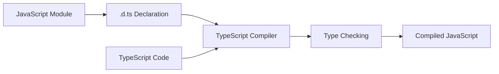
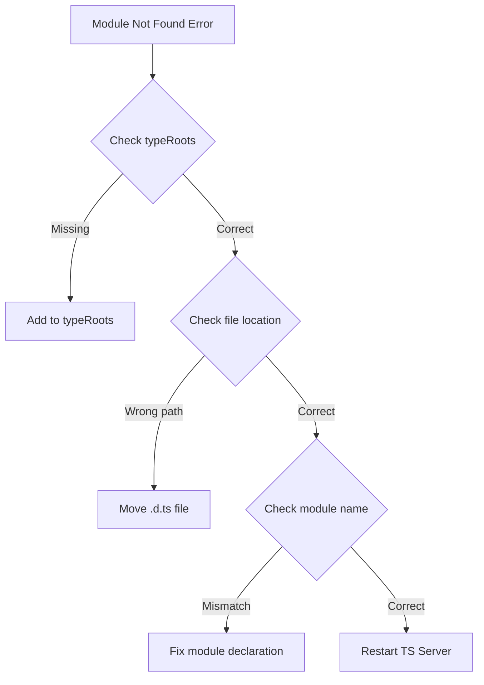

# How to Configure TypeScript Declaration Files

Author: [nawazdhandala](https://www.github.com/nawazdhandala)

Tags: TypeScript, Declaration Files, Type Definitions, d.ts, Module Types, Configuration

Description: A comprehensive guide to creating, configuring, and managing TypeScript declaration files for libraries, modules, and global types.

---

Declaration files (`.d.ts`) are TypeScript's way of describing the shape of JavaScript code. They provide type information for libraries that were not written in TypeScript, allowing you to use them with full type safety. This guide covers everything from basic configuration to advanced patterns.

## Understanding Declaration Files

Declaration files contain only type information, no actual implementation. They tell TypeScript what types exist in JavaScript modules.



### Basic Structure

```typescript
// types.d.ts
// Declare a module's exports
declare module 'my-library' {
    export function doSomething(input: string): number;
    export const version: string;
    export interface Config {
        debug: boolean;
        timeout: number;
    }
}
```

## Configuration in tsconfig.json

### Essential Compiler Options

```json
{
    "compilerOptions": {
        // Where to look for declaration files
        "typeRoots": ["./node_modules/@types", "./src/types"],

        // Specific types to include (leave empty for all)
        "types": ["node", "jest"],

        // Generate declaration files for your code
        "declaration": true,
        "declarationDir": "./dist/types",

        // Generate source maps for declarations
        "declarationMap": true,

        // Skip type checking of declaration files (faster builds)
        "skipLibCheck": true
    },

    // Include your custom declaration files
    "include": [
        "src/**/*.ts",
        "src/**/*.d.ts",
        "types/**/*.d.ts"
    ]
}
```

### Type Root Organization

```
project/
├── src/
│   └── index.ts
├── types/
│   ├── global.d.ts
│   ├── custom-module.d.ts
│   └── augmentations.d.ts
├── node_modules/
│   └── @types/
│       ├── node/
│       └── jest/
└── tsconfig.json
```

## Creating Declaration Files

### For Untyped npm Packages

When using a JavaScript package without types, create a declaration file.

```typescript
// types/legacy-utils.d.ts

// Declare the module and its exports
declare module 'legacy-utils' {
    // Export a function
    export function formatDate(date: Date, format: string): string;

    // Export a class
    export class Logger {
        constructor(prefix: string);
        log(message: string): void;
        error(message: string): void;
        setLevel(level: 'debug' | 'info' | 'warn' | 'error'): void;
    }

    // Export an interface for configuration
    export interface UtilsConfig {
        locale: string;
        timezone: string;
        debug?: boolean;
    }

    // Export a constant
    export const VERSION: string;

    // Default export
    export default function init(config: UtilsConfig): void;
}
```

### For Wildcard Module Patterns

Handle modules that match a pattern, like CSS or image imports.

```typescript
// types/assets.d.ts

// CSS modules
declare module '*.module.css' {
    const classes: { readonly [key: string]: string };
    export default classes;
}

// Regular CSS (no exports)
declare module '*.css' {
    const content: string;
    export default content;
}

// Image imports
declare module '*.png' {
    const src: string;
    export default src;
}

declare module '*.svg' {
    import React from 'react';
    const SVG: React.FC<React.SVGProps<SVGSVGElement>>;
    export default SVG;
}

// JSON imports
declare module '*.json' {
    const value: unknown;
    export default value;
}
```

### For Global Variables

Declare global variables that exist at runtime.

```typescript
// types/global.d.ts

// Extend the global scope
declare global {
    // Global variable
    const __DEV__: boolean;
    const __VERSION__: string;

    // Global function
    function gtag(command: string, ...args: unknown[]): void;

    // Extend Window interface
    interface Window {
        analytics: {
            track(event: string, properties?: Record<string, unknown>): void;
            identify(userId: string): void;
        };

        // Feature flags
        featureFlags: {
            isEnabled(flag: string): boolean;
        };
    }
}

// This export is required to make this a module
export {};
```

## Advanced Declaration Patterns

### Module Augmentation

Extend existing modules with additional types.

```typescript
// types/express-augmentation.d.ts
import 'express';

declare module 'express' {
    // Extend the Request interface
    interface Request {
        user?: {
            id: string;
            email: string;
            roles: string[];
        };
        requestId: string;
    }

    // Extend the Response interface
    interface Response {
        success<T>(data: T): void;
        error(message: string, statusCode?: number): void;
    }
}
```

```typescript
// Usage in your Express app
import express, { Request, Response } from 'express';

const app = express();

app.get('/profile', (req: Request, res: Response) => {
    // req.user is now recognized
    if (req.user) {
        res.success({ email: req.user.email });
    } else {
        res.error('Not authenticated', 401);
    }
});
```

### Generic Module Declarations

Create flexible type declarations that work with generics.

```typescript
// types/data-store.d.ts
declare module 'data-store' {
    // Generic class declaration
    export class Store<T> {
        constructor(initialState: T);
        getState(): T;
        setState(newState: Partial<T>): void;
        subscribe(listener: (state: T) => void): () => void;
    }

    // Generic function declaration
    export function createStore<T>(
        initialState: T,
        options?: StoreOptions
    ): Store<T>;

    // Options interface
    export interface StoreOptions {
        persist?: boolean;
        storageKey?: string;
    }
}
```

### Conditional Type Declarations

Handle modules that behave differently based on configuration.

```typescript
// types/config-aware.d.ts
declare module 'config-aware' {
    // Base configuration
    interface BaseConfig {
        apiUrl: string;
        timeout: number;
    }

    // Development-specific
    interface DevConfig extends BaseConfig {
        debug: true;
        mockData: boolean;
        logLevel: 'debug' | 'verbose';
    }

    // Production-specific
    interface ProdConfig extends BaseConfig {
        debug: false;
        analytics: {
            trackingId: string;
            enabled: boolean;
        };
    }

    // Conditional export based on NODE_ENV
    type Config = typeof process.env.NODE_ENV extends 'production'
        ? ProdConfig
        : DevConfig;

    export function getConfig(): Config;
    export function configure(config: Partial<Config>): void;
}
```

### Overloaded Function Declarations

Declare functions with multiple signatures.

```typescript
// types/query-builder.d.ts
declare module 'query-builder' {
    interface QueryBuilder {
        // Multiple overloads for select
        select(columns: string[]): QueryBuilder;
        select(...columns: string[]): QueryBuilder;
        select(column: string): QueryBuilder;

        // Overloaded where clause
        where(column: string, value: unknown): QueryBuilder;
        where(column: string, operator: string, value: unknown): QueryBuilder;
        where(conditions: Record<string, unknown>): QueryBuilder;

        // Execute methods
        execute(): Promise<unknown[]>;
        first(): Promise<unknown | null>;
        count(): Promise<number>;
    }

    export function table(name: string): QueryBuilder;
    export function raw(sql: string, bindings?: unknown[]): QueryBuilder;
}
```

## Publishing Declaration Files

### For Your Own npm Package

Configure your package to include declaration files.

```json
// package.json
{
    "name": "my-package",
    "version": "1.0.0",
    "main": "dist/index.js",
    "types": "dist/index.d.ts",
    "files": [
        "dist/**/*.js",
        "dist/**/*.d.ts"
    ]
}
```

```json
// tsconfig.json for library
{
    "compilerOptions": {
        "declaration": true,
        "declarationMap": true,
        "outDir": "./dist",
        "rootDir": "./src",
        "strict": true
    },
    "include": ["src/**/*"]
}
```

### Contributing to DefinitelyTyped

When creating types for community packages, follow these patterns.

```typescript
// index.d.ts template for DefinitelyTyped

// Type definitions for some-package 1.0
// Project: https://github.com/example/some-package
// Definitions by: Your Name <https://github.com/yourusername>
// Definitions: https://github.com/DefinitelyTyped/DefinitelyTyped

/// <reference types="node" />

export interface Options {
    timeout?: number;
    retries?: number;
}

export function initialize(options?: Options): void;
export function process(data: Buffer): Promise<Buffer>;

export as namespace SomePackage;
```

## Troubleshooting Common Issues

### Module Not Found



### Declaration File Not Being Used

```typescript
// Problem: Types not being recognized

// Solution 1: Ensure file is in include pattern
// tsconfig.json
{
    "include": ["src/**/*", "types/**/*.d.ts"]
}

// Solution 2: Add triple-slash reference
/// <reference path="./types/custom.d.ts" />

// Solution 3: Import the declaration file
import './types/global';
```

### Conflicting Declarations

```typescript
// Problem: Multiple declaration files for same module

// Solution: Use declare module to merge
// types/lodash-extensions.d.ts
import 'lodash';

declare module 'lodash' {
    interface LoDashStatic {
        customMethod(value: string): string;
    }
}
```

### Type Inference Issues

```typescript
// Problem: Inferred types too wide

// Solution: Use const assertions in declarations
declare module 'constants' {
    export const MODES: readonly ['read', 'write', 'append'];
    export type Mode = typeof MODES[number]; // 'read' | 'write' | 'append'
}
```

## Best Practices

### 1. Keep Declarations Close to Usage

```
src/
├── components/
│   ├── Button.tsx
│   └── Button.d.ts  // Component-specific types
├── utils/
│   ├── helpers.ts
│   └── helpers.d.ts
└── types/
    └── global.d.ts   // Global types only
```

### 2. Use Strict Typing

```typescript
// Avoid
declare module 'loose-types' {
    export function process(data: any): any;
}

// Prefer
declare module 'strict-types' {
    export function process<T extends Record<string, unknown>>(
        data: T
    ): ProcessResult<T>;

    interface ProcessResult<T> {
        success: boolean;
        data: T;
        errors?: string[];
    }
}
```

### 3. Document Complex Types

```typescript
// types/complex-api.d.ts
declare module 'complex-api' {
    /**
     * Configuration for the API client
     * @example
     * const client = createClient({
     *   apiKey: 'your-key',
     *   region: 'us-east-1'
     * });
     */
    interface ClientConfig {
        /** API key for authentication */
        apiKey: string;
        /** AWS region for the endpoint */
        region: 'us-east-1' | 'us-west-2' | 'eu-west-1';
        /** Request timeout in milliseconds (default: 30000) */
        timeout?: number;
    }

    export function createClient(config: ClientConfig): ApiClient;
}
```

### 4. Version Your Declarations

```typescript
// types/versioned-api.d.ts
declare module 'versioned-api' {
    // Mark deprecated features
    /** @deprecated Use `newMethod` instead */
    export function oldMethod(): void;

    export function newMethod(): void;

    // Version-specific types
    namespace v1 {
        interface Response {
            data: unknown;
        }
    }

    namespace v2 {
        interface Response {
            data: unknown;
            meta: {
                timestamp: number;
                version: string;
            };
        }
    }
}
```

---

Declaration files bridge the gap between JavaScript's flexibility and TypeScript's type safety. Whether you are adding types to legacy code, publishing a library, or extending existing modules, understanding how to configure and write declaration files is essential for any TypeScript project. Start with basic module declarations and gradually adopt more advanced patterns as your needs grow.
