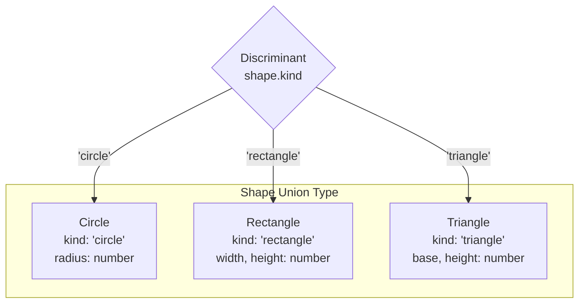
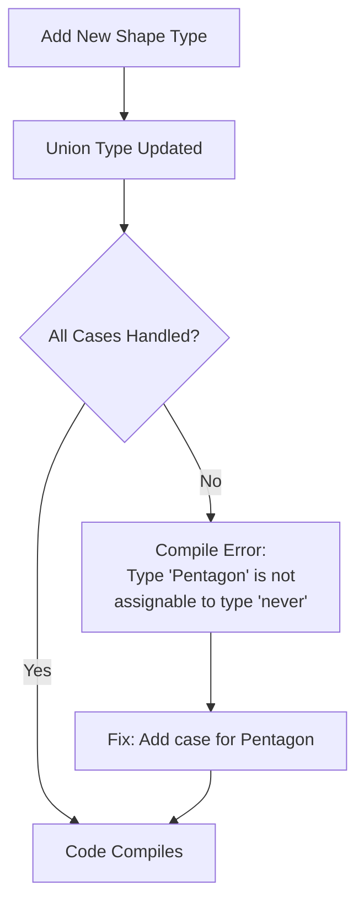
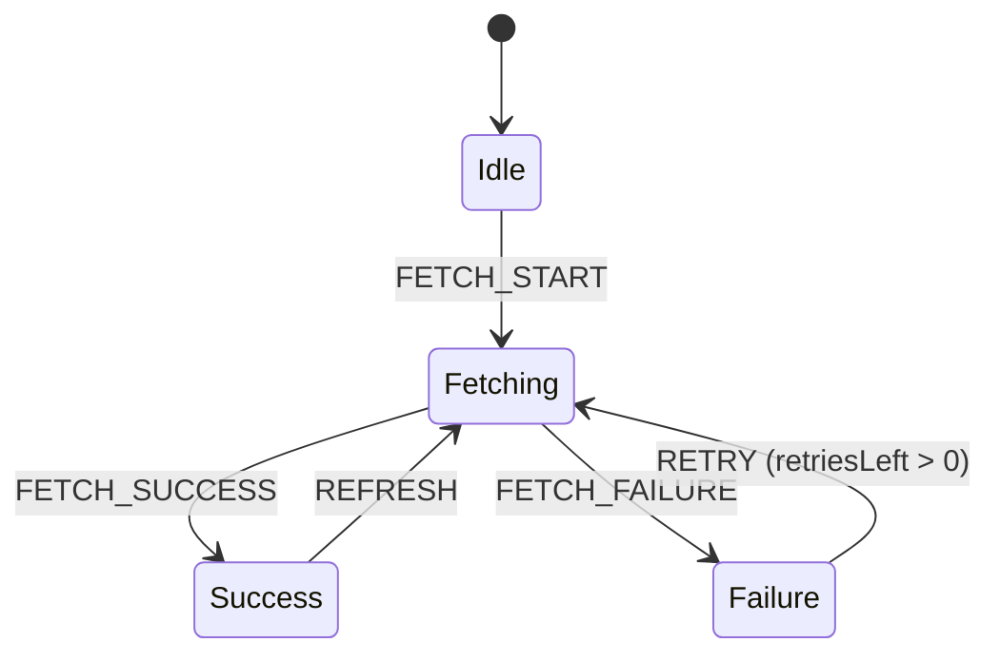

# How to Handle Discriminated Unions in TypeScript

Author: [nawazdhandala](https://www.github.com/nawazdhandala)

Tags: TypeScript, Discriminated Unions, Type Safety, Pattern Matching, JavaScript, Type Guards

Description: Learn how to use discriminated unions in TypeScript to model complex data structures with type-safe exhaustive pattern matching.

---

Discriminated unions are one of TypeScript's most powerful features for modeling data that can take different forms. They let you create types that represent one of several possible variants, with the compiler helping ensure you handle each case correctly. This guide shows you how to use them effectively in real-world applications.

## What Are Discriminated Unions?

A discriminated union (also called a tagged union) is a union type where each member has a common property that TypeScript can use to narrow the type. This "discriminant" property tells TypeScript exactly which variant you are working with.



## Basic Discriminated Union Pattern

Here is a simple example that models different shapes:

```typescript
// Define each variant with a common discriminant property
interface Circle {
    kind: 'circle';  // Literal type as discriminant
    radius: number;
}

interface Rectangle {
    kind: 'rectangle';
    width: number;
    height: number;
}

interface Triangle {
    kind: 'triangle';
    base: number;
    height: number;
}

// Create the union type
type Shape = Circle | Rectangle | Triangle;

// TypeScript narrows the type based on the discriminant
function calculateArea(shape: Shape): number {
    switch (shape.kind) {
        case 'circle':
            // TypeScript knows shape is Circle here
            return Math.PI * shape.radius ** 2;
        case 'rectangle':
            // TypeScript knows shape is Rectangle here
            return shape.width * shape.height;
        case 'triangle':
            // TypeScript knows shape is Triangle here
            return (shape.base * shape.height) / 2;
    }
}
```

## Exhaustiveness Checking

One of the biggest benefits of discriminated unions is exhaustiveness checking. TypeScript can verify that you have handled all possible cases:

```typescript
// This helper ensures we handle all cases
function assertNever(value: never): never {
    throw new Error(`Unhandled discriminated union member: ${JSON.stringify(value)}`);
}

function getShapeDescription(shape: Shape): string {
    switch (shape.kind) {
        case 'circle':
            return `A circle with radius ${shape.radius}`;
        case 'rectangle':
            return `A rectangle ${shape.width}x${shape.height}`;
        case 'triangle':
            return `A triangle with base ${shape.base}`;
        default:
            // If we add a new shape and forget to handle it,
            // TypeScript will error here at compile time
            return assertNever(shape);
    }
}
```

If you add a new shape variant to the union but forget to handle it in the switch statement, TypeScript will show an error at compile time.



## Real-World Example: API Response Handling

Discriminated unions excel at modeling API responses:

```typescript
// Success and error states with discriminant
interface SuccessResponse<T> {
    status: 'success';
    data: T;
    timestamp: Date;
}

interface ErrorResponse {
    status: 'error';
    error: {
        code: string;
        message: string;
    };
    timestamp: Date;
}

interface LoadingState {
    status: 'loading';
}

type ApiResponse<T> = SuccessResponse<T> | ErrorResponse | LoadingState;

// Type-safe response handling
function handleUserResponse(response: ApiResponse<User>): void {
    switch (response.status) {
        case 'loading':
            showSpinner();
            break;
        case 'success':
            // TypeScript knows response.data exists and is User
            displayUser(response.data);
            break;
        case 'error':
            // TypeScript knows response.error exists
            showError(response.error.message);
            break;
    }
}
```

## Multiple Discriminants

Sometimes you need multiple levels of discrimination:

```typescript
interface TextMessage {
    type: 'message';
    messageType: 'text';
    content: string;
}

interface ImageMessage {
    type: 'message';
    messageType: 'image';
    url: string;
    altText: string;
}

interface SystemNotification {
    type: 'notification';
    level: 'info' | 'warning' | 'error';
    message: string;
}

type ChatEvent = TextMessage | ImageMessage | SystemNotification;

function processChatEvent(event: ChatEvent): void {
    // First level discrimination
    if (event.type === 'notification') {
        console.log(`[${event.level.toUpperCase()}] ${event.message}`);
        return;
    }

    // Second level discrimination for messages
    if (event.messageType === 'text') {
        console.log(`Text: ${event.content}`);
    } else {
        console.log(`Image: ${event.url}`);
    }
}
```

## Using Discriminated Unions with Type Guards

You can create reusable type guards for discriminated unions:

```typescript
// Type guard functions
function isCircle(shape: Shape): shape is Circle {
    return shape.kind === 'circle';
}

function isRectangle(shape: Shape): shape is Rectangle {
    return shape.kind === 'rectangle';
}

// Generic type guard factory
function createTypeGuard<T extends Shape>(kind: T['kind']) {
    return (shape: Shape): shape is T => shape.kind === kind;
}

const isTriangle = createTypeGuard<Triangle>('triangle');

// Usage in array filtering
const shapes: Shape[] = [
    { kind: 'circle', radius: 5 },
    { kind: 'rectangle', width: 10, height: 20 },
    { kind: 'circle', radius: 3 },
];

// TypeScript knows circles is Circle[]
const circles = shapes.filter(isCircle);
console.log(circles.map(c => c.radius)); // [5, 3]
```

## State Machine Pattern

Discriminated unions are perfect for modeling state machines:

```typescript
interface IdleState {
    status: 'idle';
}

interface FetchingState {
    status: 'fetching';
    startedAt: Date;
}

interface SuccessState<T> {
    status: 'success';
    data: T;
    fetchedAt: Date;
}

interface FailureState {
    status: 'failure';
    error: Error;
    retriesLeft: number;
}

type FetchState<T> = IdleState | FetchingState | SuccessState<T> | FailureState;

// State transitions
function transition<T>(state: FetchState<T>, action: Action): FetchState<T> {
    switch (state.status) {
        case 'idle':
            if (action.type === 'FETCH_START') {
                return { status: 'fetching', startedAt: new Date() };
            }
            return state;

        case 'fetching':
            if (action.type === 'FETCH_SUCCESS') {
                return {
                    status: 'success',
                    data: action.payload,
                    fetchedAt: new Date()
                };
            }
            if (action.type === 'FETCH_FAILURE') {
                return {
                    status: 'failure',
                    error: action.error,
                    retriesLeft: 3
                };
            }
            return state;

        case 'failure':
            if (action.type === 'RETRY' && state.retriesLeft > 0) {
                return { status: 'fetching', startedAt: new Date() };
            }
            return state;

        case 'success':
            if (action.type === 'REFRESH') {
                return { status: 'fetching', startedAt: new Date() };
            }
            return state;
    }
}
```



## Best Practices

### Use String Literal Types for Discriminants

```typescript
// Good: String literals are clear and debuggable
interface Dog {
    type: 'dog';
    breed: string;
}

// Avoid: Numbers are harder to debug
interface Cat {
    type: 1;  // What does 1 mean?
    name: string;
}
```

### Keep Discriminant Property Consistent

```typescript
// Good: Same property name across all variants
type GoodEvent =
    | { kind: 'click'; x: number; y: number }
    | { kind: 'keypress'; key: string }
    | { kind: 'scroll'; delta: number };

// Bad: Inconsistent discriminant names
type BadEvent =
    | { type: 'click'; x: number; y: number }
    | { kind: 'keypress'; key: string }  // Different property name!
    | { eventType: 'scroll'; delta: number };
```

### Extract Common Properties

```typescript
// Base interface for shared properties
interface BaseEvent {
    timestamp: Date;
    source: string;
}

interface ClickEvent extends BaseEvent {
    kind: 'click';
    position: { x: number; y: number };
}

interface KeyEvent extends BaseEvent {
    kind: 'key';
    key: string;
    modifiers: string[];
}

type UIEvent = ClickEvent | KeyEvent;
```

## Common Mistakes to Avoid

### Missing Discriminant in All Branches

```typescript
// This will not work as a discriminated union
type BadUnion =
    | { type: 'a'; value: string }
    | { value: number };  // Missing type property!

function handleBad(item: BadUnion) {
    // TypeScript cannot narrow properly
    if (item.type === 'a') {
        // item.value is still string | number here
    }
}
```

### Using instanceof Instead of Discriminant

```typescript
// Classes can use instanceof, but interfaces cannot
// For interfaces, always use the discriminant property

class Dog {
    constructor(public name: string) {}
}

class Cat {
    constructor(public name: string) {}
}

// This works for classes
function handlePet(pet: Dog | Cat) {
    if (pet instanceof Dog) {
        // pet is Dog here
    }
}

// But for interfaces, use discriminants
interface DogInterface {
    kind: 'dog';
    name: string;
}

interface CatInterface {
    kind: 'cat';
    name: string;
}

type Pet = DogInterface | CatInterface;
```

## Conclusion

Discriminated unions provide a type-safe way to model data that can take different forms. They shine when you need exhaustive pattern matching, clear state transitions, or type-safe API response handling. The key is choosing a consistent discriminant property and letting TypeScript's type narrowing do the work. Combined with exhaustiveness checking, discriminated unions help catch bugs at compile time rather than runtime, making your code more reliable and easier to refactor.
