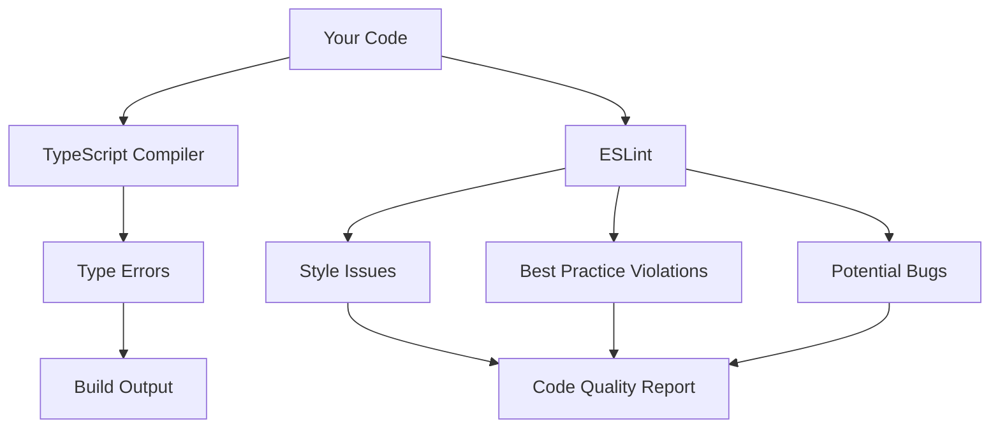
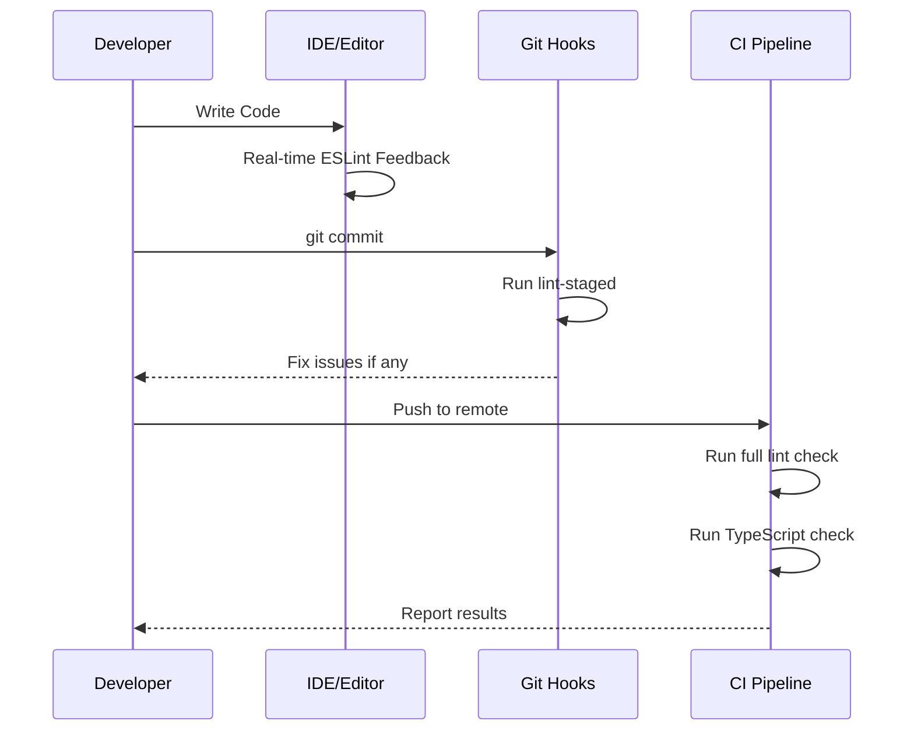

# How to Configure TypeScript with ESLint

Author: [nawazdhandala](https://www.github.com/nawazdhandala)

Tags: TypeScript, ESLint, Configuration, Linting, Code Quality, Development Tools, Best Practices

Description: Learn how to set up and configure ESLint with TypeScript for consistent code quality and automated style enforcement in your projects.

---

Combining TypeScript with ESLint provides powerful static analysis that catches bugs and enforces code style. This guide covers the complete setup process and configuration options.

## Why Use ESLint with TypeScript



TypeScript and ESLint complement each other:
- **TypeScript** catches type errors and provides IntelliSense
- **ESLint** enforces code style, best practices, and catches logical errors

## Installation

### Step 1: Install Required Packages

```bash
# Install ESLint and TypeScript ESLint packages
npm install --save-dev eslint @typescript-eslint/parser @typescript-eslint/eslint-plugin

# Or with yarn
yarn add --dev eslint @typescript-eslint/parser @typescript-eslint/eslint-plugin

# Or with pnpm
pnpm add --save-dev eslint @typescript-eslint/parser @typescript-eslint/eslint-plugin
```

### Step 2: Create ESLint Configuration

Create an `eslint.config.mjs` file (ESLint v9+ flat config format):

```javascript
// eslint.config.mjs
import eslint from '@eslint/js';
import tseslint from '@typescript-eslint/eslint-plugin';
import tsparser from '@typescript-eslint/parser';

export default [
    // Base ESLint recommended rules
    eslint.configs.recommended,

    // TypeScript files configuration
    {
        files: ['**/*.ts', '**/*.tsx'],
        languageOptions: {
            parser: tsparser,
            parserOptions: {
                ecmaVersion: 'latest',
                sourceType: 'module',
                project: './tsconfig.json',
            },
        },
        plugins: {
            '@typescript-eslint': tseslint,
        },
        rules: {
            // TypeScript-specific rules
            ...tseslint.configs.recommended.rules,

            // Custom rule overrides
            '@typescript-eslint/no-unused-vars': 'error',
            '@typescript-eslint/explicit-function-return-type': 'warn',
            '@typescript-eslint/no-explicit-any': 'warn',
        },
    },

    // Ignore patterns
    {
        ignores: ['dist/**', 'node_modules/**', '*.js'],
    },
];
```

### Alternative: Legacy Configuration (ESLint v8)

For projects using ESLint v8 or earlier, use `.eslintrc.json`:

```json
{
    "root": true,
    "env": {
        "browser": true,
        "es2021": true,
        "node": true
    },
    "extends": [
        "eslint:recommended",
        "plugin:@typescript-eslint/recommended",
        "plugin:@typescript-eslint/recommended-requiring-type-checking"
    ],
    "parser": "@typescript-eslint/parser",
    "parserOptions": {
        "ecmaVersion": "latest",
        "sourceType": "module",
        "project": "./tsconfig.json"
    },
    "plugins": [
        "@typescript-eslint"
    ],
    "rules": {
        "@typescript-eslint/no-unused-vars": "error",
        "@typescript-eslint/explicit-function-return-type": "warn"
    },
    "ignorePatterns": ["dist/", "node_modules/"]
}
```

## Configuration Architecture

```mermaid
flowchart TD
    subgraph Config["ESLint Configuration"]
        A[Parser] --> B[@typescript-eslint/parser]
        C[Plugins] --> D[@typescript-eslint/eslint-plugin]
        E[Rules] --> F[ESLint Core Rules]
        E --> G[TypeScript Rules]
        H[Parser Options] --> I[project: tsconfig.json]
    end

    subgraph Process["Linting Process"]
        J[Source Code] --> K[Parse with TS Parser]
        K --> L[Build AST]
        L --> M[Apply Rules]
        M --> N[Report Issues]
    end

    Config --> Process
```

## TypeScript-Specific ESLint Rules

### Strict Type Checking Rules

```javascript
// eslint.config.mjs - Strict rules section
{
    rules: {
        // Prevent using 'any' type
        '@typescript-eslint/no-explicit-any': 'error',

        // Require explicit return types on functions
        '@typescript-eslint/explicit-function-return-type': ['error', {
            allowExpressions: true,
            allowTypedFunctionExpressions: true,
        }],

        // Require explicit accessibility modifiers
        '@typescript-eslint/explicit-member-accessibility': ['error', {
            accessibility: 'explicit',
            overrides: {
                constructors: 'no-public',
            },
        }],

        // Disallow unused variables
        '@typescript-eslint/no-unused-vars': ['error', {
            argsIgnorePattern: '^_',
            varsIgnorePattern: '^_',
        }],

        // Require Promise-like values to be handled
        '@typescript-eslint/no-floating-promises': 'error',

        // Disallow async functions with no await
        '@typescript-eslint/require-await': 'error',

        // Enforce consistent type assertions
        '@typescript-eslint/consistent-type-assertions': ['error', {
            assertionStyle: 'as',
            objectLiteralTypeAssertions: 'never',
        }],
    },
}
```

### Code Style Rules

```javascript
// eslint.config.mjs - Style rules section
{
    rules: {
        // Enforce consistent naming conventions
        '@typescript-eslint/naming-convention': [
            'error',
            // Interfaces must start with 'I' (optional, team preference)
            {
                selector: 'interface',
                format: ['PascalCase'],
                prefix: ['I'],
            },
            // Type aliases in PascalCase
            {
                selector: 'typeAlias',
                format: ['PascalCase'],
            },
            // Enum members in UPPER_CASE
            {
                selector: 'enumMember',
                format: ['UPPER_CASE'],
            },
            // Private members with underscore prefix
            {
                selector: 'memberLike',
                modifiers: ['private'],
                format: ['camelCase'],
                leadingUnderscore: 'require',
            },
        ],

        // Prefer interfaces over type aliases
        '@typescript-eslint/consistent-type-definitions': ['error', 'interface'],

        // Require consistent member ordering in classes
        '@typescript-eslint/member-ordering': ['error', {
            default: [
                'public-static-field',
                'protected-static-field',
                'private-static-field',
                'public-instance-field',
                'protected-instance-field',
                'private-instance-field',
                'constructor',
                'public-method',
                'protected-method',
                'private-method',
            ],
        }],
    },
}
```

## Project-Specific Configurations

### React TypeScript Project

```javascript
// eslint.config.mjs for React + TypeScript
import eslint from '@eslint/js';
import tseslint from '@typescript-eslint/eslint-plugin';
import tsparser from '@typescript-eslint/parser';
import reactPlugin from 'eslint-plugin-react';
import reactHooksPlugin from 'eslint-plugin-react-hooks';

export default [
    eslint.configs.recommended,

    {
        files: ['**/*.ts', '**/*.tsx'],
        languageOptions: {
            parser: tsparser,
            parserOptions: {
                ecmaVersion: 'latest',
                sourceType: 'module',
                project: './tsconfig.json',
                ecmaFeatures: {
                    jsx: true,
                },
            },
        },
        plugins: {
            '@typescript-eslint': tseslint,
            'react': reactPlugin,
            'react-hooks': reactHooksPlugin,
        },
        settings: {
            react: {
                version: 'detect',
            },
        },
        rules: {
            ...tseslint.configs.recommended.rules,
            ...reactPlugin.configs.recommended.rules,

            // React Hooks rules
            'react-hooks/rules-of-hooks': 'error',
            'react-hooks/exhaustive-deps': 'warn',

            // TypeScript + React specific
            'react/prop-types': 'off',  // Not needed with TypeScript
            'react/react-in-jsx-scope': 'off',  // Not needed in React 17+

            // Allow JSX in .tsx files
            'react/jsx-filename-extension': ['error', {
                extensions: ['.tsx'],
            }],
        },
    },

    {
        ignores: ['dist/**', 'build/**', 'node_modules/**'],
    },
];
```

### Node.js TypeScript Project

```javascript
// eslint.config.mjs for Node.js + TypeScript
import eslint from '@eslint/js';
import tseslint from '@typescript-eslint/eslint-plugin';
import tsparser from '@typescript-eslint/parser';

export default [
    eslint.configs.recommended,

    {
        files: ['**/*.ts'],
        languageOptions: {
            parser: tsparser,
            parserOptions: {
                ecmaVersion: 'latest',
                sourceType: 'module',
                project: './tsconfig.json',
            },
            globals: {
                // Node.js globals
                process: 'readonly',
                __dirname: 'readonly',
                __filename: 'readonly',
                module: 'readonly',
                require: 'readonly',
                Buffer: 'readonly',
                console: 'readonly',
            },
        },
        plugins: {
            '@typescript-eslint': tseslint,
        },
        rules: {
            ...tseslint.configs.recommended.rules,

            // Node.js specific rules
            'no-console': 'off',  // Allow console in Node.js
            '@typescript-eslint/no-require-imports': 'error',

            // Async/Promise handling
            '@typescript-eslint/no-floating-promises': 'error',
            '@typescript-eslint/promise-function-async': 'error',
        },
    },

    {
        ignores: ['dist/**', 'node_modules/**'],
    },
];
```

## Integration with Build Tools

### Package.json Scripts

```json
{
    "scripts": {
        "lint": "eslint . --ext .ts,.tsx",
        "lint:fix": "eslint . --ext .ts,.tsx --fix",
        "lint:report": "eslint . --ext .ts,.tsx --format html --output-file lint-report.html",
        "typecheck": "tsc --noEmit",
        "validate": "npm run typecheck && npm run lint"
    }
}
```

### Pre-commit Hooks with Husky

```bash
# Install husky and lint-staged
npm install --save-dev husky lint-staged
npx husky init
```

```json
// package.json
{
    "lint-staged": {
        "*.{ts,tsx}": [
            "eslint --fix",
            "prettier --write"
        ]
    }
}
```

```bash
# .husky/pre-commit
npm run lint-staged
```

## Workflow Integration



## VS Code Integration

Create `.vscode/settings.json`:

```json
{
    "editor.codeActionsOnSave": {
        "source.fixAll.eslint": "explicit"
    },
    "eslint.validate": [
        "javascript",
        "javascriptreact",
        "typescript",
        "typescriptreact"
    ],
    "typescript.tsdk": "node_modules/typescript/lib",
    "editor.formatOnSave": true,
    "eslint.workingDirectories": [
        { "mode": "auto" }
    ]
}
```

## Handling Common Issues

### Issue 1: Parsing Errors with JSX

```javascript
// Problem: Parsing error in .tsx files
// Solution: Configure parserOptions correctly

{
    languageOptions: {
        parserOptions: {
            ecmaFeatures: {
                jsx: true,  // Enable JSX parsing
            },
        },
    },
}
```

### Issue 2: Cannot Find tsconfig.json

```javascript
// Problem: ESLint can't find tsconfig.json
// Solution: Use correct path in parserOptions

{
    languageOptions: {
        parserOptions: {
            project: './tsconfig.json',  // Relative to eslint.config.mjs
            // Or use absolute path
            // project: path.resolve(__dirname, './tsconfig.json'),
            tsconfigRootDir: import.meta.dirname,
        },
    },
}
```

### Issue 3: Rules Conflicting with Prettier

```javascript
// Install eslint-config-prettier
// npm install --save-dev eslint-config-prettier

import prettier from 'eslint-config-prettier';

export default [
    // ... other configs
    prettier,  // Must be last to override conflicting rules
];
```

### Issue 4: Slow Linting Performance

```javascript
// Create a separate tsconfig for ESLint
// tsconfig.eslint.json
{
    "extends": "./tsconfig.json",
    "include": ["src/**/*"],  // Only lint source files
    "exclude": ["node_modules", "dist", "**/*.test.ts"]
}

// Use in ESLint config
{
    languageOptions: {
        parserOptions: {
            project: './tsconfig.eslint.json',
        },
    },
}
```

## Recommended Rule Sets

### Minimal Setup (Starting Point)

```javascript
{
    rules: {
        '@typescript-eslint/no-unused-vars': 'warn',
        '@typescript-eslint/no-explicit-any': 'warn',
    },
}
```

### Recommended Setup (Balanced)

```javascript
{
    rules: {
        // Error prevention
        '@typescript-eslint/no-unused-vars': 'error',
        '@typescript-eslint/no-explicit-any': 'warn',
        '@typescript-eslint/no-non-null-assertion': 'warn',

        // Best practices
        '@typescript-eslint/explicit-function-return-type': 'off',
        '@typescript-eslint/explicit-module-boundary-types': 'warn',
        '@typescript-eslint/no-floating-promises': 'error',

        // Code style
        '@typescript-eslint/consistent-type-imports': 'error',
        '@typescript-eslint/prefer-nullish-coalescing': 'error',
        '@typescript-eslint/prefer-optional-chain': 'error',
    },
}
```

### Strict Setup (Maximum Safety)

```javascript
{
    rules: {
        // All recommended rules as errors
        '@typescript-eslint/no-unused-vars': 'error',
        '@typescript-eslint/no-explicit-any': 'error',
        '@typescript-eslint/no-non-null-assertion': 'error',
        '@typescript-eslint/explicit-function-return-type': 'error',
        '@typescript-eslint/explicit-module-boundary-types': 'error',
        '@typescript-eslint/no-floating-promises': 'error',
        '@typescript-eslint/no-misused-promises': 'error',
        '@typescript-eslint/await-thenable': 'error',
        '@typescript-eslint/no-unsafe-assignment': 'error',
        '@typescript-eslint/no-unsafe-call': 'error',
        '@typescript-eslint/no-unsafe-member-access': 'error',
        '@typescript-eslint/no-unsafe-return': 'error',
        '@typescript-eslint/restrict-template-expressions': 'error',
        '@typescript-eslint/strict-boolean-expressions': 'error',
    },
}
```

## Complete Example Configuration

```javascript
// eslint.config.mjs - Complete production configuration
import eslint from '@eslint/js';
import tseslint from '@typescript-eslint/eslint-plugin';
import tsparser from '@typescript-eslint/parser';
import prettier from 'eslint-config-prettier';

export default [
    eslint.configs.recommended,

    // TypeScript files
    {
        files: ['**/*.ts', '**/*.tsx'],
        languageOptions: {
            parser: tsparser,
            parserOptions: {
                ecmaVersion: 'latest',
                sourceType: 'module',
                project: './tsconfig.json',
            },
        },
        plugins: {
            '@typescript-eslint': tseslint,
        },
        rules: {
            // Inherit recommended rules
            ...tseslint.configs.recommended.rules,

            // Customize rules
            '@typescript-eslint/no-unused-vars': ['error', {
                argsIgnorePattern: '^_',
                varsIgnorePattern: '^_',
            }],
            '@typescript-eslint/no-explicit-any': 'warn',
            '@typescript-eslint/explicit-module-boundary-types': 'warn',
            '@typescript-eslint/no-floating-promises': 'error',
            '@typescript-eslint/consistent-type-imports': ['error', {
                prefer: 'type-imports',
            }],
            '@typescript-eslint/prefer-nullish-coalescing': 'error',
            '@typescript-eslint/prefer-optional-chain': 'error',

            // Disable base ESLint rules that conflict
            'no-unused-vars': 'off',
            'no-undef': 'off',
        },
    },

    // Test files - relaxed rules
    {
        files: ['**/*.test.ts', '**/*.spec.ts'],
        rules: {
            '@typescript-eslint/no-explicit-any': 'off',
            '@typescript-eslint/no-non-null-assertion': 'off',
        },
    },

    // Prettier must be last
    prettier,

    // Ignore patterns
    {
        ignores: [
            'dist/**',
            'build/**',
            'coverage/**',
            'node_modules/**',
            '*.config.js',
        ],
    },
];
```

## Summary

Setting up ESLint with TypeScript involves:

1. **Install packages**: `@typescript-eslint/parser` and `@typescript-eslint/eslint-plugin`
2. **Configure parser**: Point to your `tsconfig.json`
3. **Select rules**: Start with recommended and customize as needed
4. **Integrate with tools**: IDE, Git hooks, and CI pipeline
5. **Handle conflicts**: Use `eslint-config-prettier` for Prettier integration

A well-configured ESLint setup catches bugs early, enforces consistent code style, and improves overall code quality in your TypeScript projects.
