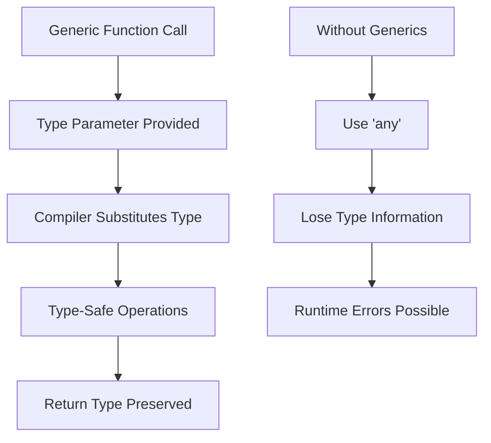
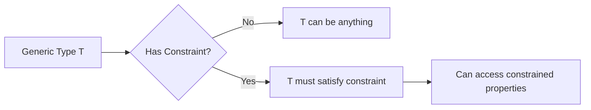
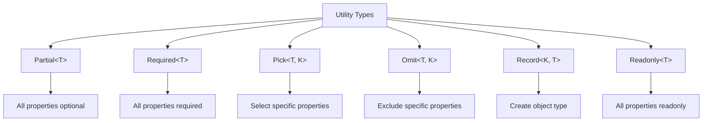

# How to Handle Generic Types in TypeScript

Author: [nawazdhandala](https://www.github.com/nawazdhandala)

Tags: TypeScript, Generics, Type Safety, JavaScript, Advanced TypeScript

Description: A comprehensive guide to understanding and effectively using generic types in TypeScript for flexible, reusable, and type-safe code.

---

> Generics are one of TypeScript's most powerful features, enabling you to write flexible, reusable code while maintaining full type safety. This guide covers everything from basic generic syntax to advanced patterns used in production applications.

Generics allow you to create components that work with multiple types while preserving type information. Instead of using `any` and losing type safety, generics let you capture and use the types provided by the caller.

---

## Understanding Generics



---

## Basic Generic Syntax

### Generic Functions

```typescript
// Without generics - loses type information
function identityAny(value: any): any {
    return value;
}

const result1 = identityAny("hello");  // Type is 'any'

// With generics - preserves type information
function identity<T>(value: T): T {
    return value;
}

const result2 = identity<string>("hello");  // Type is 'string'
const result3 = identity(42);  // Type is inferred as 'number'
```

### Generic Interfaces

```typescript
// Generic interface for API responses
interface ApiResponse<T> {
    data: T;
    status: number;
    message: string;
    timestamp: Date;
}

// Usage with different types
interface User {
    id: number;
    name: string;
}

interface Product {
    sku: string;
    price: number;
}

const userResponse: ApiResponse<User> = {
    data: { id: 1, name: "John" },
    status: 200,
    message: "Success",
    timestamp: new Date()
};

const productResponse: ApiResponse<Product> = {
    data: { sku: "ABC123", price: 29.99 },
    status: 200,
    message: "Success",
    timestamp: new Date()
};
```

### Generic Classes

```typescript
// Generic class for a type-safe stack
class Stack<T> {
    private items: T[] = [];

    push(item: T): void {
        this.items.push(item);
    }

    pop(): T | undefined {
        return this.items.pop();
    }

    peek(): T | undefined {
        return this.items[this.items.length - 1];
    }

    isEmpty(): boolean {
        return this.items.length === 0;
    }

    size(): number {
        return this.items.length;
    }
}

// Type-safe usage
const numberStack = new Stack<number>();
numberStack.push(1);
numberStack.push(2);
// numberStack.push("three");  // Error: Argument of type 'string' is not assignable

const stringStack = new Stack<string>();
stringStack.push("hello");
stringStack.push("world");
```

---

## Generic Constraints

Constraints limit what types can be used with a generic, enabling you to access specific properties.



### Using extends for Constraints

```typescript
// ERROR: Property 'length' does not exist on type 'T'
function getLength<T>(item: T): number {
    return item.length;  // T might not have length
}

// SOLUTION: Constrain T to types with length property
interface HasLength {
    length: number;
}

function getLength<T extends HasLength>(item: T): number {
    return item.length;  // Works - T must have length
}

// Valid calls
getLength("hello");         // string has length
getLength([1, 2, 3]);       // array has length
getLength({ length: 10 });  // object with length property

// Invalid calls
// getLength(123);          // Error: number doesn't have length
// getLength({ size: 10 }); // Error: no length property
```

### Multiple Constraints

```typescript
// Combine constraints with intersection types
interface Printable {
    print(): void;
}

interface Loggable {
    log(): void;
}

function processItem<T extends Printable & Loggable>(item: T): void {
    item.print();
    item.log();
}

// Implementation that satisfies both constraints
class Document implements Printable, Loggable {
    print(): void {
        console.log("Printing document");
    }
    log(): void {
        console.log("Logging document");
    }
}

processItem(new Document());  // Works
```

---

## Multiple Type Parameters

```typescript
// Function with multiple generic parameters
function pair<K, V>(key: K, value: V): [K, V] {
    return [key, value];
}

const result = pair("name", "John");  // Type: [string, string]
const result2 = pair(1, { active: true });  // Type: [number, { active: boolean }]

// Generic Map-like structure
class KeyValueStore<K, V> {
    private store = new Map<K, V>();

    set(key: K, value: V): void {
        this.store.set(key, value);
    }

    get(key: K): V | undefined {
        return this.store.get(key);
    }

    has(key: K): boolean {
        return this.store.has(key);
    }
}

const userStore = new KeyValueStore<number, User>();
userStore.set(1, { id: 1, name: "John" });
const user = userStore.get(1);  // Type: User | undefined
```

---

## Generic Type Inference

TypeScript can often infer generic types from usage.

```typescript
// Type inference from arguments
function map<T, U>(array: T[], transform: (item: T) => U): U[] {
    return array.map(transform);
}

// TypeScript infers T as number and U as string
const numbers = [1, 2, 3];
const strings = map(numbers, (n) => n.toString());  // Type: string[]

// Infers T as string and U as number
const names = ["alice", "bob"];
const lengths = map(names, (name) => name.length);  // Type: number[]

// Sometimes explicit types are needed for clarity
const result = map<User, string>(users, (user) => user.name);
```

---

## Built-in Utility Types

TypeScript provides many generic utility types.



### Practical Examples

```typescript
interface User {
    id: number;
    name: string;
    email: string;
    role: "admin" | "user";
}

// Partial - all properties become optional
type UpdateUserDTO = Partial<User>;
// Equivalent to: { id?: number; name?: string; email?: string; role?: "admin" | "user"; }

function updateUser(id: number, updates: Partial<User>): void {
    // Can update any subset of properties
}

updateUser(1, { name: "New Name" });  // Valid
updateUser(1, { email: "new@example.com", role: "admin" });  // Valid

// Pick - select specific properties
type UserCredentials = Pick<User, "email" | "id">;
// Equivalent to: { email: string; id: number; }

// Omit - exclude specific properties
type PublicUser = Omit<User, "email">;
// Equivalent to: { id: number; name: string; role: "admin" | "user"; }

// Record - create object type with specific keys and value type
type UserRoles = Record<string, User>;
const usersByRole: UserRoles = {
    admin: { id: 1, name: "Admin", email: "admin@test.com", role: "admin" },
    user: { id: 2, name: "User", email: "user@test.com", role: "user" }
};

// Readonly - make all properties readonly
type ImmutableUser = Readonly<User>;
const user: ImmutableUser = { id: 1, name: "John", email: "john@test.com", role: "user" };
// user.name = "Jane";  // Error: Cannot assign to 'name' because it is a read-only property
```

---

## Generic Type Aliases

```typescript
// Generic type alias for nullable values
type Nullable<T> = T | null;

const name: Nullable<string> = null;  // Valid
const age: Nullable<number> = 25;     // Valid

// Generic type for async operation results
type AsyncResult<T, E = Error> = {
    loading: boolean;
    data: T | null;
    error: E | null;
};

const userResult: AsyncResult<User> = {
    loading: false,
    data: { id: 1, name: "John", email: "john@test.com", role: "user" },
    error: null
};

// Generic type for event handlers
type EventHandler<T> = (event: T) => void;

interface ClickEvent {
    x: number;
    y: number;
    target: HTMLElement;
}

const handleClick: EventHandler<ClickEvent> = (event) => {
    console.log(`Clicked at (${event.x}, ${event.y})`);
};
```

---

## Advanced Generic Patterns

### Conditional Types

```typescript
// Conditional types make decisions based on type relationships
type IsString<T> = T extends string ? true : false;

type A = IsString<string>;  // true
type B = IsString<number>;  // false

// Extract array element type
type ElementType<T> = T extends (infer E)[] ? E : never;

type StringArrayElement = ElementType<string[]>;  // string
type NumberArrayElement = ElementType<number[]>;  // number

// Extract function return type (similar to built-in ReturnType)
type MyReturnType<T> = T extends (...args: any[]) => infer R ? R : never;

function getUser(): User {
    return { id: 1, name: "John", email: "john@test.com", role: "user" };
}

type UserReturn = MyReturnType<typeof getUser>;  // User
```

### Mapped Types

```typescript
// Create a type where all properties are functions returning the original type
type Getters<T> = {
    [K in keyof T as `get${Capitalize<string & K>}`]: () => T[K];
};

interface Person {
    name: string;
    age: number;
}

type PersonGetters = Getters<Person>;
// Equivalent to: { getName: () => string; getAge: () => number; }

// Make all properties optional and nullable
type DeepPartial<T> = {
    [K in keyof T]?: T[K] extends object ? DeepPartial<T[K]> : T[K];
};

interface Config {
    server: {
        host: string;
        port: number;
    };
    database: {
        url: string;
        poolSize: number;
    };
}

type PartialConfig = DeepPartial<Config>;
// All nested properties are now optional
```

### Generic Factory Functions

```typescript
// Factory function with generics
interface Entity {
    id: string;
    createdAt: Date;
}

function createEntity<T extends object>(data: T): T & Entity {
    return {
        ...data,
        id: crypto.randomUUID(),
        createdAt: new Date()
    };
}

const user = createEntity({ name: "John", email: "john@test.com" });
// Type: { name: string; email: string; } & Entity

console.log(user.id);        // Works - from Entity
console.log(user.name);      // Works - from original data
console.log(user.createdAt); // Works - from Entity
```

---

## Generic Components in React

```typescript
// Generic React component for lists
interface ListProps<T> {
    items: T[];
    renderItem: (item: T, index: number) => React.ReactNode;
    keyExtractor: (item: T) => string;
}

function List<T>({ items, renderItem, keyExtractor }: ListProps<T>) {
    return (
        <ul>
            {items.map((item, index) => (
                <li key={keyExtractor(item)}>
                    {renderItem(item, index)}
                </li>
            ))}
        </ul>
    );
}

// Usage with full type safety
interface Product {
    id: string;
    name: string;
    price: number;
}

const products: Product[] = [
    { id: "1", name: "Widget", price: 9.99 },
    { id: "2", name: "Gadget", price: 19.99 }
];

<List
    items={products}
    keyExtractor={(product) => product.id}
    renderItem={(product) => (
        <span>{product.name}: ${product.price}</span>
    )}
/>
```

---

## Best Practices

### 1. Use Meaningful Type Parameter Names

```typescript
// Poor naming
function process<T, U, V>(a: T, b: U): V { }

// Better naming
function transform<TInput, TOutput>(input: TInput): TOutput { }

// Common conventions
// T - Type (general purpose)
// K - Key
// V - Value
// E - Element
// R - Return type
// P - Props
```

### 2. Prefer Constraints Over Any

```typescript
// BAD: Loses type safety
function processAny(items: any[]): any[] {
    return items.filter(Boolean);
}

// GOOD: Maintains type safety with constraint
function processGeneric<T>(items: T[]): T[] {
    return items.filter(Boolean);
}
```

### 3. Use Default Type Parameters

```typescript
// Provide defaults for common cases
interface PaginatedResponse<T, M = { total: number; page: number }> {
    data: T[];
    meta: M;
}

// Uses default meta type
const response1: PaginatedResponse<User> = {
    data: [],
    meta: { total: 0, page: 1 }
};

// Custom meta type
interface ExtendedMeta {
    total: number;
    page: number;
    hasMore: boolean;
}

const response2: PaginatedResponse<User, ExtendedMeta> = {
    data: [],
    meta: { total: 0, page: 1, hasMore: false }
};
```

### 4. Avoid Overly Complex Generic Types

```typescript
// Too complex - hard to understand and maintain
type ComplexType<T, K extends keyof T, V extends T[K], R extends V extends string ? number : string> = { };

// Simpler approach - break into smaller pieces
type KeyOfType<T, V> = {
    [K in keyof T]: T[K] extends V ? K : never;
}[keyof T];

type StringKeys<T> = KeyOfType<T, string>;
type NumberKeys<T> = KeyOfType<T, number>;
```

---

## Common Pitfalls

### Type Parameter Not Used

```typescript
// BAD: T is not actually used
function logLength<T>(items: any[]): void {
    console.log(items.length);
}

// GOOD: T provides type safety
function logLength<T>(items: T[]): void {
    console.log(items.length);
}
```

### Constraining When Not Needed

```typescript
// Unnecessary constraint
function firstElement<T extends object>(arr: T[]): T | undefined {
    return arr[0];
}

// Better - works with any type
function firstElement<T>(arr: T[]): T | undefined {
    return arr[0];
}
```

---

## Conclusion

Generics are essential for writing flexible, reusable TypeScript code without sacrificing type safety. Start with simple generic functions and interfaces, then gradually adopt more advanced patterns like conditional types and mapped types as needed.

The key principles are: use constraints to enable property access, provide meaningful type parameter names, and prefer type inference where possible. When generics become too complex, break them into smaller, composable pieces.

---

*Want to monitor your TypeScript applications? [OneUptime](https://oneuptime.com) provides comprehensive monitoring, error tracking, and performance metrics for your applications.*

**Related Reading:**
- [How to Fix "Type 'X' Is Not Assignable to Type 'Y'" Errors](https://oneuptime.com/blog)
- [How to Configure tsconfig.json Properly](https://oneuptime.com/blog)
