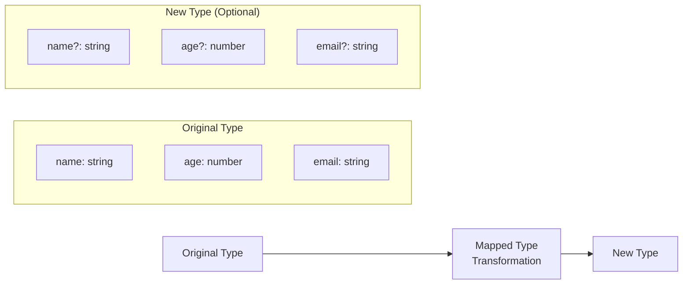
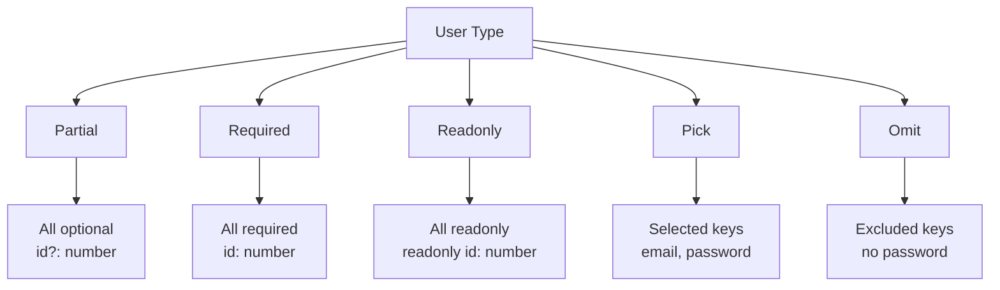
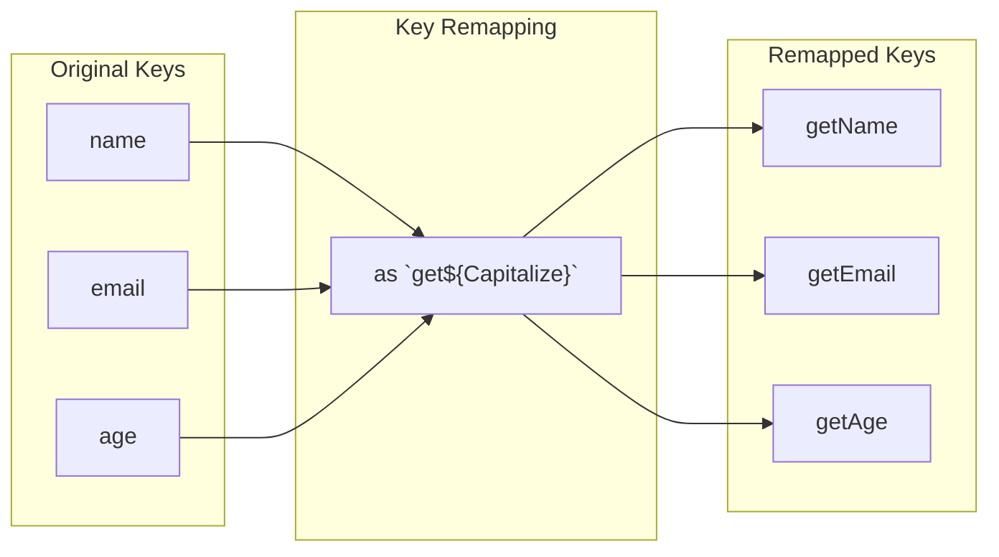
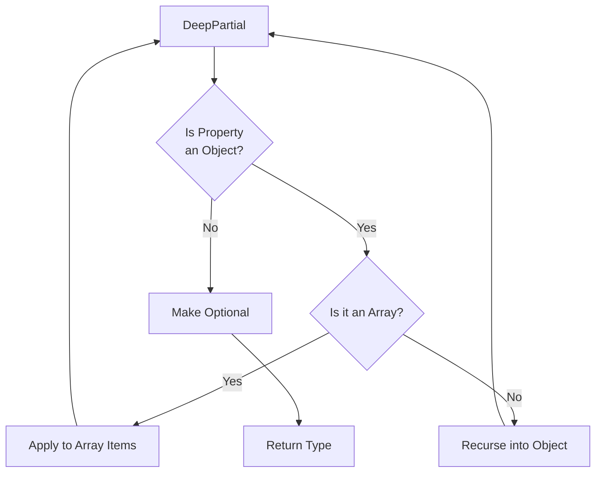
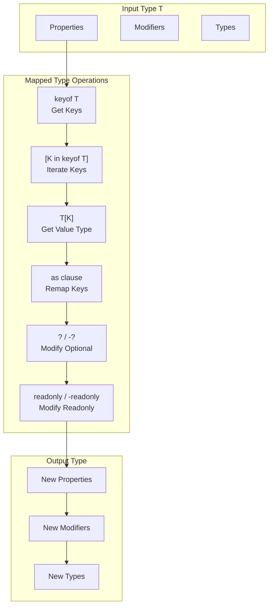

# How to Handle Mapped Types in TypeScript

Author: [nawazdhandala](https://www.github.com/nawazdhandala)

Tags: TypeScript, Mapped Types, Type System, Generics, Advanced Types, Type Manipulation

Description: Master TypeScript mapped types to transform existing types into new ones with modified properties and modifiers.

---

Mapped types are one of TypeScript's most powerful features, allowing you to create new types by transforming properties of existing types. This guide covers everything from basic syntax to advanced patterns.

## Understanding Mapped Types

Mapped types iterate over the keys of a type and create a new type with transformed properties.



## Basic Mapped Type Syntax

The basic syntax uses the `in` keyword to iterate over keys.

```typescript
// Basic mapped type syntax
type MappedType<T> = {
  [K in keyof T]: T[K];
};

// Example: Create a type that makes all properties optional
type Optional<T> = {
  [K in keyof T]?: T[K];
};

// Example: Create a type that makes all properties required
type Required<T> = {
  [K in keyof T]-?: T[K];
};

// Example: Create a type that makes all properties readonly
type Readonly<T> = {
  readonly [K in keyof T]: T[K];
};
```

## Built-in Utility Types

TypeScript provides several built-in mapped types.

```typescript
interface User {
  id: number;
  name: string;
  email: string;
  password: string;
}

// Partial<T> - Makes all properties optional
type PartialUser = Partial<User>;
// Result: { id?: number; name?: string; email?: string; password?: string; }

// Required<T> - Makes all properties required
type RequiredUser = Required<PartialUser>;
// Result: { id: number; name: string; email: string; password: string; }

// Readonly<T> - Makes all properties readonly
type ReadonlyUser = Readonly<User>;
// Result: { readonly id: number; readonly name: string; ... }

// Pick<T, K> - Picks specific properties
type UserCredentials = Pick<User, 'email' | 'password'>;
// Result: { email: string; password: string; }

// Omit<T, K> - Omits specific properties
type PublicUser = Omit<User, 'password'>;
// Result: { id: number; name: string; email: string; }
```

## Utility Types Visualization



## Creating Custom Mapped Types

Build custom mapped types for specific use cases.

```typescript
// Make all properties nullable
type Nullable<T> = {
  [K in keyof T]: T[K] | null;
};

// Usage
interface Config {
  apiUrl: string;
  timeout: number;
  retries: number;
}

type NullableConfig = Nullable<Config>;
// Result: { apiUrl: string | null; timeout: number | null; retries: number | null; }

const config: NullableConfig = {
  apiUrl: 'https://api.example.com',
  timeout: null,  // Valid: can be null
  retries: 3,
};
```

```typescript
// Make all properties return promises
type Async<T> = {
  [K in keyof T]: Promise<T[K]>;
};

// Usage
interface DataStore {
  users: User[];
  products: Product[];
  orders: Order[];
}

type AsyncDataStore = Async<DataStore>;
// Result: {
//   users: Promise<User[]>;
//   products: Promise<Product[]>;
//   orders: Promise<Order[]>;
// }
```

## Key Remapping with `as` Clause

TypeScript 4.1 introduced key remapping with the `as` clause.

```typescript
// Add prefix to all keys
type Prefixed<T, P extends string> = {
  [K in keyof T as `${P}${Capitalize<string & K>}`]: T[K];
};

interface User {
  name: string;
  email: string;
}

type PrefixedUser = Prefixed<User, 'user'>;
// Result: { userName: string; userEmail: string; }
```

```typescript
// Create getter methods for all properties
type Getters<T> = {
  [K in keyof T as `get${Capitalize<string & K>}`]: () => T[K];
};

// Create setter methods for all properties
type Setters<T> = {
  [K in keyof T as `set${Capitalize<string & K>}`]: (value: T[K]) => void;
};

interface Person {
  name: string;
  age: number;
}

type PersonGetters = Getters<Person>;
// Result: { getName: () => string; getAge: () => number; }

type PersonSetters = Setters<Person>;
// Result: { setName: (value: string) => void; setAge: (value: number) => void; }
```

## Key Remapping Flow



## Filtering Properties with Key Remapping

Use `never` to filter out properties during mapping.

```typescript
// Extract only string properties
type StringProperties<T> = {
  [K in keyof T as T[K] extends string ? K : never]: T[K];
};

interface Mixed {
  id: number;
  name: string;
  active: boolean;
  email: string;
}

type StringOnly = StringProperties<Mixed>;
// Result: { name: string; email: string; }
```

```typescript
// Extract only function properties
type FunctionProperties<T> = {
  [K in keyof T as T[K] extends Function ? K : never]: T[K];
};

interface Service {
  name: string;
  fetch: () => Promise<void>;
  transform: (data: string) => string;
  timeout: number;
}

type ServiceMethods = FunctionProperties<Service>;
// Result: { fetch: () => Promise<void>; transform: (data: string) => string; }
```

```typescript
// Exclude readonly properties
type Mutable<T> = {
  -readonly [K in keyof T]: T[K];
};

// Extract only mutable properties
type WritableKeys<T> = {
  [K in keyof T]-?: (<U>() => U extends { [P in K]: T[K] } ? 1 : 2) extends
    (<U>() => U extends { readonly [P in K]: T[K] } ? 1 : 2) ? never : K;
}[keyof T];

type WritableProperties<T> = Pick<T, WritableKeys<T>>;
```

## Combining Mapped Types

Combine multiple mapped types for complex transformations.

```typescript
// Create a type with optional properties and getters
type WithOptionalGetters<T> = Partial<T> & Getters<T>;

interface Product {
  id: number;
  name: string;
  price: number;
}

type FlexibleProduct = WithOptionalGetters<Product>;
// Result: {
//   id?: number;
//   name?: string;
//   price?: number;
//   getId: () => number;
//   getName: () => string;
//   getPrice: () => number;
// }
```

```typescript
// Create an API response wrapper
type ApiResponse<T> = {
  [K in keyof T as `${string & K}Data`]: T[K];
} & {
  [K in keyof T as `${string & K}Loading`]: boolean;
} & {
  [K in keyof T as `${string & K}Error`]: Error | null;
};

interface FetchState {
  users: User[];
  products: Product[];
}

type FetchApiState = ApiResponse<FetchState>;
// Result: {
//   usersData: User[];
//   usersLoading: boolean;
//   usersError: Error | null;
//   productsData: Product[];
//   productsLoading: boolean;
//   productsError: Error | null;
// }
```

## Recursive Mapped Types

Create deeply nested transformations with recursive mapped types.

```typescript
// Deep Partial - makes all nested properties optional
type DeepPartial<T> = {
  [K in keyof T]?: T[K] extends object
    ? T[K] extends Array<infer U>
      ? Array<DeepPartial<U>>
      : DeepPartial<T[K]>
    : T[K];
};

interface ComplexUser {
  id: number;
  profile: {
    name: string;
    address: {
      street: string;
      city: string;
      country: string;
    };
  };
  settings: {
    theme: string;
    notifications: boolean;
  };
}

type PartialComplexUser = DeepPartial<ComplexUser>;
// All nested properties are now optional
```

```typescript
// Deep Readonly - makes all nested properties readonly
type DeepReadonly<T> = {
  readonly [K in keyof T]: T[K] extends object
    ? T[K] extends Function
      ? T[K]
      : DeepReadonly<T[K]>
    : T[K];
};

const user: DeepReadonly<ComplexUser> = {
  id: 1,
  profile: {
    name: 'John',
    address: {
      street: '123 Main St',
      city: 'Boston',
      country: 'USA',
    },
  },
  settings: {
    theme: 'dark',
    notifications: true,
  },
};

// Error: Cannot assign to 'city' because it is read-only
// user.profile.address.city = 'New York';
```

## Recursive Type Visualization



## Practical Example: Form Handling

```typescript
// Create form field types from a data model
type FormField<T> = {
  value: T;
  touched: boolean;
  error: string | null;
  validate: () => boolean;
};

type FormFields<T> = {
  [K in keyof T]: FormField<T[K]>;
};

interface UserData {
  username: string;
  email: string;
  age: number;
}

type UserForm = FormFields<UserData>;
// Result: {
//   username: FormField<string>;
//   email: FormField<string>;
//   age: FormField<number>;
// }

// Implementation example
function createForm<T extends object>(initial: T): FormFields<T> {
  const fields = {} as FormFields<T>;

  for (const key in initial) {
    fields[key] = {
      value: initial[key],
      touched: false,
      error: null,
      validate: () => true,
    } as FormField<T[typeof key]>;
  }

  return fields;
}
```

## Practical Example: Event Handlers

```typescript
// Create event handler types from events
type EventHandlers<T> = {
  [K in keyof T as `on${Capitalize<string & K>}`]: (event: T[K]) => void;
};

interface DomEvents {
  click: MouseEvent;
  keydown: KeyboardEvent;
  scroll: Event;
  focus: FocusEvent;
}

type DomEventHandlers = EventHandlers<DomEvents>;
// Result: {
//   onClick: (event: MouseEvent) => void;
//   onKeydown: (event: KeyboardEvent) => void;
//   onScroll: (event: Event) => void;
//   onFocus: (event: FocusEvent) => void;
// }

// Usage in a component
interface ButtonProps extends Partial<DomEventHandlers> {
  label: string;
  disabled?: boolean;
}

function Button({ label, onClick, onFocus }: ButtonProps) {
  // Implementation
}
```

## Type Transformation Summary



## Summary

Mapped types are essential for creating flexible and reusable type transformations in TypeScript. Key concepts include using `[K in keyof T]` to iterate over properties, using `T[K]` to access property types, modifying optional and readonly modifiers with `?`, `-?`, `readonly`, and `-readonly`, remapping keys with the `as` clause, filtering properties by returning `never`, and creating recursive types for deep transformations. By mastering mapped types, you can create type-safe abstractions that reduce code duplication and improve maintainability.
