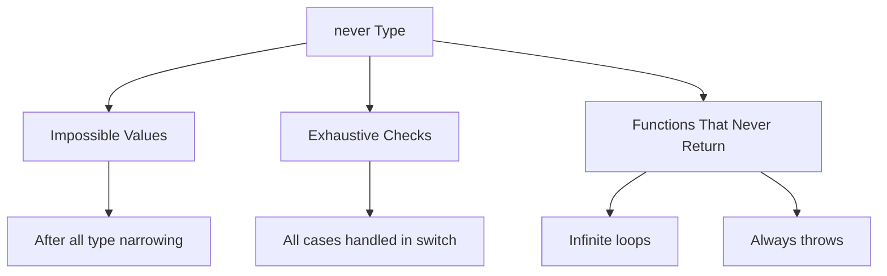
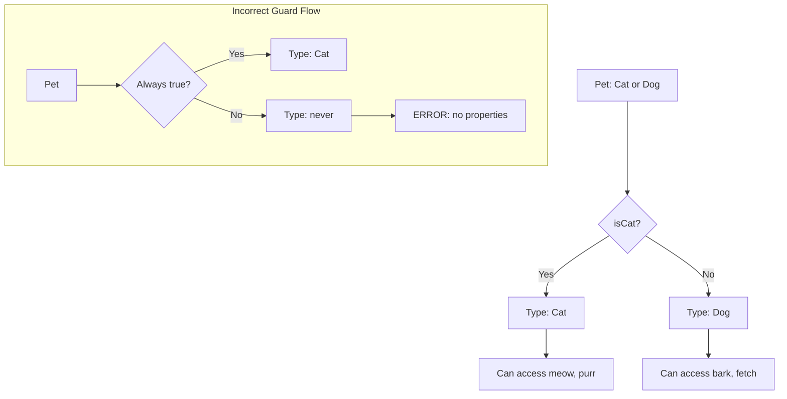
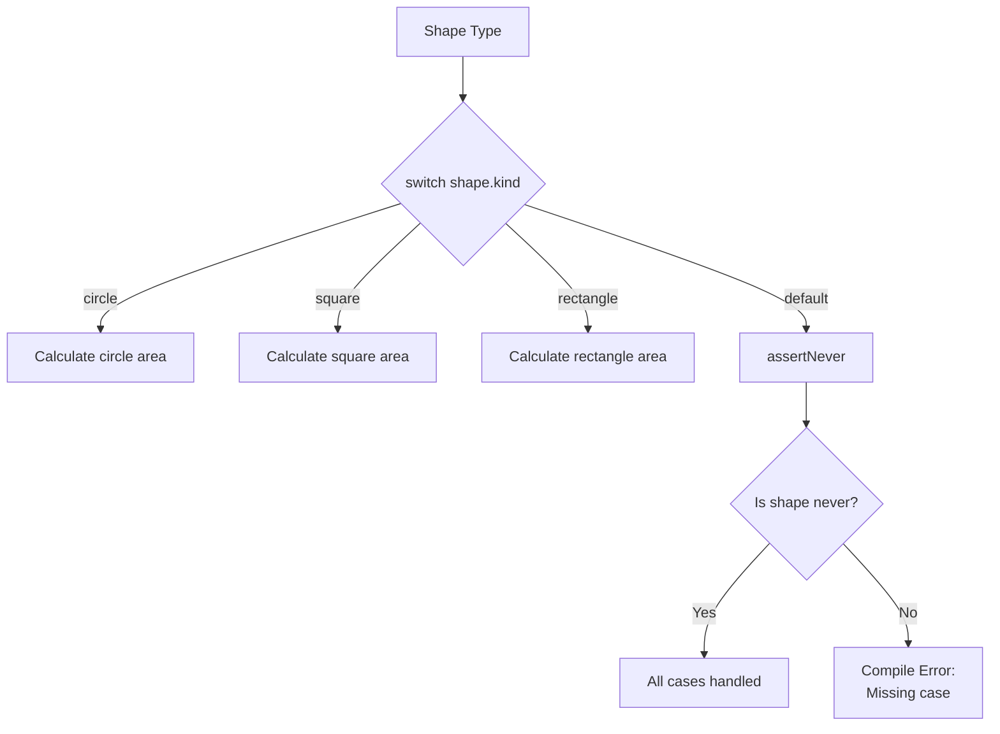
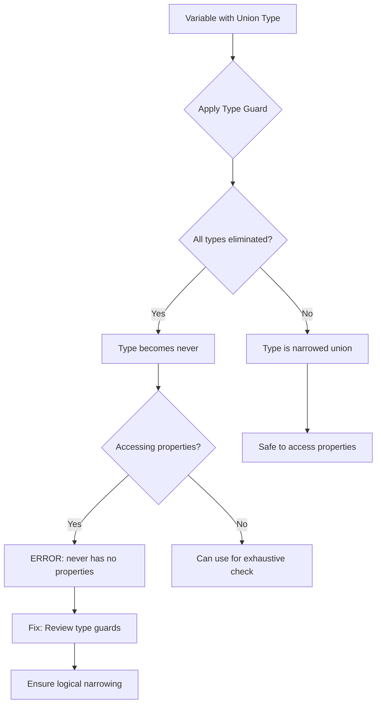

# How to Fix "Type 'never' Has No Properties" Errors

Author: [nawazdhandala](https://www.github.com/nawazdhandala)

Tags: TypeScript, Never Type, Type Errors, Type Narrowing, Debugging, Type Safety

Description: Understand and resolve the TypeScript error about type never having no properties through proper type narrowing and guards.

---

The "Type 'never' has no properties" error occurs when TypeScript infers that a variable can never have a valid value at a certain point in your code. This guide explains common causes and solutions for this error.

## Understanding the `never` Type

The `never` type represents values that never occur. TypeScript uses it for exhausted type narrowing and functions that never return.



## Common Cause 1: Impossible Type Narrowing

This error often appears after multiple type guards that eliminate all possibilities.

```typescript
// Example of impossible narrowing
function processValue(value: string | number) {
  if (typeof value === 'string') {
    // value is string here
    console.log(value.toUpperCase());
  } else if (typeof value === 'number') {
    // value is number here
    console.log(value.toFixed(2));
  } else {
    // value is never here - all cases handled
    // ERROR: Type 'never' has no properties
    console.log(value.someProperty);  // Error!
  }
}
```

```typescript
// Fix: Remove the unreachable else branch
function processValue(value: string | number) {
  if (typeof value === 'string') {
    console.log(value.toUpperCase());
  } else {
    // value is number here (no need for additional check)
    console.log(value.toFixed(2));
  }
}
```

## Common Cause 2: Incorrect Type Guards

Type guards that narrow types incorrectly can lead to `never`.

```typescript
interface Cat {
  meow: () => void;
  purr: () => void;
}

interface Dog {
  bark: () => void;
  fetch: () => void;
}

type Pet = Cat | Dog;

// Incorrect type guard
function isCat(pet: Pet): pet is Cat {
  // This guard incorrectly checks for a property that both might have
  return 'name' in pet;  // Wrong property check
}

function handlePet(pet: Pet) {
  if (isCat(pet)) {
    pet.meow();
  } else if (!isCat(pet)) {
    // If type guard is always true or always false,
    // this branch might become 'never'
    pet.bark();  // Could error if type inference fails
  }
}
```

```typescript
// Fix: Use correct type guards
function isCat(pet: Pet): pet is Cat {
  // Check for a property unique to Cat
  return 'meow' in pet;
}

function isDog(pet: Pet): pet is Dog {
  // Check for a property unique to Dog
  return 'bark' in pet;
}

function handlePet(pet: Pet) {
  if (isCat(pet)) {
    pet.meow();
    pet.purr();
  } else {
    // TypeScript knows pet is Dog here
    pet.bark();
    pet.fetch();
  }
}
```

## Type Guard Flow



## Common Cause 3: Empty Array Access

Accessing elements of an empty array type results in `never`.

```typescript
// Empty array type
const emptyArray: [] = [];

// ERROR: Type 'never' has no properties
// Because emptyArray[0] is type 'never'
const first = emptyArray[0];
console.log(first.toString());  // Error!
```

```typescript
// Fix: Use proper array types
const numbers: number[] = [];

// Check array length before accessing
if (numbers.length > 0) {
  // TypeScript still infers number here
  const first = numbers[0];
  console.log(first.toString());  // Works
}

// Or use optional chaining with nullish coalescing
const firstOrDefault = numbers[0] ?? 0;
console.log(firstOrDefault.toString());  // Works
```

## Common Cause 4: Intersection of Incompatible Types

Intersecting incompatible types results in `never`.

```typescript
// Incompatible intersection
type StringAndNumber = string & number;  // Type is 'never'

// This will cause errors
function impossible(value: StringAndNumber) {
  // ERROR: Type 'never' has no properties
  console.log(value.length);  // Error!
}
```

```typescript
// Fix: Use union instead of intersection for either/or
type StringOrNumber = string | number;

function possible(value: StringOrNumber) {
  if (typeof value === 'string') {
    console.log(value.length);  // Works
  } else {
    console.log(value.toFixed(2));  // Works
  }
}
```

## Common Cause 5: Exhaustive Switch Statements

Switch statements that cover all cases leave `never` in the default.

```typescript
type Status = 'pending' | 'success' | 'error';

function getStatusMessage(status: Status): string {
  switch (status) {
    case 'pending':
      return 'Loading...';
    case 'success':
      return 'Done!';
    case 'error':
      return 'Failed!';
    default:
      // status is 'never' here - all cases handled
      // This is actually useful for exhaustive checking
      const exhaustiveCheck: never = status;
      throw new Error(`Unhandled status: ${exhaustiveCheck}`);
  }
}
```

```typescript
// Using exhaustive check pattern properly
function assertNever(value: never): never {
  throw new Error(`Unexpected value: ${value}`);
}

type Shape =
  | { kind: 'circle'; radius: number }
  | { kind: 'square'; side: number }
  | { kind: 'rectangle'; width: number; height: number };

function getArea(shape: Shape): number {
  switch (shape.kind) {
    case 'circle':
      return Math.PI * shape.radius ** 2;
    case 'square':
      return shape.side ** 2;
    case 'rectangle':
      return shape.width * shape.height;
    default:
      // If a new shape is added but not handled,
      // TypeScript will error here
      return assertNever(shape);
  }
}
```

## Exhaustive Check Pattern



## Common Cause 6: Generic Type Constraints

Generic types with impossible constraints result in `never`.

```typescript
// Impossible constraint
type ImpossibleGeneric<T extends string & number> = T;
// T is constrained to 'never'

// Fix: Use union for flexible constraints
type FlexibleGeneric<T extends string | number> = T;

// Or use separate type parameters
type TwoParams<S extends string, N extends number> = {
  stringValue: S;
  numberValue: N;
};
```

## Common Cause 7: Conditional Types Evaluating to Never

Conditional types can evaluate to `never` in certain conditions.

```typescript
// Conditional type that can be never
type ExtractString<T> = T extends string ? T : never;

// When used with non-string types
type Result = ExtractString<number>;  // Type is 'never'

function processResult(result: Result) {
  // ERROR: Cannot access properties of 'never'
  console.log(result.length);  // Error!
}
```

```typescript
// Fix: Handle the never case or use different approach
type ExtractString<T> = T extends string ? T : string;

// Or use union with fallback
type SafeExtractString<T> = T extends string ? T : never;
type StringOrFallback<T> = SafeExtractString<T> extends never ? string : SafeExtractString<T>;

// Better approach: Check for never before use
type IsNever<T> = [T] extends [never] ? true : false;

type CheckResult = IsNever<ExtractString<number>>;  // true
```

## Debugging Never Type Errors

Here is a systematic approach to debug `never` type errors.

```typescript
// Step 1: Identify where 'never' comes from
type DebugType<T> = T;

function debugNever(value: string | number) {
  if (typeof value === 'string') {
    const stringValue: DebugType<typeof value> = value;
    // Hover over stringValue to see it's 'string'
  } else if (typeof value === 'number') {
    const numberValue: DebugType<typeof value> = value;
    // Hover over numberValue to see it's 'number'
  } else {
    const neverValue: DebugType<typeof value> = value;
    // Hover over neverValue to see it's 'never'
  }
}
```

```typescript
// Step 2: Use type assertions carefully for debugging
function temporaryFix(value: unknown) {
  // Type assertion to bypass never error (temporary fix only!)
  const typed = value as { property: string };
  console.log(typed.property);

  // Better: Add proper type guards
  if (isValidObject(value)) {
    console.log(value.property);
  }
}

function isValidObject(value: unknown): value is { property: string } {
  return (
    typeof value === 'object' &&
    value !== null &&
    'property' in value &&
    typeof (value as { property: unknown }).property === 'string'
  );
}
```

## Type Narrowing Decision Tree



## Prevention Strategies

```typescript
// Strategy 1: Use discriminated unions
interface SuccessResponse {
  status: 'success';
  data: unknown;
}

interface ErrorResponse {
  status: 'error';
  message: string;
}

type ApiResponse = SuccessResponse | ErrorResponse;

function handleResponse(response: ApiResponse) {
  // Discriminated union prevents 'never' issues
  if (response.status === 'success') {
    console.log(response.data);
  } else {
    console.log(response.message);
  }
}
```

```typescript
// Strategy 2: Use assertion functions
function assertIsDefined<T>(value: T | undefined | null): asserts value is T {
  if (value === undefined || value === null) {
    throw new Error('Value is not defined');
  }
}

function processData(data: string | undefined) {
  assertIsDefined(data);
  // data is string here, not 'never' or undefined
  console.log(data.toUpperCase());
}
```

```typescript
// Strategy 3: Use NonNullable utility type
type MaybeString = string | null | undefined;

function process(value: MaybeString) {
  // Use NonNullable to exclude null and undefined
  const defined: NonNullable<typeof value> | never =
    value ?? (() => { throw new Error('No value'); })();

  console.log(defined.toUpperCase());
}
```

## Summary

The "Type 'never' has no properties" error indicates that TypeScript has determined a value cannot exist at that point in your code. Common causes include overly restrictive type narrowing that eliminates all possibilities, incorrect type guards that do not properly discriminate types, empty array access, impossible type intersections, and conditional types evaluating to never. To fix these errors, review your type guards and narrowing logic, use discriminated unions for complex types, implement exhaustive checking patterns intentionally, and use assertion functions for runtime validation. Understanding the `never` type is essential for writing type-safe TypeScript code.
