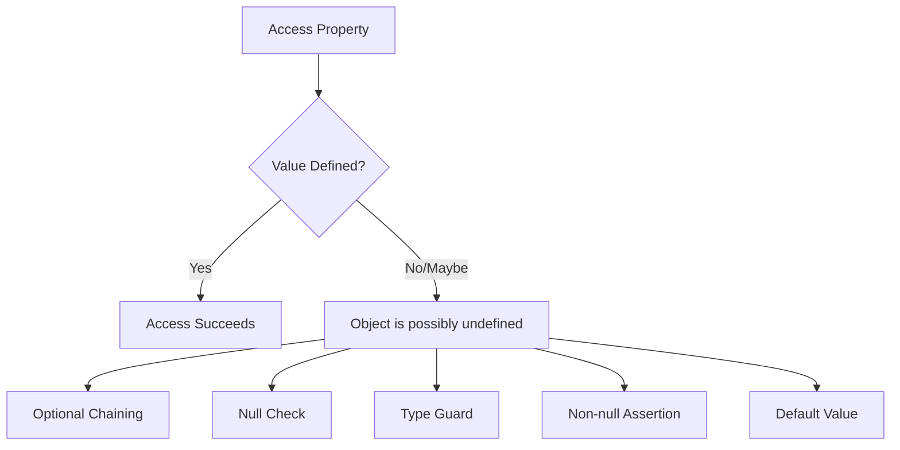
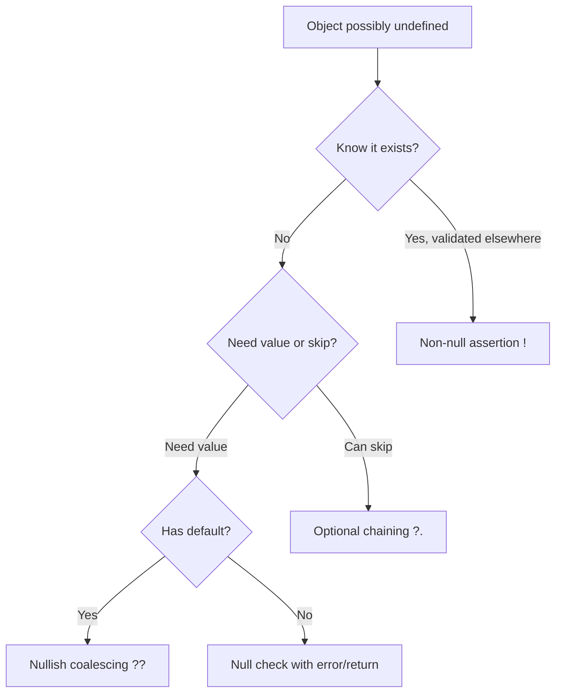

# How to Fix "Object Is Possibly Undefined" Errors

Author: [nawazdhandala](https://www.github.com/nawazdhandala)

Tags: TypeScript, Type Safety, Null Checks, JavaScript, Error Handling

Description: A practical guide to handling TypeScript's "Object is possibly undefined" error with safe coding patterns and best practices.

---

> The "Object is possibly undefined" error is one of the most common TypeScript errors when strict null checks are enabled. This error protects you from runtime errors by forcing you to handle cases where values might not exist. This guide covers all the ways to safely handle potentially undefined values.

Understanding why this error occurs and how to fix it properly leads to more robust code. TypeScript's strict null checking catches potential null pointer exceptions at compile time rather than at runtime.

---

## Understanding the Error



This error appears when you try to access a property or method on a value that TypeScript knows could be `undefined` or `null`.

```typescript
interface User {
    profile?: {
        avatar?: string;
        bio?: string;
    };
}

function getAvatar(user: User): string {
    // ERROR: Object is possibly 'undefined'
    return user.profile.avatar;
}
```

---

## Solution 1: Optional Chaining (?.)

The safest and most concise way to access nested properties.

```typescript
interface User {
    profile?: {
        avatar?: string;
        bio?: string;
        settings?: {
            theme?: string;
        };
    };
}

function getAvatar(user: User): string | undefined {
    // Safe access - returns undefined if any part is missing
    return user.profile?.avatar;
}

function getTheme(user: User): string | undefined {
    // Chain multiple optional accesses
    return user.profile?.settings?.theme;
}

// Works with method calls too
interface Document {
    metadata?: {
        getTitle?(): string;
    };
}

function getTitle(doc: Document): string | undefined {
    return doc.metadata?.getTitle?.();
}

// Works with array access
interface Data {
    items?: string[];
}

function getFirstItem(data: Data): string | undefined {
    return data.items?.[0];
}
```

---

## Solution 2: Nullish Coalescing (??)

Provide default values when encountering null or undefined.

```typescript
interface Config {
    timeout?: number;
    retries?: number;
    baseUrl?: string;
}

function getTimeout(config: Config): number {
    // Returns 5000 if timeout is null or undefined
    return config.timeout ?? 5000;
}

function getBaseUrl(config: Config): string {
    // Combine with optional chaining
    return config.baseUrl ?? 'https://api.example.com';
}

// Important: ?? is different from ||
// ?? only checks for null/undefined
// || checks for any falsy value (0, '', false, etc.)

const config: Config = { timeout: 0, retries: 0 };

config.timeout ?? 5000;   // Returns 0 (0 is not null/undefined)
config.timeout || 5000;   // Returns 5000 (0 is falsy)
```

### Combined Pattern

```typescript
interface User {
    settings?: {
        theme?: string;
        fontSize?: number;
    };
}

function getTheme(user: User): string {
    // Safe access with default
    return user.settings?.theme ?? 'light';
}

function getFontSize(user: User): number {
    return user.settings?.fontSize ?? 14;
}
```

---

## Solution 3: Type Guards and Null Checks

Explicitly check for undefined before accessing properties.

```typescript
interface User {
    profile?: {
        avatar: string;
        bio: string;
    };
}

// Simple null check
function getAvatar(user: User): string {
    if (user.profile !== undefined) {
        // TypeScript knows profile is defined here
        return user.profile.avatar;
    }
    return 'default-avatar.png';
}

// Alternative: check for truthiness
function getBio(user: User): string {
    if (user.profile) {
        return user.profile.bio;
    }
    return 'No bio available';
}

// Early return pattern
function processUser(user: User | undefined): void {
    if (!user) {
        console.log('No user provided');
        return;
    }

    // TypeScript knows user is defined here
    console.log(user.profile);
}
```

### Type Guard Functions

```typescript
interface User {
    id: number;
    profile?: {
        avatar: string;
    };
}

// Custom type guard
function hasProfile(user: User): user is User & { profile: { avatar: string } } {
    return user.profile !== undefined;
}

function getAvatar(user: User): string {
    if (hasProfile(user)) {
        // TypeScript knows user.profile is defined
        return user.profile.avatar;
    }
    return 'default-avatar.png';
}

// Generic type guard for defined values
function isDefined<T>(value: T | undefined | null): value is T {
    return value !== undefined && value !== null;
}

function processItems(items: (string | undefined)[]): string[] {
    return items.filter(isDefined);  // Type: string[]
}
```

---

## Solution 4: The in Operator

Check if a property exists in an object.

```typescript
interface BasicUser {
    id: number;
    name: string;
}

interface PremiumUser extends BasicUser {
    subscription: {
        plan: string;
        expiresAt: Date;
    };
}

function getSubscriptionPlan(user: BasicUser | PremiumUser): string {
    if ('subscription' in user) {
        // TypeScript knows user is PremiumUser
        return user.subscription.plan;
    }
    return 'free';
}
```

---

## Solution 5: Non-null Assertion (!)

Use when you are certain a value is defined but TypeScript cannot verify it.

```typescript
interface Config {
    apiKey?: string;
}

// CAUTION: Only use when you're certain the value exists
function callApi(config: Config): void {
    // You've validated this elsewhere or in initialization
    const key = config.apiKey!;  // Assert non-null
    fetch(`/api?key=${key}`);
}

// Better: Validate and throw if missing
function callApiSafe(config: Config): void {
    if (!config.apiKey) {
        throw new Error('API key is required');
    }
    // TypeScript knows apiKey is defined after the check
    fetch(`/api?key=${config.apiKey}`);
}
```

**Warning:** Non-null assertions bypass TypeScript's safety checks. Use them sparingly and only when you have guaranteed the value exists through other means.

---

## Common Scenarios and Fixes

### Array Methods

```typescript
interface User {
    id: number;
    name: string;
}

const users: User[] = [
    { id: 1, name: 'Alice' },
    { id: 2, name: 'Bob' }
];

// ERROR: Object is possibly 'undefined'
const user = users.find(u => u.id === 1);
console.log(user.name);  // Error!

// Solution 1: Optional chaining
console.log(user?.name);

// Solution 2: Null check
if (user) {
    console.log(user.name);
}

// Solution 3: Default value
const foundUser = users.find(u => u.id === 1) ?? { id: 0, name: 'Unknown' };
console.log(foundUser.name);  // Safe

// Solution 4: Assert when you know it exists
const knownUser = users.find(u => u.id === 1)!;  // Use carefully
```

### Map Access

```typescript
const userMap = new Map<string, User>();
userMap.set('user1', { id: 1, name: 'Alice' });

// ERROR: Object is possibly 'undefined'
const user = userMap.get('user1');
console.log(user.name);  // Error!

// Solution 1: Check existence
if (userMap.has('user1')) {
    const user = userMap.get('user1')!;  // Safe after has() check
    console.log(user.name);
}

// Solution 2: Null check
const user = userMap.get('user1');
if (user) {
    console.log(user.name);
}

// Solution 3: Optional chaining
console.log(userMap.get('user1')?.name);
```

### Object Index Access

```typescript
interface StringMap {
    [key: string]: string | undefined;  // Explicit undefined
}

// Or with noUncheckedIndexedAccess in tsconfig
interface StringMap {
    [key: string]: string;
}

const map: StringMap = { foo: 'bar' };

// ERROR: Object is possibly 'undefined'
console.log(map['foo'].toUpperCase());  // Error!

// Solution 1: Null check
const value = map['foo'];
if (value) {
    console.log(value.toUpperCase());
}

// Solution 2: Optional chaining
console.log(map['foo']?.toUpperCase());

// Solution 3: Default value
console.log((map['foo'] ?? '').toUpperCase());
```

---

## Function Parameters

```typescript
// Optional parameter
function greet(name?: string): string {
    // ERROR: Object is possibly 'undefined'
    return `Hello, ${name.toUpperCase()}!`;  // Error!
}

// Solution 1: Default parameter
function greet(name: string = 'Guest'): string {
    return `Hello, ${name.toUpperCase()}!`;
}

// Solution 2: Null check
function greet(name?: string): string {
    if (!name) {
        return 'Hello, Guest!';
    }
    return `Hello, ${name.toUpperCase()}!`;
}

// Solution 3: Nullish coalescing
function greet(name?: string): string {
    return `Hello, ${(name ?? 'Guest').toUpperCase()}!`;
}
```

---

## Class Properties

```typescript
class UserService {
    private user?: User;

    async loadUser(id: number): Promise<void> {
        this.user = await fetchUser(id);
    }

    // ERROR: Object is possibly 'undefined'
    getName(): string {
        return this.user.name;  // Error!
    }

    // Solution 1: Guard with error
    getName(): string {
        if (!this.user) {
            throw new Error('User not loaded');
        }
        return this.user.name;
    }

    // Solution 2: Return optional
    getName(): string | undefined {
        return this.user?.name;
    }

    // Solution 3: Ensure loaded before use
    getNameSafe(): string {
        this.ensureLoaded();
        return this.user!.name;  // Safe after ensureLoaded
    }

    private ensureLoaded(): asserts this is this & { user: User } {
        if (!this.user) {
            throw new Error('User not loaded. Call loadUser first.');
        }
    }
}
```

---

## Best Practices Flow



---

## Configuration

Enable strict null checks in tsconfig.json for these errors to appear:

```json
{
    "compilerOptions": {
        "strict": true,
        // Or individually:
        "strictNullChecks": true
    }
}
```

With `strictNullChecks` disabled, TypeScript will not catch these potential issues, leading to possible runtime errors.

---

## Summary of Solutions

| Pattern | Use Case | Example |
|---------|----------|---------|
| `?.` Optional chaining | Safe property access | `user?.profile?.avatar` |
| `??` Nullish coalescing | Default values | `value ?? 'default'` |
| `if (x)` Null check | Explicit handling | `if (user) { ... }` |
| `!` Non-null assertion | Known to exist | `user!.name` (careful!) |
| Type guard | Complex validation | `function isDefined(x)` |
| Default parameter | Function params | `function f(x = 'default')` |

---

## Conclusion

The "Object is possibly undefined" error is TypeScript protecting you from null reference errors. Instead of fighting it with non-null assertions, embrace the safer patterns: optional chaining, nullish coalescing, and proper null checks.

The key is to think about what should happen when a value is undefined. Sometimes you want a default value, sometimes you want to skip the operation, and sometimes you want to throw an error. TypeScript forces you to make this decision explicitly, leading to more robust code.

---

*Want to catch errors in production that slip past type checking? [OneUptime](https://oneuptime.com) provides comprehensive error tracking and monitoring for your applications.*

**Related Reading:**
- [How to Fix "Type 'X' Is Not Assignable to Type 'Y'" Errors](https://oneuptime.com/blog)
- [How to Handle Generic Types in TypeScript](https://oneuptime.com/blog)
