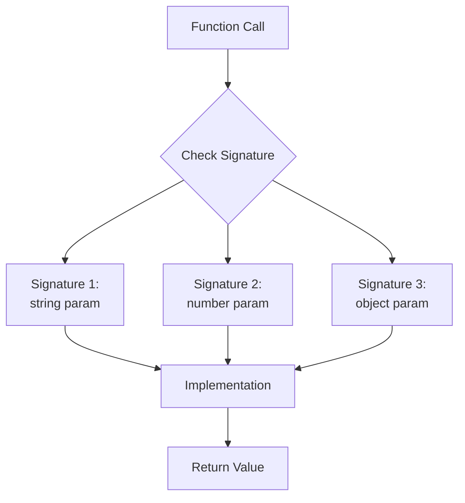
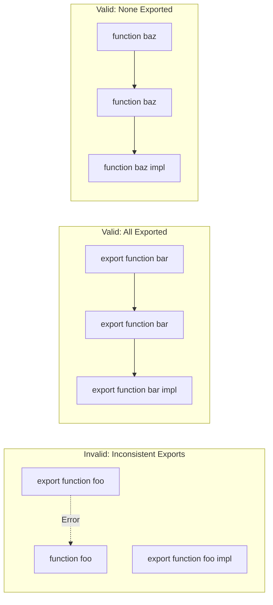
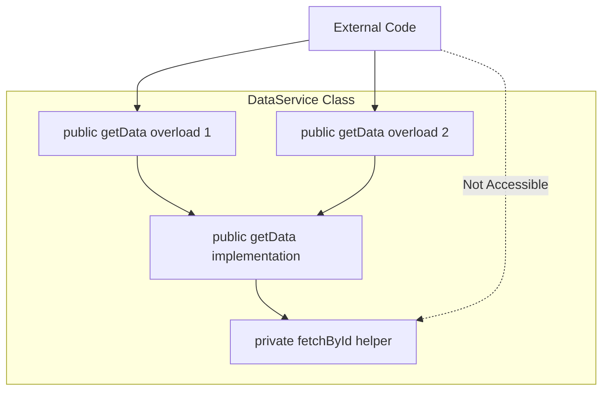
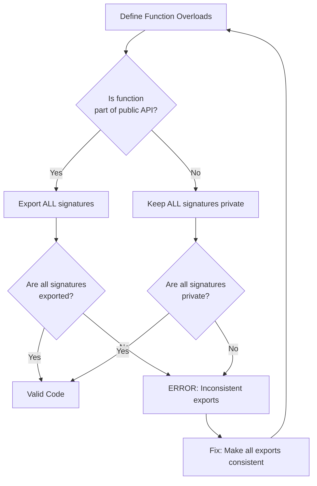

# How to Fix 'Overload Signatures Must All Be Exported'

Author: [nawazdhandala](https://www.github.com/nawazdhandala)

Tags: TypeScript, Function Overloading, Export, Errors, Type Safety, Troubleshooting

Description: Learn how to resolve the TypeScript error requiring all overload signatures to share the same export modifier.

---

The "Overload signatures must all be exported" error occurs when function overloads have inconsistent export modifiers. This guide explains why this error happens and how to fix it properly.

## Understanding Function Overloading

Function overloading in TypeScript allows you to define multiple signatures for a single function, enabling it to accept different parameter types and return different types accordingly.



## The Error Explained

This error occurs when some overload signatures are exported while others are not.

```typescript
// This code causes the error
// ERROR: Overload signatures must all be exported

export function processData(data: string): string;
function processData(data: number): number;  // Missing export!
function processData(data: string | number): string | number {
  if (typeof data === 'string') {
    return data.toUpperCase();
  }
  return data * 2;
}
```

## The Fix: Consistent Export Modifiers

All overload signatures and the implementation must have matching export modifiers.

```typescript
// Solution 1: Export all signatures

// First overload signature (exported)
export function processData(data: string): string;
// Second overload signature (exported)
export function processData(data: number): number;
// Implementation signature (exported)
export function processData(data: string | number): string | number {
  if (typeof data === 'string') {
    return data.toUpperCase();
  }
  return data * 2;
}
```

```typescript
// Solution 2: Keep all signatures private (no export)

// First overload signature (not exported)
function processData(data: string): string;
// Second overload signature (not exported)
function processData(data: number): number;
// Implementation signature (not exported)
function processData(data: string | number): string | number {
  if (typeof data === 'string') {
    return data.toUpperCase();
  }
  return data * 2;
}
```

## Export Modifier Consistency Diagram



## Real-World Example: API Response Handler

Here is a practical example of properly exported function overloads.

```typescript
// types.ts
export interface User {
  id: number;
  name: string;
  email: string;
}

export interface Product {
  id: number;
  name: string;
  price: number;
}

export interface ApiResponse<T> {
  data: T;
  status: number;
  message: string;
}
```

```typescript
// api-handler.ts
import { User, Product, ApiResponse } from './types';

// All overload signatures must be exported
export function fetchData(endpoint: 'users'): Promise<ApiResponse<User[]>>;
export function fetchData(endpoint: 'products'): Promise<ApiResponse<Product[]>>;
export function fetchData(endpoint: 'users' | 'products'): Promise<ApiResponse<User[] | Product[]>>;
// Implementation is also exported
export async function fetchData(
  endpoint: 'users' | 'products'
): Promise<ApiResponse<User[] | Product[]>> {
  const response = await fetch(`/api/${endpoint}`);
  const data = await response.json();

  return {
    data,
    status: response.status,
    message: response.ok ? 'Success' : 'Error',
  };
}
```

## Class Method Overloading

The same rule applies to class methods with visibility modifiers.

```typescript
// Incorrect: Mixed visibility modifiers
class DataService {
  public getData(id: number): Promise<object>;
  private getData(id: string): Promise<object>;  // ERROR: inconsistent
  getData(id: number | string): Promise<object> {
    // implementation
  }
}
```

```typescript
// Correct: Consistent visibility modifiers
class DataService {
  // All signatures are public
  public getData(id: number): Promise<object>;
  public getData(id: string): Promise<object>;
  public getData(ids: number[]): Promise<object[]>;
  // Implementation with consistent visibility
  public getData(
    idOrIds: number | string | number[]
  ): Promise<object | object[]> {
    if (Array.isArray(idOrIds)) {
      // Handle array of IDs
      return Promise.all(idOrIds.map(id => this.fetchById(id)));
    }
    // Handle single ID
    return this.fetchById(idOrIds);
  }

  private async fetchById(id: number | string): Promise<object> {
    const response = await fetch(`/api/data/${id}`);
    return response.json();
  }
}
```

## Class Method Visibility Flow



## Interface Method Overloading

When implementing interfaces with overloaded methods, ensure consistency.

```typescript
// Define interface with overloaded method
interface StringFormatter {
  format(value: string): string;
  format(value: number): string;
  format(value: Date): string;
}

// Implementation must match interface signatures
class Formatter implements StringFormatter {
  // All methods are implicitly public (matching interface)
  format(value: string): string;
  format(value: number): string;
  format(value: Date): string;
  format(value: string | number | Date): string {
    if (typeof value === 'string') {
      return value.trim();
    }
    if (typeof value === 'number') {
      return value.toFixed(2);
    }
    return value.toISOString();
  }
}
```

## Module Exports Pattern

When organizing code into modules, consider export patterns carefully.

```typescript
// internal-utils.ts
// Keep internal helpers private (no export)
function validateInput(input: unknown): boolean;
function validateInput(input: unknown, strict: boolean): boolean;
function validateInput(input: unknown, strict?: boolean): boolean {
  if (strict) {
    return input !== null && input !== undefined && input !== '';
  }
  return input !== null && input !== undefined;
}

// Export a public API that uses internal overloads
export function processInput(input: unknown): string {
  if (!validateInput(input, true)) {
    throw new Error('Invalid input');
  }
  return String(input);
}
```

```typescript
// public-api.ts
// All public API overloads are exported

// Overload for string input
export function transform(input: string): string;
// Overload for number input
export function transform(input: number): string;
// Overload for array input
export function transform(input: unknown[]): string[];
// Implementation handles all cases
export function transform(
  input: string | number | unknown[]
): string | string[] {
  if (Array.isArray(input)) {
    return input.map(item => String(item));
  }
  return String(input);
}
```

## Common Patterns and Solutions

### Pattern 1: Converting Class Methods to Standalone Functions

```typescript
// Before: Class with mixed visibility (incorrect)
class Processor {
  public process(data: string): string;
  private process(data: number): number;  // ERROR
  process(data: string | number): string | number {
    // ...
  }
}

// After: Separate public and private functions
export function processString(data: string): string {
  return data.toUpperCase();
}

export function processNumber(data: number): number {
  return data * 2;
}

// Internal helper (not exported)
function processAny(data: string | number): string | number {
  if (typeof data === 'string') {
    return processString(data);
  }
  return processNumber(data);
}
```

### Pattern 2: Using Generic Functions Instead of Overloads

```typescript
// Instead of multiple overloads
export function parse<T extends string | number | boolean>(
  value: string,
  type: 'string' | 'number' | 'boolean'
): T {
  switch (type) {
    case 'string':
      return value as T;
    case 'number':
      return Number(value) as T;
    case 'boolean':
      return (value === 'true') as T;
  }
}

// Usage
const str = parse<string>('hello', 'string');  // string
const num = parse<number>('42', 'number');     // number
const bool = parse<boolean>('true', 'boolean'); // boolean
```

## Decision Flow for Export Modifiers



## Summary

The "Overload signatures must all be exported" error is straightforward to fix once you understand the rule: all overload signatures and the implementation must share the same export modifier. Whether you choose to export all signatures or keep them all private depends on your module design. Remember that this rule also applies to class methods with visibility modifiers such as public, private, and protected. When in doubt, consider whether the overloaded function is part of your public API, and make your export decisions accordingly.
