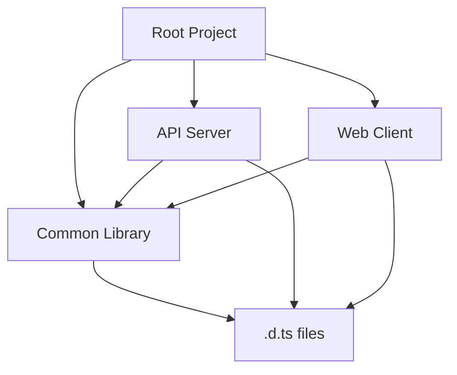
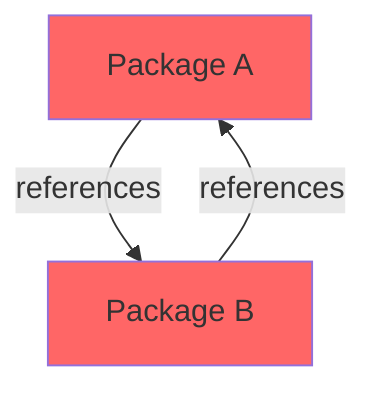
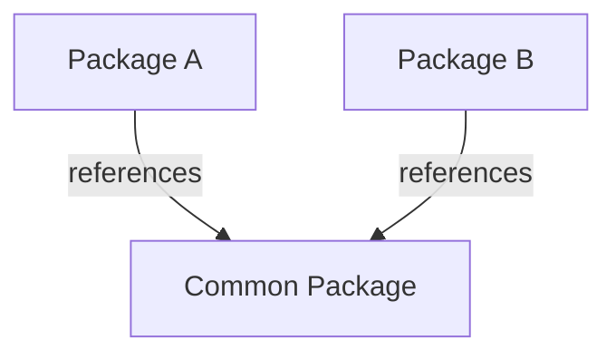

# How to Configure TypeScript Project References

Author: [nawazdhandala](https://github.com/nawazdhandala)

Tags: TypeScript, Project References, Monorepo, Build Optimization, Code Organization, Compiler Configuration

Description: Learn how to configure TypeScript project references to improve build times, enforce module boundaries, and manage large codebases effectively.

---

## Introduction

As TypeScript projects grow in size, build times can become a significant bottleneck in your development workflow. TypeScript project references provide a way to structure your codebase into smaller, independently buildable pieces that reference each other. This enables incremental builds, better code organization, and faster compile times.

This guide covers how to configure project references from scratch, including common patterns for monorepo setups and troubleshooting typical configuration issues.

## Understanding Project References

### What Are Project References?

Project references allow you to split a large TypeScript project into smaller projects that depend on each other. Each sub-project has its own `tsconfig.json` and can be built independently. TypeScript tracks the dependencies between projects and only rebuilds what has changed.

### Benefits of Project References

The key advantages include:

- **Faster incremental builds**: Only modified projects and their dependents are rebuilt
- **Logical separation**: Enforce boundaries between different parts of your codebase
- **Better editor performance**: Editors can load smaller project contexts
- **Independent deployability**: Build and deploy sub-projects separately

### How It Works

When you use project references, TypeScript creates `.d.ts` declaration files and `.tsbuildinfo` files for each project. The declaration files allow dependent projects to type-check without accessing the source files directly, while the build info files track what has changed for incremental compilation.



## Basic Configuration

### Setting Up a Simple Multi-Project Structure

Consider a project with shared utilities, a server, and a client application. Here is the directory structure:

```
my-project/
  tsconfig.json           # Root config
  packages/
    common/
      tsconfig.json       # Common library config
      src/
        index.ts
        utils.ts
    server/
      tsconfig.json       # Server config
      src/
        index.ts
    client/
      tsconfig.json       # Client config
      src/
        index.ts
```

### Root tsconfig.json

The root configuration file references all sub-projects and uses the `references` array:

```json
{
  "files": [],
  "references": [
    { "path": "./packages/common" },
    { "path": "./packages/server" },
    { "path": "./packages/client" }
  ]
}
```

The empty `files` array is important because the root config does not compile anything directly. It only orchestrates the build of referenced projects.

### Common Library Configuration

The shared library needs `composite: true` to enable project references:

```json
{
  "compilerOptions": {
    "target": "ES2022",
    "module": "NodeNext",
    "moduleResolution": "NodeNext",
    "declaration": true,
    "declarationMap": true,
    "composite": true,
    "outDir": "./dist",
    "rootDir": "./src",
    "strict": true
  },
  "include": ["src/**/*"]
}
```

Key settings explained:

- `composite`: Required for project references. Enables incremental compilation and declaration file generation
- `declaration`: Generates `.d.ts` files that dependent projects use for type checking
- `declarationMap`: Creates source maps for declarations, enabling "Go to Definition" to navigate to source files

### Server Configuration with References

The server project references the common library:

```json
{
  "compilerOptions": {
    "target": "ES2022",
    "module": "NodeNext",
    "moduleResolution": "NodeNext",
    "declaration": true,
    "declarationMap": true,
    "composite": true,
    "outDir": "./dist",
    "rootDir": "./src",
    "strict": true
  },
  "include": ["src/**/*"],
  "references": [
    { "path": "../common" }
  ]
}
```

### Importing Across Projects

With project references configured, you can import from the common package:

```typescript
// packages/server/src/index.ts
// Import from the common library using the package name or relative path
import { formatDate, parseConfig } from "../../common/src";

// Or if you have package.json exports configured
import { formatDate, parseConfig } from "@myproject/common";

const config = parseConfig("./config.json");
console.log(`Server started at ${formatDate(new Date())}`);
```

## Building with Project References

### Using tsc --build

The `--build` flag (or `-b`) is required when working with project references:

```bash
# Build all projects in dependency order
tsc --build

# Build with verbose output to see what is happening
tsc --build --verbose

# Force a clean rebuild of all projects
tsc --build --force

# Clean all build outputs
tsc --build --clean

# Build in watch mode for development
tsc --build --watch
```

### Understanding Build Order

TypeScript automatically determines the correct build order based on the dependency graph. If you run `tsc -b --verbose`, you will see output like:

```
Projects in this build:
  * packages/common/tsconfig.json
  * packages/server/tsconfig.json
  * packages/client/tsconfig.json

Building project 'packages/common/tsconfig.json'...
Building project 'packages/server/tsconfig.json'...
Building project 'packages/client/tsconfig.json'...
```

### Incremental Builds

After the initial build, subsequent builds only recompile changed projects:

```bash
# Make a change to common/src/utils.ts
echo "// comment" >> packages/common/src/utils.ts

# Rebuild - only common and its dependents are rebuilt
tsc --build --verbose

# Output shows:
# Project 'packages/common/tsconfig.json' is out of date because output 'packages/common/dist/utils.js' is older than input 'packages/common/src/utils.ts'
# Building project 'packages/common/tsconfig.json'...
# Project 'packages/server/tsconfig.json' is out of date because its dependency 'packages/common' was rebuilt
# Building project 'packages/server/tsconfig.json'...
```

## Advanced Configuration Patterns

### Shared Compiler Options with Extends

Avoid duplicating compiler options by using a base configuration:

```json
// tsconfig.base.json
{
  "compilerOptions": {
    "target": "ES2022",
    "module": "NodeNext",
    "moduleResolution": "NodeNext",
    "declaration": true,
    "declarationMap": true,
    "composite": true,
    "strict": true,
    "esModuleInterop": true,
    "skipLibCheck": true,
    "forceConsistentCasingInFileNames": true
  }
}
```

Sub-projects extend the base config:

```json
// packages/common/tsconfig.json
{
  "extends": "../../tsconfig.base.json",
  "compilerOptions": {
    "outDir": "./dist",
    "rootDir": "./src"
  },
  "include": ["src/**/*"]
}
```

### Path Aliases with Project References

Configure path aliases to use clean import paths:

```json
// tsconfig.base.json
{
  "compilerOptions": {
    "baseUrl": ".",
    "paths": {
      "@common/*": ["packages/common/src/*"],
      "@server/*": ["packages/server/src/*"],
      "@client/*": ["packages/client/src/*"]
    }
  }
}
```

Note that path aliases require a module bundler or path resolution tool at runtime. For Node.js, you might use `tsconfig-paths` or configure the paths in your build tool.

### Separate Configurations for Build and Editor

Sometimes you need different configurations for building versus editor support. Create a solution-level config for the editor:

```json
// tsconfig.json (for editor)
{
  "compilerOptions": {
    "target": "ES2022",
    "module": "NodeNext",
    "moduleResolution": "NodeNext",
    "strict": true,
    "baseUrl": ".",
    "paths": {
      "@common/*": ["packages/common/src/*"],
      "@server/*": ["packages/server/src/*"]
    }
  },
  "include": ["packages/*/src/**/*"],
  "references": [
    { "path": "./packages/common" },
    { "path": "./packages/server" },
    { "path": "./packages/client" }
  ]
}
```

```json
// tsconfig.build.json (for building)
{
  "files": [],
  "references": [
    { "path": "./packages/common" },
    { "path": "./packages/server" },
    { "path": "./packages/client" }
  ]
}
```

Build using the dedicated config:

```bash
tsc --build tsconfig.build.json
```

## Monorepo Integration

### With npm/yarn/pnpm Workspaces

Project references work well with package manager workspaces. Here is a typical setup:

```json
// package.json
{
  "name": "my-monorepo",
  "private": true,
  "workspaces": [
    "packages/*"
  ],
  "scripts": {
    "build": "tsc --build",
    "build:watch": "tsc --build --watch",
    "clean": "tsc --build --clean"
  }
}
```

```json
// packages/common/package.json
{
  "name": "@myproject/common",
  "version": "1.0.0",
  "main": "./dist/index.js",
  "types": "./dist/index.d.ts",
  "exports": {
    ".": {
      "types": "./dist/index.d.ts",
      "import": "./dist/index.js",
      "require": "./dist/index.cjs"
    }
  }
}
```

### With Nx or Turborepo

Build tools like Nx and Turborepo can leverage TypeScript project references for even faster builds:

```json
// turbo.json
{
  "pipeline": {
    "build": {
      "dependsOn": ["^build"],
      "outputs": ["dist/**"]
    }
  }
}
```

## Troubleshooting Common Issues

### Error: Cannot Find Module

When you see module resolution errors, check that:

1. The referenced project has been built at least once
2. The `outDir` is correctly set and declaration files exist
3. The import path matches the package structure

```bash
# Ensure all projects are built
tsc --build --force
```

### Error: Output File Has Not Been Built from Source File

This error occurs when declaration files are stale. Clean and rebuild:

```bash
tsc --build --clean
tsc --build
```

### Circular Reference Detected

Project references cannot have circular dependencies. Restructure your code:



Solution: Extract shared code into a common package:



### Slow Initial Build

The first build compiles everything. To speed up development:

1. Use `--watch` mode during development
2. Configure `skipLibCheck: true` to skip checking node_modules
3. Ensure `incremental: true` is set (enabled by `composite`)

## Best Practices

### Keep Projects Focused

Each sub-project should have a clear responsibility. Avoid creating too many tiny projects as the overhead can outweigh the benefits.

### Use Consistent Output Directories

Maintain predictable output locations:

```json
{
  "compilerOptions": {
    "outDir": "./dist",
    "rootDir": "./src"
  }
}
```

### Include .tsbuildinfo in .gitignore

The build info files are machine-specific and should not be committed:

```
# .gitignore
*.tsbuildinfo
packages/*/dist/
```

### Document the Build Process

Add clear instructions in your README for building the project:

```bash
# Install dependencies
npm install

# Build all packages
npm run build

# Build in watch mode for development
npm run build:watch
```

## Conclusion

TypeScript project references are a powerful feature for managing large codebases. By splitting your code into smaller, independently buildable projects, you gain faster incremental builds, better code organization, and improved editor performance.

Key takeaways:

- Use `composite: true` in each sub-project's tsconfig
- Build with `tsc --build` to respect project dependencies
- Share common compiler options using `extends`
- Integrate with package manager workspaces for a complete monorepo setup
- Clean and rebuild when you encounter stale output errors

With proper configuration, project references can significantly improve your development experience in large TypeScript codebases.
