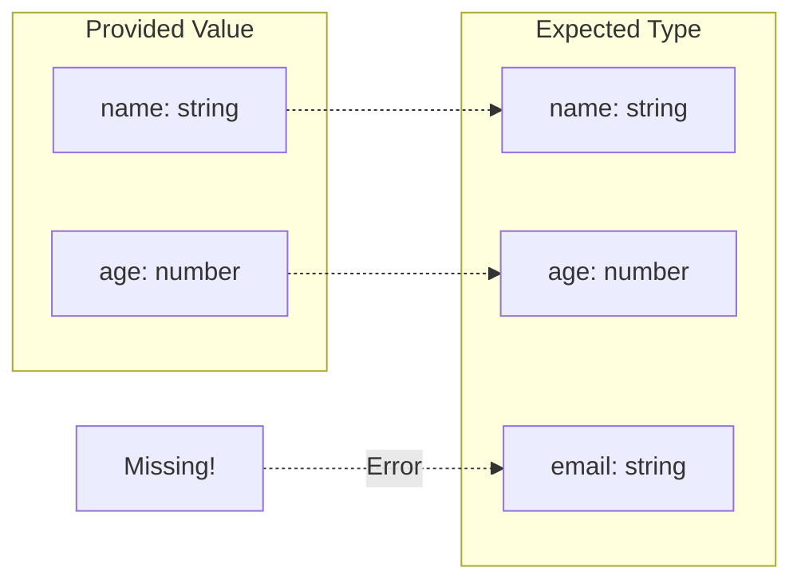
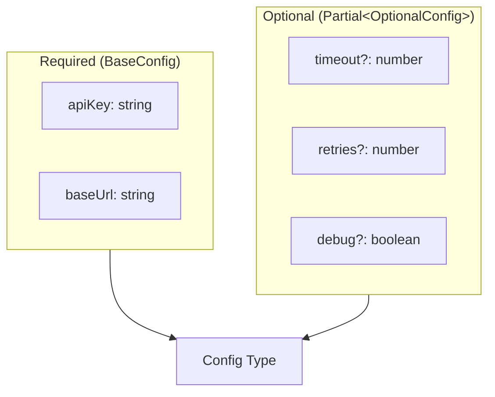

# How to Fix 'Property Is Missing in Type' Errors

Author: [nawazdhandala](https://www.github.com/nawazdhandala)

Tags: TypeScript, Type Errors, Debugging, Type Safety, Interfaces, Object Types

Description: Learn how to diagnose and fix common 'Property is missing in type' errors in TypeScript with practical solutions and best practices.

---

The "Property is missing in type" error is one of the most common TypeScript errors developers encounter. While it can be frustrating at first, this error is actually TypeScript doing its job - protecting you from runtime errors. This guide covers the various causes of this error and how to fix them properly.

## Understanding the Error

When you see an error like `Property 'x' is missing in type 'Y' but required in type 'Z'`, TypeScript is telling you that you are trying to use a value that does not have all the properties that the expected type requires.



## Common Causes and Solutions

### 1. Missing Required Properties

The most straightforward case - you forgot to include a required property:

```typescript
interface User {
    name: string;
    age: number;
    email: string;
}

// Error: Property 'email' is missing in type '{ name: string; age: number; }'
const user: User = {
    name: 'Alice',
    age: 30
};

// Fix: Add the missing property
const fixedUser: User = {
    name: 'Alice',
    age: 30,
    email: 'alice@example.com'
};
```

### 2. Optional Properties

If a property is not always required, mark it as optional with `?`:

```typescript
interface User {
    name: string;
    age: number;
    email?: string;  // Optional - no error if missing
}

// Now this works
const user: User = {
    name: 'Alice',
    age: 30
};
```

### 3. Function Parameter Mismatches

This error often appears when calling functions:

```typescript
interface Config {
    host: string;
    port: number;
    timeout: number;
}

function connect(config: Config): void {
    console.log(`Connecting to ${config.host}:${config.port}`);
}

// Error: Property 'timeout' is missing
connect({
    host: 'localhost',
    port: 3000
});

// Solution 1: Provide all required properties
connect({
    host: 'localhost',
    port: 3000,
    timeout: 5000
});

// Solution 2: Use default values with Partial
function connectWithDefaults(config: Partial<Config> & { host: string }): void {
    const fullConfig: Config = {
        host: config.host,
        port: config.port ?? 3000,
        timeout: config.timeout ?? 5000
    };
    console.log(`Connecting to ${fullConfig.host}:${fullConfig.port}`);
}

// Now this works
connectWithDefaults({ host: 'localhost' });
```

### 4. Interface Extension Issues

When extending interfaces, make sure you include properties from the parent:

```typescript
interface BaseEntity {
    id: string;
    createdAt: Date;
}

interface User extends BaseEntity {
    name: string;
    email: string;
}

// Error: Properties 'id' and 'createdAt' are missing
const user: User = {
    name: 'Alice',
    email: 'alice@example.com'
};

// Fix: Include all inherited properties
const fixedUser: User = {
    id: 'user-123',
    createdAt: new Date(),
    name: 'Alice',
    email: 'alice@example.com'
};
```

### 5. Type Narrowing Gone Wrong

Sometimes the error occurs because TypeScript cannot narrow the type correctly:

```typescript
interface Dog {
    kind: 'dog';
    bark: () => void;
}

interface Cat {
    kind: 'cat';
    meow: () => void;
}

type Pet = Dog | Cat;

function handlePet(pet: Pet) {
    // Error if you try to access bark without checking kind
    // pet.bark();  // Property 'bark' does not exist on type 'Cat'

    // Fix: Use type narrowing
    if (pet.kind === 'dog') {
        pet.bark();  // Now TypeScript knows it is a Dog
    }
}
```

## Advanced Solutions

### Using Pick to Select Properties

When you only need certain properties from a larger interface:

```typescript
interface FullUser {
    id: string;
    name: string;
    email: string;
    address: string;
    phone: string;
    createdAt: Date;
}

// Only require the properties you need
type UserSummary = Pick<FullUser, 'id' | 'name' | 'email'>;

function displaySummary(user: UserSummary): void {
    console.log(`${user.name} (${user.email})`);
}

// Works with just the required properties
displaySummary({
    id: '123',
    name: 'Alice',
    email: 'alice@example.com'
});
```

### Using Partial for All Optional

When all properties should be optional (like for updates):

```typescript
interface User {
    name: string;
    email: string;
    age: number;
}

// All properties become optional
type UserUpdate = Partial<User>;

function updateUser(id: string, updates: UserUpdate): void {
    // Update only the provided fields
    console.log(`Updating user ${id}`, updates);
}

// Any subset of properties works
updateUser('123', { name: 'New Name' });
updateUser('123', { age: 31, email: 'new@example.com' });
```

### Required Plus Optional Pattern

Combine required and optional properties:

```typescript
interface BaseConfig {
    apiKey: string;
    baseUrl: string;
}

interface OptionalConfig {
    timeout: number;
    retries: number;
    debug: boolean;
}

// apiKey and baseUrl required, rest optional
type Config = BaseConfig & Partial<OptionalConfig>;

function createClient(config: Config) {
    const fullConfig = {
        timeout: 5000,
        retries: 3,
        debug: false,
        ...config
    };
    return fullConfig;
}

// Works with just required properties
createClient({
    apiKey: 'secret',
    baseUrl: 'https://api.example.com'
});
```



### Factory Functions with Defaults

Create objects with sensible defaults:

```typescript
interface UserPreferences {
    theme: 'light' | 'dark';
    language: string;
    notifications: boolean;
    fontSize: number;
}

// Factory function with defaults
function createUserPreferences(
    overrides: Partial<UserPreferences> = {}
): UserPreferences {
    return {
        theme: 'light',
        language: 'en',
        notifications: true,
        fontSize: 14,
        ...overrides
    };
}

// Use defaults
const defaultPrefs = createUserPreferences();

// Override specific values
const customPrefs = createUserPreferences({
    theme: 'dark',
    fontSize: 16
});
```

### Class Implementation Issues

Classes must implement all interface properties:

```typescript
interface Serializable {
    toJSON(): string;
    fromJSON(json: string): void;
}

// Error: Class incorrectly implements interface
class User implements Serializable {
    name: string;

    constructor(name: string) {
        this.name = name;
    }

    toJSON(): string {
        return JSON.stringify({ name: this.name });
    }

    // Fix: Implement all required methods
    fromJSON(json: string): void {
        const data = JSON.parse(json);
        this.name = data.name;
    }
}
```

## Debugging Strategies

### Check the Full Error Message

TypeScript errors often contain helpful information:

```typescript
// Error message breakdown:
// "Property 'email' is missing in type '{ name: string; }'
//  but required in type 'User'"

// This tells you:
// 1. Which property is missing: 'email'
// 2. What type you provided: '{ name: string; }'
// 3. What type was expected: 'User'
```

### Use Type Assertions Carefully

Type assertions can suppress errors but use them sparingly:

```typescript
interface User {
    name: string;
    email: string;
}

// This suppresses the error but can cause runtime issues!
const user = { name: 'Alice' } as User;

// user.email is undefined at runtime but TypeScript thinks it exists
console.log(user.email.toLowerCase()); // Runtime error!

// Better: Fix the actual type
const safeUser: User = {
    name: 'Alice',
    email: 'alice@example.com'
};
```

### Hover for Type Information

In your IDE, hover over variables to see their inferred types:

```typescript
const data = fetchData();  // Hover to see what type TypeScript infers
// If the type is wrong, you will see why properties are missing
```

## Common Patterns

### API Response Handling

```typescript
interface ApiUser {
    id: number;
    username: string;
    email: string;
    profile: {
        firstName: string;
        lastName: string;
    };
}

// Response might be partial during loading states
interface AppUser {
    id: number;
    username: string;
    displayName: string;
}

// Transform API response to app type
function transformUser(apiUser: ApiUser): AppUser {
    return {
        id: apiUser.id,
        username: apiUser.username,
        displayName: `${apiUser.profile.firstName} ${apiUser.profile.lastName}`
    };
}
```

### Form Data Handling

```typescript
interface FormData {
    name: string;
    email: string;
    message: string;
}

// Form fields start empty
type PartialFormData = {
    [K in keyof FormData]?: FormData[K];
};

function validateForm(data: PartialFormData): data is FormData {
    return !!(data.name && data.email && data.message);
}

function submitForm(data: PartialFormData): void {
    if (validateForm(data)) {
        // TypeScript now knows data has all required properties
        sendEmail(data);
    } else {
        showValidationErrors();
    }
}
```

## Conclusion

The "Property is missing in type" error is your friend, not your enemy. It catches bugs before they reach production. When you encounter this error, first understand what property is missing and why. Then choose the appropriate fix: add the missing property, make it optional, use utility types like `Partial` or `Pick`, or restructure your types to better match your data flow. Avoid using type assertions to suppress the error unless you are absolutely certain the property will exist at runtime.
