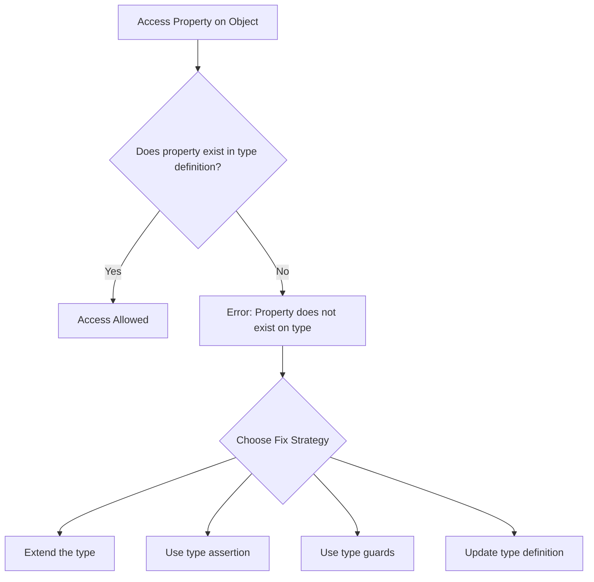
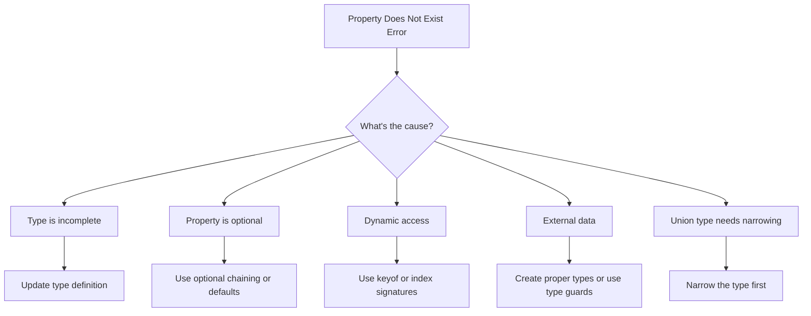
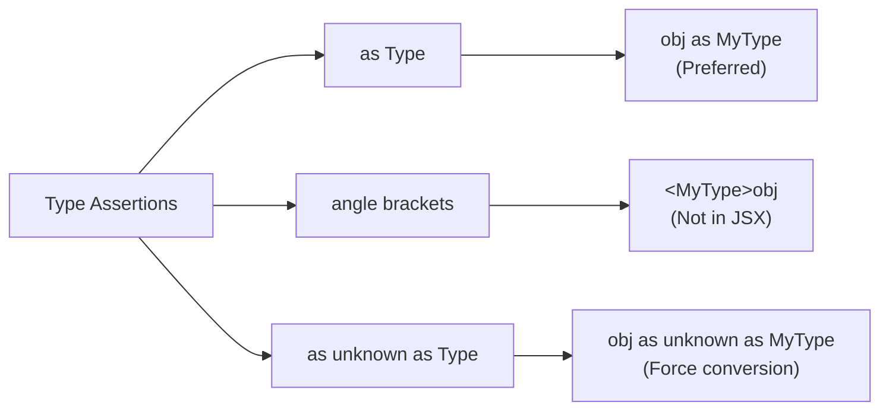
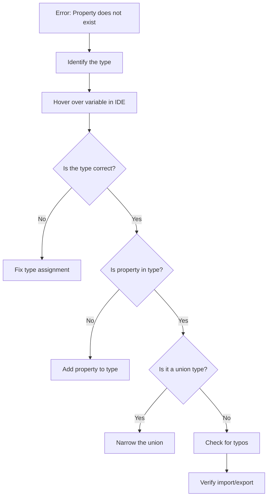

# How to Fix 'Property Does Not Exist on Type' Errors

Author: [nawazdhandala](https://www.github.com/nawazdhandala)

Tags: TypeScript, Error Handling, Type Errors, Debugging, Programming, Troubleshooting

Description: Learn how to diagnose and fix the common TypeScript error 'Property does not exist on type' with practical solutions and examples.

---

The "Property does not exist on type" error is one of the most common TypeScript errors developers encounter. This guide will help you understand why it occurs and how to fix it in various scenarios.

## Understanding the Error

This error occurs when TypeScript cannot verify that a property exists on a given type. TypeScript's type system is designed to catch these potential runtime errors at compile time.



## Common Scenarios and Solutions

### Scenario 1: Missing Property in Interface

```typescript
// Problem: Interface is incomplete
interface User {
    id: number;
    name: string;
}

function displayUser(user: User): void {
    console.log(user.name);
    // Error: Property 'email' does not exist on type 'User'
    // console.log(user.email);
}

// Solution: Add the missing property to the interface
interface UserComplete {
    id: number;
    name: string;
    email: string;  // Added missing property
}

function displayUserFixed(user: UserComplete): void {
    console.log(user.name);
    console.log(user.email);  // Now works
}
```

### Scenario 2: Optional Properties

```typescript
// Problem: Property might not exist
interface Config {
    host: string;
    port: number;
    timeout?: number;  // Optional property
}

function getTimeout(config: Config): number {
    // Error if timeout is optional and you try to use it directly
    // in contexts expecting a number

    // Solution 1: Provide a default value
    return config.timeout ?? 5000;

    // Solution 2: Check if it exists
    // if (config.timeout !== undefined) {
    //     return config.timeout;
    // }
    // return 5000;
}

// Solution 3: Make it required with Partial utility reversed
interface ConfigRequired {
    host: string;
    port: number;
    timeout: number;  // Now required
}
```

### Scenario 3: Dynamic Object Keys

```typescript
// Problem: Accessing properties dynamically
interface Product {
    id: string;
    name: string;
    price: number;
}

function getProperty(product: Product, key: string): unknown {
    // Error: Element implicitly has an 'any' type because expression
    // of type 'string' can't be used to index type 'Product'
    // return product[key];

    // Solution 1: Use keyof type
    return product[key as keyof Product];
}

// Solution 2: Type the key parameter properly
function getPropertyTyped<K extends keyof Product>(
    product: Product,
    key: K
): Product[K] {
    return product[key];  // Fully type-safe
}

// Usage
const product: Product = { id: "1", name: "Widget", price: 99.99 };
const name = getPropertyTyped(product, "name");  // Type: string
const price = getPropertyTyped(product, "price"); // Type: number
```

## Error Resolution Strategies



### Scenario 4: Working with Union Types

```typescript
// Problem: Property exists on some but not all union members
interface Dog {
    type: "dog";
    bark(): void;
}

interface Cat {
    type: "cat";
    meow(): void;
}

type Pet = Dog | Cat;

function makeSound(pet: Pet): void {
    // Error: Property 'bark' does not exist on type 'Pet'
    // Property 'bark' does not exist on type 'Cat'
    // pet.bark();

    // Solution: Narrow the type first
    if (pet.type === "dog") {
        pet.bark();  // Works - TypeScript knows it's a Dog
    } else {
        pet.meow();  // Works - TypeScript knows it's a Cat
    }
}

// Alternative: Use 'in' operator
function makeSoundAlt(pet: Pet): void {
    if ("bark" in pet) {
        pet.bark();
    } else {
        pet.meow();
    }
}
```

### Scenario 5: Extending Built-in Objects

```typescript
// Problem: Adding properties to built-in types
// Error: Property 'customMethod' does not exist on type 'Window'
// window.customMethod = () => {};

// Solution 1: Extend the global interface
declare global {
    interface Window {
        customMethod: () => void;
        appConfig: {
            apiUrl: string;
            debug: boolean;
        };
    }
}

// Now this works
window.customMethod = () => {
    console.log("Custom method called");
};

window.appConfig = {
    apiUrl: "https://api.example.com",
    debug: true
};

// Solution 2: Use type assertion (less safe)
(window as any).anotherMethod = () => {};

// Solution 3: Create a typed wrapper
interface ExtendedWindow extends Window {
    myProperty: string;
}

const extWindow = window as ExtendedWindow;
extWindow.myProperty = "value";
```

### Scenario 6: Working with External APIs

```typescript
// Problem: External data has unknown shape
async function fetchData(): Promise<unknown> {
    const response = await fetch("https://api.example.com/data");
    return response.json();
}

// Error: Object is of type 'unknown'
// const data = await fetchData();
// console.log(data.name);

// Solution 1: Define an interface and use type assertion
interface ApiResponse {
    id: number;
    name: string;
    status: string;
}

async function fetchDataTyped(): Promise<ApiResponse> {
    const response = await fetch("https://api.example.com/data");
    const data = await response.json();
    return data as ApiResponse;
}

// Solution 2: Use a type guard for runtime validation
function isApiResponse(data: unknown): data is ApiResponse {
    return (
        typeof data === "object" &&
        data !== null &&
        "id" in data &&
        "name" in data &&
        "status" in data &&
        typeof (data as ApiResponse).id === "number" &&
        typeof (data as ApiResponse).name === "string" &&
        typeof (data as ApiResponse).status === "string"
    );
}

async function fetchDataSafe(): Promise<ApiResponse | null> {
    const response = await fetch("https://api.example.com/data");
    const data: unknown = await response.json();

    if (isApiResponse(data)) {
        return data;  // TypeScript knows this is ApiResponse
    }

    console.error("Invalid API response");
    return null;
}
```

### Scenario 7: Index Signatures

```typescript
// Problem: Object with dynamic keys
interface StaticObject {
    knownProp: string;
}

const obj: StaticObject = { knownProp: "value" };
// Error: Property 'dynamicProp' does not exist on type 'StaticObject'
// obj.dynamicProp = "test";

// Solution: Add an index signature
interface DynamicObject {
    knownProp: string;
    [key: string]: string;  // Index signature
}

const dynamicObj: DynamicObject = { knownProp: "value" };
dynamicObj.dynamicProp = "test";  // Works
dynamicObj.anotherProp = "works"; // Works

// More specific index signature with union
interface MixedObject {
    id: number;
    name: string;
    [key: string]: string | number;  // Must include all property types
}
```

## Type Assertion Approaches



### Using Type Assertions Safely

```typescript
// Type assertion examples
interface User {
    id: number;
    name: string;
    email: string;
}

// From unknown data
const rawData: unknown = { id: 1, name: "Alice", email: "alice@example.com" };

// Basic assertion (trust that data matches type)
const user = rawData as User;

// Double assertion (when types are incompatible)
// Use sparingly - this bypasses type safety
const strangeConversion = "not a user" as unknown as User;

// Const assertion for literal types
const config = {
    endpoint: "/api/users",
    method: "GET"
} as const;
// config.method is now type "GET", not string

// Non-null assertion (use when you're sure value exists)
interface Element {
    id: string;
    value: string | null;
}

function processElement(element: Element): string {
    // Using ! to assert value is not null
    // Only use when you're certain
    return element.value!.toUpperCase();

    // Safer alternative
    // if (element.value !== null) {
    //     return element.value.toUpperCase();
    // }
    // return "";
}
```

### Scenario 8: Class Properties

```typescript
// Problem: Property not initialized in constructor
class UserService {
    // Error: Property 'apiClient' has no initializer and is not
    // definitely assigned in the constructor
    // private apiClient: ApiClient;

    // Solution 1: Initialize with a value
    private apiClient: ApiClient = new ApiClient();

    // Solution 2: Use definite assignment assertion
    private cache!: Map<string, User>;  // ! tells TS it will be assigned

    // Solution 3: Make it optional
    private logger?: Logger;

    constructor() {
        // Solution 2 requires actual assignment
        this.cache = new Map();
    }

    getUser(id: string): User | undefined {
        // Need to check optional property
        this.logger?.log(`Fetching user ${id}`);
        return this.cache.get(id);
    }
}

// Supporting types for the example
class ApiClient {
    fetch(url: string): Promise<unknown> {
        return fetch(url).then(r => r.json());
    }
}

interface User {
    id: string;
    name: string;
}

interface Logger {
    log(message: string): void;
}
```

## Handling Third-Party Libraries

```typescript
// Problem: Library without type definitions
// Error: Could not find a declaration file for module 'untyped-lib'
// import { something } from 'untyped-lib';

// Solution 1: Create a declaration file (untyped-lib.d.ts)
declare module 'untyped-lib' {
    export function something(arg: string): number;
    export interface SomeInterface {
        prop: string;
    }
}

// Solution 2: Quick fix with any (not recommended for production)
declare module 'untyped-lib';
// Now imports work but return 'any'

// Solution 3: Install community types
// npm install @types/library-name

// Solution 4: Augment existing types
// If a library is partially typed, you can extend its types
declare module 'partially-typed-lib' {
    interface ExistingInterface {
        newProperty: string;  // Add missing property
    }
}
```

## Debugging Strategy



## Best Practices

1. **Avoid using `any`** - It defeats the purpose of TypeScript
2. **Create proper interfaces** for all data structures
3. **Use type guards** for runtime type checking
4. **Leverage utility types** like `Partial`, `Required`, `Pick`
5. **Enable strict mode** in tsconfig.json for better error detection

```typescript
// tsconfig.json recommendation
{
    "compilerOptions": {
        "strict": true,
        "noImplicitAny": true,
        "strictNullChecks": true,
        "strictPropertyInitialization": true
    }
}
```

## Quick Reference: Common Fixes

| Error Context | Quick Fix |
|---------------|-----------|
| Missing property in interface | Add property to interface |
| Optional property access | Use optional chaining `?.` |
| Dynamic property access | Use `keyof` or index signature |
| Union type property | Narrow with type guard |
| External/API data | Create interface and validate |
| Window/global object | Extend global interface |
| Third-party library | Install @types or create declaration |

## Summary

The "Property does not exist on type" error is TypeScript helping you catch potential bugs before runtime. To fix it:

1. First understand why TypeScript cannot verify the property exists
2. Choose the appropriate solution based on your use case
3. Prefer type-safe solutions over type assertions when possible
4. Use type guards for runtime validation of external data
5. Keep your type definitions up to date with your actual data structures

Remember that these errors are features, not bugs. They help you write more robust and maintainable code.
