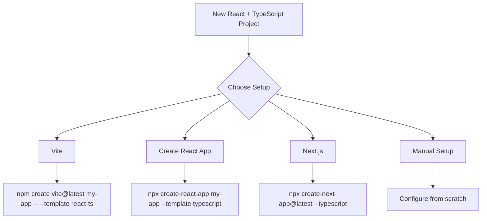
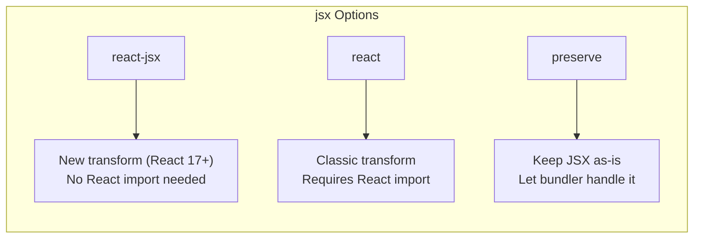

# How to Configure TypeScript with React

Author: [nawazdhandala](https://www.github.com/nawazdhandala)

Tags: TypeScript, React, Configuration, tsconfig, JSX, Build Tools, Vite, Create React App

Description: Learn how to properly configure TypeScript for React projects including tsconfig settings, JSX handling, and common setup patterns.

---

Setting up TypeScript with React can be confusing with all the configuration options available. This guide walks you through the essential settings, explains what each option does, and shows you how to configure TypeScript for different React project setups.

## Project Setup Options

There are several ways to start a TypeScript React project:



### Quick Start with Vite (Recommended)

```bash
# Create new Vite project with React and TypeScript
npm create vite@latest my-app -- --template react-ts
cd my-app
npm install
npm run dev
```

### Quick Start with Create React App

```bash
# Create new CRA project with TypeScript
npx create-react-app my-app --template typescript
cd my-app
npm start
```

## Essential tsconfig.json Settings

Here is a well-configured `tsconfig.json` for React projects:

```json
{
  "compilerOptions": {
    // Target and Module Settings
    "target": "ES2020",
    "lib": ["ES2020", "DOM", "DOM.Iterable"],
    "module": "ESNext",
    "moduleResolution": "bundler",

    // JSX Support - Critical for React
    "jsx": "react-jsx",

    // Strict Type Checking
    "strict": true,
    "noImplicitAny": true,
    "strictNullChecks": true,
    "strictFunctionTypes": true,
    "noImplicitReturns": true,
    "noFallthroughCasesInSwitch": true,
    "noUncheckedIndexedAccess": true,

    // Module Interop
    "esModuleInterop": true,
    "allowSyntheticDefaultImports": true,
    "forceConsistentCasingInFileNames": true,
    "isolatedModules": true,

    // Path Aliases
    "baseUrl": ".",
    "paths": {
      "@/*": ["src/*"],
      "@components/*": ["src/components/*"],
      "@hooks/*": ["src/hooks/*"],
      "@utils/*": ["src/utils/*"]
    },

    // Output Settings
    "noEmit": true,
    "skipLibCheck": true,
    "resolveJsonModule": true
  },
  "include": ["src"],
  "exclude": ["node_modules", "build", "dist"]
}
```

## Key Configuration Options Explained

### JSX Settings

The `jsx` option tells TypeScript how to handle JSX syntax:

```typescript
// jsx: "react-jsx" (React 17+)
// Uses the new JSX transform - no need to import React
function Button({ label }: { label: string }) {
    return <button>{label}</button>;
}

// jsx: "react" (React 16 and earlier)
// Requires React in scope
import React from 'react';
function Button({ label }: { label: string }) {
    return <button>{label}</button>;
}
```



### Strict Mode Options

Enable strict mode for better type safety:

```typescript
// With strict: true

// noImplicitAny - must type parameters
function greet(name: string) {  // Error without type annotation
    return `Hello, ${name}`;
}

// strictNullChecks - handle null/undefined
function getUser(id: string): User | null {
    // Must handle the null case when using the result
    return users.get(id) ?? null;
}

const user = getUser('123');
// user.name  // Error: Object is possibly null
user?.name   // Safe with optional chaining
```

### Module Resolution

For modern bundlers like Vite, use `bundler` module resolution:

```json
{
  "compilerOptions": {
    "moduleResolution": "bundler",
    "allowImportingTsExtensions": true,
    "noEmit": true
  }
}
```

For projects that emit JavaScript (like libraries):

```json
{
  "compilerOptions": {
    "moduleResolution": "node",
    "declaration": true,
    "outDir": "./dist"
  }
}
```

## Path Aliases Configuration

Path aliases make imports cleaner and easier to refactor:

```typescript
// Without aliases
import { Button } from '../../../components/Button';
import { useAuth } from '../../../hooks/useAuth';

// With aliases
import { Button } from '@components/Button';
import { useAuth } from '@hooks/useAuth';
```

### Vite Configuration for Aliases

```typescript
// vite.config.ts
import { defineConfig } from 'vite';
import react from '@vitejs/plugin-react';
import path from 'path';

export default defineConfig({
    plugins: [react()],
    resolve: {
        alias: {
            '@': path.resolve(__dirname, './src'),
            '@components': path.resolve(__dirname, './src/components'),
            '@hooks': path.resolve(__dirname, './src/hooks'),
            '@utils': path.resolve(__dirname, './src/utils'),
        },
    },
});
```

### Create React App Configuration

For CRA, use `craco` or `react-app-rewired`:

```javascript
// craco.config.js
const path = require('path');

module.exports = {
    webpack: {
        alias: {
            '@': path.resolve(__dirname, 'src'),
            '@components': path.resolve(__dirname, 'src/components'),
        },
    },
};
```

## React-Specific Type Patterns

### Component Props

```typescript
// Function component with typed props
interface ButtonProps {
    label: string;
    onClick: () => void;
    variant?: 'primary' | 'secondary';
    disabled?: boolean;
}

function Button({ label, onClick, variant = 'primary', disabled = false }: ButtonProps) {
    return (
        <button
            onClick={onClick}
            disabled={disabled}
            className={`btn btn-${variant}`}
        >
            {label}
        </button>
    );
}

// With children
interface CardProps {
    title: string;
    children: React.ReactNode;
}

function Card({ title, children }: CardProps) {
    return (
        <div className="card">
            <h2>{title}</h2>
            {children}
        </div>
    );
}
```

### Event Handlers

```typescript
// Form events
function SearchForm() {
    const [query, setQuery] = useState('');

    const handleChange = (event: React.ChangeEvent<HTMLInputElement>) => {
        setQuery(event.target.value);
    };

    const handleSubmit = (event: React.FormEvent<HTMLFormElement>) => {
        event.preventDefault();
        search(query);
    };

    return (
        <form onSubmit={handleSubmit}>
            <input
                type="text"
                value={query}
                onChange={handleChange}
            />
            <button type="submit">Search</button>
        </form>
    );
}

// Mouse and keyboard events
function InteractiveElement() {
    const handleClick = (event: React.MouseEvent<HTMLButtonElement>) => {
        console.log(event.clientX, event.clientY);
    };

    const handleKeyDown = (event: React.KeyboardEvent<HTMLInputElement>) => {
        if (event.key === 'Enter') {
            submit();
        }
    };

    return (
        <>
            <button onClick={handleClick}>Click me</button>
            <input onKeyDown={handleKeyDown} />
        </>
    );
}
```

### Hooks with TypeScript

```typescript
// useState with explicit type
const [user, setUser] = useState<User | null>(null);

// useRef with element type
const inputRef = useRef<HTMLInputElement>(null);

// useReducer with typed state and actions
interface State {
    count: number;
    step: number;
}

type Action =
    | { type: 'increment' }
    | { type: 'decrement' }
    | { type: 'setStep'; payload: number };

function reducer(state: State, action: Action): State {
    switch (action.type) {
        case 'increment':
            return { ...state, count: state.count + state.step };
        case 'decrement':
            return { ...state, count: state.count - state.step };
        case 'setStep':
            return { ...state, step: action.payload };
    }
}

const [state, dispatch] = useReducer(reducer, { count: 0, step: 1 });
```

## Multiple Config Files

Large projects often use multiple TypeScript configurations:

```
project/
  tsconfig.json          # Base config
  tsconfig.app.json      # App-specific config
  tsconfig.node.json     # Node scripts config
  tsconfig.test.json     # Test config
```

### Base Configuration

```json
// tsconfig.json
{
  "compilerOptions": {
    "strict": true,
    "esModuleInterop": true,
    "skipLibCheck": true,
    "forceConsistentCasingInFileNames": true
  }
}
```

### App Configuration

```json
// tsconfig.app.json
{
  "extends": "./tsconfig.json",
  "compilerOptions": {
    "target": "ES2020",
    "lib": ["ES2020", "DOM", "DOM.Iterable"],
    "jsx": "react-jsx",
    "moduleResolution": "bundler",
    "noEmit": true
  },
  "include": ["src"]
}
```

### Test Configuration

```json
// tsconfig.test.json
{
  "extends": "./tsconfig.json",
  "compilerOptions": {
    "types": ["jest", "@testing-library/jest-dom"]
  },
  "include": ["src/**/*.test.ts", "src/**/*.test.tsx"]
}
```

## Common Issues and Fixes

### Cannot Find Module Errors

```bash
# Install type definitions
npm install --save-dev @types/react @types/react-dom

# For third-party libraries without types
npm install --save-dev @types/lodash
```

If types do not exist, create a declaration file:

```typescript
// src/types/untyped-library.d.ts
declare module 'untyped-library' {
    export function doSomething(value: string): number;
    export default function main(): void;
}
```

### JSX Element Type Errors

```typescript
// Error: 'Component' cannot be used as a JSX component
// Its return type 'Element | undefined' is not a valid JSX element

// Fix: Ensure consistent return type
function Component({ show }: { show: boolean }) {
    if (!show) {
        return null;  // Return null, not undefined
    }
    return <div>Content</div>;
}
```

### Import Errors with CSS/Assets

```typescript
// src/types/assets.d.ts
declare module '*.css' {
    const content: { [className: string]: string };
    export default content;
}

declare module '*.svg' {
    const content: React.FC<React.SVGProps<SVGSVGElement>>;
    export default content;
}

declare module '*.png' {
    const content: string;
    export default content;
}
```

## Recommended ESLint Configuration

Pair TypeScript with ESLint for better code quality:

```json
// .eslintrc.json
{
  "extends": [
    "eslint:recommended",
    "plugin:@typescript-eslint/recommended",
    "plugin:react/recommended",
    "plugin:react-hooks/recommended"
  ],
  "parser": "@typescript-eslint/parser",
  "parserOptions": {
    "ecmaFeatures": {
      "jsx": true
    },
    "project": "./tsconfig.json"
  },
  "plugins": ["@typescript-eslint", "react"],
  "rules": {
    "react/react-in-jsx-scope": "off",
    "@typescript-eslint/explicit-function-return-type": "off",
    "@typescript-eslint/no-unused-vars": ["error", { "argsIgnorePattern": "^_" }]
  },
  "settings": {
    "react": {
      "version": "detect"
    }
  }
}
```

## Conclusion

A well-configured TypeScript setup catches errors early and improves the development experience with better autocomplete and refactoring support. Start with strict mode enabled from the beginning - it is much harder to add strictness later. Use path aliases to keep imports clean, and set up multiple config files for different parts of your project if needed. With the right configuration, TypeScript and React work together to help you build more reliable applications.
