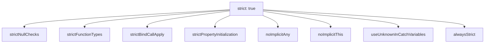
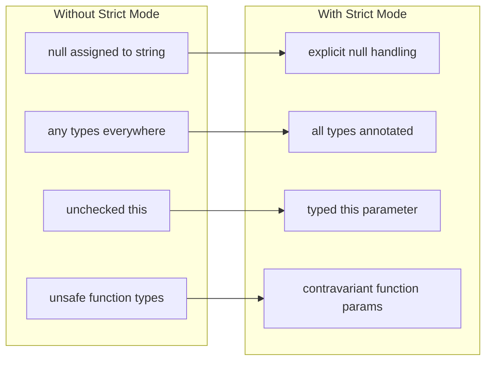
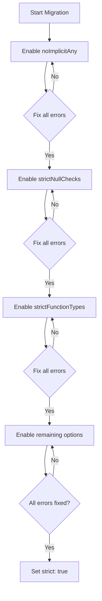
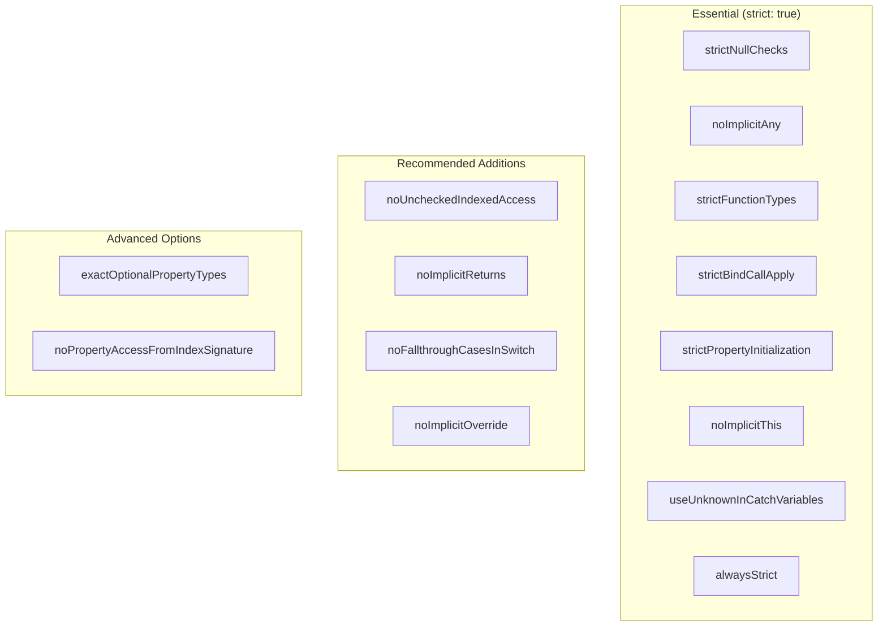

# How to Configure TypeScript Strict Mode

Author: [nawazdhandala](https://www.github.com/nawazdhandala)

Tags: TypeScript, Strict Mode, Configuration, Type Safety, Best Practices, tsconfig

Description: Learn how to enable and configure TypeScript strict mode options for maximum type safety and better code quality.

---

TypeScript strict mode enables a set of compiler options that catch more potential errors at compile time. This guide covers all strict mode options and how to adopt them incrementally.

## What is Strict Mode?

Strict mode is a collection of compiler options that enable stricter type checking rules. Setting `"strict": true` enables all strict flags at once.



## Basic Strict Mode Configuration

Enable strict mode in your `tsconfig.json`.

```json
{
  "compilerOptions": {
    // Enable all strict type checking options
    "strict": true,

    // Other recommended options that work well with strict mode
    "target": "ES2020",
    "module": "ESNext",
    "moduleResolution": "bundler",
    "esModuleInterop": true,
    "skipLibCheck": true,
    "forceConsistentCasingInFileNames": true
  }
}
```

## Individual Strict Options Explained

### strictNullChecks

This option makes `null` and `undefined` their own distinct types.

```typescript
// Without strictNullChecks (dangerous)
function getLength(str: string) {
  return str.length;  // No error, but crashes if str is null
}

getLength(null);  // Allowed without strictNullChecks, crashes at runtime
```

```typescript
// With strictNullChecks (safe)
function getLength(str: string | null) {
  if (str === null) {
    return 0;
  }
  return str.length;  // Safe: str is definitely string here
}

// Or use optional chaining
function getLengthSafe(str: string | null | undefined): number {
  return str?.length ?? 0;
}
```

### noImplicitAny

Raises an error when TypeScript cannot infer a type and falls back to `any`.

```typescript
// Without noImplicitAny (dangerous)
function process(data) {  // data is implicitly 'any'
  return data.value;      // No error, but no type checking
}
```

```typescript
// With noImplicitAny (safe)
// ERROR: Parameter 'data' implicitly has an 'any' type

// Fix: Add explicit type annotation
interface DataItem {
  value: string;
  count: number;
}

function process(data: DataItem) {
  return data.value;  // Type-checked access
}
```

### strictFunctionTypes

Enables stricter checking of function types.

```typescript
// Function type hierarchy
type Handler<T> = (event: T) => void;

interface BaseEvent {
  timestamp: number;
}

interface MouseEvent extends BaseEvent {
  x: number;
  y: number;
}

// Without strictFunctionTypes (dangerous)
let baseHandler: Handler<BaseEvent>;
let mouseHandler: Handler<MouseEvent> = (e) => console.log(e.x, e.y);

// This assignment would be allowed but is unsafe
baseHandler = mouseHandler;  // Allowed without strict
baseHandler({ timestamp: 123 });  // Runtime error: no x, y
```

```typescript
// With strictFunctionTypes (safe)
// ERROR: Type 'Handler<MouseEvent>' is not assignable to 'Handler<BaseEvent>'

// Fix: Use proper type hierarchy
let baseHandler: Handler<BaseEvent> = (e) => console.log(e.timestamp);
let mouseHandler: Handler<MouseEvent> = (e) => console.log(e.x, e.y);

// Only assign compatible handlers
function handleBase(e: BaseEvent) {
  baseHandler(e);  // Safe
}
```

### strictPropertyInitialization

Ensures class properties are initialized in the constructor.

```typescript
// Without strictPropertyInitialization (dangerous)
class User {
  name: string;  // Not initialized
  email: string; // Not initialized

  greet() {
    console.log(`Hello, ${this.name}`);  // Undefined at runtime
  }
}
```

```typescript
// With strictPropertyInitialization (safe)
class User {
  // Option 1: Initialize in declaration
  name: string = '';

  // Option 2: Initialize in constructor
  email: string;

  // Option 3: Use definite assignment assertion (use carefully)
  id!: number;  // The ! tells TypeScript this will be assigned

  // Option 4: Make optional
  nickname?: string;

  constructor(email: string) {
    this.email = email;
  }

  // Call this to set id after construction
  setId(id: number) {
    this.id = id;
  }
}
```

### strictBindCallApply

Enables strict checking of `bind`, `call`, and `apply` methods.

```typescript
function greet(name: string, age: number): string {
  return `Hello ${name}, you are ${age} years old`;
}

// Without strictBindCallApply (dangerous)
const result1 = greet.call(null, 'John', 'not a number');  // No error
```

```typescript
// With strictBindCallApply (safe)
// ERROR: Argument of type 'string' is not assignable to parameter of type 'number'

// Fix: Use correct argument types
const result = greet.call(null, 'John', 30);  // Correct types

// bind is also checked
const boundGreet = greet.bind(null, 'John');  // Returns (age: number) => string
const greeting = boundGreet(30);  // Correct

// apply is also checked
const result2 = greet.apply(null, ['John', 30]);  // Array must match params
```

### noImplicitThis

Raises an error when `this` has an implicit `any` type.

```typescript
// Without noImplicitThis (dangerous)
const calculator = {
  value: 0,
  add: function(n) {
    this.value += n;  // 'this' is implicitly 'any'
    return this;
  }
};
```

```typescript
// With noImplicitThis (safe)
interface Calculator {
  value: number;
  add(this: Calculator, n: number): Calculator;
  subtract(this: Calculator, n: number): Calculator;
}

const calculator: Calculator = {
  value: 0,
  add(this: Calculator, n: number) {
    this.value += n;  // 'this' is typed as Calculator
    return this;
  },
  subtract(this: Calculator, n: number) {
    this.value -= n;
    return this;
  }
};

// Usage
calculator.add(5).subtract(2);  // value is 3
```

### useUnknownInCatchVariables

Makes catch clause variables `unknown` instead of `any`.

```typescript
// Without useUnknownInCatchVariables (dangerous)
try {
  throw new Error('Something went wrong');
} catch (error) {
  // error is 'any', no type checking
  console.log(error.message);  // No error, but could crash
}
```

```typescript
// With useUnknownInCatchVariables (safe)
try {
  throw new Error('Something went wrong');
} catch (error) {
  // error is 'unknown', must be narrowed
  if (error instanceof Error) {
    console.log(error.message);  // Safe access
  } else if (typeof error === 'string') {
    console.log(error);  // Handle string errors
  } else {
    console.log('Unknown error occurred');
  }
}

// Helper function for error handling
function getErrorMessage(error: unknown): string {
  if (error instanceof Error) {
    return error.message;
  }
  if (typeof error === 'string') {
    return error;
  }
  return 'An unknown error occurred';
}
```

## Strict Mode Impact Visualization



## Incremental Strict Mode Adoption

If enabling all strict options at once is too disruptive, adopt them incrementally.

```json
{
  "compilerOptions": {
    // Start with these less disruptive options
    "strict": false,

    // Phase 1: Enable basic strict options
    "noImplicitAny": true,
    "strictNullChecks": true,

    // Phase 2: Add function checking
    "strictFunctionTypes": true,
    "strictBindCallApply": true,

    // Phase 3: Add remaining options
    "noImplicitThis": true,
    "strictPropertyInitialization": true,
    "useUnknownInCatchVariables": true,
    "alwaysStrict": true

    // After all phases, replace with:
    // "strict": true
  }
}
```

## Migration Strategy



## Common Migration Patterns

### Migrating to strictNullChecks

```typescript
// Before migration
function getUserName(user: User): string {
  return user.name;
}

// Step 1: Identify nullable values
function getUserName(user: User | null): string {
  return user.name;  // Error: user might be null
}

// Step 2: Add null checks
function getUserName(user: User | null): string {
  if (!user) {
    return 'Anonymous';
  }
  return user.name;
}

// Step 3: Or use optional chaining
function getUserName(user: User | null | undefined): string {
  return user?.name ?? 'Anonymous';
}
```

### Migrating to noImplicitAny

```typescript
// Before migration
function processItems(items) {
  return items.map(item => item.value);
}

// After migration: Add type annotations
interface Item {
  id: number;
  value: string;
}

function processItems(items: Item[]): string[] {
  return items.map(item => item.value);
}
```

### Migrating to strictPropertyInitialization

```typescript
// Before migration
class ApiService {
  private baseUrl: string;
  private client: HttpClient;

  async init(config: Config) {
    this.baseUrl = config.apiUrl;
    this.client = new HttpClient();
  }
}

// After migration: Multiple options

// Option 1: Initialize with default values
class ApiService {
  private baseUrl: string = '';
  private client: HttpClient = new HttpClient();
}

// Option 2: Make properties optional
class ApiService {
  private baseUrl?: string;
  private client?: HttpClient;

  private ensureInitialized(): asserts this is { baseUrl: string; client: HttpClient } {
    if (!this.baseUrl || !this.client) {
      throw new Error('ApiService not initialized');
    }
  }
}

// Option 3: Use constructor injection
class ApiService {
  constructor(
    private readonly baseUrl: string,
    private readonly client: HttpClient
  ) {}
}
```

## Additional Strict-Related Options

These options are not part of `strict` but complement it well.

```json
{
  "compilerOptions": {
    "strict": true,

    // Additional type checking options
    "noUncheckedIndexedAccess": true,
    "noPropertyAccessFromIndexSignature": true,
    "noImplicitReturns": true,
    "noFallthroughCasesInSwitch": true,
    "noImplicitOverride": true,
    "exactOptionalPropertyTypes": true
  }
}
```

### noUncheckedIndexedAccess

```typescript
// Without noUncheckedIndexedAccess
const arr: string[] = ['a', 'b', 'c'];
const item: string = arr[10];  // No error, but undefined at runtime
```

```typescript
// With noUncheckedIndexedAccess
const arr: string[] = ['a', 'b', 'c'];
const item: string | undefined = arr[10];  // Properly typed

// Must handle undefined
if (item !== undefined) {
  console.log(item.toUpperCase());
}
```

### noImplicitOverride

```typescript
class Base {
  greet() {
    console.log('Hello');
  }
}

// Without noImplicitOverride
class Derived extends Base {
  greet() {  // Overrides base method silently
    console.log('Hi');
  }
}

// With noImplicitOverride
class DerivedSafe extends Base {
  override greet() {  // Must use 'override' keyword
    console.log('Hi');
  }
}
```

## Strict Mode Configuration Summary



## Summary

TypeScript strict mode significantly improves code quality by catching potential errors at compile time. Key recommendations include enabling `"strict": true` for new projects from the start, migrating existing projects incrementally starting with `noImplicitAny` and `strictNullChecks`, using helper functions and assertion functions to handle edge cases, and considering additional options like `noUncheckedIndexedAccess` for even stricter checking. While strict mode requires more explicit type annotations, it prevents many runtime errors and makes code more maintainable.
