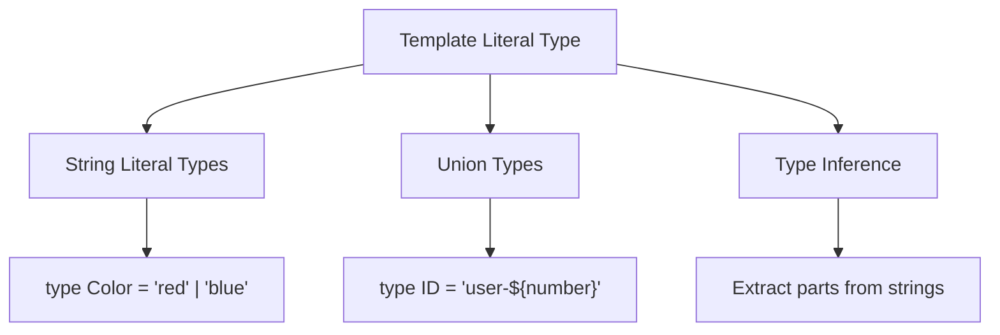
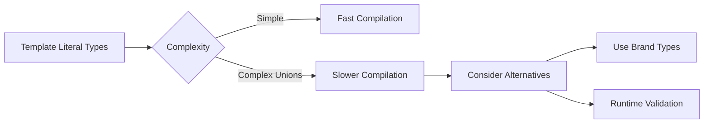

# How to Handle Template Literal Types

Author: [nawazdhandala](https://www.github.com/nawazdhandala)

Tags: TypeScript, Template Literals, Type System, String Types, Advanced Types, Type Safety

Description: A comprehensive guide to using TypeScript's template literal types for creating powerful string-based type definitions and compile-time validation.

---

Template literal types are one of TypeScript's most powerful features for working with strings at the type level. They allow you to create precise string types, validate string patterns, and build type-safe APIs. This guide will show you how to leverage them effectively.

## Understanding Template Literal Types

Template literal types use the same syntax as JavaScript template literals, but they operate at the type level.



### Basic Syntax

```typescript
// Simple template literal type
type Greeting = `Hello, ${string}`;

// This works
const valid: Greeting = "Hello, World";
const alsoValid: Greeting = "Hello, TypeScript";

// This fails
// const invalid: Greeting = "Hi, World"; // Error: Type '"Hi, World"' is not assignable

// Combining with union types
type Color = "red" | "green" | "blue";
type ColorClass = `text-${Color}`;
// Results in: "text-red" | "text-green" | "text-blue"
```

## Practical Applications

### Building CSS Class Names

Template literal types are perfect for CSS-in-TypeScript patterns.

```typescript
// Define spacing scale
type SpacingScale = 0 | 1 | 2 | 4 | 8 | 16;
type Direction = "t" | "r" | "b" | "l" | "x" | "y" | "";
type SpacingClass = `m${Direction}-${SpacingScale}` | `p${Direction}-${SpacingScale}`;

// All these are valid
const margin: SpacingClass = "m-4";
const paddingTop: SpacingClass = "pt-8";
const marginX: SpacingClass = "mx-2";

// Build a complete utility class system
type TextSize = "xs" | "sm" | "base" | "lg" | "xl" | "2xl";
type FontWeight = "light" | "normal" | "medium" | "bold";

type TextClass = `text-${TextSize}`;
type FontClass = `font-${FontWeight}`;

function applyClasses(element: HTMLElement, ...classes: (TextClass | FontClass | SpacingClass)[]) {
    element.className = classes.join(" ");
}

// Type-safe CSS classes
applyClasses(document.body, "text-lg", "font-bold", "p-4");
// applyClasses(document.body, "text-huge"); // Error: invalid class
```

### Creating Event Names

Template literal types help create consistent event naming conventions.

```typescript
// Define entity types and actions
type Entity = "user" | "order" | "product";
type Action = "created" | "updated" | "deleted";

type EventName = `${Entity}:${Action}`;
// Results in: "user:created" | "user:updated" | "user:deleted" |
//             "order:created" | "order:updated" | ... etc

// Type-safe event emitter
type EventPayloads = {
    "user:created": { id: string; email: string };
    "user:updated": { id: string; changes: Record<string, unknown> };
    "user:deleted": { id: string };
    "order:created": { orderId: string; items: string[] };
    "order:updated": { orderId: string; status: string };
    "order:deleted": { orderId: string };
    "product:created": { sku: string; name: string };
    "product:updated": { sku: string; price: number };
    "product:deleted": { sku: string };
};

class TypedEventEmitter {
    private listeners = new Map<string, Function[]>();

    on<E extends EventName>(event: E, callback: (payload: EventPayloads[E]) => void) {
        const existing = this.listeners.get(event) || [];
        this.listeners.set(event, [...existing, callback]);
    }

    emit<E extends EventName>(event: E, payload: EventPayloads[E]) {
        const callbacks = this.listeners.get(event) || [];
        callbacks.forEach(cb => cb(payload));
    }
}

// Usage with full type safety
const emitter = new TypedEventEmitter();

emitter.on("user:created", (payload) => {
    // payload is typed as { id: string; email: string }
    console.log(`User ${payload.email} created with ID ${payload.id}`);
});

emitter.emit("user:created", { id: "123", email: "test@example.com" });
// emitter.emit("user:created", { id: "123" }); // Error: missing email
```

### API Route Definitions

Create type-safe route definitions for your API.

```typescript
// Define route parameters
type HttpMethod = "GET" | "POST" | "PUT" | "DELETE";
type ApiVersion = "v1" | "v2";

// Route pattern with parameters
type UserRoutes =
    | `/api/${ApiVersion}/users`
    | `/api/${ApiVersion}/users/${string}`;

type OrderRoutes =
    | `/api/${ApiVersion}/orders`
    | `/api/${ApiVersion}/orders/${string}`
    | `/api/${ApiVersion}/orders/${string}/items`;

type ApiRoute = UserRoutes | OrderRoutes;

// Type-safe fetch wrapper
async function apiRequest<R>(
    method: HttpMethod,
    route: ApiRoute,
    body?: unknown
): Promise<R> {
    const response = await fetch(route, {
        method,
        body: body ? JSON.stringify(body) : undefined,
        headers: { "Content-Type": "application/json" }
    });
    return response.json();
}

// Valid routes
apiRequest("GET", "/api/v1/users");
apiRequest("GET", "/api/v2/users/abc123");
apiRequest("POST", "/api/v1/orders/order-1/items");

// Invalid routes caught at compile time
// apiRequest("GET", "/api/v3/users"); // Error: v3 is not valid
// apiRequest("GET", "/users"); // Error: missing /api prefix
```

## Advanced Techniques

### Extracting Parts from Strings

Use template literal types with `infer` to extract parts of strings.

```typescript
// Extract the ID part from a prefixed string
type ExtractId<St extends string> = St extends `user-${infer Id}` ? Id : never;

type UserId = ExtractId<"user-12345">; // "12345"
type Invalid = ExtractId<"order-999">; // never

// Parse route parameters
type ParseRouteParams<Route extends string> =
    Route extends `${string}/:${infer Param}/${infer Rest}`
        ? Param | ParseRouteParams<`/${Rest}`>
        : Route extends `${string}/:${infer Param}`
            ? Param
            : never;

type UserRouteParams = ParseRouteParams<"/users/:userId/posts/:postId">;
// Result: "userId" | "postId"

// Build a route handler with typed params
type RouteParams<Route extends string> = {
    [K in ParseRouteParams<Route>]: string;
};

function createHandler<Route extends string>(
    route: Route,
    handler: (params: RouteParams<Route>) => void
) {
    // Implementation would parse the actual route
    return { route, handler };
}

// Type-safe route handler
createHandler("/users/:userId/posts/:postId", (params) => {
    // params is typed as { userId: string; postId: string }
    console.log(params.userId, params.postId);
});
```

### String Manipulation Types

TypeScript provides built-in string manipulation types that work with template literals.

```typescript
// Built-in string manipulation types
type Upper = Uppercase<"hello">; // "HELLO"
type Lower = Lowercase<"HELLO">; // "hello"
type Cap = Capitalize<"hello">; // "Hello"
type Uncap = Uncapitalize<"Hello">; // "hello"

// Combine with template literals for powerful patterns
type CSSProperty = "margin" | "padding" | "border";
type CSSDirection = "Top" | "Right" | "Bottom" | "Left";
type FullCSSProperty = `${CSSProperty}${CSSDirection}`;
// "marginTop" | "marginRight" | ... "borderLeft"

// Create getter/setter names
type PropertyNames = "name" | "age" | "email";
type Getters = `get${Capitalize<PropertyNames>}`;
// "getName" | "getAge" | "getEmail"
type Setters = `set${Capitalize<PropertyNames>}`;
// "setName" | "setAge" | "setEmail"

// Auto-generate interface with getters/setters
type WithAccessors<T> = {
    [K in keyof T as `get${Capitalize<string & K>}`]: () => T[K];
} & {
    [K in keyof T as `set${Capitalize<string & K>}`]: (value: T[K]) => void;
};

interface Person {
    name: string;
    age: number;
}

type PersonAccessors = WithAccessors<Person>;
// {
//     getName: () => string;
//     getAge: () => number;
//     setName: (value: string) => void;
//     setAge: (value: number) => void;
// }
```

### Validation Patterns

Use template literal types to validate string formats at compile time.

```typescript
// Email pattern (simplified)
type EmailFormat = `${string}@${string}.${string}`;

function sendEmail(to: EmailFormat, subject: string) {
    // Implementation
}

sendEmail("user@example.com", "Hello"); // Valid
// sendEmail("invalid-email", "Hello"); // Error

// Semantic version pattern
type Digit = "0" | "1" | "2" | "3" | "4" | "5" | "6" | "7" | "8" | "9";
type SemVerNumber = `${Digit}` | `${Digit}${Digit}`;
type SemVer = `${SemVerNumber}.${SemVerNumber}.${SemVerNumber}`;

function checkVersion(version: SemVer) {
    console.log(`Checking version ${version}`);
}

checkVersion("1.0.0"); // Valid
checkVersion("12.34.56"); // Valid
// checkVersion("1.0"); // Error: not a valid SemVer

// Hex color pattern
type HexDigit = Digit | "a" | "b" | "c" | "d" | "e" | "f" | "A" | "B" | "C" | "D" | "E" | "F";
type HexColor = `#${HexDigit}${HexDigit}${HexDigit}${HexDigit}${HexDigit}${HexDigit}`;

function setBackgroundColor(color: HexColor) {
    document.body.style.backgroundColor = color;
}

setBackgroundColor("#ff5500"); // Valid
// setBackgroundColor("#gggggg"); // Error: 'g' is not a valid hex digit
```

## Real-World Example: Type-Safe i18n

Build a type-safe internationalization system.

```typescript
// Define translation keys with nested structure
type TranslationKeys = {
    common: {
        buttons: {
            submit: string;
            cancel: string;
            delete: string;
        };
        messages: {
            success: string;
            error: string;
        };
    };
    auth: {
        login: string;
        logout: string;
        register: string;
    };
};

// Flatten nested keys using template literals
type FlattenKeys<T, Prefix extends string = ""> = {
    [K in keyof T]: T[K] extends object
        ? FlattenKeys<T[K], `${Prefix}${string & K}.`>
        : `${Prefix}${string & K}`;
}[keyof T];

type TranslationKey = FlattenKeys<TranslationKeys>;
// "common.buttons.submit" | "common.buttons.cancel" | ...

// Type-safe translation function
const translations: Record<TranslationKey, string> = {
    "common.buttons.submit": "Submit",
    "common.buttons.cancel": "Cancel",
    "common.buttons.delete": "Delete",
    "common.messages.success": "Operation successful",
    "common.messages.error": "An error occurred",
    "auth.login": "Log In",
    "auth.logout": "Log Out",
    "auth.register": "Register"
};

function t(key: TranslationKey): string {
    return translations[key];
}

// Usage with autocomplete
console.log(t("common.buttons.submit")); // "Submit"
// console.log(t("invalid.key")); // Error: not a valid key
```

## Performance Considerations



Template literal types with large unions can slow down compilation:

```typescript
// This creates 10,000 type combinations - avoid
type TooManyOptions = `${0|1|2|3|4|5|6|7|8|9}${0|1|2|3|4|5|6|7|8|9}${0|1|2|3|4|5|6|7|8|9}${0|1|2|3|4|5|6|7|8|9}`;

// Better: Use branded types for runtime validation
type BrandedId = string & { __brand: "UserId" };

function createUserId(id: string): BrandedId {
    if (!id.match(/^user-\d+$/)) {
        throw new Error("Invalid user ID format");
    }
    return id as BrandedId;
}
```

## Best Practices

1. **Keep unions small** - Large union types in templates can explode combinatorially

2. **Use for API contracts** - Template literals excel at defining strict API boundaries

3. **Combine with runtime validation** - Types disappear at runtime, so validate important strings

4. **Document complex types** - Add comments explaining what patterns are valid

5. **Test edge cases** - Ensure your template types handle empty strings and special characters correctly

---

Template literal types bring string manipulation into the type system, enabling patterns that were previously impossible. From type-safe CSS classes to validated API routes, they help catch errors at compile time rather than runtime. Start with simple patterns and gradually adopt more complex ones as you become comfortable with the syntax.
