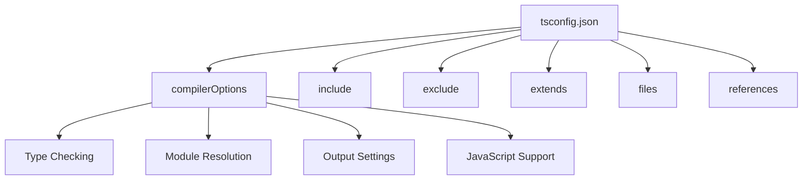
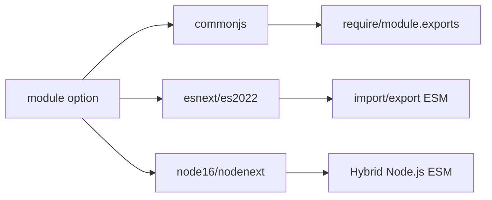
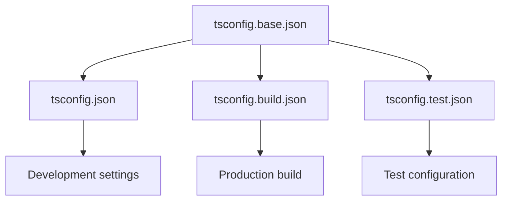

# How to Configure tsconfig.json Properly

Author: [nawazdhandala](https://www.github.com/nawazdhandala)

Tags: TypeScript, Configuration, tsconfig, JavaScript, Build Tools

Description: A comprehensive guide to configuring tsconfig.json for different project types with explanations of key compiler options.

---

> The tsconfig.json file is the heart of every TypeScript project. A well-configured tsconfig.json improves type safety, enables better IDE support, and ensures your code compiles correctly. This guide covers essential options and provides configurations for common project types.

Understanding tsconfig.json options helps you make informed decisions about type checking strictness, module systems, and output settings. This guide explains each important option and provides ready-to-use configurations.

---

## Basic Structure



```json
{
    "compilerOptions": {
        // Compiler options go here
    },
    "include": ["src/**/*"],
    "exclude": ["node_modules", "dist"],
    "extends": "./tsconfig.base.json"
}
```

---

## Essential Compiler Options

### Type Checking Options

```json
{
    "compilerOptions": {
        // Enable all strict type checking options
        "strict": true,

        // Individual strict options (enabled by "strict": true)
        "noImplicitAny": true,           // Error on expressions with implied 'any'
        "strictNullChecks": true,         // null/undefined are distinct types
        "strictFunctionTypes": true,      // Strict checking of function types
        "strictBindCallApply": true,      // Strict bind/call/apply methods
        "strictPropertyInitialization": true,  // Class properties must be initialized
        "noImplicitThis": true,           // Error on 'this' with implied 'any'
        "useUnknownInCatchVariables": true,  // catch clause variables are 'unknown'
        "alwaysStrict": true,             // Emit 'use strict' in output

        // Additional type checking
        "noUnusedLocals": true,           // Error on unused local variables
        "noUnusedParameters": true,       // Error on unused parameters
        "exactOptionalPropertyTypes": true,  // Differentiate undefined vs missing
        "noImplicitReturns": true,        // Error when not all paths return
        "noFallthroughCasesInSwitch": true,  // Error on fallthrough in switch
        "noUncheckedIndexedAccess": true, // Add undefined to index signatures
        "noImplicitOverride": true,       // Require 'override' keyword
        "noPropertyAccessFromIndexSignature": true  // Require indexed access
    }
}
```

### Understanding Strict Options

```typescript
// noImplicitAny: Error on implicit 'any' type
function process(data) {  // Error: Parameter 'data' implicitly has 'any' type
    return data.value;
}

// Fix: Add explicit type
function process(data: { value: string }): string {
    return data.value;
}

// strictNullChecks: null and undefined are distinct
let name: string = null;  // Error: Type 'null' is not assignable to type 'string'
let name: string | null = null;  // OK

// noUncheckedIndexedAccess: Adds undefined to indexed access
interface Dict {
    [key: string]: string;
}
const dict: Dict = {};
const value = dict['key'];  // Type is 'string | undefined', not 'string'
```

---

## Module Resolution Options

```json
{
    "compilerOptions": {
        // Module system
        "module": "commonjs",           // Output module format
        "moduleResolution": "node",     // How to resolve imports

        // Path configuration
        "baseUrl": ".",                 // Base directory for paths
        "paths": {
            "@/*": ["src/*"],
            "@components/*": ["src/components/*"]
        },

        // Import helpers
        "esModuleInterop": true,        // Emit __importDefault helpers
        "allowSyntheticDefaultImports": true,  // Allow default imports
        "resolveJsonModule": true,      // Allow importing .json files

        // Type roots
        "typeRoots": [
            "./node_modules/@types",
            "./src/types"
        ],
        "types": ["node", "jest"]       // Only include specific @types
    }
}
```

### Module Systems Explained



```json
// For Node.js CommonJS projects
{
    "compilerOptions": {
        "module": "commonjs",
        "moduleResolution": "node"
    }
}

// For Node.js ESM projects (Node 16+)
{
    "compilerOptions": {
        "module": "node16",
        "moduleResolution": "node16"
    }
}

// For bundlers (webpack, vite, esbuild)
{
    "compilerOptions": {
        "module": "esnext",
        "moduleResolution": "bundler"
    }
}

// For browser projects without bundler
{
    "compilerOptions": {
        "module": "esnext",
        "moduleResolution": "bundler"
    }
}
```

---

## Output Options

```json
{
    "compilerOptions": {
        // Target JavaScript version
        "target": "ES2020",             // Output JS version

        // Output settings
        "outDir": "./dist",             // Output directory
        "rootDir": "./src",             // Root of source files

        // Declaration files
        "declaration": true,            // Generate .d.ts files
        "declarationDir": "./dist/types",  // Declaration output directory
        "declarationMap": true,         // Generate sourcemaps for .d.ts

        // Source maps
        "sourceMap": true,              // Generate .map files
        "inlineSourceMap": false,       // Inline maps in .js files
        "inlineSources": false,         // Include source in maps

        // Output format
        "removeComments": true,         // Remove comments from output
        "newLine": "lf",                // Line ending style
        "preserveConstEnums": false     // Inline const enum values
    }
}
```

### Target Options

```typescript
// Target affects which JavaScript features are emitted vs polyfilled

// target: "ES5" - Maximum compatibility
// - Async/await transpiled to generators or promises
// - Arrow functions transpiled to regular functions
// - Classes transpiled to constructor functions

// target: "ES2020" - Good balance for modern Node.js
// - Optional chaining (?.) is native
// - Nullish coalescing (??) is native
// - BigInt support

// target: "ESNext" - Latest ECMAScript features
// - Use with bundler for browser compatibility
```

---

## Project-Specific Configurations

### Node.js Backend (CommonJS)

```json
{
    "compilerOptions": {
        "target": "ES2020",
        "module": "commonjs",
        "moduleResolution": "node",
        "lib": ["ES2020"],
        "outDir": "./dist",
        "rootDir": "./src",
        "strict": true,
        "esModuleInterop": true,
        "skipLibCheck": true,
        "forceConsistentCasingInFileNames": true,
        "resolveJsonModule": true,
        "declaration": true,
        "declarationMap": true,
        "sourceMap": true,
        "noEmitOnError": true
    },
    "include": ["src/**/*"],
    "exclude": ["node_modules", "dist", "**/*.test.ts"]
}
```

### Node.js Backend (ESM)

```json
{
    "compilerOptions": {
        "target": "ES2022",
        "module": "node16",
        "moduleResolution": "node16",
        "lib": ["ES2022"],
        "outDir": "./dist",
        "rootDir": "./src",
        "strict": true,
        "esModuleInterop": true,
        "skipLibCheck": true,
        "forceConsistentCasingInFileNames": true,
        "resolveJsonModule": true,
        "declaration": true,
        "sourceMap": true
    },
    "include": ["src/**/*"],
    "exclude": ["node_modules", "dist"]
}
```

### React Application (with bundler)

```json
{
    "compilerOptions": {
        "target": "ES2020",
        "lib": ["ES2020", "DOM", "DOM.Iterable"],
        "module": "esnext",
        "moduleResolution": "bundler",
        "jsx": "react-jsx",
        "strict": true,
        "esModuleInterop": true,
        "skipLibCheck": true,
        "forceConsistentCasingInFileNames": true,
        "allowImportingTsExtensions": true,
        "resolveJsonModule": true,
        "isolatedModules": true,
        "noEmit": true,
        "baseUrl": ".",
        "paths": {
            "@/*": ["./src/*"]
        }
    },
    "include": ["src"],
    "exclude": ["node_modules"]
}
```

### Library Package

```json
{
    "compilerOptions": {
        "target": "ES2020",
        "module": "esnext",
        "moduleResolution": "node",
        "lib": ["ES2020"],
        "outDir": "./dist",
        "rootDir": "./src",
        "strict": true,
        "esModuleInterop": true,
        "skipLibCheck": true,
        "forceConsistentCasingInFileNames": true,
        "declaration": true,
        "declarationDir": "./dist/types",
        "declarationMap": true,
        "sourceMap": true,
        "noEmitOnError": true
    },
    "include": ["src/**/*"],
    "exclude": ["node_modules", "dist", "**/*.test.ts", "**/*.spec.ts"]
}
```

### Monorepo Base Configuration

```json
// tsconfig.base.json
{
    "compilerOptions": {
        "target": "ES2020",
        "module": "esnext",
        "moduleResolution": "node",
        "strict": true,
        "esModuleInterop": true,
        "skipLibCheck": true,
        "forceConsistentCasingInFileNames": true,
        "resolveJsonModule": true,
        "declaration": true,
        "declarationMap": true,
        "sourceMap": true,
        "composite": true,
        "incremental": true
    }
}
```

```json
// packages/app/tsconfig.json
{
    "extends": "../../tsconfig.base.json",
    "compilerOptions": {
        "outDir": "./dist",
        "rootDir": "./src"
    },
    "include": ["src/**/*"],
    "references": [
        { "path": "../shared" }
    ]
}
```

---

## Include and Exclude

```json
{
    "include": [
        "src/**/*",           // All files in src
        "src/**/*.ts",        // Only .ts files in src
        "src/**/*.tsx",       // Include React files
        "types/**/*.d.ts"     // Include type declarations
    ],
    "exclude": [
        "node_modules",       // Always exclude
        "dist",               // Output directory
        "build",              // Alternative output
        "coverage",           // Test coverage
        "**/*.test.ts",       // Test files
        "**/*.spec.ts",       // Spec files
        "**/__tests__/**"     // Test directories
    ]
}
```

---

## Extending Configurations



```json
// tsconfig.base.json - Shared settings
{
    "compilerOptions": {
        "strict": true,
        "esModuleInterop": true,
        "skipLibCheck": true,
        "forceConsistentCasingInFileNames": true
    }
}

// tsconfig.json - Development
{
    "extends": "./tsconfig.base.json",
    "compilerOptions": {
        "target": "ES2020",
        "module": "commonjs",
        "sourceMap": true,
        "outDir": "./dist"
    },
    "include": ["src/**/*"]
}

// tsconfig.build.json - Production build
{
    "extends": "./tsconfig.base.json",
    "compilerOptions": {
        "target": "ES2020",
        "module": "commonjs",
        "declaration": true,
        "declarationMap": true,
        "removeComments": true,
        "outDir": "./dist"
    },
    "include": ["src/**/*"],
    "exclude": ["**/*.test.ts", "**/*.spec.ts"]
}
```

---

## Important Options Explained

### skipLibCheck

```json
{
    "compilerOptions": {
        "skipLibCheck": true  // Skip type checking .d.ts files
    }
}
```

This option is recommended for most projects. It speeds up compilation and avoids errors from conflicting type definitions in node_modules.

### isolatedModules

```json
{
    "compilerOptions": {
        "isolatedModules": true  // Required for tools like esbuild, swc
    }
}
```

This ensures each file can be transpiled independently. Required when using transpilers other than tsc.

```typescript
// ERROR with isolatedModules: true

// Re-exporting types must use 'export type'
export { MyType } from './types';  // Error
export type { MyType } from './types';  // OK

// const enums cannot be used
const enum Direction { Up, Down }  // Error
enum Direction { Up, Down }  // OK
```

### noEmit

```json
{
    "compilerOptions": {
        "noEmit": true  // Only type check, do not emit files
    }
}
```

Use this when another tool handles transpilation (e.g., Babel, esbuild, bundlers).

---

## Debugging Configuration Issues

### Show Effective Configuration

```bash
# Show the resolved tsconfig
npx tsc --showConfig

# Show what files would be compiled
npx tsc --listFiles

# Show module resolution details
npx tsc --traceResolution
```

### Common Issues

```json
// Issue: "Cannot find module" errors
// Solution: Check moduleResolution and paths
{
    "compilerOptions": {
        "moduleResolution": "node",
        "baseUrl": ".",
        "paths": {
            "@/*": ["src/*"]
        }
    }
}

// Issue: Duplicate identifier errors
// Solution: Check for conflicting type definitions
{
    "compilerOptions": {
        "skipLibCheck": true,
        "types": ["node"]  // Explicitly list needed types
    }
}

// Issue: ESM/CommonJS interop problems
// Solution: Enable esModuleInterop
{
    "compilerOptions": {
        "esModuleInterop": true,
        "allowSyntheticDefaultImports": true
    }
}
```

---

## Best Practices

1. **Start with strict mode** - Catch more errors at compile time

2. **Use extends for shared configs** - Maintain consistency across projects

3. **Enable skipLibCheck** - Improves compilation speed

4. **Match module settings to runtime** - Use correct moduleResolution for your environment

5. **Include declaration files for libraries** - Enable consumers to get types

6. **Exclude test files from production builds** - Use separate tsconfig for tests

7. **Use incremental compilation** - Speeds up repeated compilations

```json
{
    "compilerOptions": {
        "incremental": true,
        "tsBuildInfoFile": "./.tsbuildinfo"
    }
}
```

---

## Recommended Starting Configuration

```json
{
    "compilerOptions": {
        // Language and environment
        "target": "ES2020",
        "lib": ["ES2020"],

        // Modules
        "module": "commonjs",
        "moduleResolution": "node",
        "esModuleInterop": true,
        "resolveJsonModule": true,

        // Type checking
        "strict": true,
        "noImplicitReturns": true,
        "noFallthroughCasesInSwitch": true,
        "noUncheckedIndexedAccess": true,

        // Output
        "outDir": "./dist",
        "rootDir": "./src",
        "declaration": true,
        "sourceMap": true,

        // Build
        "skipLibCheck": true,
        "forceConsistentCasingInFileNames": true,
        "incremental": true
    },
    "include": ["src/**/*"],
    "exclude": ["node_modules", "dist"]
}
```

---

## Conclusion

A properly configured tsconfig.json is essential for productive TypeScript development. Start with strict mode and adjust settings based on your project's needs. Use extends to share configurations across projects, and remember that different build targets (development, production, tests) may need different configurations.

The key is understanding what each option does so you can make informed decisions. When in doubt, enable more strict options and relax them only when needed.

---

*Building TypeScript applications? [OneUptime](https://oneuptime.com) provides comprehensive monitoring, error tracking, and performance metrics for your applications.*

**Related Reading:**
- [How to Fix "Cannot Find Module" Declaration Errors](https://oneuptime.com/blog)
- [How to Handle Generic Types in TypeScript](https://oneuptime.com/blog)
