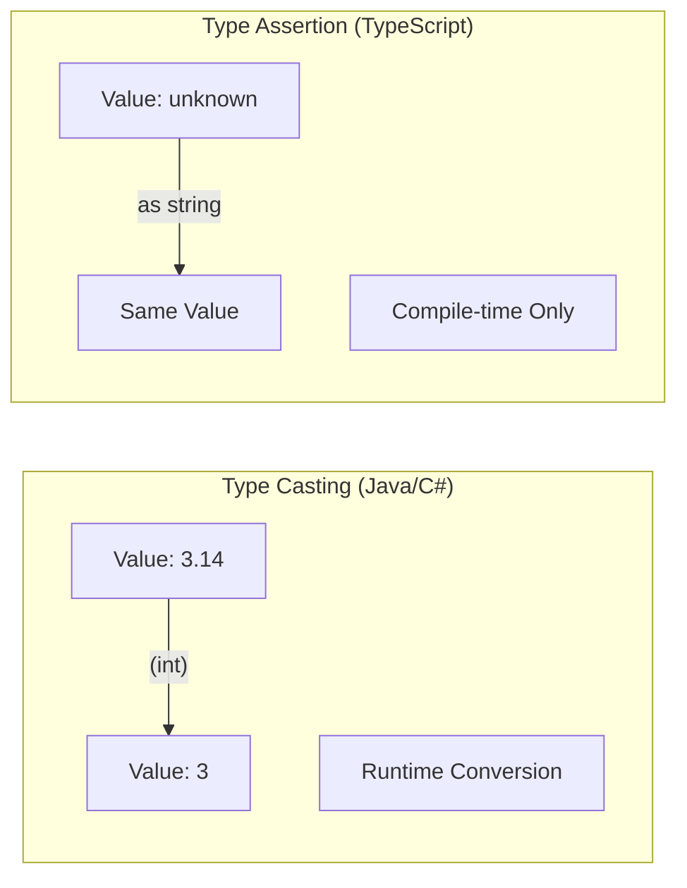
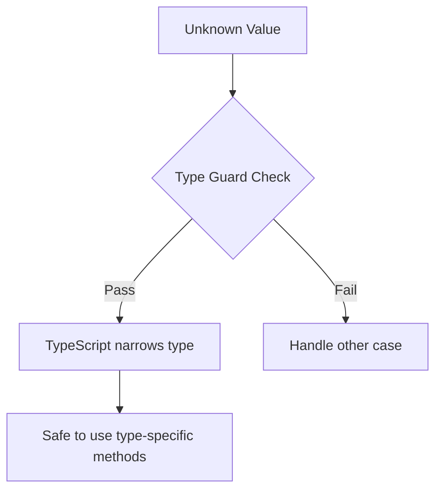
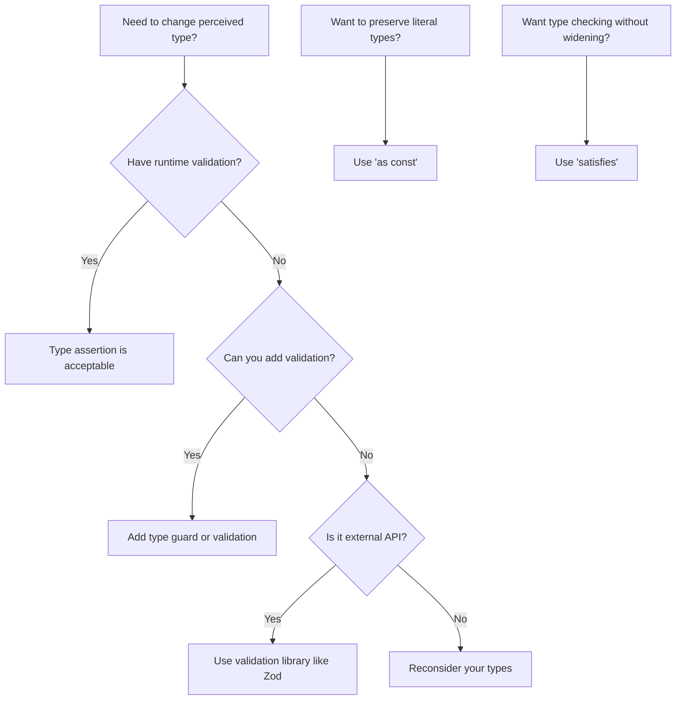

# How to Fix 'Type Assertion' vs Type Casting Confusion

Author: [nawazdhandala](https://www.github.com/nawazdhandala)

Tags: TypeScript, Type Assertion, Type Casting, Type Safety, as keyword, angle bracket syntax

Description: Learn the difference between type assertions and type casting in TypeScript and when to use each approach safely.

---

Many developers coming from languages like Java or C# confuse TypeScript type assertions with type casting. While they look similar, they work very differently. Understanding this distinction is crucial for writing safe TypeScript code. This guide clears up the confusion and shows you how to use type assertions correctly.

## The Key Difference

Type casting (in languages like C or Java) actually converts a value from one type to another at runtime. Type assertions in TypeScript do nothing at runtime - they only tell the compiler to treat a value as a different type.



```typescript
// TypeScript type assertion - NO runtime effect
const value: unknown = "hello";
const str = value as string;  // Just tells compiler it is a string

// This compiles but crashes at runtime!
const badValue: unknown = 123;
const badStr = badValue as string;
console.log(badStr.toUpperCase());  // Runtime error: toUpperCase is not a function
```

## Type Assertion Syntax

TypeScript has two syntaxes for type assertions:

```typescript
// Syntax 1: "as" keyword (preferred)
const value = someValue as string;

// Syntax 2: Angle bracket (does not work in JSX files)
const value = <string>someValue;

// In React/JSX files, you must use "as" syntax
function Component() {
    const element = document.getElementById('root') as HTMLDivElement;
    // <HTMLDivElement>document.getElementById('root');  // Syntax error in JSX!
    return <div ref={element}>Content</div>;
}
```

## When Type Assertions Are Appropriate

### 1. Narrowing from Unknown

When you receive data of unknown type and have validated it:

```typescript
function processApiResponse(data: unknown): string {
    // Validate first
    if (typeof data === 'object' && data !== null && 'message' in data) {
        // Now assertion is safe
        const response = data as { message: string };
        return response.message;
    }
    throw new Error('Invalid response format');
}
```

### 2. DOM Element Types

The DOM API often returns generic types that you know more specifically:

```typescript
// getElementById returns HTMLElement | null
// But you know it is specifically an input
const input = document.getElementById('email') as HTMLInputElement;
input.value = 'test@example.com';

// Better: Check if element exists first
const input = document.getElementById('email');
if (input instanceof HTMLInputElement) {
    input.value = 'test@example.com';
}
```

### 3. Working with External Data

When TypeScript cannot infer the type from external sources:

```typescript
interface User {
    id: number;
    name: string;
    email: string;
}

// JSON.parse returns 'any'
const userData = JSON.parse(jsonString) as User;

// Better approach: Use a type guard or validation library
function isUser(value: unknown): value is User {
    return (
        typeof value === 'object' &&
        value !== null &&
        'id' in value &&
        'name' in value &&
        'email' in value &&
        typeof (value as User).id === 'number' &&
        typeof (value as User).name === 'string' &&
        typeof (value as User).email === 'string'
    );
}

const data = JSON.parse(jsonString);
if (isUser(data)) {
    // TypeScript knows data is User here
    console.log(data.name);
}
```

## Dangerous Assertion Patterns

### Lying to the Compiler

```typescript
// DANGEROUS: Asserting incompatible types
interface Dog {
    bark(): void;
    breed: string;
}

interface Cat {
    meow(): void;
    color: string;
}

const dog: Dog = { bark: () => console.log('Woof'), breed: 'Labrador' };

// TypeScript prevents direct assertion between unrelated types
// const cat = dog as Cat;  // Error!

// But you can bypass with double assertion (NEVER do this)
const cat = dog as unknown as Cat;  // Compiles but dangerous!
cat.meow();  // Runtime error: meow is not a function
```

### Asserting Away Null

```typescript
// Non-null assertion operator (!)
function getElement(): HTMLElement | null {
    return document.getElementById('maybe-exists');
}

// DANGEROUS: Asserting element exists
const element = getElement()!;  // Removes null from type
element.classList.add('active');  // Runtime error if element is null

// SAFE: Check for null first
const element = getElement();
if (element) {
    element.classList.add('active');
}

// Or use optional chaining
getElement()?.classList.add('active');
```

## Better Alternatives to Assertions

### Type Guards

```typescript
// User-defined type guard
function isString(value: unknown): value is string {
    return typeof value === 'string';
}

function processValue(value: unknown): string {
    if (isString(value)) {
        // TypeScript knows value is string here
        return value.toUpperCase();
    }
    return String(value);
}
```



### Discriminated Unions

```typescript
interface SuccessResult {
    success: true;
    data: string;
}

interface ErrorResult {
    success: false;
    error: string;
}

type Result = SuccessResult | ErrorResult;

function handleResult(result: Result) {
    // No assertion needed - TypeScript narrows based on discriminant
    if (result.success) {
        console.log(result.data);  // TypeScript knows it is SuccessResult
    } else {
        console.log(result.error);  // TypeScript knows it is ErrorResult
    }
}
```

### Validation Libraries

Use libraries like Zod for runtime validation with TypeScript integration:

```typescript
import { z } from 'zod';

// Define schema
const UserSchema = z.object({
    id: z.number(),
    name: z.string(),
    email: z.string().email(),
});

// Infer TypeScript type from schema
type User = z.infer<typeof UserSchema>;

// Parse and validate at runtime
function parseUser(data: unknown): User {
    return UserSchema.parse(data);  // Throws if invalid
}

// Safe parsing that returns result object
function safeParseUser(data: unknown) {
    const result = UserSchema.safeParse(data);
    if (result.success) {
        return result.data;  // Type is User
    }
    console.error(result.error);
    return null;
}
```

## Const Assertions

A special type of assertion that makes values more specific:

```typescript
// Without const assertion
const config = {
    endpoint: '/api/users',
    method: 'GET'
};
// Type: { endpoint: string; method: string }

// With const assertion
const config = {
    endpoint: '/api/users',
    method: 'GET'
} as const;
// Type: { readonly endpoint: '/api/users'; readonly method: 'GET' }

// Useful for creating literal union types
const COLORS = ['red', 'green', 'blue'] as const;
type Color = typeof COLORS[number];  // 'red' | 'green' | 'blue'

// Without "as const", type would just be string[]
const badColors = ['red', 'green', 'blue'];
type BadColor = typeof badColors[number];  // string
```

## Satisfies Operator (TypeScript 4.9+)

The `satisfies` operator provides type checking without changing the inferred type:

```typescript
interface Config {
    endpoint: string;
    timeout: number;
    retries?: number;
}

// Using "as" - loses specific literal types
const config1 = {
    endpoint: '/api',
    timeout: 5000
} as Config;
// Type of endpoint: string (lost the literal '/api')

// Using "satisfies" - keeps literal types while validating
const config2 = {
    endpoint: '/api',
    timeout: 5000
} satisfies Config;
// Type of endpoint: '/api' (literal type preserved)

// Error if it does not satisfy the type
const badConfig = {
    endpoint: '/api'
    // Error: Property 'timeout' is missing
} satisfies Config;
```

## When to Use What



## Summary Table

| Technique | Runtime Effect | Safety | Use Case |
|-----------|---------------|--------|----------|
| Type Assertion (`as`) | None | Low | When you know more than TypeScript |
| Type Guard | Yes | High | Runtime validation with type narrowing |
| `as const` | None | High | Literal types and readonly |
| `satisfies` | None | High | Validate shape without widening type |
| Validation Library | Yes | Highest | External data validation |

## Conclusion

Type assertions in TypeScript are not the same as type casting in other languages. They do not change the actual value at runtime - they only tell the compiler to treat the value differently. This makes them potentially dangerous if used incorrectly. Prefer type guards and validation when possible, use `as const` for literal types, and reach for assertions only when you genuinely know more about a type than TypeScript can infer. When you do use assertions, validate the data first to avoid runtime surprises.
