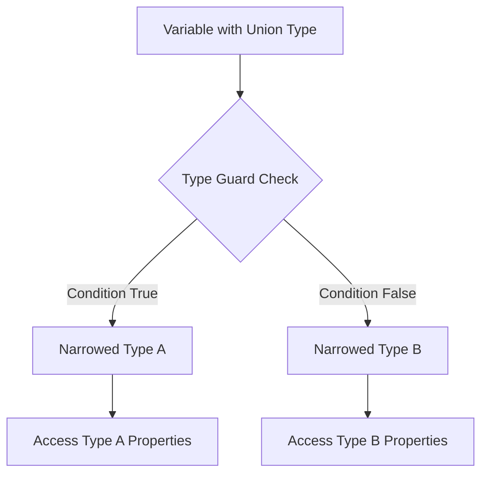
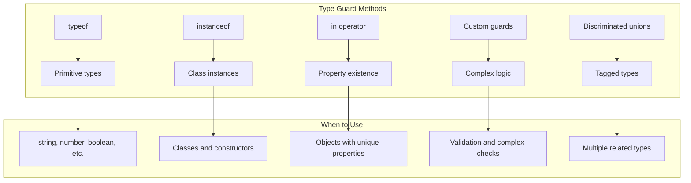
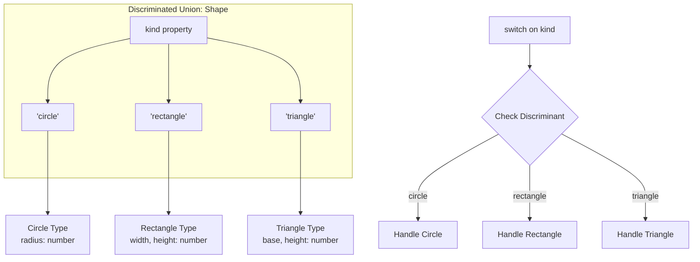
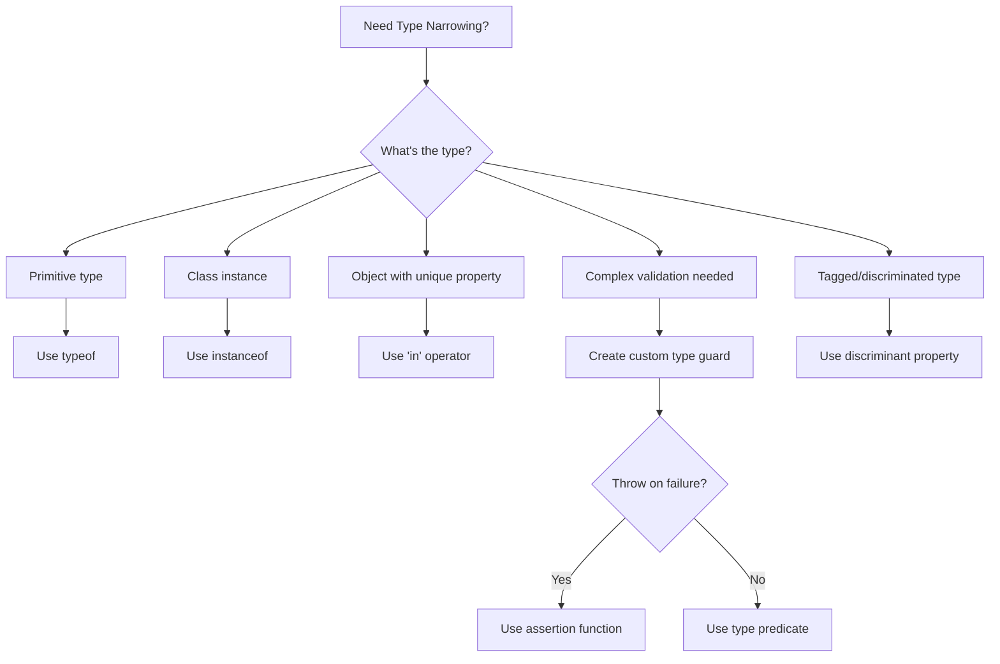

# How to Handle Type Guards in TypeScript

Author: [nawazdhandala](https://www.github.com/nawazdhandala)

Tags: TypeScript, Type Guards, Type Narrowing, Programming, Best Practices, Type Safety

Description: Learn how to use type guards in TypeScript to narrow types at runtime and write safer, more predictable code.

---

Type guards are TypeScript expressions that perform runtime checks to narrow down the type of a variable within a conditional block. They bridge the gap between compile-time type checking and runtime behavior.

## Understanding Type Guards



Type guards allow TypeScript to understand that within certain code blocks, a variable is of a more specific type than originally declared.

## Built-in Type Guards

### typeof Guard

The `typeof` operator is the simplest type guard for primitive types.

```typescript
// typeof type guard
function processValue(value: string | number | boolean): string {
    // typeof narrows to specific primitive types
    if (typeof value === "string") {
        // TypeScript knows value is string here
        return value.toUpperCase();
    }

    if (typeof value === "number") {
        // TypeScript knows value is number here
        return value.toFixed(2);
    }

    // TypeScript knows value is boolean here
    return value ? "yes" : "no";
}

// Usage
console.log(processValue("hello"));  // "HELLO"
console.log(processValue(3.14159));  // "3.14"
console.log(processValue(true));     // "yes"
```

### instanceof Guard

The `instanceof` operator checks if an object is an instance of a class.

```typescript
// Classes for demonstration
class Dog {
    bark(): string {
        return "Woof!";
    }
}

class Cat {
    meow(): string {
        return "Meow!";
    }
}

class Bird {
    chirp(): string {
        return "Tweet!";
    }
}

type Pet = Dog | Cat | Bird;

// instanceof type guard
function getPetSound(pet: Pet): string {
    if (pet instanceof Dog) {
        // TypeScript knows pet is Dog
        return pet.bark();
    }

    if (pet instanceof Cat) {
        // TypeScript knows pet is Cat
        return pet.meow();
    }

    // TypeScript knows pet is Bird
    return pet.chirp();
}

// Usage
const myDog = new Dog();
const myCat = new Cat();
console.log(getPetSound(myDog));  // "Woof!"
console.log(getPetSound(myCat));  // "Meow!"
```

### in Operator Guard

The `in` operator checks for the existence of a property.

```typescript
// Interfaces with different properties
interface Car {
    drive(): void;
    wheels: number;
}

interface Boat {
    sail(): void;
    propellers: number;
}

interface Plane {
    fly(): void;
    wings: number;
}

type Vehicle = Car | Boat | Plane;

// 'in' type guard
function operateVehicle(vehicle: Vehicle): void {
    if ("drive" in vehicle) {
        // TypeScript knows vehicle is Car
        console.log(`Driving with ${vehicle.wheels} wheels`);
        vehicle.drive();
    } else if ("sail" in vehicle) {
        // TypeScript knows vehicle is Boat
        console.log(`Sailing with ${vehicle.propellers} propellers`);
        vehicle.sail();
    } else {
        // TypeScript knows vehicle is Plane
        console.log(`Flying with ${vehicle.wings} wings`);
        vehicle.fly();
    }
}
```

## Type Guard Flow



## Custom Type Guards

Custom type guards use the `is` keyword to create user-defined type predicates.

### Basic Custom Type Guard

```typescript
// Define interfaces
interface Fish {
    swim(): void;
    habitat: "water";
}

interface Bird {
    fly(): void;
    habitat: "air";
}

type Animal = Fish | Bird;

// Custom type guard function
function isFish(animal: Animal): animal is Fish {
    // Return true if this is a Fish
    return animal.habitat === "water";
}

function isBird(animal: Animal): animal is Bird {
    return animal.habitat === "air";
}

// Using custom type guards
function moveAnimal(animal: Animal): void {
    if (isFish(animal)) {
        // TypeScript knows animal is Fish
        animal.swim();
    } else {
        // TypeScript knows animal is Bird
        animal.fly();
    }
}
```

### Complex Type Guard with Validation

```typescript
// API response types
interface SuccessResponse {
    status: "success";
    data: {
        id: number;
        name: string;
        email: string;
    };
}

interface ErrorResponse {
    status: "error";
    error: {
        code: number;
        message: string;
    };
}

type ApiResponse = SuccessResponse | ErrorResponse;

// Type guard with thorough validation
function isSuccessResponse(response: ApiResponse): response is SuccessResponse {
    return (
        response.status === "success" &&
        "data" in response &&
        typeof response.data.id === "number" &&
        typeof response.data.name === "string" &&
        typeof response.data.email === "string"
    );
}

function isErrorResponse(response: ApiResponse): response is ErrorResponse {
    return (
        response.status === "error" &&
        "error" in response &&
        typeof response.error.code === "number" &&
        typeof response.error.message === "string"
    );
}

// Usage
async function handleApiResponse(response: ApiResponse): Promise<void> {
    if (isSuccessResponse(response)) {
        // TypeScript knows this is SuccessResponse
        console.log(`User: ${response.data.name}`);
        console.log(`Email: ${response.data.email}`);
    } else if (isErrorResponse(response)) {
        // TypeScript knows this is ErrorResponse
        console.error(`Error ${response.error.code}: ${response.error.message}`);
    }
}
```

## Discriminated Unions

Discriminated unions use a common property (discriminant) to distinguish between types.

```typescript
// Define types with discriminant property
interface Circle {
    kind: "circle";
    radius: number;
}

interface Rectangle {
    kind: "rectangle";
    width: number;
    height: number;
}

interface Triangle {
    kind: "triangle";
    base: number;
    height: number;
}

type Shape = Circle | Rectangle | Triangle;

// Using discriminated union
function calculateArea(shape: Shape): number {
    switch (shape.kind) {
        case "circle":
            // TypeScript knows shape is Circle
            return Math.PI * shape.radius ** 2;

        case "rectangle":
            // TypeScript knows shape is Rectangle
            return shape.width * shape.height;

        case "triangle":
            // TypeScript knows shape is Triangle
            return (shape.base * shape.height) / 2;

        default:
            // Exhaustiveness check
            const _exhaustive: never = shape;
            throw new Error(`Unknown shape: ${_exhaustive}`);
    }
}
```

### Discriminated Union Diagram



## Type Guards with Generics

```typescript
// Generic type guard
function isArray<T>(value: T | T[]): value is T[] {
    return Array.isArray(value);
}

function processItems<T>(input: T | T[]): T[] {
    if (isArray(input)) {
        // TypeScript knows input is T[]
        return input;
    }
    // TypeScript knows input is T
    return [input];
}

// Usage
const single = processItems(42);      // number[]
const multiple = processItems([1, 2]); // number[]

// Generic type guard with constraint
function hasProperty<T extends object, K extends string>(
    obj: T,
    key: K
): obj is T & Record<K, unknown> {
    return key in obj;
}

function processObject(obj: object): void {
    if (hasProperty(obj, "name")) {
        // TypeScript knows obj has 'name' property
        console.log(obj.name);
    }
}
```

## Assertion Functions

TypeScript 3.7+ supports assertion functions that throw if a condition is not met.

```typescript
// Assertion function
function assertIsString(value: unknown): asserts value is string {
    if (typeof value !== "string") {
        throw new Error(`Expected string, got ${typeof value}`);
    }
}

function assertIsDefined<T>(value: T | null | undefined): asserts value is T {
    if (value === null || value === undefined) {
        throw new Error("Value is null or undefined");
    }
}

// Usage
function processInput(input: unknown): string {
    assertIsString(input);
    // TypeScript now knows input is string
    return input.toUpperCase();
}

function getLength(arr: number[] | null): number {
    assertIsDefined(arr);
    // TypeScript now knows arr is number[]
    return arr.length;
}

// Assertion with custom error
function assertIsPositive(value: number): asserts value is number {
    if (value <= 0) {
        throw new RangeError(`Expected positive number, got ${value}`);
    }
}
```

## Type Guard Patterns

### Pattern 1: Null and Undefined Guards

```typescript
// Null guard
function isNotNull<T>(value: T | null): value is T {
    return value !== null;
}

// Undefined guard
function isDefined<T>(value: T | undefined): value is T {
    return value !== undefined;
}

// Combined null/undefined guard
function isPresent<T>(value: T | null | undefined): value is T {
    return value !== null && value !== undefined;
}

// Usage with arrays
const values: (string | null | undefined)[] = ["a", null, "b", undefined, "c"];

// Filter removes null and undefined
const strings: string[] = values.filter(isPresent);
console.log(strings);  // ["a", "b", "c"]
```

### Pattern 2: Object Shape Guards

```typescript
// Define expected shape
interface UserProfile {
    id: string;
    username: string;
    email: string;
    preferences?: {
        theme: "light" | "dark";
        notifications: boolean;
    };
}

// Type guard for object shape
function isUserProfile(obj: unknown): obj is UserProfile {
    // First check if it's an object
    if (typeof obj !== "object" || obj === null) {
        return false;
    }

    // Cast for property access
    const candidate = obj as Record<string, unknown>;

    // Check required properties
    if (typeof candidate.id !== "string") return false;
    if (typeof candidate.username !== "string") return false;
    if (typeof candidate.email !== "string") return false;

    // Check optional preferences
    if (candidate.preferences !== undefined) {
        if (typeof candidate.preferences !== "object" || candidate.preferences === null) {
            return false;
        }
        const prefs = candidate.preferences as Record<string, unknown>;
        if (prefs.theme !== "light" && prefs.theme !== "dark") return false;
        if (typeof prefs.notifications !== "boolean") return false;
    }

    return true;
}

// Usage
function loadUserProfile(data: unknown): UserProfile | null {
    if (isUserProfile(data)) {
        return data;
    }
    console.error("Invalid user profile data");
    return null;
}
```

### Pattern 3: Array Element Guards

```typescript
// Guard for array elements
function isStringArray(arr: unknown[]): arr is string[] {
    return arr.every(item => typeof item === "string");
}

function isNumberArray(arr: unknown[]): arr is number[] {
    return arr.every(item => typeof item === "number");
}

// Generic element guard
function isArrayOf<T>(
    arr: unknown[],
    guard: (item: unknown) => item is T
): arr is T[] {
    return arr.every(guard);
}

// Custom element guard
function isPositiveNumber(value: unknown): value is number {
    return typeof value === "number" && value > 0;
}

// Usage
const mixedArray: unknown[] = [1, 2, 3, 4, 5];

if (isArrayOf(mixedArray, isPositiveNumber)) {
    // TypeScript knows this is number[]
    const sum = mixedArray.reduce((a, b) => a + b, 0);
    console.log(sum);
}
```

## Type Guard Decision Tree



## Best Practices

### Do: Create Reusable Type Guards

```typescript
// Centralized type guards module
// guards.ts

export function isString(value: unknown): value is string {
    return typeof value === "string";
}

export function isNumber(value: unknown): value is number {
    return typeof value === "number" && !Number.isNaN(value);
}

export function isObject(value: unknown): value is Record<string, unknown> {
    return typeof value === "object" && value !== null && !Array.isArray(value);
}

export function isNonEmptyArray<T>(arr: T[]): arr is [T, ...T[]] {
    return arr.length > 0;
}

// Usage in other files
import { isString, isNumber } from "./guards";
```

### Do: Use Exhaustiveness Checking

```typescript
type Status = "pending" | "approved" | "rejected" | "archived";

function handleStatus(status: Status): string {
    switch (status) {
        case "pending":
            return "Waiting for review";
        case "approved":
            return "Request approved";
        case "rejected":
            return "Request denied";
        case "archived":
            return "Request archived";
        default:
            // This ensures all cases are handled
            const _exhaustive: never = status;
            return _exhaustive;
    }
}
```

### Don't: Overuse Type Assertions

```typescript
// Bad: Using assertion instead of guard
function processData(data: unknown): void {
    // Unsafe - no runtime check
    const user = data as User;
    console.log(user.name);
}

// Good: Using type guard
function processDataSafe(data: unknown): void {
    if (isUser(data)) {
        // Safe - runtime validated
        console.log(data.name);
    }
}
```

## Performance Considerations

```typescript
// Cache type guard results for repeated checks
class TypeChecker {
    private cache = new WeakMap<object, string>();

    getType(obj: object): string {
        if (this.cache.has(obj)) {
            return this.cache.get(obj)!;
        }

        const type = this.detectType(obj);
        this.cache.set(obj, type);
        return type;
    }

    private detectType(obj: object): string {
        // Expensive type detection logic
        if ("kind" in obj) {
            return (obj as { kind: string }).kind;
        }
        return "unknown";
    }
}

// Avoid redundant checks
function processItems(items: (string | number)[]): void {
    // Single pass with type narrowing
    for (const item of items) {
        if (typeof item === "string") {
            handleString(item);
        } else {
            handleNumber(item);
        }
    }
}

function handleString(s: string): void {
    console.log(s.toUpperCase());
}

function handleNumber(n: number): void {
    console.log(n.toFixed(2));
}
```

## Summary

Type guards are essential for writing type-safe TypeScript code:

1. **typeof** - Use for primitive types (string, number, boolean)
2. **instanceof** - Use for class instances
3. **in operator** - Use to check property existence
4. **Custom type guards** - Use for complex type validation with `is` predicate
5. **Assertion functions** - Use when you want to throw on invalid types
6. **Discriminated unions** - Use common discriminant property for related types

Type guards enable TypeScript to understand your runtime checks and provide accurate type information within conditional blocks, making your code both safer and more expressive.
