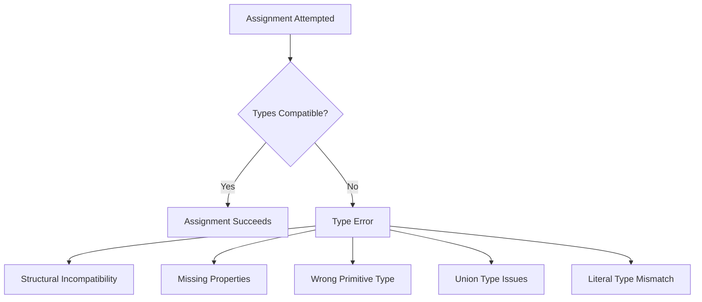
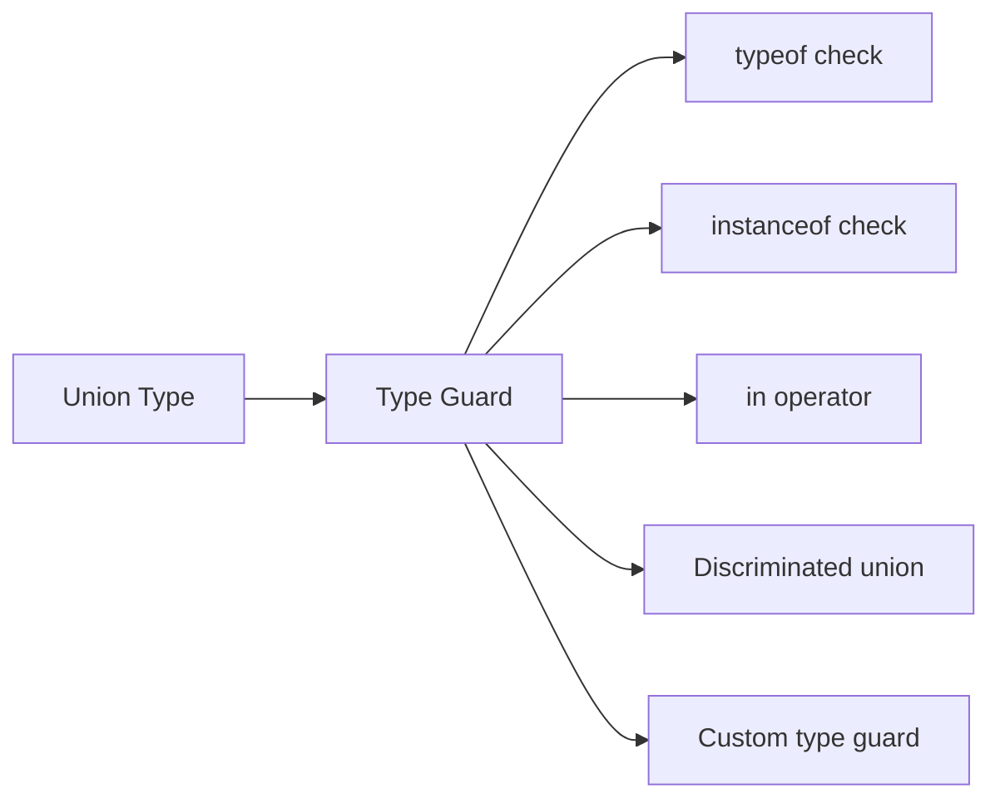
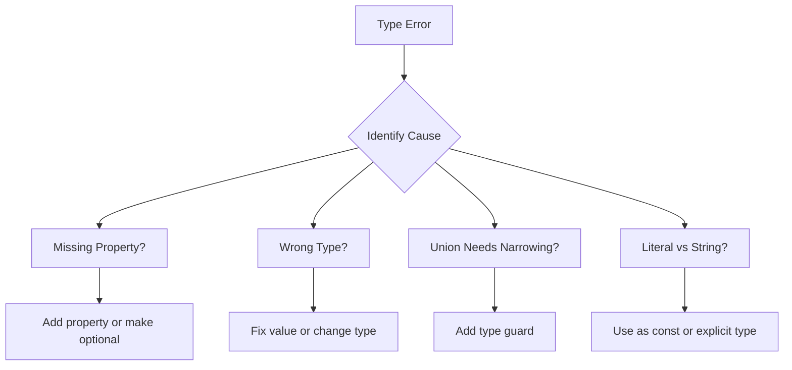

# How to Fix 'Type 'X' Is Not Assignable to Type 'Y'' Errors

Author: [nawazdhandala](https://www.github.com/nawazdhandala)

Tags: TypeScript, Type Errors, Debugging, JavaScript, Type Safety

Description: A practical guide to understanding and fixing TypeScript's 'Type 'X' is not assignable to type 'Y'' errors with real-world examples and solutions.

---

> TypeScript's type system helps catch errors at compile time, but the "Type 'X' is not assignable to type 'Y'" error is one of the most common and sometimes confusing messages developers encounter. This guide explains the root causes and provides practical solutions.

Understanding why TypeScript reports type incompatibility is essential for writing type-safe code. This error occurs when you try to assign a value of one type to a variable or parameter that expects a different type.

---

## Understanding the Error



---

## Common Causes and Solutions

### 1. Basic Type Mismatch

The simplest case is assigning a value of the wrong primitive type.

```typescript
// ERROR: Type 'string' is not assignable to type 'number'
let count: number = "5";

// SOLUTION 1: Use the correct type
let count: number = 5;

// SOLUTION 2: Parse the string
let count: number = parseInt("5", 10);

// SOLUTION 3: Change the variable type if appropriate
let count: string = "5";
```

### 2. Object Property Mismatches

When object shapes do not match the expected interface.

```typescript
interface User {
    id: number;
    name: string;
    email: string;
}

// ERROR: Property 'email' is missing in type '{ id: number; name: string; }'
const user: User = {
    id: 1,
    name: "John"
};

// SOLUTION 1: Add the missing property
const user: User = {
    id: 1,
    name: "John",
    email: "john@example.com"
};

// SOLUTION 2: Make the property optional in the interface
interface User {
    id: number;
    name: string;
    email?: string;  // Optional property
}

// SOLUTION 3: Use Partial for all optional properties
const partialUser: Partial<User> = {
    id: 1,
    name: "John"
};
```

### 3. Union Type Narrowing Issues

When working with union types, TypeScript cannot determine the specific type.

```typescript
type Result = { success: true; data: string } | { success: false; error: string };

function handleResult(result: Result) {
    // ERROR: Property 'data' does not exist on type 'Result'
    console.log(result.data);

    // SOLUTION: Use type guards to narrow the type
    if (result.success) {
        // TypeScript now knows result has 'data'
        console.log(result.data);
    } else {
        // TypeScript now knows result has 'error'
        console.log(result.error);
    }
}
```

---

## Type Narrowing Patterns



### Using typeof for Primitives

```typescript
function processValue(value: string | number) {
    // ERROR without narrowing
    // value.toFixed(2);

    // SOLUTION: Use typeof to narrow
    if (typeof value === "number") {
        console.log(value.toFixed(2));  // Works - value is number
    } else {
        console.log(value.toUpperCase());  // Works - value is string
    }
}
```

### Using instanceof for Classes

```typescript
class Dog {
    bark() { console.log("Woof!"); }
}

class Cat {
    meow() { console.log("Meow!"); }
}

function handlePet(pet: Dog | Cat) {
    if (pet instanceof Dog) {
        pet.bark();  // TypeScript knows pet is Dog
    } else {
        pet.meow();  // TypeScript knows pet is Cat
    }
}
```

### Using the in Operator

```typescript
interface Bird {
    fly(): void;
    layEggs(): void;
}

interface Fish {
    swim(): void;
    layEggs(): void;
}

function move(animal: Bird | Fish) {
    if ("fly" in animal) {
        animal.fly();  // TypeScript knows animal is Bird
    } else {
        animal.swim();  // TypeScript knows animal is Fish
    }
}
```

### Discriminated Unions

```typescript
// Use a common property with literal types for discrimination
interface Square {
    kind: "square";
    size: number;
}

interface Rectangle {
    kind: "rectangle";
    width: number;
    height: number;
}

interface Circle {
    kind: "circle";
    radius: number;
}

type Shape = Square | Rectangle | Circle;

function getArea(shape: Shape): number {
    switch (shape.kind) {
        case "square":
            return shape.size * shape.size;
        case "rectangle":
            return shape.width * shape.height;
        case "circle":
            return Math.PI * shape.radius ** 2;
    }
}
```

---

## Handling Literal Types

Literal types can cause unexpected assignment errors.

```typescript
// ERROR: Type 'string' is not assignable to type '"small" | "medium" | "large"'
type Size = "small" | "medium" | "large";

const config = {
    size: "medium"  // TypeScript infers 'string', not '"medium"'
};

function setSize(size: Size) {}

setSize(config.size);  // Error!

// SOLUTION 1: Use const assertion
const config = {
    size: "medium" as const  // Type is now '"medium"'
};

// SOLUTION 2: Use const assertion on the whole object
const config = {
    size: "medium"
} as const;

// SOLUTION 3: Explicitly type the property
const config: { size: Size } = {
    size: "medium"
};

// SOLUTION 4: Type assertion at call site
setSize(config.size as Size);
```

---

## Array and Tuple Type Errors

```typescript
// ERROR: Type 'number[]' is not assignable to type '[number, number]'
const coordinates: [number, number] = [1, 2, 3];  // Too many elements

// SOLUTION: Match the tuple length
const coordinates: [number, number] = [1, 2];

// ERROR: Type 'string' is not assignable to type 'number'
const mixed: number[] = [1, 2, "three"];

// SOLUTION 1: Use union type array
const mixed: (number | string)[] = [1, 2, "three"];

// SOLUTION 2: Use tuple with specific types
const mixed: [number, number, string] = [1, 2, "three"];
```

---

## Generic Type Constraints

```typescript
// ERROR: Type 'T' is not assignable to type 'string'
function getLength<T>(item: T): number {
    return item.length;  // Error - T might not have length
}

// SOLUTION: Add a constraint
function getLength<T extends { length: number }>(item: T): number {
    return item.length;  // Works - T must have length property
}

// Or use a more specific constraint
function getLength<T extends string | Array<unknown>>(item: T): number {
    return item.length;
}
```

---

## Null and Undefined Assignments

```typescript
// ERROR: Type 'null' is not assignable to type 'string'
let name: string = null;

// SOLUTION 1: Use union with null
let name: string | null = null;

// SOLUTION 2: Use optional chaining when accessing
interface User {
    profile?: {
        avatar?: string;
    };
}

function getAvatar(user: User): string {
    // ERROR: Type 'string | undefined' is not assignable to type 'string'
    return user.profile?.avatar;

    // SOLUTION: Provide a default value
    return user.profile?.avatar ?? "default-avatar.png";
}
```

---

## Function Parameter and Return Types

```typescript
// ERROR: Type '(x: number) => string' is not assignable to type '(x: number) => number'
type NumberTransform = (x: number) => number;

const transform: NumberTransform = (x: number) => x.toString();  // Error

// SOLUTION: Match the return type
const transform: NumberTransform = (x: number) => x * 2;

// Function parameter contravariance
interface Animal {
    name: string;
}

interface Dog extends Animal {
    breed: string;
}

// ERROR: Type '(animal: Animal) => void' is not assignable to type '(dog: Dog) => void'
type DogHandler = (dog: Dog) => void;

const handleAnimal: DogHandler = (animal: Animal) => {
    // This is actually safe - handler accepts broader type
    console.log(animal.name);
};

// SOLUTION: Use the correct parameter type
const handleDog: DogHandler = (dog: Dog) => {
    console.log(dog.name, dog.breed);
};
```

---

## Type Assertion Techniques

When you know more about a type than TypeScript can infer, use type assertions carefully.

```typescript
// CAUTION: Type assertions bypass type checking
const data = JSON.parse('{"id": 1}');

// ERROR: Property 'id' does not exist on type 'unknown'
console.log(data.id);

// SOLUTION 1: Type assertion (use with caution)
interface Data {
    id: number;
}
const typedData = JSON.parse('{"id": 1}') as Data;
console.log(typedData.id);

// SOLUTION 2: Runtime validation with type guard
function isData(value: unknown): value is Data {
    return (
        typeof value === "object" &&
        value !== null &&
        "id" in value &&
        typeof (value as Data).id === "number"
    );
}

const parsed = JSON.parse('{"id": 1}');
if (isData(parsed)) {
    console.log(parsed.id);  // Safe - validated at runtime
}
```

---

## Common Patterns and Fixes



---

## Debugging Tips

1. **Read the full error message** - TypeScript provides detailed information about what type was expected versus received

2. **Hover over variables** - In VS Code, hovering shows the inferred type

3. **Use the TypeScript playground** - Test isolated code snippets at typescriptlang.org/play

4. **Check for typos** - Property name mismatches cause this error

5. **Verify import paths** - Wrong imports can bring in types with similar names but different shapes

```typescript
// Enable strict mode for better error messages
// tsconfig.json
{
    "compilerOptions": {
        "strict": true,
        "noImplicitAny": true,
        "strictNullChecks": true
    }
}
```

---

## Best Practices

1. **Define interfaces for complex objects** - Makes type requirements explicit

2. **Use discriminated unions** - Provides clean type narrowing with switch statements

3. **Avoid type assertions when possible** - Prefer type guards for runtime safety

4. **Enable strict mode** - Catches more errors at compile time

5. **Use generics with constraints** - Maintain flexibility while ensuring type safety

---

## Conclusion

The "Type 'X' is not assignable to type 'Y'" error is TypeScript helping you catch bugs before runtime. Understanding structural typing, type narrowing, and literal types helps you write code that satisfies the type checker while maintaining the safety benefits TypeScript provides.

When you encounter this error, identify whether the issue is a missing property, wrong primitive type, union that needs narrowing, or literal type mismatch. Each scenario has specific solutions that maintain type safety.

---

*Need to monitor your TypeScript applications in production? [OneUptime](https://oneuptime.com) provides comprehensive monitoring, error tracking, and performance metrics for your applications.*

**Related Reading:**
- [How to Handle Generic Types in TypeScript](https://oneuptime.com/blog)
- [How to Configure tsconfig.json Properly](https://oneuptime.com/blog)
