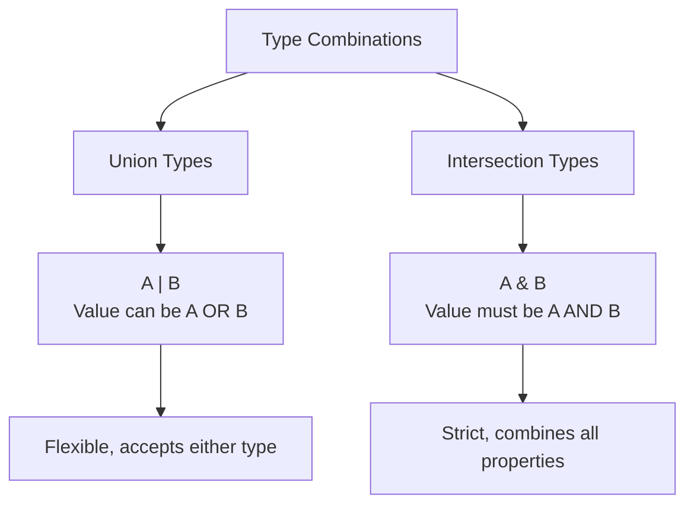
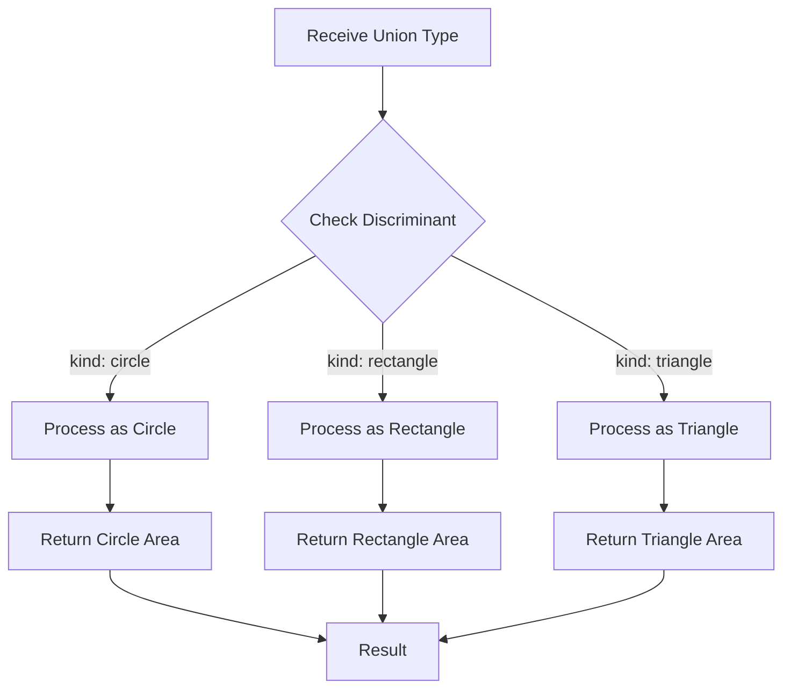
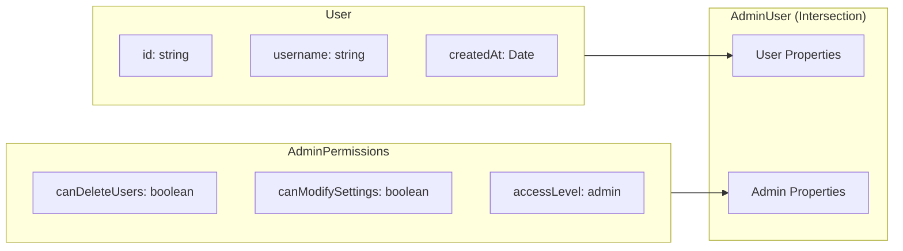
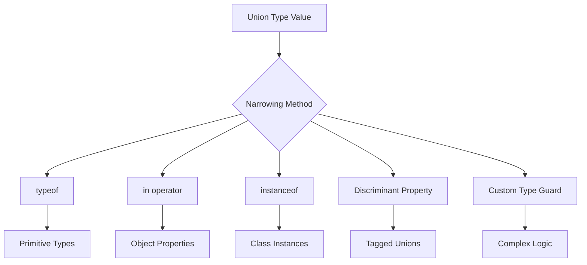

# How to Handle Union and Intersection Types

Author: [nawazdhandala](https://www.github.com/nawazdhandala)

Tags: TypeScript, Union Types, Intersection Types, Type System, Programming, Best Practices

Description: Learn how to effectively use union and intersection types in TypeScript to create flexible and type-safe code structures.

---

Union and intersection types are powerful features in TypeScript that allow you to combine types in different ways. Understanding when and how to use each is essential for writing robust, type-safe code.

## Understanding the Difference

Before diving into examples, let's understand the fundamental difference between union and intersection types.



## Union Types

Union types allow a value to be one of several types. They use the pipe `|` operator.

### Basic Union Types

```typescript
// Basic union type - value can be string OR number
type StringOrNumber = string | number;

// Function accepting union type
function printId(id: StringOrNumber): void {
    // TypeScript knows id could be either type
    console.log(`ID: ${id}`);
}

// Both calls are valid
printId(101);        // Works with number
printId("user-42");  // Works with string

// Type narrowing with union types
function processValue(value: string | number): string {
    // Use typeof to narrow the type
    if (typeof value === "string") {
        // TypeScript knows value is string here
        return value.toUpperCase();
    } else {
        // TypeScript knows value is number here
        return value.toFixed(2);
    }
}
```

### Discriminated Unions

Discriminated unions are a pattern that makes working with union types safer and more predictable.

```typescript
// Define types with a common discriminant property
interface Circle {
    kind: "circle";     // Discriminant
    radius: number;
}

interface Rectangle {
    kind: "rectangle";  // Discriminant
    width: number;
    height: number;
}

interface Triangle {
    kind: "triangle";   // Discriminant
    base: number;
    height: number;
}

// Create union type
type Shape = Circle | Rectangle | Triangle;

// Calculate area using discriminated union
function calculateArea(shape: Shape): number {
    // Switch on the discriminant property
    switch (shape.kind) {
        case "circle":
            // TypeScript knows shape is Circle
            return Math.PI * shape.radius ** 2;

        case "rectangle":
            // TypeScript knows shape is Rectangle
            return shape.width * shape.height;

        case "triangle":
            // TypeScript knows shape is Triangle
            return (shape.base * shape.height) / 2;

        default:
            // Exhaustiveness check
            const _exhaustive: never = shape;
            return _exhaustive;
    }
}

// Usage
const circle: Circle = { kind: "circle", radius: 5 };
const area = calculateArea(circle);  // Returns ~78.54
```

### Union Type Flow



## Intersection Types

Intersection types combine multiple types into one. A value of an intersection type must satisfy all constituent types.

### Basic Intersection Types

```typescript
// Define separate interfaces
interface HasName {
    name: string;
}

interface HasAge {
    age: number;
}

interface HasEmail {
    email: string;
}

// Combine using intersection
type Person = HasName & HasAge & HasEmail;

// Must provide ALL properties from ALL types
const person: Person = {
    name: "Alice",
    age: 30,
    email: "alice@example.com"
};

// This would cause an error - missing email
// const incomplete: Person = {
//     name: "Bob",
//     age: 25
// };
```

### Extending Functionality with Intersections

```typescript
// Base user type
interface User {
    id: string;
    username: string;
    createdAt: Date;
}

// Permission types
interface AdminPermissions {
    canDeleteUsers: boolean;
    canModifySettings: boolean;
    accessLevel: "admin";
}

interface ModeratorPermissions {
    canBanUsers: boolean;
    canEditContent: boolean;
    accessLevel: "moderator";
}

// Create specialized user types using intersection
type AdminUser = User & AdminPermissions;
type ModeratorUser = User & ModeratorPermissions;

// Admin user must have all User AND AdminPermissions properties
const admin: AdminUser = {
    id: "admin-001",
    username: "superadmin",
    createdAt: new Date(),
    canDeleteUsers: true,
    canModifySettings: true,
    accessLevel: "admin"
};

// Function that works with admin users
function performAdminAction(admin: AdminUser): void {
    if (admin.canDeleteUsers) {
        console.log(`${admin.username} can delete users`);
    }
}
```

### Intersection Type Structure



## Combining Union and Intersection

You can use both union and intersection types together for complex type definitions.

```typescript
// API response types
interface SuccessResponse<T> {
    status: "success";
    data: T;
    timestamp: Date;
}

interface ErrorResponse {
    status: "error";
    error: {
        code: number;
        message: string;
    };
    timestamp: Date;
}

// Common metadata added to all responses
interface ResponseMetadata {
    requestId: string;
    duration: number;
}

// Combine: (Success OR Error) AND Metadata
type ApiResponse<T> = (SuccessResponse<T> | ErrorResponse) & ResponseMetadata;

// Handler function
function handleResponse<T>(response: ApiResponse<T>): T | null {
    // All responses have metadata (intersection)
    console.log(`Request ${response.requestId} took ${response.duration}ms`);

    // Check discriminant for union type
    if (response.status === "success") {
        return response.data;
    } else {
        console.error(`Error ${response.error.code}: ${response.error.message}`);
        return null;
    }
}

// Example usage
interface UserData {
    id: string;
    name: string;
}

const successResponse: ApiResponse<UserData> = {
    status: "success",
    data: { id: "1", name: "Alice" },
    timestamp: new Date(),
    requestId: "req-123",
    duration: 45
};

const errorResponse: ApiResponse<UserData> = {
    status: "error",
    error: { code: 404, message: "User not found" },
    timestamp: new Date(),
    requestId: "req-124",
    duration: 12
};
```

## Practical Patterns

### Configuration Objects

```typescript
// Base configuration
interface BaseConfig {
    appName: string;
    version: string;
}

// Environment-specific configurations
interface DevelopmentConfig {
    environment: "development";
    debugMode: boolean;
    mockApi: boolean;
}

interface ProductionConfig {
    environment: "production";
    analyticsEnabled: boolean;
    cdnUrl: string;
}

// Combined configuration type
type AppConfig = BaseConfig & (DevelopmentConfig | ProductionConfig);

// Development configuration
const devConfig: AppConfig = {
    appName: "MyApp",
    version: "1.0.0",
    environment: "development",
    debugMode: true,
    mockApi: true
};

// Production configuration
const prodConfig: AppConfig = {
    appName: "MyApp",
    version: "1.0.0",
    environment: "production",
    analyticsEnabled: true,
    cdnUrl: "https://cdn.example.com"
};

// Type-safe configuration handler
function initializeApp(config: AppConfig): void {
    console.log(`Starting ${config.appName} v${config.version}`);

    if (config.environment === "development") {
        // TypeScript knows this is DevelopmentConfig
        if (config.debugMode) {
            console.log("Debug mode enabled");
        }
    } else {
        // TypeScript knows this is ProductionConfig
        console.log(`CDN: ${config.cdnUrl}`);
    }
}
```

### Event Handling System

```typescript
// Event type definitions
interface MouseEvent {
    type: "click" | "mouseover" | "mouseout";
    x: number;
    y: number;
    button: number;
}

interface KeyboardEvent {
    type: "keydown" | "keyup";
    key: string;
    keyCode: number;
    modifiers: {
        ctrl: boolean;
        shift: boolean;
        alt: boolean;
    };
}

interface CustomEvent {
    type: "custom";
    name: string;
    payload: unknown;
}

// Union of all events
type AppEvent = MouseEvent | KeyboardEvent | CustomEvent;

// Event metadata intersection
interface EventMetadata {
    timestamp: number;
    target: string;
}

// Full event type
type TrackedEvent = AppEvent & EventMetadata;

// Event handler
function handleEvent(event: TrackedEvent): void {
    // Access metadata (always available via intersection)
    console.log(`Event at ${event.timestamp} on ${event.target}`);

    // Handle based on event type (union discrimination)
    switch (event.type) {
        case "click":
        case "mouseover":
        case "mouseout":
            console.log(`Mouse at (${event.x}, ${event.y})`);
            break;

        case "keydown":
        case "keyup":
            console.log(`Key: ${event.key}`);
            break;

        case "custom":
            console.log(`Custom event: ${event.name}`);
            break;
    }
}
```

## Type Narrowing Techniques



### Type Narrowing Examples

```typescript
// Using 'in' operator
interface Bird {
    fly(): void;
    layEggs(): void;
}

interface Fish {
    swim(): void;
    layEggs(): void;
}

function move(animal: Bird | Fish): void {
    if ("fly" in animal) {
        // TypeScript knows animal is Bird
        animal.fly();
    } else {
        // TypeScript knows animal is Fish
        animal.swim();
    }
}

// Using instanceof
class Dog {
    bark(): void {
        console.log("Woof!");
    }
}

class Cat {
    meow(): void {
        console.log("Meow!");
    }
}

function makeSound(pet: Dog | Cat): void {
    if (pet instanceof Dog) {
        pet.bark();
    } else {
        pet.meow();
    }
}

// Custom type guard
interface SuccessResult {
    success: true;
    value: number;
}

interface FailureResult {
    success: false;
    error: string;
}

type Result = SuccessResult | FailureResult;

// Type guard function
function isSuccess(result: Result): result is SuccessResult {
    return result.success === true;
}

function processResult(result: Result): number {
    if (isSuccess(result)) {
        // TypeScript knows result is SuccessResult
        return result.value * 2;
    } else {
        // TypeScript knows result is FailureResult
        console.error(result.error);
        return 0;
    }
}
```

## Best Practices

1. **Use discriminated unions** for complex object types that need runtime checking
2. **Prefer intersection types** when you need to combine capabilities from multiple types
3. **Keep union members related** to maintain code clarity
4. **Use exhaustiveness checking** to ensure all union cases are handled
5. **Document complex type combinations** with comments explaining the intent

## Common Pitfalls to Avoid

```typescript
// Pitfall 1: Conflicting properties in intersections
interface A {
    prop: string;
}

interface B {
    prop: number;  // Same property, different type
}

// type C = A & B;  // prop becomes 'never' - impossible type!

// Pitfall 2: Forgetting to narrow union types
function badExample(value: string | number): string {
    // Error: number doesn't have toUpperCase
    // return value.toUpperCase();

    // Correct: narrow the type first
    if (typeof value === "string") {
        return value.toUpperCase();
    }
    return String(value);
}

// Pitfall 3: Over-complicated unions
// Instead of this:
type Complex =
    | { type: "a"; propA: string }
    | { type: "b"; propB: number }
    | { type: "c"; propC: boolean }
    | { type: "d"; propD: Date }
    | { type: "e"; propE: object };

// Consider if a generic approach is cleaner:
interface TypedValue<T extends string, V> {
    type: T;
    value: V;
}

type StringValue = TypedValue<"string", string>;
type NumberValue = TypedValue<"number", number>;
type Values = StringValue | NumberValue;
```

## Summary

Union and intersection types are complementary tools in TypeScript:

- Use **union types** (`|`) when a value can be one of several types
- Use **intersection types** (`&`) when a value must satisfy multiple type requirements
- Combine both for flexible, type-safe data structures
- Always narrow union types before accessing type-specific properties
- Use discriminated unions for safer runtime type checking

Mastering these concepts will help you write more expressive and safer TypeScript code.
