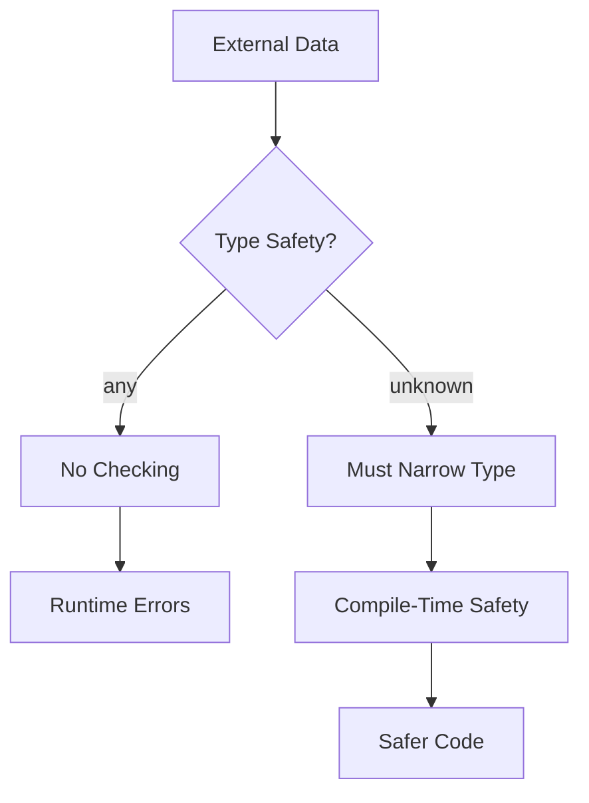
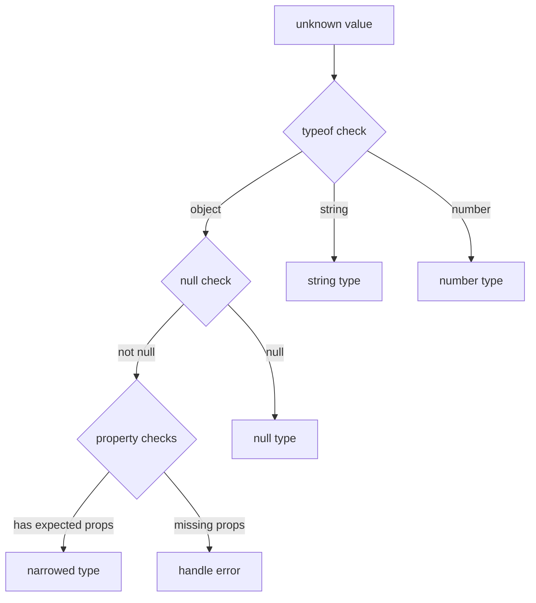

# How to Fix "Type 'unknown' Is Not Assignable" Errors

Author: [nawazdhandala](https://www.github.com/nawazdhandala)

Tags: TypeScript, Type Safety, Error Handling, Unknown Type, Type Guards, Debugging

Description: A practical guide to understanding the unknown type in TypeScript and techniques for safely narrowing it to specific types.

---

The error "Type 'unknown' is not assignable to type X" is one of the most common TypeScript errors when working with data from external sources. Unlike `any`, the `unknown` type forces you to verify the type before using it. This guide explains why this is actually helpful and how to handle it properly.

## Understanding the Unknown Type

The `unknown` type was introduced in TypeScript 3.0 as a type-safe counterpart to `any`. While `any` allows you to do anything without type checking, `unknown` requires type verification before use.



### Why Unknown Instead of Any

```typescript
// Using any - dangerous
function processAny(data: any) {
    // No errors, but might crash at runtime
    console.log(data.name.toUpperCase());
    data.forEach(item => console.log(item));
}

// Using unknown - safe
function processUnknown(data: unknown) {
    // console.log(data.name); // Error: Object is of type 'unknown'

    // Must verify type first
    if (typeof data === 'object' && data !== null && 'name' in data) {
        console.log(data.name);
    }
}
```

## Common Scenarios and Solutions

### Scenario 1: JSON Parsing

Parsing JSON returns `unknown` in strict TypeScript configurations.

```typescript
// The problem
const jsonString = '{"name": "John", "age": 30}';
const data = JSON.parse(jsonString); // Type is 'any' by default

// With strict typing, you might have:
function parseConfig(json: string): unknown {
    return JSON.parse(json);
}

const config = parseConfig('{"port": 3000}');
// config.port; // Error: Object is of type 'unknown'

// Solution 1: Type assertion (use when you trust the source)
interface AppConfig {
    port: number;
    host: string;
}

const configAsserted = parseConfig('{"port": 3000, "host": "localhost"}') as AppConfig;
console.log(configAsserted.port); // Works

// Solution 2: Type guard function (safer)
function isAppConfig(value: unknown): value is AppConfig {
    return (
        typeof value === 'object' &&
        value !== null &&
        'port' in value &&
        'host' in value &&
        typeof (value as AppConfig).port === 'number' &&
        typeof (value as AppConfig).host === 'string'
    );
}

const configGuarded = parseConfig('{"port": 3000, "host": "localhost"}');
if (isAppConfig(configGuarded)) {
    console.log(configGuarded.port); // Type-safe access
}
```

### Scenario 2: API Responses

Handling responses from external APIs where the structure might vary.

```typescript
// Define expected response types
interface User {
    id: string;
    email: string;
    name: string;
}

interface ApiError {
    code: number;
    message: string;
}

// Type guard for User
function isUser(value: unknown): value is User {
    if (typeof value !== 'object' || value === null) {
        return false;
    }

    const obj = value as Record<string, unknown>;
    return (
        typeof obj.id === 'string' &&
        typeof obj.email === 'string' &&
        typeof obj.name === 'string'
    );
}

// Type guard for ApiError
function isApiError(value: unknown): value is ApiError {
    if (typeof value !== 'object' || value === null) {
        return false;
    }

    const obj = value as Record<string, unknown>;
    return (
        typeof obj.code === 'number' &&
        typeof obj.message === 'string'
    );
}

// Safe API call handler
async function fetchUser(id: string): Promise<User> {
    const response = await fetch(`/api/users/${id}`);
    const data: unknown = await response.json();

    if (isApiError(data)) {
        throw new Error(`API Error ${data.code}: ${data.message}`);
    }

    if (!isUser(data)) {
        throw new Error('Invalid user data received');
    }

    return data;
}
```

### Scenario 3: Error Handling in Catch Blocks

In TypeScript 4.4+, caught errors are typed as `unknown` by default.

```typescript
// The problem
async function processData() {
    try {
        await fetch('/api/data');
    } catch (error) {
        // error is 'unknown' in strict mode
        // console.log(error.message); // Error
    }
}

// Solution 1: Type guard for Error
function isError(value: unknown): value is Error {
    return value instanceof Error;
}

async function processDataFixed() {
    try {
        await fetch('/api/data');
    } catch (error) {
        if (isError(error)) {
            console.log(error.message); // Safe
            console.log(error.stack);
        } else {
            console.log('Unknown error:', String(error));
        }
    }
}

// Solution 2: Utility function for error messages
function getErrorMessage(error: unknown): string {
    if (error instanceof Error) {
        return error.message;
    }
    if (typeof error === 'string') {
        return error;
    }
    if (typeof error === 'object' && error !== null && 'message' in error) {
        return String((error as { message: unknown }).message);
    }
    return 'An unknown error occurred';
}

// Usage
try {
    throw new Error('Something went wrong');
} catch (error) {
    console.log(getErrorMessage(error)); // Always works
}
```

### Scenario 4: Working with Local Storage

Local storage returns strings, but you often store serialized objects.

```typescript
// Type-safe local storage wrapper
class TypedStorage {
    static get<T>(key: string, validator: (value: unknown) => value is T): T | null {
        const raw = localStorage.getItem(key);
        if (raw === null) {
            return null;
        }

        try {
            const parsed: unknown = JSON.parse(raw);
            if (validator(parsed)) {
                return parsed;
            }
            console.warn(`Invalid data for key "${key}"`);
            return null;
        } catch {
            console.warn(`Failed to parse data for key "${key}"`);
            return null;
        }
    }

    static set<T>(key: string, value: T): void {
        localStorage.setItem(key, JSON.stringify(value));
    }
}

// Define your data type and validator
interface UserPreferences {
    theme: 'light' | 'dark';
    language: string;
    notifications: boolean;
}

function isUserPreferences(value: unknown): value is UserPreferences {
    if (typeof value !== 'object' || value === null) {
        return false;
    }

    const obj = value as Record<string, unknown>;
    return (
        (obj.theme === 'light' || obj.theme === 'dark') &&
        typeof obj.language === 'string' &&
        typeof obj.notifications === 'boolean'
    );
}

// Usage
const prefs = TypedStorage.get('userPrefs', isUserPreferences);
if (prefs) {
    console.log(prefs.theme); // Type-safe
}
```

## Advanced Type Narrowing Techniques

### Using Assertion Functions

Assertion functions throw if the type check fails, eliminating the need for if statements.

```typescript
// Assertion function for non-null values
function assertDefined<T>(value: T | null | undefined, name: string): asserts value is T {
    if (value === null || value === undefined) {
        throw new Error(`Expected ${name} to be defined`);
    }
}

// Assertion function for specific types
function assertIsString(value: unknown): asserts value is string {
    if (typeof value !== 'string') {
        throw new TypeError(`Expected string, got ${typeof value}`);
    }
}

// Usage
function processInput(input: unknown) {
    assertIsString(input);
    // After assertion, TypeScript knows input is string
    console.log(input.toUpperCase());
}
```

### Using Discriminated Unions

When dealing with multiple possible types, use discriminated unions.

```typescript
// Define discriminated union
type ApiResponse =
    | { status: 'success'; data: User }
    | { status: 'error'; error: string }
    | { status: 'loading' };

function isApiResponse(value: unknown): value is ApiResponse {
    if (typeof value !== 'object' || value === null) {
        return false;
    }

    const obj = value as Record<string, unknown>;

    if (obj.status === 'success') {
        return isUser(obj.data);
    }
    if (obj.status === 'error') {
        return typeof obj.error === 'string';
    }
    if (obj.status === 'loading') {
        return true;
    }

    return false;
}

// Handle response safely
function handleResponse(response: unknown) {
    if (!isApiResponse(response)) {
        throw new Error('Invalid response format');
    }

    switch (response.status) {
        case 'success':
            console.log(`User: ${response.data.name}`);
            break;
        case 'error':
            console.log(`Error: ${response.error}`);
            break;
        case 'loading':
            console.log('Loading...');
            break;
    }
}
```

### Using Zod for Runtime Validation

For complex schemas, consider using a validation library like Zod.

```typescript
import { z } from 'zod';

// Define schema
const UserSchema = z.object({
    id: z.string(),
    email: z.string().email(),
    name: z.string().min(1),
    age: z.number().int().positive().optional()
});

// Infer TypeScript type from schema
type User = z.infer<typeof UserSchema>;

// Parse and validate unknown data
function parseUser(data: unknown): User {
    return UserSchema.parse(data); // Throws on invalid data
}

// Safe parse (doesn't throw)
function safeParseUser(data: unknown): User | null {
    const result = UserSchema.safeParse(data);
    if (result.success) {
        return result.data;
    }
    console.error('Validation errors:', result.error.issues);
    return null;
}

// Usage
const userData: unknown = JSON.parse('{"id": "1", "email": "test@example.com", "name": "John"}');
const user = safeParseUser(userData);
if (user) {
    console.log(user.email); // Type-safe
}
```

## Type Narrowing Flow



## Best Practices

### 1. Create Reusable Type Guards

```typescript
// Generic type guard utilities
function isObject(value: unknown): value is Record<string, unknown> {
    return typeof value === 'object' && value !== null;
}

function hasProperty<K extends string>(
    obj: unknown,
    key: K
): obj is Record<K, unknown> {
    return isObject(obj) && key in obj;
}

function isArrayOf<T>(
    value: unknown,
    itemGuard: (item: unknown) => item is T
): value is T[] {
    return Array.isArray(value) && value.every(itemGuard);
}

// Usage
function processItems(data: unknown) {
    if (isArrayOf(data, isUser)) {
        data.forEach(user => console.log(user.name));
    }
}
```

### 2. Prefer Unknown Over Any

```typescript
// Bad: any disables type checking
function logData(data: any) {
    console.log(data.whatever); // No error, might crash
}

// Good: unknown forces verification
function logDataSafe(data: unknown) {
    if (isObject(data) && 'message' in data) {
        console.log(data.message);
    }
}
```

### 3. Use Type Predicates for Complex Checks

```typescript
// Complex type with nested structure
interface Order {
    id: string;
    items: Array<{
        productId: string;
        quantity: number;
    }>;
    total: number;
}

function isOrder(value: unknown): value is Order {
    if (!isObject(value)) return false;
    if (typeof value.id !== 'string') return false;
    if (typeof value.total !== 'number') return false;
    if (!Array.isArray(value.items)) return false;

    return value.items.every(item =>
        isObject(item) &&
        typeof item.productId === 'string' &&
        typeof item.quantity === 'number'
    );
}
```

---

The `unknown` type is TypeScript's way of saying "I do not know what this is, so prove it before using it." While it requires more code than using `any`, it prevents countless runtime errors. Embrace type guards, assertion functions, and validation libraries to handle unknown data safely. Your future self will thank you when debugging production issues.
