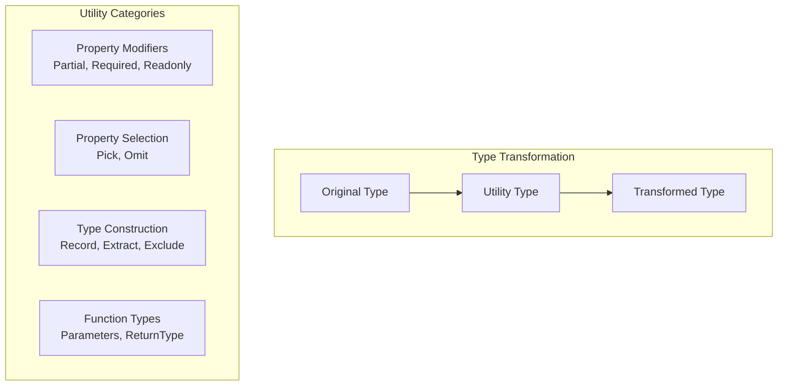
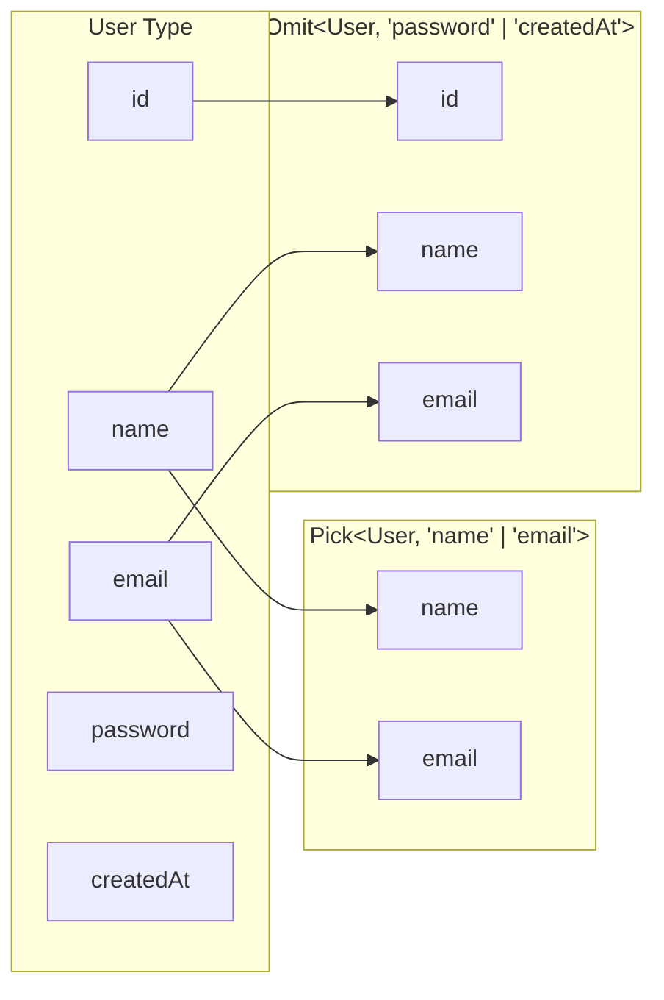
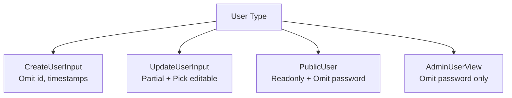

# How to Handle Utility Types in TypeScript

Author: [nawazdhandala](https://www.github.com/nawazdhandala)

Tags: TypeScript, Utility Types, Generics, Partial, Pick, Omit, Record, Type Manipulation

Description: Learn how to use TypeScript utility types to transform and manipulate types for cleaner, more reusable code.

---

TypeScript provides a collection of built-in utility types that help you transform existing types into new ones. Instead of writing the same type variations repeatedly, you can use these utilities to derive new types from existing ones. This guide covers the most useful utility types and shows you how to apply them in real-world scenarios.

## Overview of Utility Types



## Partial<T> - Make All Properties Optional

`Partial` makes every property in a type optional. Perfect for update operations where you only want to change some fields:

```typescript
interface User {
    id: string;
    name: string;
    email: string;
    age: number;
}

// All properties become optional
type PartialUser = Partial<User>;
// Equivalent to:
// {
//     id?: string;
//     name?: string;
//     email?: string;
//     age?: number;
// }

// Use case: Update function that accepts partial data
function updateUser(id: string, updates: Partial<User>): User {
    const existingUser = getUserById(id);
    return { ...existingUser, ...updates };
}

// Can update any subset of properties
updateUser('123', { name: 'New Name' });
updateUser('123', { email: 'new@example.com', age: 30 });
```

## Required<T> - Make All Properties Required

The opposite of `Partial`. Converts optional properties to required ones:

```typescript
interface Config {
    host?: string;
    port?: number;
    timeout?: number;
}

// All properties become required
type RequiredConfig = Required<Config>;
// Equivalent to:
// {
//     host: string;
//     port: number;
//     timeout: number;
// }

// Use case: Ensure all config values are set after merging with defaults
function createClient(userConfig: Config): void {
    const fullConfig: RequiredConfig = {
        host: userConfig.host ?? 'localhost',
        port: userConfig.port ?? 3000,
        timeout: userConfig.timeout ?? 5000
    };
    // Now we know all properties exist
    connect(fullConfig.host, fullConfig.port, fullConfig.timeout);
}
```

## Readonly<T> - Make All Properties Immutable

Prevents modification of properties after creation:

```typescript
interface Point {
    x: number;
    y: number;
}

const origin: Readonly<Point> = { x: 0, y: 0 };
// origin.x = 10;  // Error: Cannot assign to 'x' because it is a read-only property

// Use case: Immutable state
interface AppState {
    user: User | null;
    settings: Settings;
    notifications: Notification[];
}

function reducer(state: Readonly<AppState>, action: Action): AppState {
    switch (action.type) {
        case 'SET_USER':
            // Must return new object, cannot mutate state
            return { ...state, user: action.payload };
        default:
            return state;
    }
}
```

## Pick<T, K> - Select Specific Properties

Creates a type with only the specified properties:

```typescript
interface User {
    id: string;
    name: string;
    email: string;
    password: string;
    createdAt: Date;
    updatedAt: Date;
}

// Only include public-safe properties
type PublicUser = Pick<User, 'id' | 'name' | 'email'>;
// Equivalent to:
// {
//     id: string;
//     name: string;
//     email: string;
// }

// Use case: API response that excludes sensitive data
function getPublicProfile(user: User): PublicUser {
    return {
        id: user.id,
        name: user.name,
        email: user.email
    };
}

// Use case: Form that only edits certain fields
type UserEditForm = Pick<User, 'name' | 'email'>;
```

## Omit<T, K> - Exclude Specific Properties

The opposite of `Pick`. Creates a type without the specified properties:

```typescript
interface User {
    id: string;
    name: string;
    email: string;
    password: string;
    createdAt: Date;
}

// Exclude sensitive and auto-generated fields
type CreateUserInput = Omit<User, 'id' | 'createdAt'>;
// Equivalent to:
// {
//     name: string;
//     email: string;
//     password: string;
// }

// Use case: Input type for creating new records
function createUser(input: CreateUserInput): User {
    return {
        id: generateId(),
        createdAt: new Date(),
        ...input
    };
}
```



## Record<K, T> - Create Object Type with Keys

Creates an object type with specified keys and value type:

```typescript
// Simple key-value mapping
type StringMap = Record<string, string>;
const headers: StringMap = {
    'Content-Type': 'application/json',
    'Authorization': 'Bearer token'
};

// Typed keys with union
type Status = 'pending' | 'active' | 'completed';
type StatusColors = Record<Status, string>;

const colors: StatusColors = {
    pending: '#ffc107',
    active: '#28a745',
    completed: '#6c757d'
};

// Use case: Configuration by environment
type Environment = 'development' | 'staging' | 'production';

interface EnvConfig {
    apiUrl: string;
    debug: boolean;
}

const configs: Record<Environment, EnvConfig> = {
    development: { apiUrl: 'http://localhost:3000', debug: true },
    staging: { apiUrl: 'https://staging.api.com', debug: true },
    production: { apiUrl: 'https://api.com', debug: false }
};
```

## Extract<T, U> - Extract Matching Types

Extracts types from a union that are assignable to another type:

```typescript
type AllTypes = string | number | boolean | null | undefined;

// Extract only the primitive types that can be used as object keys
type KeyTypes = Extract<AllTypes, string | number>;
// Result: string | number

// Use case: Filter event types
type AppEvent =
    | { type: 'click'; x: number; y: number }
    | { type: 'keypress'; key: string }
    | { type: 'scroll'; delta: number }
    | { type: 'resize'; width: number; height: number };

// Extract only mouse-related events
type MouseEvent = Extract<AppEvent, { type: 'click' } | { type: 'scroll' }>;
// Result: { type: 'click'; x: number; y: number } | { type: 'scroll'; delta: number }
```

## Exclude<T, U> - Remove Matching Types

The opposite of `Extract`. Removes types from a union:

```typescript
type AllTypes = string | number | boolean | null | undefined;

// Remove null and undefined
type NonNullableTypes = Exclude<AllTypes, null | undefined>;
// Result: string | number | boolean

// Use case: Remove specific variants
type AllPermissions = 'read' | 'write' | 'delete' | 'admin';
type UserPermissions = Exclude<AllPermissions, 'admin'>;
// Result: 'read' | 'write' | 'delete'
```

## NonNullable<T> - Remove Null and Undefined

Shorthand for excluding null and undefined:

```typescript
type MaybeString = string | null | undefined;
type DefiniteString = NonNullable<MaybeString>;
// Result: string

// Use case: After null check
function processValue(value: string | null): void {
    if (value !== null) {
        // TypeScript narrows to string
        const definite: NonNullable<typeof value> = value;
        console.log(definite.toUpperCase());
    }
}
```

## ReturnType<T> - Get Function Return Type

Extracts the return type of a function:

```typescript
function createUser(name: string, email: string) {
    return {
        id: generateId(),
        name,
        email,
        createdAt: new Date()
    };
}

// Extract the return type
type User = ReturnType<typeof createUser>;
// Equivalent to:
// {
//     id: string;
//     name: string;
//     email: string;
//     createdAt: Date;
// }

// Use case: Type a variable to match function output
const users: ReturnType<typeof createUser>[] = [];
users.push(createUser('Alice', 'alice@example.com'));
```

## Parameters<T> - Get Function Parameter Types

Extracts parameter types as a tuple:

```typescript
function updateUser(id: string, name: string, email: string): void {
    // ...
}

type UpdateParams = Parameters<typeof updateUser>;
// Result: [id: string, name: string, email: string]

// Use case: Create wrapper functions
function loggedUpdate(...args: Parameters<typeof updateUser>): void {
    console.log('Updating user:', args[0]);
    updateUser(...args);
}
```

## Awaited<T> - Unwrap Promise Types

Extracts the resolved type of a Promise:

```typescript
type PromiseString = Promise<string>;
type ResolvedString = Awaited<PromiseString>;
// Result: string

// Works with nested promises
type NestedPromise = Promise<Promise<number>>;
type ResolvedNumber = Awaited<NestedPromise>;
// Result: number

// Use case: Type async function results
async function fetchUser(id: string): Promise<User> {
    const response = await fetch(`/api/users/${id}`);
    return response.json();
}

type FetchedUser = Awaited<ReturnType<typeof fetchUser>>;
// Result: User
```

## Combining Utility Types

The real power comes from combining utilities:

```typescript
interface User {
    id: string;
    name: string;
    email: string;
    password: string;
    role: 'admin' | 'user';
    createdAt: Date;
    updatedAt: Date;
}

// Create input type: omit auto-generated, make some optional
type CreateUserInput = Omit<User, 'id' | 'createdAt' | 'updatedAt'>;

// Update input: pick editable fields, make all optional
type UpdateUserInput = Partial<Pick<User, 'name' | 'email' | 'password'>>;

// Public response: omit sensitive data, make readonly
type PublicUser = Readonly<Omit<User, 'password'>>;

// Admin can see everything except password
type AdminUserView = Omit<User, 'password'>;
```



## Creating Custom Utility Types

You can build your own utility types using mapped types:

```typescript
// Make specific properties optional
type PartialBy<T, K extends keyof T> = Omit<T, K> & Partial<Pick<T, K>>;

interface User {
    id: string;
    name: string;
    email: string;
}

type UserWithOptionalEmail = PartialBy<User, 'email'>;
// Result: { id: string; name: string; email?: string }

// Make specific properties required
type RequiredBy<T, K extends keyof T> = T & Required<Pick<T, K>>;

// Deep readonly
type DeepReadonly<T> = {
    readonly [P in keyof T]: T[P] extends object ? DeepReadonly<T[P]> : T[P];
};

// Nullable version of all properties
type Nullable<T> = { [P in keyof T]: T[P] | null };
```

## Conclusion

Utility types are one of TypeScript's most powerful features for creating flexible, reusable type definitions. Instead of duplicating type definitions with slight variations, use `Partial` for updates, `Pick` and `Omit` for selecting properties, `Record` for dictionaries, and `ReturnType` for extracting function output types. Combining these utilities lets you derive precisely the types you need while keeping your codebase DRY. Master these built-in utilities before creating custom ones, as they cover most common use cases.
