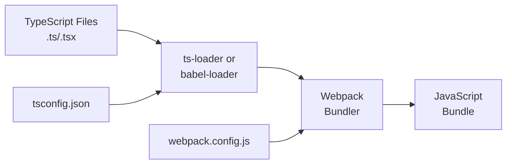
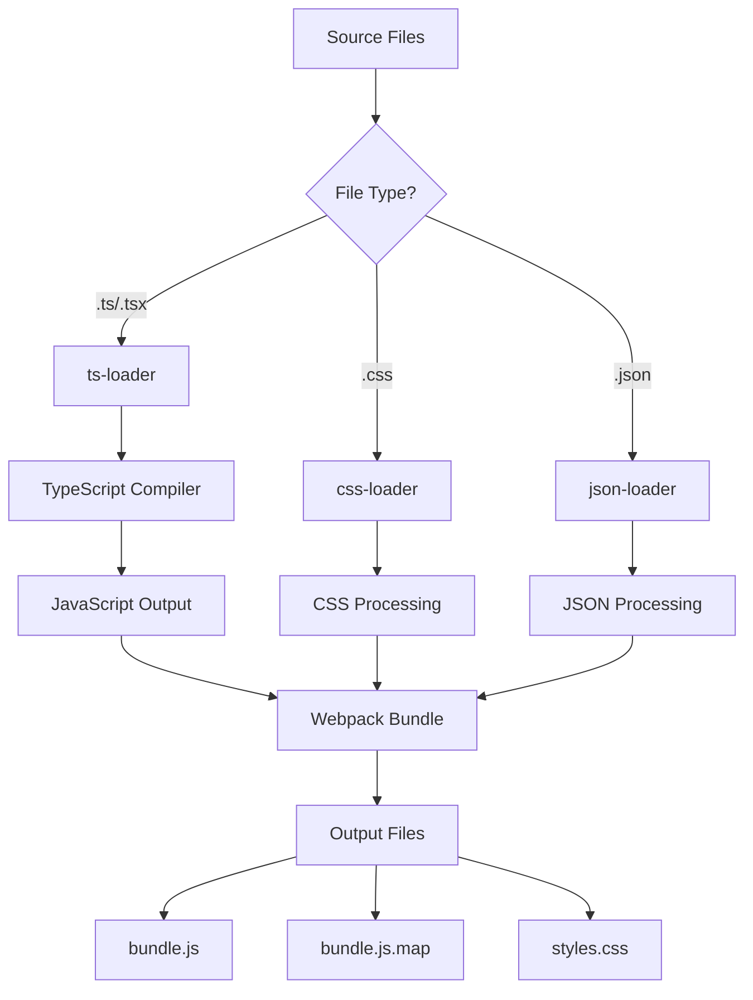
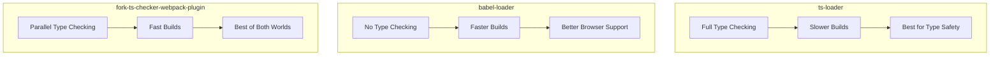
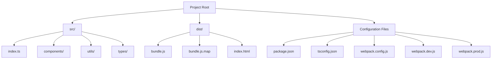

# How to Configure TypeScript with Webpack

Author: [nawazdhandala](https://www.github.com/nawazdhandala)

Tags: TypeScript, Webpack, Build Tools, Configuration, JavaScript, Bundling

Description: Learn how to set up and configure TypeScript with Webpack for efficient module bundling and type-safe builds.

---

Configuring TypeScript with Webpack enables you to combine the power of static typing with efficient module bundling. This guide covers everything from basic setup to advanced optimization strategies.

## Understanding the Build Pipeline

Before diving into configuration, let us understand how TypeScript and Webpack work together.



## Initial Project Setup

First, initialize your project and install the required dependencies.

```bash
# Initialize a new npm project
npm init -y

# Install TypeScript and Webpack
npm install --save-dev typescript webpack webpack-cli

# Install the TypeScript loader for Webpack
npm install --save-dev ts-loader

# Install webpack dev server for development
npm install --save-dev webpack-dev-server
```

## Basic TypeScript Configuration

Create a `tsconfig.json` file in your project root.

```json
{
  "compilerOptions": {
    // Target ECMAScript version for output
    "target": "ES2020",

    // Module system for the output
    "module": "ESNext",

    // Enable all strict type checking options
    "strict": true,

    // Allow importing JSON files as modules
    "resolveJsonModule": true,

    // Ensure consistent casing in file names
    "forceConsistentCasingInFileNames": true,

    // Skip type checking of declaration files
    "skipLibCheck": true,

    // Enable ES module interop for CommonJS modules
    "esModuleInterop": true,

    // Module resolution strategy
    "moduleResolution": "bundler",

    // Output directory for compiled files
    "outDir": "./dist",

    // Root directory of source files
    "rootDir": "./src",

    // Generate source maps for debugging
    "sourceMap": true,

    // Allow default imports from modules with no default export
    "allowSyntheticDefaultImports": true
  },
  "include": ["src/**/*"],
  "exclude": ["node_modules", "dist"]
}
```

## Basic Webpack Configuration

Create a `webpack.config.js` file in your project root.

```javascript
// webpack.config.js
const path = require('path');

module.exports = {
  // Entry point for the application
  entry: './src/index.ts',

  // Output configuration
  output: {
    // Output filename
    filename: 'bundle.js',
    // Output directory (absolute path)
    path: path.resolve(__dirname, 'dist'),
    // Clean the output directory before each build
    clean: true,
  },

  // Module resolution configuration
  resolve: {
    // File extensions to resolve automatically
    extensions: ['.ts', '.tsx', '.js', '.jsx'],
  },

  // Module rules for processing files
  module: {
    rules: [
      {
        // Match TypeScript files
        test: /\.tsx?$/,
        // Use ts-loader to process them
        use: 'ts-loader',
        // Exclude node_modules
        exclude: /node_modules/,
      },
    ],
  },

  // Development server configuration
  devServer: {
    // Serve content from the dist directory
    static: './dist',
    // Enable hot module replacement
    hot: true,
    // Port to run the dev server
    port: 3000,
  },

  // Generate source maps for debugging
  devtool: 'source-map',
};
```

## Build Process Flow

The following diagram illustrates the complete build process.



## Development and Production Configurations

For real-world projects, you need separate configurations for development and production.

```javascript
// webpack.common.js - Shared configuration
const path = require('path');

module.exports = {
  // Entry point
  entry: './src/index.ts',

  // Module resolution
  resolve: {
    extensions: ['.ts', '.tsx', '.js', '.jsx'],
    // Path aliases for cleaner imports
    alias: {
      '@components': path.resolve(__dirname, 'src/components'),
      '@utils': path.resolve(__dirname, 'src/utils'),
      '@types': path.resolve(__dirname, 'src/types'),
    },
  },

  // Module rules
  module: {
    rules: [
      {
        test: /\.tsx?$/,
        use: 'ts-loader',
        exclude: /node_modules/,
      },
    ],
  },
};
```

```javascript
// webpack.dev.js - Development configuration
const { merge } = require('webpack-merge');
const common = require('./webpack.common.js');

module.exports = merge(common, {
  // Development mode enables helpful error messages
  mode: 'development',

  // Inline source maps for faster rebuilds
  devtool: 'inline-source-map',

  // Output configuration
  output: {
    filename: '[name].js',
    path: path.resolve(__dirname, 'dist'),
  },

  // Development server settings
  devServer: {
    static: './dist',
    hot: true,
    port: 3000,
    // Open browser automatically
    open: true,
    // Enable history API fallback for SPA routing
    historyApiFallback: true,
  },
});
```

```javascript
// webpack.prod.js - Production configuration
const { merge } = require('webpack-merge');
const common = require('./webpack.common.js');
const TerserPlugin = require('terser-webpack-plugin');

module.exports = merge(common, {
  // Production mode enables optimizations
  mode: 'production',

  // Source maps for production debugging
  devtool: 'source-map',

  // Output with content hash for cache busting
  output: {
    filename: '[name].[contenthash].js',
    path: path.resolve(__dirname, 'dist'),
    clean: true,
  },

  // Optimization settings
  optimization: {
    // Minimize the output
    minimize: true,
    // Use Terser for minification
    minimizer: [
      new TerserPlugin({
        terserOptions: {
          // Remove comments
          format: {
            comments: false,
          },
        },
        // Extract comments to separate file
        extractComments: false,
      }),
    ],
    // Split runtime code into separate chunk
    runtimeChunk: 'single',
    // Split vendor code for better caching
    splitChunks: {
      cacheGroups: {
        vendor: {
          test: /[\\/]node_modules[\\/]/,
          name: 'vendors',
          chunks: 'all',
        },
      },
    },
  },
});
```

## Using Babel with TypeScript

For better browser compatibility, you can use Babel instead of ts-loader.

```bash
# Install Babel and required presets
npm install --save-dev @babel/core @babel/preset-env @babel/preset-typescript babel-loader
```

```javascript
// babel.config.js
module.exports = {
  presets: [
    // Handle modern JavaScript features
    ['@babel/preset-env', {
      // Target specific browsers
      targets: {
        browsers: ['last 2 versions', 'not dead', '> 0.2%'],
      },
      // Use polyfills as needed
      useBuiltIns: 'usage',
      corejs: 3,
    }],
    // Handle TypeScript
    ['@babel/preset-typescript', {
      // Enable support for TypeScript-specific features
      allowDeclareFields: true,
    }],
  ],
};
```

```javascript
// webpack.config.js with Babel
module.exports = {
  // ... other config
  module: {
    rules: [
      {
        test: /\.tsx?$/,
        // Use babel-loader instead of ts-loader
        use: 'babel-loader',
        exclude: /node_modules/,
      },
    ],
  },
};
```

## Comparison of Loader Options



## Using fork-ts-checker-webpack-plugin

This plugin runs TypeScript type checking in a separate process for faster builds.

```bash
# Install the plugin
npm install --save-dev fork-ts-checker-webpack-plugin
```

```javascript
// webpack.config.js
const ForkTsCheckerWebpackPlugin = require('fork-ts-checker-webpack-plugin');

module.exports = {
  // ... other config

  module: {
    rules: [
      {
        test: /\.tsx?$/,
        use: [
          {
            loader: 'ts-loader',
            options: {
              // Disable type checking in ts-loader
              // The plugin will handle it
              transpileOnly: true,
            },
          },
        ],
        exclude: /node_modules/,
      },
    ],
  },

  plugins: [
    // Run type checking in separate process
    new ForkTsCheckerWebpackPlugin({
      // Use async mode for non-blocking builds
      async: true,
      // TypeScript configuration
      typescript: {
        // Path to tsconfig
        configFile: './tsconfig.json',
        // Report errors in overlay
        diagnosticOptions: {
          semantic: true,
          syntactic: true,
        },
      },
    }),
  ],
};
```

## Path Aliases Configuration

Configure path aliases for cleaner imports.

```json
{
  "compilerOptions": {
    "baseUrl": ".",
    "paths": {
      "@components/*": ["src/components/*"],
      "@utils/*": ["src/utils/*"],
      "@types/*": ["src/types/*"],
      "@services/*": ["src/services/*"]
    }
  }
}
```

```javascript
// webpack.config.js
const path = require('path');

module.exports = {
  // ... other config
  resolve: {
    extensions: ['.ts', '.tsx', '.js', '.jsx'],
    alias: {
      // Must match tsconfig.json paths
      '@components': path.resolve(__dirname, 'src/components'),
      '@utils': path.resolve(__dirname, 'src/utils'),
      '@types': path.resolve(__dirname, 'src/types'),
      '@services': path.resolve(__dirname, 'src/services'),
    },
  },
};
```

## Package.json Scripts

Add convenient scripts for building and development.

```json
{
  "scripts": {
    "start": "webpack serve --config webpack.dev.js",
    "build": "webpack --config webpack.prod.js",
    "build:dev": "webpack --config webpack.dev.js",
    "watch": "webpack --watch --config webpack.dev.js",
    "type-check": "tsc --noEmit",
    "type-check:watch": "tsc --noEmit --watch"
  }
}
```

## Complete Project Structure



## Troubleshooting Common Issues

### Module Resolution Errors

If TypeScript cannot find modules, ensure your paths are configured correctly.

```javascript
// webpack.config.js
module.exports = {
  resolve: {
    // Add all necessary extensions
    extensions: ['.ts', '.tsx', '.js', '.jsx', '.json'],
    // Ensure modules are resolved from node_modules
    modules: ['node_modules', path.resolve(__dirname, 'src')],
  },
};
```

### Source Map Issues

If source maps are not working correctly in development.

```javascript
// webpack.dev.js
module.exports = {
  // Use eval-source-map for faster rebuilds
  // with quality source maps
  devtool: 'eval-source-map',
};
```

```json
{
  "compilerOptions": {
    "sourceMap": true,
    "inlineSources": true
  }
}
```

### Build Performance Optimization

For large projects, optimize build performance.

```javascript
// webpack.config.js
module.exports = {
  module: {
    rules: [
      {
        test: /\.tsx?$/,
        use: [
          {
            loader: 'ts-loader',
            options: {
              // Only transpile, skip type checking
              transpileOnly: true,
              // Enable experimental watch API
              experimentalWatchApi: true,
            },
          },
        ],
        // Include only necessary directories
        include: path.resolve(__dirname, 'src'),
        exclude: /node_modules/,
      },
    ],
  },

  // Cache builds for faster subsequent builds
  cache: {
    type: 'filesystem',
    buildDependencies: {
      config: [__filename],
    },
  },
};
```

## Summary

Configuring TypeScript with Webpack requires understanding both tools and how they interact. Key points to remember include using the appropriate loader (ts-loader for simplicity or babel-loader for browser compatibility), configuring path aliases in both tsconfig.json and webpack.config.js, using fork-ts-checker-webpack-plugin for faster builds with type checking, and maintaining separate configurations for development and production environments.
