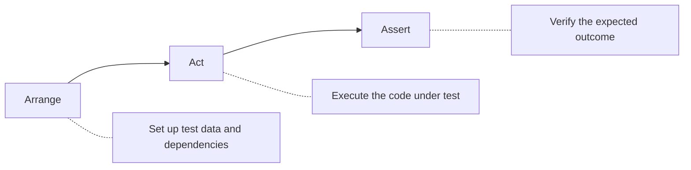

# How to Handle Unit Testing Best Practices

Author: [nawazdhandala](https://github.com/nawazdhandala)

Tags: Testing, Unit Tests, Best Practices, TDD, Software Quality

Description: Learn essential unit testing best practices including test structure, naming conventions, assertion patterns, and maintainability strategies.

---

Unit tests are the foundation of a reliable software system. When done right, they catch bugs early, document your code's behavior, and give you confidence to refactor. When done poorly, they become a maintenance burden that slows down development. This guide covers battle-tested practices for writing unit tests that provide value without becoming a liability.

## The Anatomy of a Good Unit Test

Every well-structured unit test follows the Arrange-Act-Assert (AAA) pattern:



Here is a practical example showing the AAA pattern:

```javascript
describe('ShoppingCart', () => {
  it('should calculate total with discount', () => {
    // ARRANGE: Set up the test scenario
    const cart = new ShoppingCart();
    cart.addItem({ name: 'Laptop', price: 1000 });
    cart.addItem({ name: 'Mouse', price: 50 });
    const discount = new PercentageDiscount(10);  // 10% off

    // ACT: Execute the behavior being tested
    const total = cart.calculateTotal(discount);

    // ASSERT: Verify the expected outcome
    expect(total).toBe(945);  // 1050 - 10% = 945
  });
});
```

## Naming Conventions That Document Behavior

Test names should describe what is being tested, the scenario, and the expected outcome. Good names make test failures self-explanatory.

**Pattern: should_[expectedBehavior]_when_[scenario]**

```javascript
describe('UserService', () => {
  // Clear names describe the complete scenario
  it('should_returnNull_when_userNotFound', async () => {
    const user = await userService.findById('nonexistent-id');
    expect(user).toBeNull();
  });

  it('should_throwValidationError_when_emailIsInvalid', async () => {
    const invalidUser = { email: 'not-an-email', name: 'Test' };
    await expect(userService.create(invalidUser))
      .rejects.toThrow(ValidationError);
  });

  it('should_hashPassword_when_creatingNewUser', async () => {
    const user = await userService.create({
      email: 'test@example.com',
      password: 'plaintext123'
    });

    // Password should be hashed, not stored in plain text
    expect(user.password).not.toBe('plaintext123');
    expect(user.password).toMatch(/^\$2[aby]\$/);  // bcrypt hash pattern
  });
});
```

## One Assertion Per Concept

Each test should verify one logical concept. Multiple assertions are fine if they all verify different aspects of the same behavior.

```javascript
// GOOD: Multiple assertions verifying one concept (user creation)
it('should create user with all required fields', async () => {
  const userData = { email: 'test@example.com', name: 'Test User' };
  const user = await userService.create(userData);

  // All assertions verify the same concept: correct user creation
  expect(user.id).toBeDefined();
  expect(user.email).toBe('test@example.com');
  expect(user.name).toBe('Test User');
  expect(user.createdAt).toBeInstanceOf(Date);
});

// BAD: Testing multiple unrelated concepts
it('should create user and send email and update stats', async () => {
  // This test is doing too much - split it up
  const user = await userService.create(userData);
  expect(user.id).toBeDefined();
  expect(emailService.send).toHaveBeenCalled();  // Different concept
  expect(statsService.increment).toHaveBeenCalled();  // Different concept
});
```

## Test Data Management

Use factory functions and builders to create test data. This keeps tests readable and makes it easy to set up complex scenarios.

```javascript
// test/factories/user.factory.js
const { faker } = require('@faker-js/faker');

// Factory function with sensible defaults
function createUser(overrides = {}) {
  return {
    id: faker.string.uuid(),
    email: faker.internet.email(),
    name: faker.person.fullName(),
    role: 'user',
    createdAt: new Date(),
    ...overrides  // Allow tests to override specific fields
  };
}

// Builder pattern for complex objects
class OrderBuilder {
  constructor() {
    this.order = {
      id: faker.string.uuid(),
      items: [],
      status: 'pending',
      customerId: faker.string.uuid()
    };
  }

  withItem(item) {
    this.order.items.push({
      productId: faker.string.uuid(),
      quantity: 1,
      price: faker.number.int({ min: 10, max: 1000 }),
      ...item
    });
    return this;  // Enable chaining
  }

  withStatus(status) {
    this.order.status = status;
    return this;
  }

  build() {
    return { ...this.order };
  }
}

// Usage in tests
describe('OrderService', () => {
  it('should calculate order total', () => {
    // Builder makes complex setup readable
    const order = new OrderBuilder()
      .withItem({ price: 100, quantity: 2 })
      .withItem({ price: 50, quantity: 1 })
      .build();

    const total = orderService.calculateTotal(order);
    expect(total).toBe(250);  // (100 * 2) + (50 * 1)
  });
});
```

## Isolation and Independence

Tests must be independent and able to run in any order. Use proper setup and teardown to ensure isolation.

```javascript
describe('Database operations', () => {
  let connection;
  let testUser;

  // Setup runs before each test
  beforeEach(async () => {
    // Start a transaction for test isolation
    connection = await db.getConnection();
    await connection.beginTransaction();

    // Create fresh test data
    testUser = await createTestUser(connection);
  });

  // Teardown runs after each test
  afterEach(async () => {
    // Rollback undoes all changes made during the test
    await connection.rollback();
    await connection.release();
  });

  it('should update user email', async () => {
    await userRepository.updateEmail(testUser.id, 'new@example.com');

    const updated = await userRepository.findById(testUser.id);
    expect(updated.email).toBe('new@example.com');
  });

  it('should delete user', async () => {
    await userRepository.delete(testUser.id);

    const deleted = await userRepository.findById(testUser.id);
    expect(deleted).toBeNull();
  });
});
```

## Testing Edge Cases

Good unit tests cover edge cases, not just the happy path. Consider boundary conditions, error states, and unusual inputs.

```javascript
describe('calculateAge', () => {
  // Happy path
  it('should calculate age correctly', () => {
    jest.setSystemTime(new Date('2026-01-24'));
    expect(calculateAge(new Date('1990-01-24'))).toBe(36);
  });

  // Edge case: birthday is today
  it('should include today if birthday is today', () => {
    jest.setSystemTime(new Date('2026-01-24'));
    expect(calculateAge(new Date('2000-01-24'))).toBe(26);
  });

  // Edge case: birthday is tomorrow
  it('should not count year if birthday is tomorrow', () => {
    jest.setSystemTime(new Date('2026-01-24'));
    expect(calculateAge(new Date('2000-01-25'))).toBe(25);
  });

  // Edge case: leap year
  it('should handle leap year birthdays', () => {
    jest.setSystemTime(new Date('2026-02-28'));
    // Born on Feb 29, 2000 (leap year)
    expect(calculateAge(new Date('2000-02-29'))).toBe(25);
  });

  // Error case: future date
  it('should throw for future birth dates', () => {
    jest.setSystemTime(new Date('2026-01-24'));
    expect(() => calculateAge(new Date('2030-01-01')))
      .toThrow('Birth date cannot be in the future');
  });

  // Error case: invalid input
  it('should throw for invalid date', () => {
    expect(() => calculateAge('not a date'))
      .toThrow('Invalid date');
  });
});
```

## Test Organization and Structure

Organize tests to mirror your source code structure and group related tests logically:

```
src/
  services/
    user.service.js
    order.service.js
  utils/
    validation.js
tests/
  services/
    user.service.test.js
    order.service.test.js
  utils/
    validation.test.js
  factories/
    user.factory.js
    order.factory.js
  fixtures/
    sample-data.json
```

Use nested describe blocks to organize tests by feature or method:

```javascript
describe('UserService', () => {
  describe('create', () => {
    it('should create user with valid data', async () => { /* ... */ });
    it('should throw on duplicate email', async () => { /* ... */ });
    it('should hash password before storing', async () => { /* ... */ });
  });

  describe('findById', () => {
    it('should return user when found', async () => { /* ... */ });
    it('should return null when not found', async () => { /* ... */ });
  });

  describe('update', () => {
    it('should update allowed fields', async () => { /* ... */ });
    it('should ignore protected fields', async () => { /* ... */ });
    it('should throw when user not found', async () => { /* ... */ });
  });
});
```

## Avoiding Common Pitfalls

### Do Not Test Implementation Details

Test behavior, not how it is implemented. This makes tests resilient to refactoring.

```javascript
// BAD: Testing implementation details
it('should call database.query with correct SQL', async () => {
  await userService.findById('123');
  expect(database.query).toHaveBeenCalledWith(
    'SELECT * FROM users WHERE id = ?',
    ['123']
  );
});

// GOOD: Testing behavior
it('should return user by ID', async () => {
  // Setup: Insert test user
  const testUser = await insertTestUser({ id: '123', name: 'Test' });

  // Act
  const user = await userService.findById('123');

  // Assert behavior, not implementation
  expect(user.id).toBe('123');
  expect(user.name).toBe('Test');
});
```

### Do Not Over-Mock

Too much mocking makes tests brittle and less valuable. Mock external dependencies, not internal implementation.

```javascript
// BAD: Mocking everything
it('should process payment', async () => {
  const mockValidator = { validate: jest.fn().mockReturnValue(true) };
  const mockCalculator = { calculate: jest.fn().mockReturnValue(100) };
  const mockFormatter = { format: jest.fn().mockReturnValue('$100.00') };

  // Test becomes meaningless - just testing mock wiring
});

// GOOD: Only mock external boundaries
it('should process payment', async () => {
  // Only mock the external payment gateway
  const mockGateway = {
    charge: jest.fn().mockResolvedValue({ id: 'ch_123', status: 'succeeded' })
  };

  const service = new PaymentService(mockGateway);
  const result = await service.processPayment(order);

  // Test real business logic, only mock external calls
  expect(result.chargeId).toBe('ch_123');
  expect(mockGateway.charge).toHaveBeenCalledWith({
    amount: order.total,
    currency: 'usd'
  });
});
```

## Code Coverage Guidelines

Use coverage as a guide, not a goal. High coverage does not guarantee good tests.

```javascript
// jest.config.js
module.exports = {
  collectCoverage: true,
  coverageThreshold: {
    global: {
      branches: 80,     // Decision points covered
      functions: 80,    // Functions called
      lines: 80,        // Lines executed
      statements: 80    // Statements executed
    }
  },
  // Focus coverage on business logic
  collectCoverageFrom: [
    'src/**/*.js',
    '!src/**/*.test.js',
    '!src/index.js',         // Entry points
    '!src/config/**',        // Configuration
    '!src/**/*.d.ts'         // Type definitions
  ]
};
```

## Summary

| Practice | Why It Matters |
|----------|----------------|
| AAA pattern | Clear test structure |
| Descriptive names | Self-documenting tests |
| One concept per test | Easy to understand failures |
| Factory functions | Maintainable test data |
| Test isolation | Reliable, independent tests |
| Edge case coverage | Catch real-world bugs |
| Behavior over implementation | Tests survive refactoring |
| Minimal mocking | Meaningful test results |

Good unit tests are an investment that pays dividends throughout your project's lifetime. They catch bugs before they reach production, serve as living documentation, and give you the confidence to improve your code without fear of breaking things.
