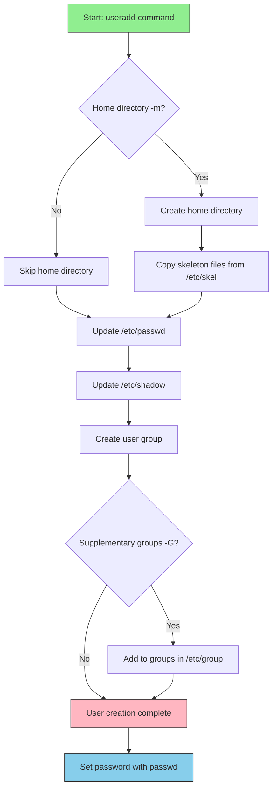
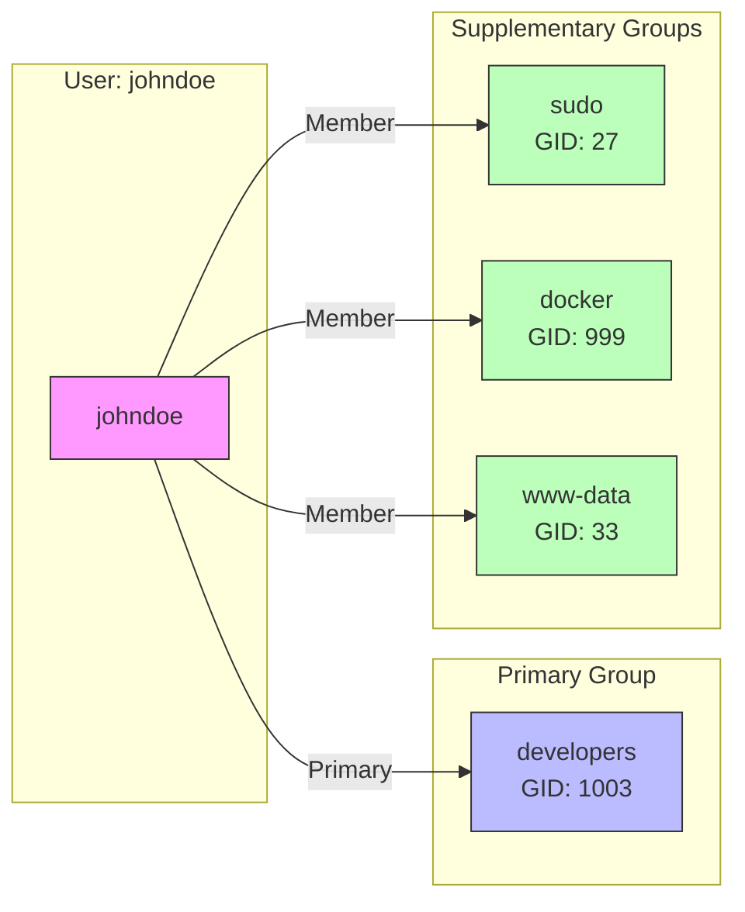
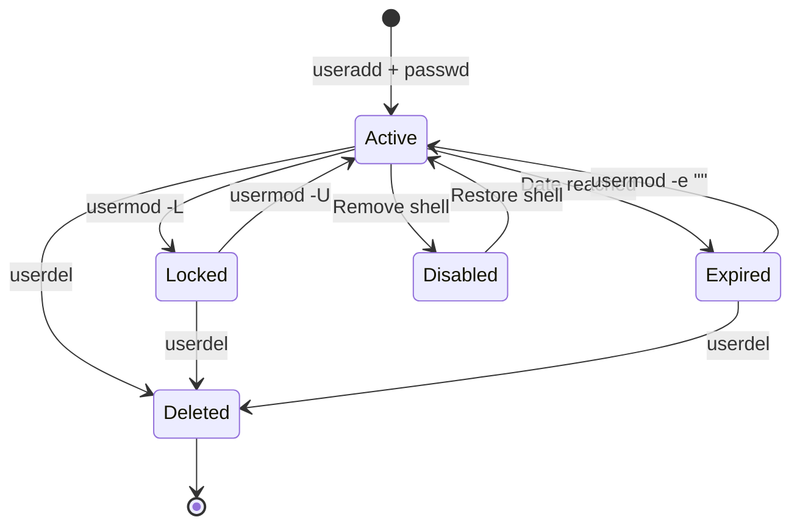

# How to Handle User Management with useradd and usermod

Author: [nawazdhandala](https://www.github.com/nawazdhandala)

Tags: Linux, System Administration, User Management, Security, useradd, usermod

Description: A comprehensive guide to managing Linux users with useradd and usermod commands, covering user creation, modification, group management, and security best practices.

---

User management is a fundamental skill for any Linux system administrator. Whether you are setting up new employee accounts, managing service users, or configuring access permissions, understanding `useradd` and `usermod` is essential. This guide covers everything you need to know about creating, modifying, and managing user accounts in Linux.

## Understanding Linux User Management

Before diving into commands, let's understand how Linux manages users:

```mermaid
graph TD
    A[User Management] --> B[User Accounts]
    A --> C[Groups]
    A --> D[Permissions]

    B --> E[/etc/passwd]
    B --> F[/etc/shadow]
    C --> G[/etc/group]
    C --> H[/etc/gshadow]

    E --> I[Username, UID, GID, Home, Shell]
    F --> J[Encrypted Passwords]
    G --> K[Group Names and Members]

    style A fill:#f9f,stroke:#333
    style B fill:#bbf,stroke:#333
    style C fill:#bbf,stroke:#333
    style D fill:#bbf,stroke:#333
```

## Key User Management Files

Linux stores user information in several critical files:

```bash
# View the passwd file structure
# Format: username:x:UID:GID:comment:home:shell
cat /etc/passwd | head -5

# Example output:
# root:x:0:0:root:/root:/bin/bash
# daemon:x:1:1:daemon:/usr/sbin:/usr/sbin/nologin
# bin:x:2:2:bin:/bin:/usr/sbin/nologin
```

```bash
# View the shadow file (requires root)
# Contains encrypted passwords and aging information
sudo cat /etc/shadow | head -3

# Format: username:password:lastchange:min:max:warn:inactive:expire:reserved
```

```bash
# View the group file
# Format: groupname:x:GID:members
cat /etc/group | head -5
```

## Creating Users with useradd

### Basic User Creation

The `useradd` command creates new user accounts:

```bash
# Create a basic user
# This creates the user but does NOT create a password
sudo useradd john

# Verify the user was created
grep john /etc/passwd
# Output: john:x:1001:1001::/home/john:/bin/sh
```

### Setting a Password

After creating a user, set their password:

```bash
# Set password interactively
sudo passwd john
# Enter new password when prompted

# Or set password non-interactively (useful for scripts)
# Note: This method is less secure as password appears in process list
echo "john:secretpassword" | sudo chpasswd
```

### Creating Users with Options

The `useradd` command supports many useful options:

```bash
# Create user with specific options
sudo useradd \
    -m \                    # Create home directory
    -d /home/johndoe \      # Specify home directory path
    -s /bin/bash \          # Set login shell
    -c "John Doe" \         # Add comment/full name
    -G sudo,developers \    # Add to supplementary groups
    -e 2026-12-31 \         # Set account expiration date
    johndoe

# Verify the user settings
id johndoe
# Output: uid=1002(johndoe) gid=1002(johndoe) groups=1002(johndoe),27(sudo),1003(developers)
```

### User Creation Workflow



### Creating System Users

System users are for services and applications, not real people:

```bash
# Create a system user for a service
# -r creates a system user (UID below 1000)
# -s /usr/sbin/nologin prevents interactive login
sudo useradd \
    -r \
    -s /usr/sbin/nologin \
    -d /var/lib/myapp \
    -c "MyApp Service Account" \
    myapp

# Verify system user
grep myapp /etc/passwd
# Output: myapp:x:998:998:MyApp Service Account:/var/lib/myapp:/usr/sbin/nologin
```

### Customizing Default Settings

View and modify default settings for new users:

```bash
# View current defaults
useradd -D

# Output example:
# GROUP=100
# HOME=/home
# INACTIVE=-1
# EXPIRE=
# SHELL=/bin/sh
# SKEL=/etc/skel
# CREATE_MAIL_SPOOL=yes

# Change default shell for new users
sudo useradd -D -s /bin/bash

# Change default home directory base
sudo useradd -D -b /home/users
```

### Skeleton Directory

The `/etc/skel` directory contains files copied to new home directories:

```bash
# View skeleton directory contents
ls -la /etc/skel

# Add custom files to skeleton
# These will be copied to all new user home directories
sudo cp /path/to/company-bashrc /etc/skel/.bashrc
sudo cp /path/to/welcome.txt /etc/skel/

# Create with custom skeleton directory
sudo useradd -m -k /custom/skel johndoe
```

## Modifying Users with usermod

### Changing User Properties

The `usermod` command modifies existing user accounts:

```bash
# Change user's login name
sudo usermod -l newjohn john
# Note: This only changes the username, not home directory

# Change user's home directory
sudo usermod -d /home/newjohn -m newjohn
# -m moves contents from old home to new location

# Change user's shell
sudo usermod -s /bin/zsh johndoe

# Update user's comment/full name
sudo usermod -c "John A. Doe" johndoe
```

### Managing Group Membership

Groups control access to files and resources:

```bash
# Add user to a supplementary group
# -a appends to existing groups (IMPORTANT: without -a, user is removed from other groups!)
sudo usermod -aG docker johndoe

# Add user to multiple groups
sudo usermod -aG docker,developers,sudo johndoe

# Change user's primary group
sudo usermod -g developers johndoe

# View user's groups
groups johndoe
# Output: johndoe : johndoe developers docker sudo

# Remove user from a group (use gpasswd)
sudo gpasswd -d johndoe docker
```

### Group Management Visualization



### Locking and Unlocking Accounts

Control user access without deleting accounts:

```bash
# Lock a user account (prevents login)
sudo usermod -L johndoe

# Check if account is locked (look for ! before password hash)
sudo grep johndoe /etc/shadow
# Output: johndoe:!$6$...:... (! indicates locked)

# Unlock a user account
sudo usermod -U johndoe

# Alternative: Use passwd to lock/unlock
sudo passwd -l johndoe  # Lock
sudo passwd -u johndoe  # Unlock
```

### Setting Account Expiration

Manage temporary accounts with expiration dates:

```bash
# Set account expiration date
sudo usermod -e 2026-06-30 contractor

# Check expiration settings
sudo chage -l contractor
# Output shows:
# Account expires: Jun 30, 2026

# Remove expiration (set to never expire)
sudo usermod -e "" contractor

# Set password expiration (different from account expiration)
sudo chage -M 90 johndoe  # Password expires in 90 days
sudo chage -W 14 johndoe  # Warn 14 days before expiration
```

### User Account States



## Practical Examples

### Example 1: Create a Developer Account

```bash
#!/bin/bash
# Script to create a standard developer account

USERNAME=$1
FULLNAME=$2

if [ -z "$USERNAME" ] || [ -z "$FULLNAME" ]; then
    echo "Usage: $0 <username> <fullname>"
    exit 1
fi

# Create user with developer settings
sudo useradd \
    -m \
    -s /bin/bash \
    -c "$FULLNAME" \
    -G developers,docker,sudo \
    "$USERNAME"

# Set password expiration to 90 days
sudo chage -M 90 "$USERNAME"

# Force password change on first login
sudo chage -d 0 "$USERNAME"

# Set a temporary password
echo "$USERNAME:TempPass123!" | sudo chpasswd

echo "User $USERNAME created successfully"
echo "Temporary password: TempPass123!"
echo "User must change password on first login"
```

### Example 2: Bulk User Creation

```bash
#!/bin/bash
# Create users from a CSV file
# Format: username,fullname,groups,shell

CSV_FILE="/path/to/users.csv"

while IFS=',' read -r username fullname groups shell; do
    # Skip header line
    [ "$username" = "username" ] && continue

    # Create user
    sudo useradd \
        -m \
        -c "$fullname" \
        -G "$groups" \
        -s "$shell" \
        "$username"

    # Generate random password
    PASSWORD=$(openssl rand -base64 12)
    echo "$username:$PASSWORD" | sudo chpasswd

    # Force password change
    sudo chage -d 0 "$username"

    echo "Created: $username - Temp password: $PASSWORD"
done < "$CSV_FILE"
```

### Example 3: Service Account Management

```bash
#!/bin/bash
# Create a secure service account for an application

SERVICE_NAME=$1
APP_DIR="/var/lib/$SERVICE_NAME"

if [ -z "$SERVICE_NAME" ]; then
    echo "Usage: $0 <service-name>"
    exit 1
fi

# Create system user
sudo useradd \
    -r \
    -s /usr/sbin/nologin \
    -d "$APP_DIR" \
    -c "$SERVICE_NAME service account" \
    "$SERVICE_NAME"

# Create application directory
sudo mkdir -p "$APP_DIR"
sudo chown "$SERVICE_NAME:$SERVICE_NAME" "$APP_DIR"
sudo chmod 750 "$APP_DIR"

echo "Service account '$SERVICE_NAME' created"
echo "Home directory: $APP_DIR"
```

### Example 4: Audit User Accounts

```bash
#!/bin/bash
# Audit user accounts and report issues

echo "=== User Account Audit Report ==="
echo "Generated: $(date)"
echo ""

# Users with UID 0 (root privileges)
echo "Users with UID 0 (should only be root):"
awk -F: '$3 == 0 {print "  - " $1}' /etc/passwd
echo ""

# Users with empty passwords
echo "Users with empty passwords:"
sudo awk -F: '$2 == "" {print "  - " $1}' /etc/shadow
echo ""

# Users with no password expiration
echo "Users with no password expiration (non-system):"
while IFS=: read -r username _ uid _; do
    if [ "$uid" -ge 1000 ]; then
        expire=$(sudo chage -l "$username" 2>/dev/null | grep "Password expires" | cut -d: -f2)
        if [ "$expire" = " never" ]; then
            echo "  - $username"
        fi
    fi
done < /etc/passwd
echo ""

# Locked accounts
echo "Locked accounts:"
sudo grep '!' /etc/shadow | cut -d: -f1 | while read user; do
    echo "  - $user"
done
```

## Security Best Practices

### Password Policies

```bash
# Configure password policies in /etc/login.defs
sudo vi /etc/login.defs

# Key settings:
# PASS_MAX_DAYS   90    # Maximum password age
# PASS_MIN_DAYS   1     # Minimum days between changes
# PASS_MIN_LEN    12    # Minimum password length
# PASS_WARN_AGE   14    # Days before expiry to warn

# Apply to existing user
sudo chage -M 90 -m 1 -W 14 username
```

### Restrict Shell Access

```bash
# For users who only need SFTP access
sudo usermod -s /usr/sbin/nologin sftpuser

# Or use a restricted shell
sudo usermod -s /bin/rbash restricteduser

# Create a jail environment for restricted users
# (requires additional setup with chroot)
```

### Monitor User Activity

```bash
# Check last login times
lastlog

# View currently logged in users
who
w

# Check login history
last username

# Check failed login attempts
sudo lastb
```

## Common Issues and Solutions

### Issue: User Cannot Login

```bash
# Check if account is locked
sudo passwd -S username
# Look for 'L' in status (locked)

# Check if account is expired
sudo chage -l username

# Check if shell is valid
grep username /etc/passwd
# Verify shell exists and is in /etc/shells
```

### Issue: User Not in Expected Groups

```bash
# Check current groups
id username

# Verify group exists
getent group groupname

# Re-add to groups (remember -a flag!)
sudo usermod -aG groupname username

# User must log out and back in for group changes to take effect
# Or use newgrp to activate group in current session
newgrp groupname
```

### Issue: Home Directory Problems

```bash
# Check if home directory exists
ls -la /home/username

# Fix ownership
sudo chown -R username:username /home/username

# Fix permissions
sudo chmod 750 /home/username

# Recreate home directory with skeleton files
sudo mkhomedir_helper username
```

## Quick Reference

| Command | Description |
|---------|-------------|
| `useradd username` | Create basic user |
| `useradd -m username` | Create user with home directory |
| `useradd -G group1,group2 username` | Create user with groups |
| `useradd -s /bin/bash username` | Create user with specific shell |
| `useradd -r username` | Create system user |
| `usermod -aG group username` | Add user to group |
| `usermod -L username` | Lock user account |
| `usermod -U username` | Unlock user account |
| `usermod -e 2026-12-31 username` | Set account expiration |
| `userdel username` | Delete user |
| `userdel -r username` | Delete user and home directory |

## Conclusion

Effective user management is critical for maintaining a secure and organized Linux system. The `useradd` and `usermod` commands provide powerful capabilities for creating and modifying user accounts. Remember to always use the `-a` flag with `usermod -G` to append groups, set appropriate password policies, and regularly audit user accounts for security compliance.

Key takeaways:
- Always create home directories with `-m` for regular users
- Use system users (`-r`) for services
- Remember `-a` when adding supplementary groups with `usermod`
- Set password expiration policies for security
- Regularly audit user accounts and access
