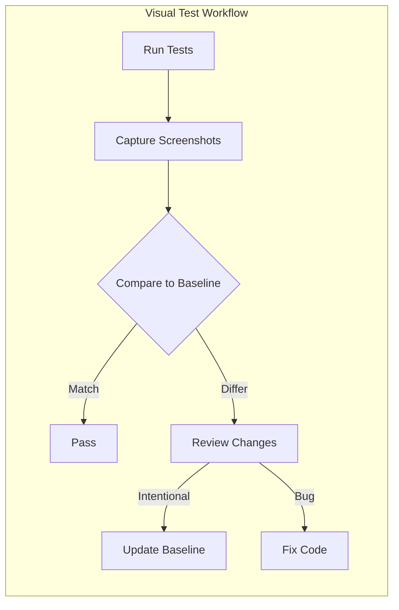
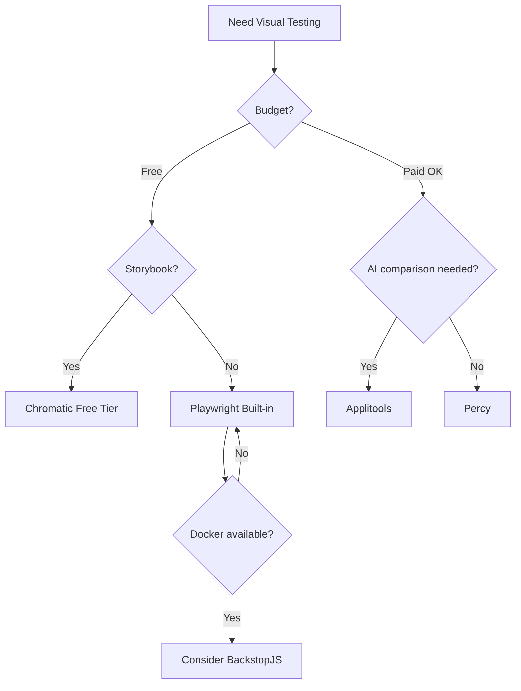
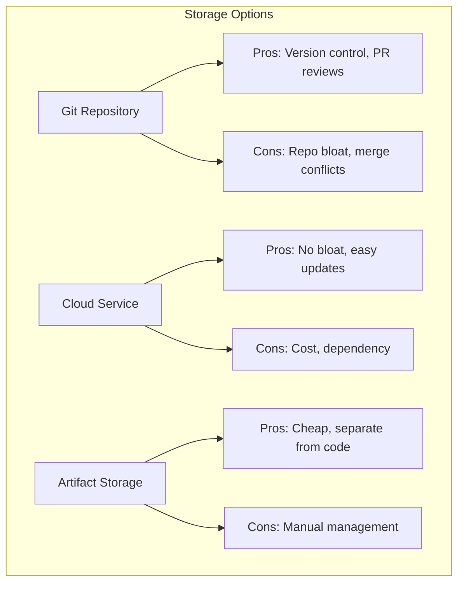

# How to Handle Visual Regression Testing

Author: [nawazdhandala](https://www.github.com/nawazdhandala)

Tags: Visual Testing, Regression Testing, Playwright, Cypress, Percy, UI Testing, Screenshot Testing, Automation

Description: A comprehensive guide to implementing visual regression testing for web applications, including tool selection, baseline management, and handling flaky tests.

---

Visual regression testing catches unintended UI changes by comparing screenshots of your application against approved baselines. When done right, it prevents CSS bugs, layout breaks, and design inconsistencies from reaching production. This guide covers how to set up visual regression testing effectively and handle the common challenges.

---

## Table of Contents

1. What is Visual Regression Testing?
2. Choosing the Right Tool
3. Setting Up Visual Tests
4. Managing Baselines
5. Handling Flaky Visual Tests
6. CI/CD Integration
7. Advanced Techniques
8. Best Practices

---

## 1. What is Visual Regression Testing?

Visual regression testing automatically detects unintended visual changes in your UI by comparing screenshots.



### Why Visual Testing Matters

| Scenario | Unit Tests | E2E Tests | Visual Tests |
|----------|------------|-----------|--------------|
| Button renders | Yes | Partial | **Yes** |
| Button is blue | No | No | **Yes** |
| Button is clickable | Partial | **Yes** | No |
| Button is in right position | No | No | **Yes** |
| CSS regression | No | No | **Yes** |

Traditional tests verify functionality but miss visual regressions. A button can work perfectly while being invisible or misaligned.

---

## 2. Choosing the Right Tool

### Tool Comparison

| Tool | Type | Pros | Cons |
|------|------|------|------|
| **Playwright** | Built-in | Fast, free, full control | Self-managed baselines |
| **Cypress + Percy** | Cloud service | Easy setup, cross-browser | Paid, external dependency |
| **BackstopJS** | Self-hosted | Docker support, free | Complex configuration |
| **Chromatic** | Cloud service | Storybook integration | Paid for teams |
| **Applitools** | AI-powered | Smart comparisons | Expensive |

### Decision Flowchart



---

## 3. Setting Up Visual Tests

### Playwright Visual Testing

Playwright has built-in screenshot comparison capabilities.

```javascript
// playwright.config.js
const { defineConfig } = require('@playwright/test');

module.exports = defineConfig({
  testDir: './tests/visual',

  // Snapshot configuration
  snapshotPathTemplate: '{testDir}/__snapshots__/{testFilePath}/{arg}{ext}',

  expect: {
    toHaveScreenshot: {
      // Allow small differences for anti-aliasing
      maxDiffPixels: 100,
      // Or use percentage threshold
      maxDiffPixelRatio: 0.01,
      // Animation timeout
      animations: 'disabled',
      // Consistent scaling
      scale: 'device'
    }
  },

  use: {
    // Consistent viewport
    viewport: { width: 1280, height: 720 },
    // Disable animations
    launchOptions: {
      args: ['--force-prefers-reduced-motion']
    }
  },

  // Run in single browser for consistency
  projects: [
    {
      name: 'chromium',
      use: { browserName: 'chromium' }
    }
  ]
});
```

```javascript
// tests/visual/homepage.spec.js
const { test, expect } = require('@playwright/test');

test.describe('Homepage Visual Tests', () => {
  test.beforeEach(async ({ page }) => {
    // Wait for fonts and images to load
    await page.goto('/', { waitUntil: 'networkidle' });

    // Wait for any animations to complete
    await page.waitForTimeout(500);
  });

  test('full page screenshot', async ({ page }) => {
    await expect(page).toHaveScreenshot('homepage-full.png', {
      fullPage: true
    });
  });

  test('hero section', async ({ page }) => {
    const hero = page.locator('[data-testid="hero-section"]');
    await expect(hero).toHaveScreenshot('hero-section.png');
  });

  test('navigation menu', async ({ page }) => {
    const nav = page.locator('nav');
    await expect(nav).toHaveScreenshot('navigation.png');
  });

  test('navigation menu - mobile', async ({ page }) => {
    // Test responsive design
    await page.setViewportSize({ width: 375, height: 667 });
    await page.reload({ waitUntil: 'networkidle' });

    const nav = page.locator('nav');
    await expect(nav).toHaveScreenshot('navigation-mobile.png');
  });
});
```

### Cypress with Percy

```javascript
// cypress/support/e2e.js
import '@percy/cypress';

// cypress/e2e/visual/homepage.cy.js
describe('Homepage Visual Tests', () => {
  beforeEach(() => {
    cy.visit('/');
    // Wait for page to be fully loaded
    cy.get('[data-testid="page-loaded"]').should('be.visible');
  });

  it('captures full page', () => {
    cy.percySnapshot('Homepage - Full Page', {
      widths: [375, 768, 1280],  // Test multiple breakpoints
      minHeight: 1024
    });
  });

  it('captures hero section', () => {
    cy.get('[data-testid="hero-section"]').scrollIntoView();
    cy.percySnapshot('Homepage - Hero Section', {
      scope: '[data-testid="hero-section"]'
    });
  });

  it('captures pricing table', () => {
    cy.get('[data-testid="pricing-section"]').scrollIntoView();
    // Wait for any price animations
    cy.wait(1000);
    cy.percySnapshot('Homepage - Pricing');
  });
});
```

### BackstopJS Configuration

```javascript
// backstop.config.js
module.exports = {
  id: 'my-app',
  viewports: [
    { label: 'phone', width: 375, height: 667 },
    { label: 'tablet', width: 768, height: 1024 },
    { label: 'desktop', width: 1280, height: 800 }
  ],

  scenarios: [
    {
      label: 'Homepage',
      url: 'http://localhost:3000',
      selectors: ['document'],
      delay: 500,  // Wait for animations
      misMatchThreshold: 0.1,
      requireSameDimensions: true
    },
    {
      label: 'Homepage - Hero',
      url: 'http://localhost:3000',
      selectors: ['[data-testid="hero-section"]'],
      delay: 500
    },
    {
      label: 'Dashboard - Logged In',
      url: 'http://localhost:3000/dashboard',
      cookiePath: 'backstop_data/cookies.json',  // Auth cookies
      selectors: ['document'],
      delay: 1000
    }
  ],

  paths: {
    bitmaps_reference: 'backstop_data/bitmaps_reference',
    bitmaps_test: 'backstop_data/bitmaps_test',
    html_report: 'backstop_data/html_report'
  },

  engine: 'playwright',
  engineOptions: {
    args: ['--no-sandbox']
  },

  report: ['browser', 'CI'],
  debug: false
};
```

---

## 4. Managing Baselines

Baselines are the "approved" screenshots that new captures are compared against.

### Baseline Storage Strategies



### Git-Based Baseline Management

```bash
# .gitattributes - Use Git LFS for screenshots
*.png filter=lfs diff=lfs merge=lfs -text
tests/**/__snapshots__/** filter=lfs diff=lfs merge=lfs -text
```

```javascript
// scripts/update-baselines.js
const { execSync } = require('child_process');
const readline = require('readline');

async function updateBaselines() {
  const rl = readline.createInterface({
    input: process.stdin,
    output: process.stdout
  });

  // Run tests to generate new screenshots
  console.log('Running visual tests...');
  try {
    execSync('npx playwright test --update-snapshots', { stdio: 'inherit' });
  } catch (error) {
    console.log('Some tests may have failed - this is expected when updating baselines');
  }

  // Show diff
  console.log('\nChanged baselines:');
  execSync('git diff --stat tests/**/__snapshots__', { stdio: 'inherit' });

  // Confirm update
  rl.question('\nCommit updated baselines? (y/n) ', (answer) => {
    if (answer.toLowerCase() === 'y') {
      execSync('git add tests/**/__snapshots__');
      execSync('git commit -m "chore: update visual baselines"');
      console.log('Baselines committed!');
    }
    rl.close();
  });
}

updateBaselines();
```

### Handling Baseline Updates in Pull Requests

```yaml
# .github/workflows/visual-tests.yml
name: Visual Regression Tests

on:
  pull_request:
    branches: [main]

jobs:
  visual-test:
    runs-on: ubuntu-latest
    steps:
      - uses: actions/checkout@v4
        with:
          fetch-depth: 0  # Full history for baseline comparison

      - name: Setup Node.js
        uses: actions/setup-node@v4
        with:
          node-version: '20'

      - name: Install dependencies
        run: npm ci

      - name: Install Playwright browsers
        run: npx playwright install --with-deps chromium

      - name: Run visual tests
        run: npx playwright test tests/visual/
        continue-on-error: true

      - name: Upload test results
        if: failure()
        uses: actions/upload-artifact@v4
        with:
          name: visual-test-results
          path: |
            test-results/
            playwright-report/

      - name: Comment on PR with diff
        if: failure()
        uses: actions/github-script@v7
        with:
          script: |
            const fs = require('fs');
            const report = fs.existsSync('playwright-report/index.html');

            github.rest.issues.createComment({
              issue_number: context.issue.number,
              owner: context.repo.owner,
              repo: context.repo.repo,
              body: `## Visual Regression Test Failed

              Visual differences were detected. Please review the changes:

              1. Download the [test artifacts](${context.serverUrl}/${context.repo.owner}/${context.repo.repo}/actions/runs/${context.runId})
              2. Review the differences in \`playwright-report/index.html\`
              3. If changes are intentional, update baselines with:
                 \`\`\`
                 npx playwright test --update-snapshots
                 git add tests/**/__snapshots__
                 git commit -m "chore: update visual baselines"
                 \`\`\`
              `
            });
```

---

## 5. Handling Flaky Visual Tests

Visual tests are prone to flakiness due to timing, fonts, and dynamic content.

### Common Causes and Fixes

| Cause | Symptom | Fix |
|-------|---------|-----|
| **Animations** | Random differences | Disable animations |
| **Fonts loading** | Text shifts | Wait for fonts |
| **Dynamic content** | Dates, avatars differ | Mock or hide |
| **Anti-aliasing** | Pixel-level differences | Use threshold |
| **Lazy loading** | Missing content | Wait for elements |

### Stabilizing Tests

```javascript
// tests/visual/helpers.js
async function preparePageForScreenshot(page) {
  // 1. Disable animations
  await page.addStyleTag({
    content: `
      *, *::before, *::after {
        animation-duration: 0s !important;
        animation-delay: 0s !important;
        transition-duration: 0s !important;
        transition-delay: 0s !important;
      }
    `
  });

  // 2. Wait for fonts to load
  await page.evaluate(() => document.fonts.ready);

  // 3. Wait for images to load
  await page.evaluate(() => {
    return Promise.all(
      Array.from(document.images)
        .filter(img => !img.complete)
        .map(img => new Promise(resolve => {
          img.onload = img.onerror = resolve;
        }))
    );
  });

  // 4. Scroll to trigger lazy loading
  await page.evaluate(() => {
    window.scrollTo(0, document.body.scrollHeight);
  });
  await page.waitForTimeout(500);
  await page.evaluate(() => {
    window.scrollTo(0, 0);
  });

  // 5. Hide dynamic content
  await page.evaluate(() => {
    // Hide timestamps
    document.querySelectorAll('[data-dynamic]').forEach(el => {
      el.style.visibility = 'hidden';
    });

    // Replace avatars with placeholder
    document.querySelectorAll('img[data-avatar]').forEach(img => {
      img.src = '/placeholder-avatar.png';
    });
  });

  // 6. Wait for network to be idle
  await page.waitForLoadState('networkidle');
}

module.exports = { preparePageForScreenshot };
```

```javascript
// tests/visual/dashboard.spec.js
const { test, expect } = require('@playwright/test');
const { preparePageForScreenshot } = require('./helpers');

test.describe('Dashboard Visual Tests', () => {
  test('dashboard overview', async ({ page }) => {
    await page.goto('/dashboard');
    await preparePageForScreenshot(page);

    // Mock dynamic data
    await page.evaluate(() => {
      document.querySelector('[data-testid="last-login"]').textContent = 'Jan 1, 2024';
      document.querySelector('[data-testid="user-count"]').textContent = '1,234';
    });

    await expect(page).toHaveScreenshot('dashboard-overview.png', {
      maxDiffPixels: 50  // Allow small anti-aliasing differences
    });
  });
});
```

### Handling Cross-Browser Differences

```javascript
// playwright.config.js
const { defineConfig } = require('@playwright/test');

module.exports = defineConfig({
  projects: [
    {
      name: 'chromium',
      use: {
        browserName: 'chromium',
        // Use consistent rendering
        deviceScaleFactor: 1,
        hasTouch: false
      },
      // Separate snapshots per browser
      snapshotPathTemplate: '{testDir}/__snapshots__/{projectName}/{testFilePath}/{arg}{ext}'
    },
    {
      name: 'firefox',
      use: {
        browserName: 'firefox',
        deviceScaleFactor: 1
      },
      snapshotPathTemplate: '{testDir}/__snapshots__/{projectName}/{testFilePath}/{arg}{ext}'
    }
  ]
});
```

---

## 6. CI/CD Integration

### Complete CI Pipeline

```yaml
# .github/workflows/visual-tests.yml
name: Visual Tests

on:
  push:
    branches: [main]
  pull_request:
    branches: [main]

jobs:
  visual-tests:
    runs-on: ubuntu-latest
    container:
      # Use consistent environment
      image: mcr.microsoft.com/playwright:v1.40.0-jammy

    steps:
      - uses: actions/checkout@v4
        with:
          lfs: true  # Fetch LFS files (baselines)

      - name: Setup Node.js
        uses: actions/setup-node@v4
        with:
          node-version: '20'
          cache: 'npm'

      - name: Install dependencies
        run: npm ci

      - name: Start app
        run: npm start &
        env:
          NODE_ENV: test

      - name: Wait for app
        run: npx wait-on http://localhost:3000

      - name: Run visual tests
        run: npx playwright test tests/visual/
        env:
          # Ensure consistent font rendering
          FONTCONFIG_PATH: /etc/fonts

      - name: Upload report on failure
        if: failure()
        uses: actions/upload-artifact@v4
        with:
          name: playwright-report
          path: playwright-report/
          retention-days: 7
```

### Automated Baseline Updates

```yaml
# .github/workflows/update-baselines.yml
name: Update Visual Baselines

on:
  workflow_dispatch:
    inputs:
      reason:
        description: 'Reason for updating baselines'
        required: true

jobs:
  update:
    runs-on: ubuntu-latest
    container:
      image: mcr.microsoft.com/playwright:v1.40.0-jammy

    steps:
      - uses: actions/checkout@v4
        with:
          lfs: true

      - name: Setup Node.js
        uses: actions/setup-node@v4
        with:
          node-version: '20'

      - name: Install dependencies
        run: npm ci

      - name: Start app
        run: npm start &
        env:
          NODE_ENV: test

      - name: Wait for app
        run: npx wait-on http://localhost:3000

      - name: Update baselines
        run: npx playwright test tests/visual/ --update-snapshots

      - name: Create Pull Request
        uses: peter-evans/create-pull-request@v5
        with:
          title: 'chore: update visual baselines'
          body: |
            This PR updates visual test baselines.

            **Reason:** ${{ github.event.inputs.reason }}

            Please review the baseline changes carefully before merging.
          branch: update-visual-baselines
          commit-message: 'chore: update visual baselines'
```

---

## 7. Advanced Techniques

### Component-Level Visual Testing with Storybook

```javascript
// .storybook/test-runner.js
const { getStoryContext } = require('@storybook/test-runner');
const { toMatchImageSnapshot } = require('jest-image-snapshot');

const customSnapshotsDir = `${process.cwd()}/__snapshots__`;

module.exports = {
  setup() {
    expect.extend({ toMatchImageSnapshot });
  },

  async postVisit(page, context) {
    // Wait for story to render
    await page.waitForTimeout(100);

    // Disable animations
    await page.addStyleTag({
      content: '* { animation: none !important; transition: none !important; }'
    });

    // Capture screenshot
    const image = await page.screenshot();

    expect(image).toMatchImageSnapshot({
      customSnapshotsDir,
      customSnapshotIdentifier: context.id,
      failureThreshold: 0.01,
      failureThresholdType: 'percent'
    });
  }
};
```

### Responsive Testing Matrix

```javascript
// tests/visual/responsive.spec.js
const { test, expect } = require('@playwright/test');

const viewports = [
  { name: 'mobile', width: 375, height: 667 },
  { name: 'tablet', width: 768, height: 1024 },
  { name: 'desktop', width: 1280, height: 800 },
  { name: 'wide', width: 1920, height: 1080 }
];

const pages = [
  { name: 'homepage', path: '/' },
  { name: 'pricing', path: '/pricing' },
  { name: 'contact', path: '/contact' }
];

for (const viewport of viewports) {
  for (const pageConfig of pages) {
    test(`${pageConfig.name} at ${viewport.name}`, async ({ page }) => {
      await page.setViewportSize({ width: viewport.width, height: viewport.height });
      await page.goto(pageConfig.path, { waitUntil: 'networkidle' });

      await expect(page).toHaveScreenshot(
        `${pageConfig.name}-${viewport.name}.png`,
        { fullPage: true }
      );
    });
  }
}
```

### Dark Mode Testing

```javascript
// tests/visual/dark-mode.spec.js
const { test, expect } = require('@playwright/test');

test.describe('Dark Mode Visual Tests', () => {
  test.use({
    colorScheme: 'dark'
  });

  test('homepage in dark mode', async ({ page }) => {
    await page.goto('/');
    await expect(page).toHaveScreenshot('homepage-dark.png');
  });
});

test.describe('Light Mode Visual Tests', () => {
  test.use({
    colorScheme: 'light'
  });

  test('homepage in light mode', async ({ page }) => {
    await page.goto('/');
    await expect(page).toHaveScreenshot('homepage-light.png');
  });
});
```

---

## 8. Best Practices

### Test Organization

```
tests/
  visual/
    __snapshots__/
      chromium/
        homepage.spec.js/
          full-page.png
          hero-section.png
    helpers.js
    homepage.spec.js
    dashboard.spec.js
    components/
      button.spec.js
      card.spec.js
```

### What to Test Visually

| Good Candidates | Poor Candidates |
|-----------------|-----------------|
| Landing pages | Highly dynamic dashboards |
| Component library | Real-time data displays |
| Marketing pages | User-generated content |
| Email templates | Third-party embeds |
| Error pages | Video/animation heavy pages |

### Naming Conventions

```javascript
// Use descriptive, hierarchical names
await expect(page).toHaveScreenshot('dashboard-overview-empty-state.png');
await expect(page).toHaveScreenshot('dashboard-overview-with-data.png');
await expect(page).toHaveScreenshot('dashboard-overview-error-state.png');

// Include viewport in name for responsive tests
await expect(page).toHaveScreenshot('pricing-mobile-375.png');
await expect(page).toHaveScreenshot('pricing-tablet-768.png');
await expect(page).toHaveScreenshot('pricing-desktop-1280.png');
```

---

## Key Takeaways

1. **Choose the right tool** based on budget, team size, and existing stack
2. **Stabilize tests** by disabling animations and mocking dynamic content
3. **Use appropriate thresholds** to avoid false positives from anti-aliasing
4. **Run in consistent environments** using Docker or Playwright containers
5. **Integrate with CI/CD** and automate baseline update workflows
6. **Test at multiple viewports** to catch responsive design issues
7. **Focus on stable UI components** rather than highly dynamic content
8. **Review baseline changes carefully** before approving updates

---

*Want to monitor your application's visual performance in production? [OneUptime](https://oneuptime.com) provides synthetic monitoring that can capture screenshots and detect visual anomalies in your live application.*
